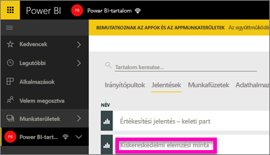
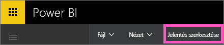
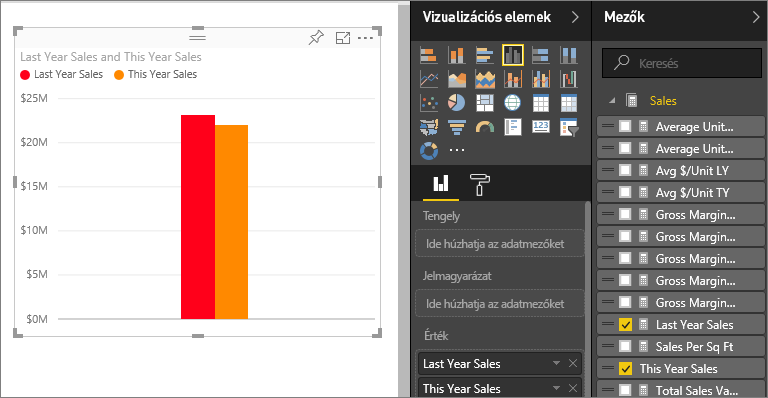
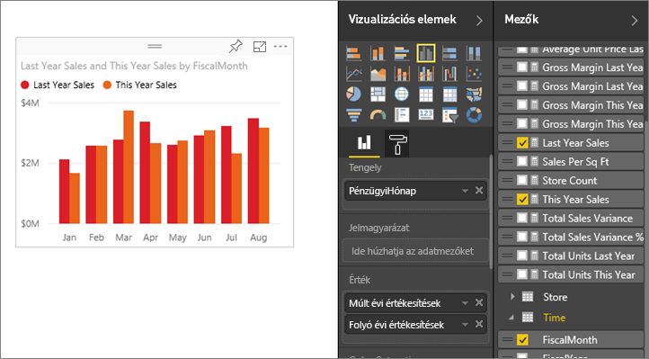
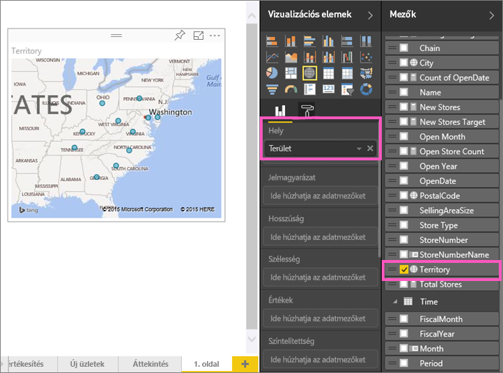
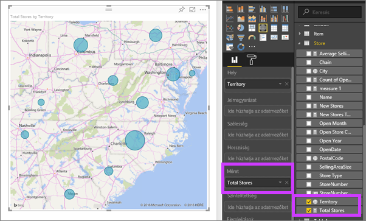

# 2. rész – Vizualizációk hozzáadása Power BI-jelentésekhez
Az [1. részben](power-bi-report-add-visualizations-ii.md) alapszintű képi megjelenítéseket hozott létre a mezők neve melletti jelölőnégyzetek bejelölésével.  A 2. részben megtudhatja, hogyan hozhat létre és módosíthat képi megjelenítéseket az egér húzásával, valamint a **Mezők** és a **Képi megjelenítések** panelek nyújtotta lehetőségek teljes körű kiaknázásával.

### Előfeltételek
- [1. rész](power-bi-report-add-visualizations-ii.md)
- Power BI szolgáltatás – a jelentésekhez a Power BI szolgáltatás vagy a Power BI Desktop használatával adhatók hozzá vizualizációk. Ebben az oktatóanyagban a Power BI szolgáltatást fogjuk használni. 
- Kiskereskedelmi elemzési minta

## Új képi megjelenítés létrehozása
Ebben az oktatóanyagban a Kiskereskedelmi elemzés adatkészlet felhasználásával létrehozunk néhány fontosabb képi megjelenítést.

### Nyisson meg egy jelentést, és adjon hozzá egy üres oldalt.
1. Nyissa meg a munkaterületet, ahová a Kereskedelmi elemzési mintát mentette. A **Kiskereskedelmi elemzés minta** lehetőségre kattintva a jelentés az Olvasás nézetben nyílik meg.
   
   
2. Válassza a **Jelentés szerkesztése** a jelentés Szerkesztési nézetben való megnyitásához.
   
   
3. A vászon aljánál lévő sárga plusz ikonra kattintva [adhat hozzá egy új oldalt](power-bi-report-add-page.md).
   
   

### Adjon hozzá egy olyan képi megjelenítést, amely az idei értékesítési adatokat a tavalyiakkal veti össze.
1. Az **Értékesítés** táblában válassza az **Idei értékesítés** > **Érték** és a **Tavalyi értékesítések** mezőket. A Power BI létrehoz egy oszlopdiagramot.  Ez valamelyest azért érdekes, és nem árt a mélyére ásni. Hogy néz ki az értékesítés havi bontásban?  
   
   
2. Az Idő tábláról húzza a **Hónap** elemet a **Tengely** területre.  
   
3. [Módosítása a képi megjelenítést](power-bi-report-change-visualization-type.md) területdiagramra.  Számos különféle képi megjelenítési típusból választhat – ha segítségre van szüksége a választáshoz, olvassa át [az egyes típusok leírását, a bevált gyakorlatokra vonatkozó tanácsokat és az oktatóanyagokat](power-bi-visualization-types-for-reports-and-q-and-a.md). A Képi megjelenítések panelen válassza a Területdiagram ikont.
4. A képi megjelenítés rendezéséhez válassza a három pontot (...), majd a **Rendezés hónapok szerint** lehetőséget.
5. [A képi megjelenítés átméretezéséhez](power-bi-visualization-move-and-resize.md) jelölje ki a képi megjelenítést, majd fogja meg és húzza a külső körvonalak valamelyikét. Legyen elég széles ahhoz, hogy a görgetősáv már eltűnjön, de egy másik képi megjelenítés még elférjen mellette.
   
   
6. [Mentse a jelentést](service-report-save.md).

### Térképi megjelenítés hozzáadása az értékesítések helyek szerinti megjelenítéséhez
1. Az **Üzletek** táblában válassza a **Terület** elemet. A Power BI felismeri, hogy a Terület helyet jelöl, ezért egy térképi megjelenítést hoz létre.  
   
2. Húzza az **Összes üzlet** elemet a Méret területre.  
   
3. Adjon hozzá egy jelmagyarázatot.  Ha szeretné az adatokat az üzletek neve alapján megjeleníteni, húzza a **Lánc** mezőt a Jelmagyarázat területre.  
   

## További lépések
* A Mezők panellel kapcsolatos további információkért lásd: [Jelentésszerkesztő – Bevezetés](service-the-report-editor-take-a-tour.md).   
* A vizualizációk adatainak szűrésével és kiemelésével kapcsolatos információkért lásd: [Szűrők és kiemelések a Power BI-jelentésekben](power-bi-reports-filters-and-highlighting.md).  
* További információk [a Power BI-jelentésekben lévő vizualizációkról](power-bi-report-visualizations.md).  
* További kérdései vannak? [Kérdezze meg a Power BI közösségét](http://community.powerbi.com/)

