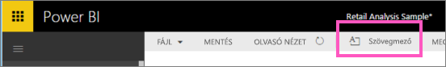
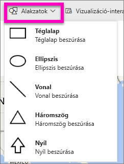
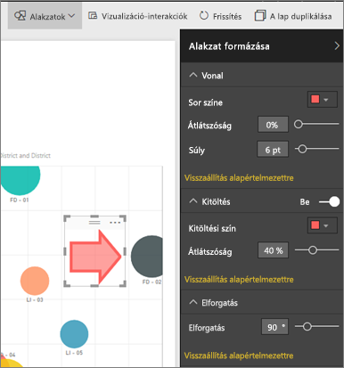

# Statikus tartalom a Power BI-jelentésekben
Szövegdobozok és alakzatok hozzáadása egy jelentéshez Szerkesztés nézetben a Power BI szolgáltatásban. 

> **MEGJEGYZÉS:** A Power BI Desktopban [statikus képeket is hozzáadhat a jelentéshez](guided-learning/visualizations.yml#step-11), amint ezen a videón szerepel.
> 
> <iframe width="560" height="315" src="https://www.youtube.com/embed/_3q6VEBhGew" frameborder="0" allowfullscreen></iframe>
> 
> 

## Szövegmező hozzáadása egy jelentéshez
1. Vigye az egérkurzort a jelentés vásznán bárhová, és válassza a **Text Box** (Szövegmező) elemet.
   
   
2. Írja be a szöveget a szövegmezőbe, és, nem kötelezően, adja meg a betűkészletet, színt és a szöveg igazítását. 
   
   
3. A szövegdoboz elhelyezéséhez jelölje ki a tetején a szürke területet, és húzza a helyére. A szövegdoboz átméretezéséhez jelölje ki és húzza a körvonalának valamelyik fogópontját. 
   
   
4. A szövegdoboz bezárásához jelöljön ki egy üres helyet a jelentés vásznán.
5. A szövegdoboz irányítópultra tűzéséhez kattintson a gombostű ikonra . 

## Alakzat hozzáadása a jelentéshez
1. Vigye az egérkurzort a jelentés vásznán bárhová, és válassza a **Shapes** (Alakzatok) elemet.
   
   
2. A legördülő menüben válasszon egy alakzatot a jelentés vásznához adásához. Adjon hozzá egy nyilat, amely a legnagyobb összértékesítési varianciát tartalmazó boborékra mutat. 
   
   Szabja testre az alakzatot a **Format shape** (Alakzat formázása) ablaktáblában. Ebben a példában egy sötétvörös szegélyű, piros nyilat hoztunk létre, 90 fokkal elforgatva.
   
   
3. Az alakzat elhelyezéséhez jelölje ki a tetején a szürke területet, és húzza a helyére. Az alakzat átméretezéséhez pedig jelölje ki és húzza a körvonalának valamelyik fogópontját. 

> **MEGJEGYZÉS:** Az alakzatok nem rögzíthetők irányítópulthoz. 
> 
> 

### Következő lépések
[Hivatkozás hozzáadása egy szövegdobozhoz](service-add-hyperlink-to-text-box.md)

[Jelentések a Power BI-ban](service-reports.md)

[Vizualizációk a Power BI-jelentésekben](power-bi-report-visualizations.md)

[Power BI – Alapfogalmak](service-basic-concepts.md)

További kérdései vannak? [Felteheti őket a Power BI-közösségnek](http://community.powerbi.com/)

