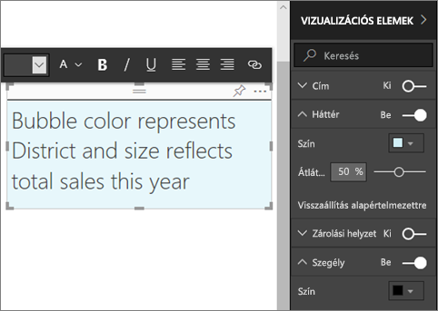

# Statikus tartalom a Power BI-jelentésekben
Szövegmezőket és alakzatokat a Power BI szolgáltatásban és a Power BI Desktopban is hozzá lehet adni a jelentésekhez. Mindkét esetben a jelentésre vonatkozó szerkesztési jogosultsággal kell rendelkeznie. Ha a jelentést megosztották Önnel a Power BI szolgáltatásban, akkor nem rendelkezik hozzá szerkesztési jogosultsággal. 

Figyelje meg, hogyan használja Will a Power BI Desktopot, hogy [statikus képeket adjon hozzá egy jelentéshez](guided-learning/visualizations.yml?tutorial-step=11), majd az alábbi lépéseket használva próbálja meg ugyanezt elvégezni a Power BI szolgáltatás használatával.
> 
> <iframe width="560" height="315" src="https://www.youtube.com/embed/_3q6VEBhGew" frameborder="0" allowfullscreen></iframe>
> 

## Szövegmező hozzáadása egy jelentéshez
1. Nyisson meg egy jelentést Szerkesztési nézetben.

2. Vigye az egérkurzort a jelentés vásznán bármely üres helyre, és válassza a **Text Box** (Szövegmező) elemet.
   
   
2. Írja be a szöveget a szövegmezőbe, és, nem kötelezően, adja meg a betűkészletet, színt és a szöveg igazítását. 
   
   
3. A szövegdoboz elhelyezéséhez jelölje ki a tetején a szürke területet, és húzza a helyére. A szövegdoboz átméretezéséhez jelölje ki és húzza a körvonalának valamelyik fogópontját. 
   
   

4. A szövegdobozt hagyja kiválasztva, és a VIZUALIZÁCIÓK panelen végezzen el további formázási beállításokat. Ebben a példában a hátteret és a szegélyt formáztuk. A szövegdoboznak a pontos méretét és elhelyezkedését is meghatározhatja.  

   

5. A szövegdoboz bezárásához jelöljön ki egy üres helyet a jelentés vásznán. 

5. A szövegdoboz irányítópultra tűzéséhez kattintson a gombostű ikonra . 

## Alakzat hozzáadása a jelentéshez
1. Vigye az egérkurzort a jelentés vásznán bárhová, és válassza a **Shapes** (Alakzatok) elemet.
   
   
2. A legördülő menüben válasszon egy alakzatot a jelentés vásznához adásához. Adjon hozzá egy nyilat, amely a legnagyobb összértékesítési varianciát tartalmazó boborékra mutat. 
   
   Szabja testre az alakzatot a **Format shape** (Alakzat formázása) ablaktáblában. Ebben a példában egy sötétvörös szegélyű, piros nyilat hoztunk létre, 90 fokkal elforgatva.
   
   
3. Az alakzat elhelyezéséhez jelölje ki a tetején a szürke területet, és húzza a helyére. Az alakzat átméretezéséhez pedig jelölje ki és húzza a körvonalának valamelyik fogópontját. Ahogy a szövegdoboz esetén, az alakzat pontos méretét és elhelyezkedését is meghatározhatja.

> **MEGJEGYZÉS**: Az alakzatokat nem lehet az irányítópulton rögzíteni, kivéve vizualizációk részeként [élő oldal rögzítésénél](service-dashboard-pin-live-tile-from-report.md). 
> 
> 

### Következő lépések
[Hivatkozás hozzáadása egy szövegdobozhoz](service-add-hyperlink-to-text-box.md)

[Power BI – Alapfogalmak](consumer/end-user-basic-concepts.md)

További kérdései vannak? [Kérdezze meg a Power BI közösségét](http://community.powerbi.com/)
