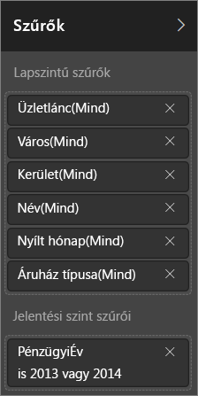
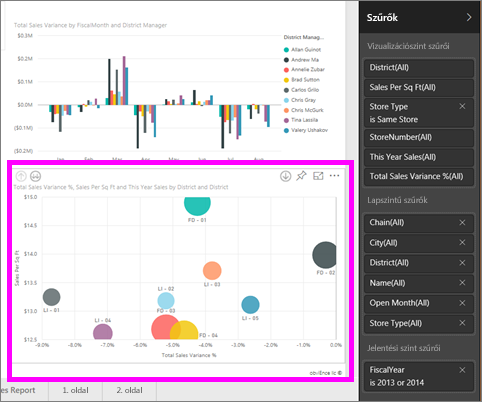
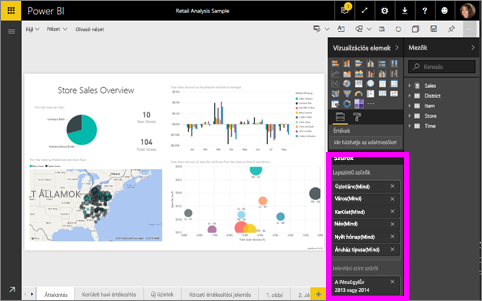

# Szűrők és kiemelés a Power BI-jelentésekben
A ***szűrők*** használatával minden olyan adatot eltávolíthat, amelyek az Ön szempontjából lényegtelenek.  A ***kiemelés*** nem egyenlő a szűréssel, mert nem távolítja el az adatokat, hanem kiemeli a látható adatok egy részét; a ki nem emelt adatok halványítva láthatóak maradnak.

A Power BI-ban sokféleképpen szűrheti és kiemelheti a jelentések adatait. Ha az összes erre vonatkozó információt egyetlen cikkbe sűrítenénk, az nehezen áttekinthető lenne, ezért az információt a következőképpen bontottuk fel:

* Bevezetés a szűrők és a kiemelés használatába (a cikk, amelyet most olvas)
* A [szűrők és a kiemelés létrehozásának módjai a saját tulajdonú Szerkesztés nézetben/jelentésekben](power-bi-report-add-filter.md). Ha szerkesztési engedélye van egy jelentéshez, akkor létrehozhatja, módosíthatja és törölheti a szűrőket és a kiemeléseket a jelentésekben.
* A [szűrők és kiemelések használatának módjai az Önnel megosztott jelentésekben vagy a jelentés Olvasó nézetében](service-reading-view-and-editing-view.md). Korlátozottabb számú dolgot tehet meg, de a Power BI még így is a szűrési és kiemelési lehetőségek széles skáláját kínálja.  
* [A Szerkesztés nézetben rendelkezésre álló szűrési és kiemelési vezérlők részletes bemutatása](power-bi-how-to-report-filter.md) többek között a szűrőtípusok részletes ismertetése (pl. dátum és idő, szám, szöveg), valamint az alapszintű és a speciális beállítások közötti különbségek.
* Most, hogy már tudja, alapértelmezés szerint hogyan működnek a szűrők és a kiemelés, [ismerje, meg hogyan lehet megváltoztatni azt a módot, ahogy az oldal vizualizációi egymást szűrik és kiemelik](service-reports-visual-interactions.md)

> [!TIP]
> Honnan tudja a Power BI, hogyan kapcsolódnak egymáshoz az adatok?  Az alapul szolgáló [adatmodell](https://support.office.com/article/Create-a-Data-Model-in-Excel-87e7a54c-87dc-488e-9410-5c75dbcb0f7b?ui=en-US&rs=en-US&ad=US) különböző táblái és mezői közötti kapcsolatokat használja a jelentésoldal elemei közötti interakció kialakítására.
> 
> 

## Bevezetés a jelentésekben a Szűrő ablaktábla használatával történő szűrésbe és kiemelésbe
 Ez a cikk bevezetést nyújt a Power BI szűrő és kiemelő funkcióiba.  Ezek a funkciók szinte ugyanúgy működnek, mint a Power BI Desktop szolgáltatásban.  

A szűrés és kiemelés alkalmazható a **Szűrők** ablaktáblán vagy a kiválasztásoknak közvetlenül a jelentésben való elvégzésével (alkalmi, lásd a lap alján). A Szűrők ablaktáblán láthatók a jelentésben használt táblák és mezők és az alkalmazott szűrők, ha vannak. A szűrők **oldalszintű**, **jelentésszintű**, **áthatoló** és **vizuális szintű** szűrőkre oszthatók.  Vizuális szintű szűrőket csak akkor láthat, ha kiválasztott egy vizualizációt a jelentés vásznán.

> [!TIP]
> Ha a szűrő mellett szerepel az **All** (összes), az azt jelenti, hogy ez a teljes mező szerepel szűrőként.  Például a **Chain(All)** (Lánc(összes)) az alábbi képernyőképen azt jelenti, hogy ez a jelentésoldal az összes áruházláncra vonatkozó adatokat tartalmaz.  Másfelől, a **FiscalYear is 2013 or 2014** (A pénzügyi év 2013 vagy 2014) jelentésszintű szűrő azt jelzi, hogy a jelentés csak a 2013-as és 2014-es pénzügyi évek adatait tartalmazza.
> 
> 

## Szűrők az Olvasó nézetben és a Szerkesztés nézetben
A jelentések kétféle módban használhatók: [Olvasás nézetben és Szerkesztési nézetben](service-reading-view-and-editing-view.md).  A szűrési képességek attól függnek, hogy milyen módban van éppen.

* Szerkesztési nézetben hozzáadhat jelentés-, oldal-, áthatoló és vizualizációszűrőket. A jelentés mentésekor a szűrőket is menti, akkor is, ha a jelentést mobilalkalmazásban nyitja meg. Azok, akik Olvasás nézetben tekintik meg a jelentést, használhatják a hozzáadott szűrőket, de nem adhatnak hozzá újakat.
* Olvasás nézetben használhatja a jelentés meglévő szűrőit, és elmentheti a kijelöléseket,  új szűrőket azonban nem adhat hozzá.

### A Szűrők ablaktábla Olvasó nézetben
Ha csak Olvasó nézetben van hozzáférése a jelentéshez, a Szűrők ablaktábla ehhez hasonló:

Tehát a jelentés ezen oldalának 6 oldalszintű szűrője és 1 jelentésszintű szűrője van.

Ha tudni szeretné, vannak-e vizuális szintű szűrők, jelöljön ki egy vizualizációt. Az alábbi képen szereplő buborék diagramra 6 szűrőt alkalmaztak.

Olvasó nézetben a meglévő szűrők módosításával tárhatja fel az adatokat. A módosításokat menti a rendszer a jelentéssel együtt, még akkor is, ha mobilalkalmazásban nyitja meg a jelentést. További információ: [A Power BI szolgáltatás jelentéseinek Olvasó és Szerkesztési nézete](service-reading-view-and-editing-view.md)

### Szűrők ablaktábla Szerkesztés nézetben
Ha tulajdonosi engedélye van a jelentéshez, és Szerkesztés nézetben nyitja meg, akkor azt látja, hogy a **Szűrők** csak egyike a rendelkezésre álló szerkesztési ablaktábláknak.

Mint a fenti Olvasó nézetben, láthatjuk, hogy a jelentésnek ezen az oldalán 6 oldalszintű szűrő és 1 jelentésszintű szűrő van. A buborék diagram kijelölésekor láthatjuk, hogy arra 6 vizuális szintű szűrőt alkalmaztak.

Szerkesztés nézetben azonban sokkal több mindent tehetünk szűrőkkel és kiemeléssel. A fő különbség, hogy felvehetünk új szűrőket. Ennek módjáról és sok egyébről a [Szűrő hozzáadása jelentéshez](power-bi-report-add-filter.md) című cikkben olvashat.

## Alkalmi szűrők és kiemelés
Jelöljön ki egy mezőt a jelentés vásznon az oldal többi részének szűréséhez és kiemeléséhez. Jelöljön ki egy üres helyet ugyanabban a vizualizációban az eltávolításához. A szűrésnek és kiemelésnek ez egy szórakoztató módja az adathatások feltárásához. Az ilyen típusú keresztszűrés és keresztkiemelés finombeállításához lásd: [Vizualizációk interakciói](service-reports-visual-interactions.md).

Amikor kilép a jelentésből, menti a módosításokat. A szűrés visszavonásához és a jelentés készítőjének alapértelmezett szűrő-, szeletelő-, részletezési és rendezési készletéhez való visszatéréshez válassza a **Visszaállítás alapértelmezettre** lehetőséget a felső menüsoron.

## Következő lépések
[Interakció a szűrőkkel és kiemeléssel (Olvasó nézetben)](service-reading-view-and-editing-view.md)

[Szűrő hozzáadása jelentéshez (Szerkesztés nézetben)](power-bi-report-add-filter.md)

[Ismerkedés a jelentésszűrőkkel](power-bi-how-to-report-filter.md)

[A jelentésvizualizációk keresztszűrésének és -kiemelésének módosítása](service-reports-visual-interactions.md)

További információ a [Power BI-jelentésekről](service-reports.md)

További kérdései vannak? [Kérdezze meg a Power BI közösségét](http://community.powerbi.com/)

