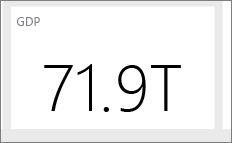

# Tippek és trükkök jelentések létrehozásához a Power BI Desktopban és a Power BI szolgáltatásban
Ahhoz, hogy a legtöbbet hozza ki az adataiból, néha szüksége van egy kis extra segítségre. Összegyűjtöttünk néhány tippet és trükköt, amelyek segítségére lehetnek, amikor jelentéseket hoz létre a Microsoft Power BI Desktopban, a Power BI szolgáltatásban *és* a Microsoft Excel 2016 vagy Excel 2013 Pro-Plus kiadásokban, amelyekben engedélyezve van a Power Pivot bővítmény, illetve telepítve és engedélyezve van a Power Query.

## Power BI Desktop

### A Lekérdezésszerkesztő használatának elsajátítása
A Power BI Desktop Lekérdezésszerkesztője hasonlít az Excel 2013 Power Query beépülő moduljához. Bár a Power BI támogatási webhelyén számos hasznos cikket találhat, az első lépésekhez a Power Query dokumentációját is érdemes áttekinteni a support.office.com webhelyen.

További információt a [Power Query forrásanyagközpontban](https://support.office.com/article/Microsoft-Power-Query-for-Excel-Help-2b433a85-ddfb-420b-9cda-fe0e60b82a94) találhat.

A [Képletreferenciát](https://support.office.com/Article/Learn-about-Power-Query-formulas-6bc50988-022b-4799-a709-f8aafdee2b2f) is megtekintheti.

### Adattípusok a Lekérdezésszerkesztőben
Amikor a Power BI Desktopban a Lekérdezésszerkesztőt használja az adatok betöltéséhez, feltételezésen alapuló adattípus-felismerést végzünk.  A képletek használatakor a rendszer néha nem őrzi meg az oszlopok adattípus-beállításait. A következő műveletek elvégzése után ellenőrizze, hogy megfelelő-e az oszlopok adattípusa: Adatok betöltése elsőként a lekérdezés lapra, Első sor fejléccé alakítása, Oszlop hozzáadása, Csoportosítás, Egyesítés, Hozzáfűzés, és mielőtt először jóváhagyná az adatok betöltését.

Fontos megjegyezni: az adattáblázatban a dőlt betűk nem azt jelentik, hogy az adattípus megfelelően van beállítva, hanem azt, hogy az adatot nem szövegként értelmezi a rendszer.

### Lekérdezésekre való hivatkozás a Lekérdezésszerkesztőben
Amikor a Power BI Desktopban a Lekérdezésszerkesztő kezelőjében a jobb gombbal rákattint az egyik lekérdezésre, elérheti a „Hivatkozás” lehetőséget.  Ez a következő miatt hasznos:

* Amikor adatforrásként használ fájlokat egy lekérdezéshez, a rendszer a lekérdezésben tárolja a fájl abszolút elérési útját. A Power BI Desktop-fájl vagy Excel-munkafüzet áthelyezésekor időt takaríthat meg azzal, hogy az elérési utak helyett csak egyszer frissíti a fájlt.

Alapértelmezés szerint minden lekérdezés egy Excel-munkalapra vagy az adatmodellbe tölt be (vagy mindkettőbe). Néhány lekérdezés közbenső lépés, és nem a felhasználók számára tervezték.  Amikor a fent említett módon hivatkozik a lekérdezésekre, gyakran ez a helyzet.  Szabályozhatja a lekérdezésbetöltés viselkedését, ha a jobb gombbal a lekérdezésre kattint a kezelőben, és bekapcsolja a „Betöltés engedélyezése” beállítást.  Ha a „Betöltés engedélyezése” mellett nincs pipa, a lekérdezést attól még el lehet érni a lekérdezés lapon, és használhatja azt más lekérdezésekkel.  Ez különösen hasznos az Egyesítés, Hozzáfűzés és Hivatkozás átalakítókkal kombinálva.  Mivel azonban a rendszer nem tölti be a lekérdezés eredményeit az adatmodellbe, a lekérdezés nem fogja telezsúfolni a jelentések mezőlistáját vagy az adatmodellt.

### A pontdiagramokban szükség van egy pontazonosítóra
Vegyük példaként egy egyszerű táblát, amely hőmérsékleteket és a leolvasás idejét tartalmazza. Ha ezt közvetlenül jeleníti meg egy pontdiagramon, a Power BI egyetlen pontba összesíti az értékeket. A külön adatpontok megjelenítéséhez hozzá kell adnia egy mezőt a Részletek gyűjtőhöz a Mezők területen.   Ennek a Power BI Desktopban egy egyszerű módja, ha a lekérdezés lapon az „Oszlop hozzáadása” menüszalag „Indexoszlop felvétele” lehetőségét használja.

### Referenciavonalak a jelentésben
A Power BI Desktopban a referenciavonalak meghatározása számított oszlop használatával történhet.  Azonosítsa a táblát és az oszlopot, amelyen létre kívánja hozni a referenciavonalat.  A menüszalagon válassza az „Új oszlop” lehetőséget, és a képletsávban gépelje be a következő képletet:

    Target Value = 100

A számított oszlop a 100 értéket fogja visszaadni függetlenül attól, hogy hol használják.  Az új oszlop meg fog jelenni a mezőlistában.  Adja hozzá a „Target Value” (Célérték) nevű számított oszlopot egy vonaldiagramhoz, amely bemutatja, hogyan viszonyulnak a sorozatok az adott referenciavonalhoz.  

### Rendezés más oszlop alapján
Ha kategorikus (karakterlánc) értéket használ a Power BI-ban a diagramtengelyekhez, illetve egy szeletelőben vagy szűrőben, az alapértelmezett sorrend a betűrend szerinti rendezés. Ha más sorrendet kell használnia, például a hét napjai vagy hónapok szerinti rendezést, akkor utasíthatja a Power BI Desktopot, hogy rendezzen egy másik oszlop alapján. További információ: [Rendezés oszlop szerint a Power BI Desktopban](desktop-sort-by-column.md).

### Térképek egyszerűbb létrehozása Bing-javaslatokkal
A Power BI integrálható a Binggel alapértelmezett térképkoordináták biztosításához (ez a geokódolás nevű folyamat), így egyszerűbben hozhat létre térképeket.  A Bing algoritmusokkal és javaslatokkal próbálja megtalálni a megfelelő helyet, de ez feltételezésen alapul. A helyes geokódolás valószínűségének növelése érdekében használhatja a következő tippeket:

A térképek létrehozása gyakran országok, államok és városok megjelenítése céljából történik.  Ha a Power BI Desktopban a földrajzi megjelölés után elnevezi az oszlopokat, akkor a Bing könnyebben kitalálja, hogy Ön mit szeretne megjeleníteni. Például ha van egy mezője, amely USA tagállamok neveit tartalmazza (például „California” és „Washington”), a Bing lehet, hogy a „Washington” szóra Washington D.C. helyét fogja visszaadni Washington állam helyett.  Ha az oszlop a „State” (Állam) nevet kapja, pontosabb lesz a geokódolás.  Ugyanez vonatkozik a „Country” (Ország) és a „City” (Város) nevű oszlopra.   

Néhány megjelölés nem egyértelmű, ha több ország/régió összefüggésében vizsgálják.  Bizonyos esetekben amit egy ország/régió „államnak” tekint, más helyek „tartományként”, „megyeként” vagy egyéb megjelölésként kezelnek.  Növelheti a geokódolás pontosságát, ha olyan oszlopokat hoz létre, amelyek több mezőt fűznek össze, és azokat használja az adatok helyének megjelenítéséhez.  Például ahelyett, hogy csak a „Wiltshire” nevű oszlopot adná át, a pontosabb geokódolási eredmény érdekében átadhatja a „Wiltshire, England” oszlopot.

A Power BI szolgáltatásban vagy Desktopban bármikor megadhat konkrét szélességi és hosszúsági helyeket.  Ha így tesz, egy Location (Hely) mezőt is át kell adnia, különben az adatok alapértelmezés szerint összesítve lesznek, és a szélességi és a hosszúsági hely nem biztos, hogy az lesz, amire számít.

### Földrajzi mezők kategorizálása a Bing geokódolásának segítése érdekében
A mezők helyes geokódolásának másik módja, ha az adatmezőkön beállítja az Adatkategóriát.   A Power BI Desktopban válassza ki a kívánt táblát, lépjen a Speciális menüszalagra, majd állítsa az Adatkategóriát a következők egyikére: Állam, Cím, Irányítószám, Kontinens, Megye, Ország/Régió, Tartomány vagy Város.  Ezek az adatkategóriák segítenek a Bingnek helyesen kódolni az adatokat. További tudnivalókért lásd az [adatok kategorizálását a Power BI Desktopban](desktop-data-categorization.md).

### Jobb geokódolás pontosabb helyekkel
Néha még az sem elég, ha beállítja az adatkategóriákat a leképezéshez.  A Power BI Desktop Lekérdezésszerkesztőjének használatával pontosabb helyet, például címet hozhat létre.  Használja az Oszlop hozzáadása funkciót egy egyéni oszlop létrehozásához.  Hozza létre a kívánt helyet a következőképpen:

    = [Field1] & " " & [Field2]

Ezt követően használja az eredményül kapott mezőt a térkép-vizualizációkban. Ez nagyon hasznos, amikor címeket hoz létre az adatkészletekben gyakran előforduló szállítási cím mezőkből.  Megjegyzés: az összefűzés csak a szöveges mezőknél működik.  Szükség esetén alakítsa át a házszámot szöveg adattípusúra, mielőtt címet hozna létre belőle.

### Hisztogramok a lekérdezés szakaszban
Hisztogramok a Power BI Desktopban többféleképpen is létrehozhatók. Kezdjük a legegyszerűbbel, és haladjunk onnan:

A legegyszerűbb hisztogramok – Határozza meg, hogy melyik lekérdezésben található az a mező, amelynek alapján létre szeretné hozni a hisztogramot.  A lekérdezésnél használja a „Hivatkozás” lehetőséget egy új lekérdezés létrehozásához, és adja neki a „FieldName Histogram” nevet. Használja a „Csoportosítás” lehetőséget az „Átalakítás” menüszalagon, és válassza ki a „sorok számlálása” aggregátumot.  Győződjön meg arról, hogy az összesített oszlop adattípusa szám. Ezután jelenítse meg az adatokat a jelentések oldalon.  Ez egy gyors és könnyű létrehozási mód, de sok adatpont esetén nem működik jól, és nem engedélyezi a vizualizációk közötti ecsetelést.

Gyűjtők meghatározása egy hisztogram létrehozásához – Határozza meg, melyik lekérdezésben található az a mező, amelynek alapján létre szeretné hozni a hisztogramot.  A lekérdezésnél használja a „Hivatkozás” lehetőséget egy új lekérdezés létrehozásához, és adja neki a „FieldName” nevet.  Ezután határozza meg a gyűjtőket egy szabállyal.  Használja az Egyéni oszlop hozzáadása lehetőséget az Oszlop hozzáadása menüszalagon, és hozzon létre egy egyéni szabályt.  Egy egyszerű gyűjtőszabály például így nézhet ki:

    if([FieldName] \< 2) then "\<2 min" else
    if([FieldName] \< 5) then "\<5 min" else
    if([FieldName] \< 10) then "\<10 min" else
    if([FieldName] \< 30) then "\<30 min" else
    "longer")

Győződjön meg arról, hogy az összesített oszlop adattípusa szám. Most már használhatja „A legegyszerűbb hisztogram” részben leírt csoportosítási technikát a hisztogram létrehozására.  Ez a lehetőség több adatpontot kezel, de ettől még nem segít az ecsetelésben.

Ecsetelést támogató hisztogram meghatározása – Azt nevezik ecsetelésnek, amikor össze vannak kapcsolva a vizualizációk, így amikor egy felhasználó kijelöl egy adatpontot az egyik vizualizációban, a jelentés oldal többi vizualizációja kiemeli vagy szűri a kijelölt adatponthoz kapcsolódó adatpontokat.  Mivel lekérdezéskor módosítjuk az adatokat, létre kell hoznunk egy kapcsolatot a táblák között, és meg kell bizonyosodnunk arról, hogy tudjuk, melyik részlet kapcsolódik a hisztogram gyűjtőjéhez, és fordítva.

A folyamat elindításához használja a „Hivatkozás” lehetőséget azon lekérdezésen, amely azt a mezőt tartalmazza, amelynek alapján létre szeretné hozni a hisztogramot.  Adja a „Buckets” (Gyűjtők) nevet az új lekérdezésnek.  Ebben a példában az eredeti lekérdezés neve legyen „Details” (Részletek).  Ezután távolítsa el az összes oszlopot, kivéve azt az egyet, amelyet gyűjtőként fog használni a hisztogramhoz.  Használja a lekérdezésben az „Ismétlődések eltávolítása” funkciót. Ez az oszlop kijelölésekor megjelenő helyi menüben található. Az oszlop fennmaradó értékei így egyedi értékek lesznek.   Decimális számok használata esetén először használhatja a „gyűjtők meghatározása egy hisztogram létrehozásához” részben leírt tippet, hogy kezelhető gyűjtőkészletet kapjon.  Ellenőrizze a lekérdezés előnézetében megjelenő adatokat.  Ha üres vagy null értékeket lát, a kapcsolat létrehozása előtt ki kell őket javítania.  Ehhez tekintse meg a „Kapcsolatok létrehozása, ha az adatok null vagy üres értékeket tartalmaznak” című részt.   A rendezés szükségessége miatt ez a megközelítés problémás lehet.  Ha azt szeretné, hogy a gyűjtők megfelelően rendeződjenek, tekintse meg a „Rendezési sorrend: a kategóriák megjelenítése a kívánt sorrendben” című részt.  

>[!NOTE]
>A vizualizációk létrehozása előtt érdemes kigondolni, hogy milyen rendezési sorrendet szeretne.   

A folyamat következő lépése egy kapcsolat meghatározása a „Buckets” (Gyűjtők) és a „Details” (Részletek) lekérdezések között a gyűjtők oszlopában.  A Power BI Desktopban kattintson a menüszalag **Kapcsolatok kezelése** lehetőségére.  Hozzon létre egy kapcsolatot, ahol a Buckets a bal oldali táblában, a Details pedig a jobb oldali táblában található, és válassza ki a hisztogramhoz használni kívánt mezőt.

Az utolsó lépés a hisztogram létrehozása.  Húzza ki a Bucket mezőt a „Buckets” táblából.  Távolítsa el az alapértelmezett mezőt az így kapott oszlopdiagramból.  Húzza át a hisztogram mezőt a „Details” táblából ugyanabba a vizualizációba.  A Mezők területen módosítsa az alapértelmezett összesítést Számra.  Az eredmény a hisztogram. Ha létrehoz egy másik vizualizációt, például egy faszerkezetes térképet a Details táblából, válasszon ki egy adatpontot a faszerkezetes térképen, hogy megjelenjen a hisztogram-kiemelés, és megmutassa a kiválasztott adatponthoz tartozó hisztogramot a teljes adatkészlet trendjéhez képest.

### Hisztogramok
A Power BI Desktopban a hisztogramok meghatározásához számított mező használható.  Azonosítsa a táblát és az oszlopot, amelyen létre kívánja hozni a hisztogramot.  A számítási területen gépelje be a következő képletet:

> Frequency:=COUNTROWS(\<Column Name\>)
>
>

Mentse a módosításokat és térjen vissza a jelentéshez.  Adja hozzá a \<Column Name\> (Oszlopnév) és a Frequency (Gyakoriság) mezőt a táblához, majd alakítsa át sávdiagrammá.  Győződjön meg arról, hogy a \<Column Name\> az X tengelyen található, a Frequency számított mező pedig az Y tengelyen.

### Tippek és trükkök kapcsolatok létrehozásához a Power BI Desktopban
Amikor több forrásból tölt be részletes adatkészleteket, az olyan problémák, mint a null értékek, az üres értékek vagy a duplikált értékek gyakran megakadályozzák a kapcsolatok létrehozását.

Vegyünk egy példát:

Amikor aktív ügyféltámogatási kérelmek adatkészleteit, és egy másik, munkaelemekből álló adatkészletet töltünk be, és az adatkészletek a következő sémákkal rendelkeznek:

> CustomerIncidents: {IncidentID, CustomerName, IssueName, OpenedDate, Status} WorkItems: {WorkItemID, IncidentID, WorkItemName, OpenedDate, Status, CustomerName }
>
>

Ha nyomon szeretnénk követni egy adott CustomerName (Ügyfél neve) értékhez kapcsolódó összes incidenst és munkaelemet, nem hozhatunk létre egyszerűen egy kapcsolatot a két adatkészlet között.  Előfordulhat, hogy néhány WorkItems (Munkaelemek) érték nem kapcsolódik egy CustomerName (Ügyfél neve) értékhez, így a mező értéke üres vagy NULL lenne.  Az is előfordulhat, hogy a WorkItems (Munkaelemek) és a CustomerIncidents (Ügyfélincidens) tábla több rekordot tartalmaz egy adott CustomerName (Ügyfél neve) értékhez.  

#### Kapcsolatok létrehozása a Power BI Desktopban, ha az adatok null vagy üres értékeket tartalmaznak
Gyakran előfordul, hogy az adatkészletek null vagy üres értékekkel rendelkező oszlopokat tartalmaznak.  Ez problémákat okozhat a kapcsolatok használatakor.  Lényegében két lehetősége van a problémák megoldására.  Eltávolíthatja a null vagy üres értékeket tartalmazó sorokat.  Ehhez használhatja a szűrés funkciót a lekérdezés lapon, vagy ha lekérdezéseket egyesít, választhatja a „csak az egyező sorok megtartása” lehetőséget. Másik megoldásként lecserélheti a null vagy üres értékeket kapcsolatban működő értékekre, tehát jellemzően olyan karakterláncokra, mint a „NULL” és a „(Blank)”.   Helyes megközelítés nincs – Ha lekérdezés szakaszban szűri ki a sorokat, a rendszer eltávolítja a sorokat, és ez hatással lehet az összefoglaló statisztikákra és a számításokra.  Az utóbbi megközelítés megőrzi azokat az adatsorokat, de a használatával a nem kapcsolódó sorok kapcsolódóként jelenhetnek meg a modellben, amely számítási hibákhoz vezethet.  Ha az utóbbi megoldást alkalmazza, a pontos eredmények biztosításához használjon szűrőket azokon a nézeteken/diagramokon, ahol ez lehetséges.  És ami a legfontosabb, értékelje ki, hogy mely sorokat tartja meg/távolítja el, és legyen tisztában azzal, hogy milyen hatással van az adott megoldás az elemzésre.  

#### Kapcsolatok létrehozása a Power BI Desktopban, ha az adatok ismétlődő értékeket tartalmaznak
Amikor több forrásból tölt be részletes adatkészleteket, az ismétlődő értékek gyakran megakadályozzák a kapcsolatok létrehozását.  Ezt úgy oldhatja meg, ha létrehoz egy dimenziótáblát a két adatkészlet egyéni értékeivel.

Vegyünk egy példát:

Amikor aktív ügyféltámogatási kérelmek adatkészleteit, és egy másik, munkaelemekből álló adatkészletet töltünk be, és az adatkészletek a következő sémákkal rendelkeznek:

> CustomerIncidents: {IncidentID, CustomerName, IssueName, OpenedDate, Status} WorkItems: {WorkItemID, IncidentID, WorkItemName, OpenedDate, Status, CustomerName }
>
>

Ha nyomon szeretnénk követni egy adott CustomerName (Ügyfél neve) értékhez kapcsolódó összes incidenst és munkaelemet, nem hozhatunk létre egyszerűen egy kapcsolatot a két adatkészlet között.  Előfordulhat, hogy néhány WorkItems (Munkaelemek) érték nem kapcsolódik egy CustomerName (Ügyfél neve) értékhez, így a mező értéke üres vagy NULL lenne.  Ha a CustomerNames (Ügyfélnevek) tábla üres vagy null értékeket tartalmaz, lehet, hogy még így se tud kapcsolatot létrehozni. Tekintse át a „Kapcsolatok létrehozása, ha az adatok null vagy üres értékeket tartalmaznak” részt.  Az is előfordulhat, hogy több WorkItems (Munkaelemek) és CustomerIncidents (Ügyfélincidens) érték tartozik egy adott CustomerName (Ügyfél neve) értékhez.  

Ebben az esetben a kapcsolat létrehozásához létre kell hoznia egy logikai adatkészletet a két adatkészlet összes CustomerNames értékével.  A Lekérdezés lapon az alábbi folyamattal hozhatja létre a logikai adatkészletet:

1. Duplikálja mindkét lekérdezést. Adja az elsőnek a **Temp** (Ideiglenes), a másodiknak pedig a **CustomerNames** (Ügyfélnevek) nevet.
2. Minden lekérdezésben távolítsa el az összes oszlopot a CustomerName (Ügyfélneve) oszlop *kivételével*
3. Használja az **Ismétlődések eltávolítása** lehetőséget az összes lekérdezésben.
4. A **CustomerNames** (Ügyfélnevek) lekérdezésben a menüszalagon válassza a **Hozzáfűzés** lehetőséget, majd válassza ki a **Temp** (Ideiglenes) lekérdezést.
5. A **CustomerNames** (Ügyfélnevek) lekérdezésben válassza az **Ismétlődések eltávolítása** lehetőséget.

Most már rendelkezik egy dimenziótáblával, amelynek segítségével kapcsolódhat az összes értéket tartalmazó CustomerIndicents (Ügyfélincidensek) és WorkItems (Munkaelemek) adatkészlethez.  

### Minták a Lekérdezésszerkesztő használatának megkezdéséhez
A Lekérdezésszerkesztő erőssége, hogy módosítani lehet vele az adatokat, és át tudja alakítani, illetve meg tudja tisztítani őket, hogy készen álljanak a vizualizációra vagy a modellezésre. Van néhány minta, amelyet nem árt megismerni.

#### Az ideiglenes oszlopokat törölni lehet az eredmény kiszámítása után
Gyakran előfordul, hogy a Power BI Desktopban olyan számítást kell létrehoznia, amely több oszlop adatait egyetlen új oszloppá alakítja át.  Ez bonyolult lehet.  A probléma megoldásának egyik egyszerű módja, hogy lépésekre bontja a műveletet.  Első lépésként duplikálja a kezdeti oszlopokat. Ezután hozzon létre ideiglenes oszlopokat a lépések számára. Végül pedig hozzon létre egy oszlopot a végeredmény számára.  Ha ezzel megvan, törölheti az ideiglenes oszlopokat, hogy a végső adatkészlet ne legyen zsúfolt. Ezt azért lehet megtenni, mivel a lekérdezés lap sorrendben hajtja végre a lépéseket.

#### Lekérdezések duplikálása vagy hivatkozása, majd az eredeti lekérdezéssel való egyesítése
Néha érdemes kiszámítani egy adatkészlet összefoglaló statisztikáit.  Ennek a legegyszerűbb módja a lekérdezés duplikálása vagy hivatkozása a lekérdezés lapon. Ezután használja a **Csoportosítás** lehetőséget az összefoglaló statisztikák kiszámításához.  Az összefoglaló statisztikák segítenek szabványosítani az eredeti adatokat, hogy jobban össze lehessen őket hasonlítani.  Ez különösen hasznos, amikor egyedi értékeket vet össze a teljes adatkészlettel.  Ehhez lépjen az eredeti lekérdezésre, és válassza az Egyesítés lehetőséget.  Ezután egyesítse az összefoglaló statisztika lekérdezésének adatait, és egyeztesse a megfelelő azonosítókat.  Most már készen áll az adatok elemzéshez szükséges szabványosítására.

### A DAX első használata
A DAX a Power BI Desktop számításokhoz használt képletnyelve.  Ez a nyelv BI-elemzéshez van optimalizálva.  Ha eddig még csak SQL típusú lekérdezési nyelvet használt, ez kicsit eltérhet a megszokottól. A DAX elsajátításához nagyon jó online és nyomtatott forrásokat találhat.

[A DAX alapszintű használata a Power BI Desktopban](desktop-quickstart-learn-dax-basics.md)

[Data Analysis Expressions-referencia (DAX)](https://msdn.microsoft.com/library/gg413422.aspx)

[DAX forrásanyagközpont](http://social.technet.microsoft.com/wiki/contents/articles/1088.dax-resource-center.aspx)

## Power BI szolgáltatás *és* Power BI Desktop

### Olvassa el [a Power BI-jelentések kialakításának alapelveit](power-bi-visualization-best-practices.md) ismertető tanulmányt
Ez a tanulmány a Power BI szolgáltatásban történő jelentéstervezés bevált gyakorlatait mutatja be. Az előkészületektől kezdve tárgyalja a jelentésekre és a jelentéseket felépítő oldalakra és egyéni vizualizációkra vonatkozó tervezési alapelveket. Az ajánlott eljárások nagy része az irányítópultok tervezésére is érvényes.

### Olvassa el és/vagy nézze meg, hogyan tervezhet lenyűgöző megjelenésű jelentéseket (és irányítópultokat) a Power BI-ban
Miguel Myers adatelemző és grafikus tervező, és a Power BI-közösség tagja.

* [A blog elolvasása](https://powerbi.microsoft.com/blog/how-to-design-visually-stunning-reports/)
* [A webes szeminárium megtekintése](https://info.microsoft.com/CO-PowerBI-WBNR-FY16-04Apr-19-Design-Reports-in-PowerBI-Registration.html)

### Mindig gondoljon a közönségére
Mely kulcsfontosságú mérőszámok segítik őket leginkább a döntéshozatalban? Mire fogják felhasználni a jelentést? Milyen tanult vagy kulturális előfeltevések befolyásolhatják a tervezés során hozott döntéseket? Milyen információkra van szüksége a közönségének a sikerhez?

Hol fog megjelenni a jelentés? Ha egy nagyobb képátmérőjű monitoron jeleníti meg, akkor több tartalmat is elhelyezhet rajta. Ha azonban az olvasók a táblagépükön tekintik meg, az olvashatóság érdekében használjon kevesebb vizualizációt.

### Mondja el a történetet egyetlen képernyő használatával
Minden jelentésoldalnak azonnal értelmezhető tartalmat kell kínálnia. El tudja kerülni a görgetősávok használatát az oldalakon? Nem túl kusza vagy zsúfolt a jelentés?  A legfontosabb, könnyen olvasható és értelmezhető információk kivételével távolítson el minden további adatot.

### A legfontosabb információt jelenítse meg a legnagyobbként
Ha a jelentésoldalon található szövegek és a vizualizációk azonos méretűek, az olvasóknak nehezére esik majd a legfontosabb információra összpontosítani. A kártyavizualizációk segítségével például hatásosan tudja megjeleníteni a fontos számokat:  

### De ügyeljen arra, hogy a kontextust is megadja  

A vizualizációk szövegmezők, eszköztippek és hasonló funkciók használatával informatívabbá tehetők.

### A legfontosabb információt helyezze a felső sarokba
A legtöbb ember fentről lefelé kezd olvasni, így célszerű a képernyő tetején elhelyezni a legfontosabb részletet, és a közönség olvasási irányának megfelelően növelni a részletsűrűséget (balról jobbra, jobbról balra).

### Használja az adatoknak leginkább megfelelő vizualizációt, a formázással pedig igyekezzen elősegíteni a könnyű olvasást
Pusztán a változatosság kedvéért ne változtasson a vizualizáción.  A vizualizáció célja egy adott kép könnyen „olvasható” és értelmezhető ábrázolása.  Bizonyos adatok és vizualizációk esetében egy egyszerű grafikus vizualizáció is elegendő. Más esetekben azonban összetettebb vizualizációkra lehet szükség, ezért a csempék és címkék használatával, illetve további testreszabással igyekezzen segíteni az olvasót.  

* Legyen óvatos a valóságot eltorzító, például a térbeli vagy a nem nullánál kezdődő diagramok használatával. Ne feledje, hogy az emberi agy számára nagyobb nehézséget jelent a körkörös alakok értelmezése. A tortadiagramok, fánkdiagramok, mérőműszerek és egyéb kör alakú diagramok tetszetősek lehetnek, de talán másféle vizualizáció is használható?    
* A diagramokon belül használja következetesen a tengelyeken található diagramméreteket, a diagramméret-elrendezést és a diagramértékekhez használt színeket.    
* Ügyeljen arra, hogy ízlésesen kódolja a mennyiségi adatokat. A számok megjelenítésénél három vagy négy számjegynél ne használjon többet. A tizedesvesszőtől egy vagy két hellyel balra található számjegyeket jelenítse meg, és léptékezze a számokat ezres vagy milliós nagyságrendre, tehát 3,4 millió 3 400 000 helyett.    
* Igyekezzen kerülni a kevert pontossági és időszintek használatát. Győződjön meg róla, hogy az időkeretek jól értelmezhetők.  Ne helyezzen egy, a múlt hónapot és az év egy más hónapját szemléltető szűrt diagramot egymás mellé.    
* Lehetőleg ne keverje a kis és nagy értékeket sem ugyanazon a skálán, például egy vonal- vagy oszlopdiagramon.  Vegyük például azt az esetet, amikor az egyik érték milliós, a másik pedig ezres nagyságrendben van.  A skála nagysága miatt ebben az esetben nehéz lenne látni az ezres nagyságrendű értékek különbségeit.  Ha kevernie kell az értékek nagyságrendjeit, válasszon olyan vizualizációt, például egy kombinált diagramot, amely lehetővé teszi egy második tengely használatát.    
* Feleslegesen ne tűzdelje tele adatcímkékkel a diagramokat. Az oszlopdiagramokon szereplő értékek, ***ha kellően nagyok***, általában a konkrét számok megjelenítése nélkül is könnyen értelmezhetők.   
* Ügyeljen a [diagramok rendezési](power-bi-report-change-sort.md) módjára.  A legmagasabb vagy legalacsonyabb számok kiemeléséhez rendezze az adatokat a mértékek szerint.  Ha azt szeretné, hogy a felhasználók könnyedén megtaláljanak egy adott kategóriát a többi között, rendezze az adatokat a tengelyek szerint.  
* Az ideális tortadiagramok kevesebb mint nyolc kategóriát tartalmaznak. Mivel a tortadiagramban nem lehet két értéket egymás mellett megjeleníteni, ezért jóval nehezebb az értékek összehasonlítása, mint egy oszlopdiagramon. A tortadiagramok alkalmasabbak a rész-egész viszonyok szemléltetésére, mint az egyes részek összehasonlítására. A mérőműszer-diagramokkal rendkívül jól lehet szemléltetni egy aktuális állapotot az adott cél tekintetében.    

A vizualizációval kapcsolatos további segítségért olvassa el a következő részt: [Vizualizációtípusok a Power BI-ban](power-bi-visualization-types-for-reports-and-q-and-a.md).  

### További információk az ajánlott irányítópult-tervezési eljárásokról
Itt van néhány kedvenc könyveink közül:

* Cole Nussbaumer Knafic: *Storytelling with Data*
* Nathan Yau: *Data points*
* Alberto Cairo: *The truthful Art*
* Stephen Few *Now You See It* című könyve  
* Edward Tufte *Envisioning Information* című könyve  
* Andrew Abela: *Advanced Presentations Design*   

## Következő lépések
[Power BI – Alapfogalmak](service-basic-concepts.md)

[Power BI-jelentések](service-reports.md)

További kérdései vannak? [Kérdezze meg a Power BI közösségét](http://community.powerbi.com/)
