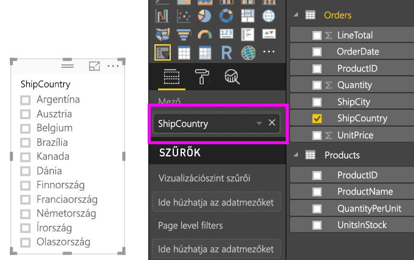
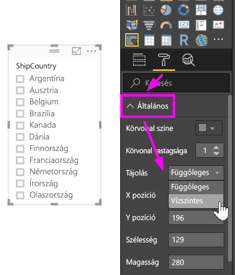
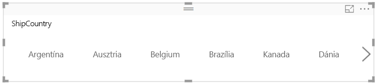
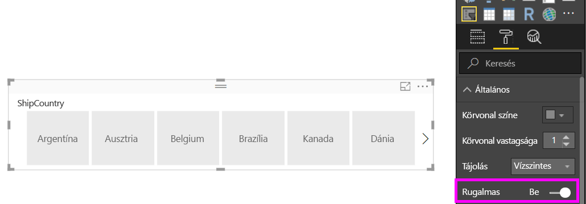
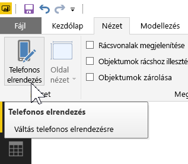
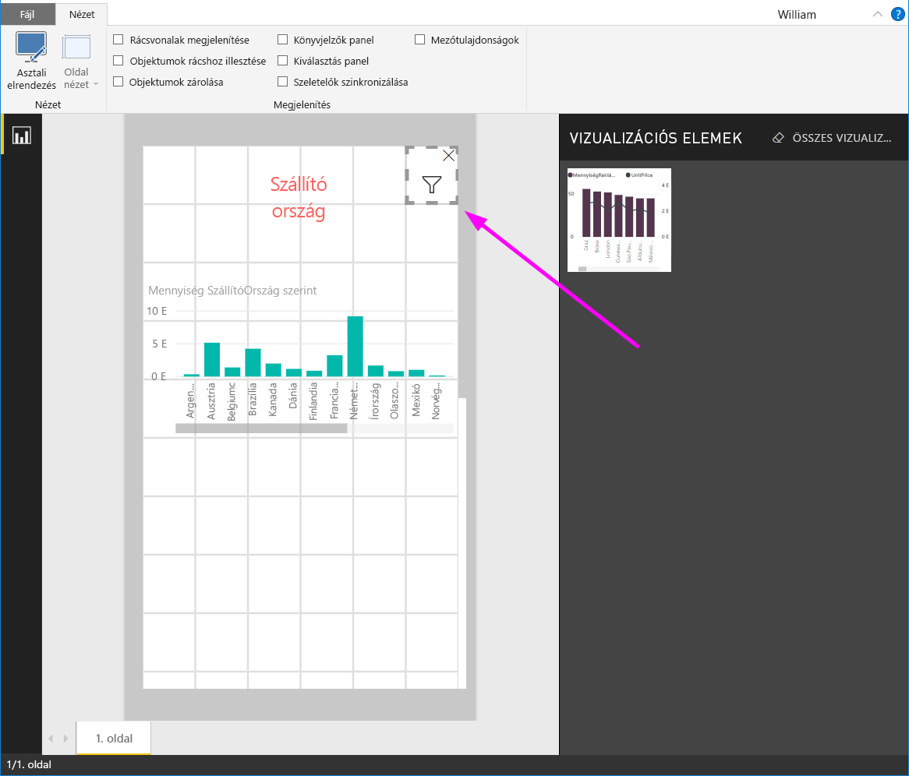

# Átméretezhető rugalmas szeletelő létrehozása a Power BI-ban

A rugalmas szeletelők a jelentés tetszőleges területének megfelelően átméretezhetők. Ha rugalmas szeletelőket használ, azokat különböző méretekre és vízszintes, négyzetes vagy függőleges alakzatokra méretezheti át, és a szeletelő értékei eközben automatikusan átrendeződnek. A Power BI Desktopban és a Power BI szolgáltatásban is rugalmassá tehet vízszintes szeletelőket és dátumtartomány-szeletelőket. A dátumtartomány-szeletelők emellett továbbfejlesztett érintéses területtel rendelkeznek, így könnyebben módosíthatók egyetlen érintéssel. A rugalmas szeletelők tetszőleges méretűre állíthatók; emellett a rendszer automatikusan átméretezi őket, hogy megfelelően illeszkedjenek a jelentésekbe a Power BI szolgáltatásban, illetve a Power BI-mobilalkalmazásokban is. 

## Szeletelő létrehozása

A dinamikus szeletelők létrehozásának első lépése egy egyszerű szeletelő létrehozása. 

1. Válassza a **Szeletelő** ikont  a **Megjelenítések** ablaktáblán.
2. Húzza a szűrni kívánt mezőt a **Mező** lehetőségre.

    

## Átalakítás vízszintes szeletelővé

1. Válassza ki a szeletelőt, majd a **Megjelenítések** ablaktáblán válassza a **Formátum** lapot.
2. Bontsa ki az **Általános** szakaszt, majd a **Tájolás** beállításnál válassza a **Vízszintes** lehetőséget.

     

1.  Érdemes szélesebbre állítania, hogy több érték jelenjen meg.

     

## Rugalmassá tétel és kísérletezés

Ez egy könnyű lépés. 

1. A **formátum** lap **Általános** szakaszában közvetlenül a **Tájolás** alatt állítsa a **Rugalmas** csúszkát a **Bekapcsolva** értékre.  

    

1. Most már kísérletezhet vele. A sarkok húzásával rövidre, hosszúra, szélesre vagy keskenyre állíthatja. Ha kellően kicsire állítja, akkor csupán egy szűrőikon lesz belőle.

    

## Hozzáadás egy telefonos jelentéselrendezéséhez

A Power BI Desktopban egy jelentés minden egyes oldalához létrehozhat egy telefonos elrendezést. Ha egy oldal rendelkezik telefonos elrendezéssel, az álló nézetben jelenik meg mobiltelefonokon. Ellenkező esetben fekvő nézetben kell azt megtekinteni. 

1. A **Nézet** menüben válassza a **Telefonos elrendezés** lehetőséget.

     
    
1. Húzzon minden, a telefonos jelentésben használni kívánt látványelemet a rácsra. A rugalmas szeletelő húzásakor állítsa azt tetszőleges méretűre – ebben az esetben olyanra, hogy csak egy szűrőikon legyen.

    

További információk [a Power BI-mobilalkalmazásokra optimalizált jelentések létrehozásáról](desktop-create-phone-report.md).

## Idő- vagy tartományszeletelő rugalmassá tétele

Ugyanezekkel a lépésekkel tehet rugalmassá egy idő- vagy tartományszeletelőt is. Miután a **Rugalmas** beállítást a **Bekapcsolva** értékre állította, észrevehet néhány dolgot:

- A látványelemek a vásznon engedélyezett mérettől függően optimalizálják a beviteli mezők sorrendjét. 
- A rendszer úgy optimalizálja az adatelemek megjelenítését, hogy a szeletelő a lehető legjobban használható legyen a vásznon engedélyezett mérete alapján. 
- A csúszkák érintéses műveletei új kerek fogantyúkkal vannak optimalizálva. 
- Amikor egy látványelem túl kicsi ahhoz, hogy használható legyen, a helyén megjelenő és a látványelem típusát jelölő ikonná alakul. Ennek használatához egyszerűen koppintson rá duplán a fókusz módban való megnyitásához. Ezzel értékes helyet takaríthat meg a jelentésoldalon funkciók elvesztése nélkül.

## Következő lépések

- [Szeletelők a Power BI szolgáltatásban](power-bi-visualization-slicers.md)
- További kérdései vannak? [Kérdezze meg a Power BI közösségét](http://community.powerbi.com/)