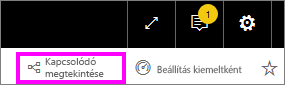
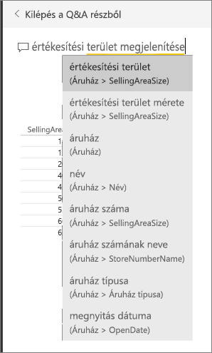
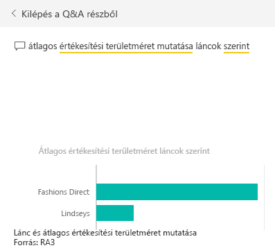
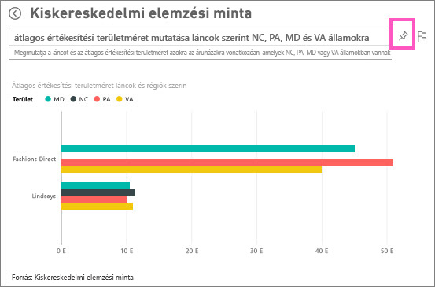
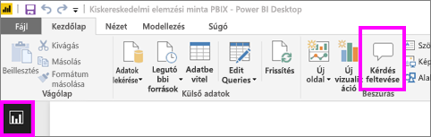
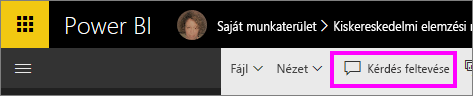
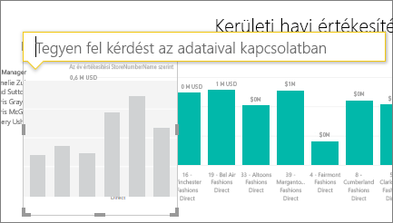
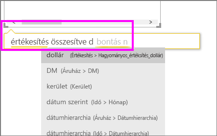
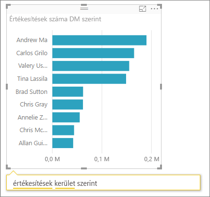
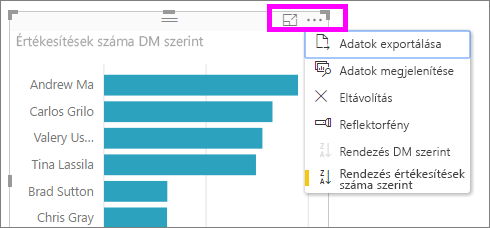

# Oktatóanyag: A Q&A használata vizualizációk és jelentések létrehozásához
A [Q&A áttekintésében](power-bi-q-and-a.md) megismerkedhetett a Power BI Q&A alapjaival, és megtanulta, mi a különbség a *felhasználók* (akikkel irányítópultokat és jelentéseket osztottak meg) és a *létrehozók* (az alapul szolgáló jelentések és adatkészletek tulajdonosai) között. Ennek az oktatóanyagnak az első része elsősorban azoknak szól, akik a Power BI szolgáltatásban irányítópultokat használnak fel. A második részt azoknak szántuk, akik jelentéseket hoznak létre akár a Power BI szolgáltatásban, akár a Power BI Desktopban. A [Q&A és a Power BI Mobile](mobile-apps-ios-qna.md), valamint a [Q&A a Power BI Embedded használatával](developer/qanda.md) külön cikkekben szerepelnek.

A Q&A interaktív, és még szórakoztató is lehet. Az esetek többségében a kérdések újabbakhoz vezetnek, és érdekes, követésre érdemes utakat nyitnak meg. Figyelje meg, hogyan hoz létre Amanda vizualizációkat a Q&A-val, hogyan tárja fel ezeket a vizualizációkat, és rögzíti őket irányítópultokon.

<iframe width="560" height="315" src="https://www.youtube.com/embed/qMf7OLJfCz8?list=PL1N57mwBHtN0JFoKSR0n-tBkUJHeMP2cP" frameborder="0" allowfullscreen></iframe>

## 1. rész: A Q&A használata irányítópulton a Power BI szolgáltatásban (app.powerbi.com)
Az irányítópultokon egy vagy több adatkészletből származó csempék vannak rögzítve, így bármely adatkészlet bármely adatával kapcsolatban feltehető kérdés. Ha meg szeretné nézni, hogy mely jelentéseket és adatkészleteket használták fel az irányítópult létrehozásához, válassza a menüsávon a **Kapcsolódó megtekintése** elemet.

A Q&A kérdésmező az irányítópult bal felső sarkában található. Itt kell beírni a kérdéseket természetes nyelven. A Q&A felismeri a beírt szavakat, és kitalálja, hogy hol (melyik adatkészletben) található meg a válasz. A Q&A a kérdés megfogalmazásában is segít automatikus kiegészítéssel, átfogalmazással és más szöveges és vizuális támogatással.

A kérdésére adott válasz használható vizualizációként jelenik meg, és a kérdés módosításakor frissül.

1. Nyisson meg egy irányítópultot, és vigye a kurzort a kérdésmező fölé. Még mielőtt gépelni kezdene, a Q&A egy új képernyőt nyit meg, amelyen javaslatokkal segít a kérdés megfogalmazásában. A táblázatok nevét az [alapul szolgáló adatkészlet(ek)](service-get-data.md) alatt találja, és ha az adatkészlet tulajdonosa létrehozott [kiemelt kérdéseket](service-q-and-a-create-featured-questions.md), akkor ezeket a kész kérdéseket is látni fogja.

   

   Kiindulásként mindig választhatja ezen kérdések egyikét, míg a kérdés finomításával rá nem talál az Ön által keresett válaszra. Egy tábla nevét használva új kérdést is megfogalmazhat.

2. Válasszon az adatkészlet lehetőségei közül, vagy kezdje el beírni saját kérdését, és válasszon a legördülő javaslatokból.

   

3. A kérdés beírása közben a Q&A kiválasztja a legjobb [vizualizációt](power-bi-visualization-types-for-reports-and-q-and-a.md) a válasz megjelenítéséhez; a kérdés módosítása közben a vizualizáció dinamikusan változik.

   

4. A kérdés begépelésekor a Power BI minden olyan adatkészletben keresi a választ, amelyhez csempe tartozik az irányítópulton.  Ha az összes csempe forrása az *A adatkészlet*, akkor a válaszok az *A adatkészletből* származnak.  Ha vannak az *A adatkészletből* és a *B adatkészletből* származó csempék is, akkor a Q&A a két adatkészletből keresi ki a legjobb választ.

   > [!TIP]
   > Ügyeljen rá, hogy ha az *A adatkészletnek* csak egy csempéje van, és eltávolítja azt az irányítópultról, akkor a Q&A többé nem fog hozzáférni az *A adatkészlethez*.
   >
   >
5. Ha elégedett az eredménnyel, [rögzítse a vizualizációt egy irányítópulton](service-dashboard-pin-tile-from-q-and-a.md) a jobb felső sarokban lévő gombostű ikon használatával. Ha az irányítópultot más osztotta meg Önnel, vagy egy alkalmazás része, akkor a rögzítésre nincs lehetősége.

   

##    2. rész: A Q&A használata jelentésben a Power BI szolgáltatásban és a Power BI Desktopban

A Q&A használatával megismerheti az adatkészletet, és vizualizációkat adhat hozzá jelentésekhez és irányítópultokhoz. Egy jelentés egyetlen adatkészletet használ, és lehet teljesen üres is, vagy tartalmazhat számos vizualizációval rendelkező oldalakat is. Ha azonban üres egy jelentés, az még nem jelenti azt, hogy nincsenek rendelkezésre álló és feltárható adatok benne: az adatkészlet csatolva van a jelentéshez, és az adatai vizualizációk létrehozásával fel is tárhatóak.  Ha meg szeretné nézni, hogy a jelentés mely adatkészlet használatával készült, nyissa meg a jelentést a Power BI szolgáltatásban Olvasó nézetben, és válassza a **Kapcsolódó megtekintése** lehetőséget.

Ahhoz, hogy a Q&A-t használni tudja a jelentésekben, szerkesztési engedéllyel kell rendelkeznie a jelentés alapjául szolgáló adatkészlethez és a jelentéshez. A [Q&A áttekintését tartalmazó témakörben](power-bi-q-and-a.md) ezt *létrehozóként* említettük. Ha Ön azonban nem létrehozó, hanem *felhasználó*, akivel a jelentést megosztották, akkor nem fogja tudni használni a Q&A-t.

1. Nyisson meg egy jelentést Szerkesztési nézetben (Power BI szolgáltatás) vagy Jelentés nézetben (Power BI Desktop), és a menüsávon válassza a **Kérdés feltevése** lehetőséget.

    **Desktop**    
    

    **Service**    
    

2. A jelentésvásznon megjelenik a Q&A kérdésmező. Az alábbi példában a kérdésmező egy másik vizualizáció fölött jelenik meg. Ez nem okoz problémát, de tanácsosabb [új üres oldalt hozzáadni a jelentéshez](power-bi-report-add-page.md) a kérdés feltevése előtt.

    

3. Vigye a kurzort a kérdésmező fölé. A kérdés begépelése közben a Q&A javaslatokat jelenít meg a kérdés megfogalmazásához.

   

4. A kérdés beírása közben a Q&A kiválasztja a legjobb [vizualizációt](power-bi-visualization-types-for-reports-and-q-and-a.md) a válasz megjelenítéséhez; a kérdés módosítása közben a vizualizáció dinamikusan változik.

   

5. Ha megjelent a kívánt vizualizáció, nyomja meg az ENTER billentyűt. Ha a vizualizációt menteni szeretné a jelentéssel, válassza a **Fájl > Mentés** lehetőséget.

6. Az új vizualizációt használatba is veheti. Függetlenül attól, hogy a vizualizációt hogyan hozta létre, elérhetőek lesznek ugyanazok a lehetőségek az interakcióra, a formázásra és egyéb funkciókra.

  

  Ha a vizualizációt a Power BI szolgáltatás használatával hozta létre, akkor [rögzítheti is azt egy irányítópulton](service-dashboard-pin-tile-from-q-and-a.md).

## Adja meg a Q&A-nak a használandó vizualizációt.
A Q&A-tól nem csak annyit kérhet, hogy az adatok beszéljenek magukért, azt is megadhatja, hogy a Power BI hogyan jelenítse meg a válaszokat. Elég a kérdés végét a "as a <visualization type>" ("mint ...") szöveggel kiegészíteni.  Erre példa a "show inventory volume by plant as a map" ("mutasd a raktárkészletet üzemenként mint térkép") és a "show total inventory as a card" ("mutasd a teljes leltárt mint kártya").  Próbálja ki.

##  Megfontolandó szempontok és hibaelhárítás
- Ha az adatkészlethez élő kapcsolattal vagy átjáró használatával csatlakozott, a Q&A-t [engedélyezni kell az adott adatkészlethez](service-q-and-a-direct-query.md).

- Megnyitott egy jelentést, de nem jelenik meg a Q&A lehetőség. Ha a Power BI szolgáltatást használja, mindenképpen a Szerkesztési nézetében nyissa meg a jelentést. Ha nem tudja megnyitni a Szerkesztési nézetet, akkor nincs jogosultsága a jelentés szerkesztéséhez, és ez esetben nem fogja tudni használni a Q&A-t ehhez a jelentéshez.

## Következő lépések
Vissza a [Q&A a Power BI-ban](power-bi-q-and-a.md)  című témakörhöz  
[Oktatóanyag: A Q&A használata a kiskereskedelmi értékesítési mintával](power-bi-visualization-introduction-to-q-and-a.md)   
[Tippek kérdések feltevéséhez a Q&A-ben](service-q-and-a-tips.md)   
[Munkafüzet előkészítése a Q&A használatához](service-prepare-data-for-q-and-a.md)  
[Helyszíni adatkészlet előkészítése a Q&A-hez](service-q-and-a-direct-query.md)
[Csempe rögzítése irányítópultra Q&A-ból](service-dashboard-pin-tile-from-q-and-a.md)
