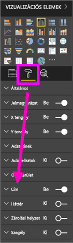
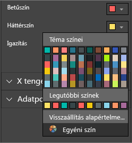
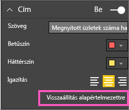
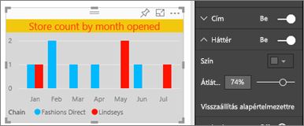
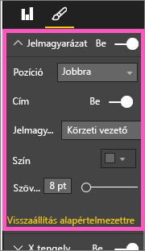

# A vizualizáció címeinek, jelmagyarázatainak és háttereinek testreszabása
Ezen oktatóanyag segítségével elsajátíthatja a vizualizációk testre szabására szolgáló különböző módszereket.   Számos lehetőség van a vizualizációk testreszabására. A legjobban a Formátum panel felfedezésével ismerheti meg ezeket (kattintson a festőhenger ikonra).  Az első lépésekhez megtételéhez ez a cikk bemutatja, hogyan szabhatja testre a vizualizáció címét, jelmagyarázatát és hátterét.  

Nem minden vizualizáció szabható testre. Tekintse meg [a teljes listát](#list).  

Tekintse meg, ahogyan Amanda testre szabja a vizualizációkat a jelentésében (tekerjen előre 4:50-hez a videóban). Ezután a videó alatt látható utasításokat követve próbálkozzon meg a saját adatai testre szabásával.

<iframe width="560" height="315" src="https://www.youtube.com/embed/IkJda4O7oGs" frameborder="0" allowfullscreen></iframe>

### Előfeltételek
- Power BI szolgáltatás vagy Power BI Desktop
- Kiskereskedelmi elemzési minta

## Vizualizáció címének testreszabása jelentésekben
Hogy követni tudja a lépéseket, jelentkezzen be a Power BI szolgáltatásba (app.powerbi.com), és [nyissa meg a Kiskereskedelmi elemzési minta](sample-datasets.md) jelentést [Szerkesztési nézetben](service-interact-with-a-report-in-editing-view.md).

> [!NOTE]
> Ha rögzít egy vizualizációt az irányítópulton, az irányítópult-csempévé válik.  Maguk a csempék is testre szabhatók [új címekkel és alcímekkel, hiperhivatkozásokkal, és átméretezhetők](service-dashboard-edit-tile.md).
> 
> 

1. Navigáljon a jelentés „New Stores” (Új üzletek) lapjára, és válassza az „Open Store Count by Open Month...” (Megnyitott üzletek száma a megnyitás hónapja alapján) oszlopdiagramot.
2. A Vizualizációk panelen kattintson a festőhenger ikonra, hogy láthatóvá váljanak a formázási lehetőségek.  Ezután a **Cím** lehetőség kiválasztásával bontsa ki az adott szakaszt.  
   
   
3. A Be (vagy Ki) csúszka kiválasztásával be- és kikapcsolhatja a **Címet**. Egyelőre hagyja **Be** állásban.  
   
   
4. A **Címszöveg** módosításához írja be a szövegmezőbe azt, hogy **Store count by month opened** (Üzletszám a megnyitás hónapja alapján).  
5. Módosítsa a **Betűszínt** narancssárgára, és a **Háttérszínt** citromsárgára.
   
   * Kattintson a legördülő listára, és válasszon egy színt a **Téma színei**, **Legutóbbi színek** vagy **Egyéni szín** közül.
   * Kattintson a legördülő listára a színablak bezárásához.  
     
   
   Mindig visszaállíthatja az alapértelmezett színeket a **Visszaállítás az alapértelmezettre** lehetőséggel a színablakban.
6. Növelje a szövegméretet 12-esre.
7. A diagram címének utolsó testre szabásaként a vizualizáció közepére igazítjuk azt. Alapértelmezés szerint a cím pozíciója balra igazított.  
   
   
    Az oktatóanyag ezen pontján az oszlopdiagramja **címének** körülbelül így kellene kinéznie:  
    
   
    A címen eddig végrehajtott testreszabások visszavonásához válassza a **Visszaállítás az alapértelmezettre** lehetőséget a **Cím** testreszabás panel alján.  
    

## Vizualizáció hátterek testreszabása
Ugyanazt az oszlopdiagramot kiválasztva bontsa ki a Háttér beállításokat.

1. A Be (vagy Ki) csúszka kiválasztásával be- és kikapcsolhatja a hátteret. Egyelőre hagyja **Be** állásban.
2. Módosítsa a háttérszínt 74%-os szürkére.
   
   * Kattintson a legördülő listára, és válasszon egy szürke színt a **Téma színei**, **Legutóbbi színek** vagy **Egyéni szín** közül.
   * Módosítsa az átlátszóságot 74%-ra.   
     
   
   Az eddig végrehajtott testreszabások visszavonásához válassza a **Visszaállítás az alapértelmezettre** lehetőséget a **Háttér** testreszabás panel alján.

## Vizualizáció jelmagyarázatának testreszabása
1. Nyissa meg az **Overview** (Áttekintés) jelentésoldalt, és válassza ki a „Total Sales Variance by FiscalMonth and District Manager” (Teljes értékesítési szórásnégyzet pénzügyi hónap és kerületi menedzser szerint) diagramot.
2. A Vizualizáció lapon a Festőhenger ikonra kattintva nyissa meg a Formátum panelt.  
3. Bontsa ki a **Jelmagyarázat** beállításait.
   
      
4. A Be (vagy Ki) csúszka kiválasztásával be- és kikapcsolhatja a jelmagyarázatot. Egyelőre hagyja **Be** állásban.
5. Helyezze át a jelmagyarázatot a vizualizáció bal oldalára.    
6. A **Cím** **Be** helyzetbe váltásával, és a **Jelmagyarázat neve** mezőbe a **Managers** (Menedzserek) szó beírásával adja meg a jelmagyarázat címét.
   
   
   A jelmagyarázaton eddig végrehajtott testreszabások visszavonásához válassza a **Visszaállítás az alapértelmezettre** lehetőséget a **Jelmagyarázat** testreszabás panel alján.

## Testre szabható vizualizációtípusok
| Vizualizáció | Cím | Háttér | Jelmagyarázat |
|:--- |:--- |:--- |:--- |
| terület |igen |igen |igen |
| sáv |igen |igen |igen |
| card |igen |igen |n.a. |
| többsoros kártya |igen |igen |n.a. |
| oszlop |igen |igen |igen |
| kombinált |igen |igen |igen |
| gyűrű |igen |igen |igen |
| kartogram |igen |igen |igen |
| tölcsér |igen |igen |n.a. |
| mérőműszer |igen |igen |n.a. |
| kpi |igen |igen |n.a. |
| vonal |igen |igen |igen |
| térkép |igen |igen |igen |
| mátrix |igen |igen |n.a. |
| torta |igen |igen |igen |
| pont |igen |igen |igen |
| szeletelő |igen |igen |n.a. |
| tábla |igen |igen |n.a. |
| szövegmező |nem |igen |n.a. |
| fatérkép |igen |igen |igen |
| vízesés |igen |igen |igen |

## Következő lépések
[X és Y tengely testreszabása](power-bi-visualization-customize-x-axis-and-y-axis.md)  
[Színek és tengelytulajdonságok testreszabása](service-getting-started-with-color-formatting-and-axis-properties.md)  
[Power BI – Alapfogalmak](service-basic-concepts.md)  
További kérdései vannak? [Kérdezze meg a Power BI közösségét](http://community.powerbi.com/)

