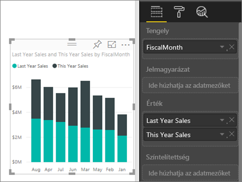
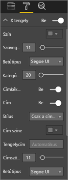
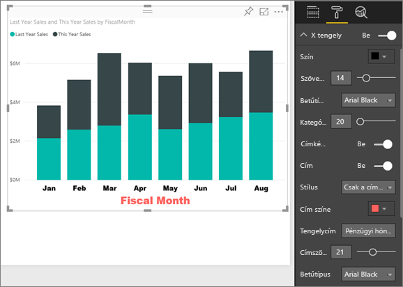
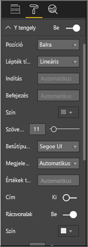
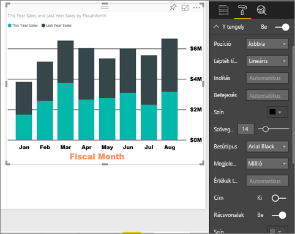
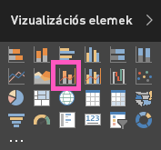
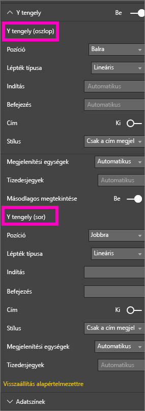

# X és Y tengely tulajdonságainak testreszabása
Az oktatóanyag segítségével elsajátíthatja a vizualizációk X és Y tengelyének testreszabását lehetővé tevő módok végrehajtását. Nem minden vizualizáció rendelkezik tengelyekkel vagy testreszabási lehetőségekkel. Például a kördiagramoknak nincsenek tengelyei. Ráadásul a testreszabási lehetőségek minden vizualizáció esetében különböznek, és túl sok lehetőség létezik ahhoz, hogy egyetlen cikkben mindet ismertessük. Így a leggyakrabban használt tengelyek testreszabási lehetőségeit fogjuk átvenni, hogy Ön kényelmesen elsajátíthassa a vizualizációk formázási lapjának használatát a Power BI-jelentések vásznán.  

> [!NOTE]
> A tartalom a Power BI szolgáltatásra és a Power BI Desktopra is vonatkozik. Azok a testreszabási lehetőségek, amelyek a **Formázás** elem (a festőhenger ikon ) kiválasztásával érhetők el, a Power BI Desktopban is elérhetők.  
>
>

Figyelje meg, ahogy Amanda testreszabja az X és Y tengelyt, és bemutatja az összefűző vezérlésének különböző módjait a felhatolás és lehatolás használatakor. Ezután a videó alatt látható részletes utasításokat követve próbálkozzon meg a feladat elvégzésével, a Kiskereskedelmi elemzési minta használatával.

<iframe width="560" height="315" src="https://www.youtube.com/embed/9DeAKM4SNJM" frameborder="0" allowfullscreen></iframe>

## Az X tengely vizualizációjának testreszabása jelentésekben
## Halmozott diagramos vizualizáció létrehozása
Jelentkezzen be a Power BI szolgáltatásba, és nyissa meg a **Kiskereskedelmi elemzési minta** jelentést [Szerkesztési nézetben](service-interact-with-a-report-in-editing-view.md). A további lépések követéséhez [kapcsolódjon a Kiskereskedelmi elemzési mintához](sample-datasets.md).

1. Hozzon létre egy oszlopdiagramot, amely az idei és az előző évi értékesítések értékét jeleníti meg pénzügyi hónapok szerinti bontásban.
2. Alakítsa át a diagramot halmozott oszlopdiagrammá.

    

## Az X tengely testreszabása
1. A Vizualizációk és szűrők ablaktáblán válassza a **Formázás** lehetőséget (a festőhenger ikont ), hogy láthatóvá váljanak a testreszabási lehetőségek.
2. Bontsa ki az X tengely beállításait.

   
3. A Be (vagy Ki) csúszka kiválasztásával be- és kikapcsolhatja az X tengelyt. Egyelőre hagyja **Be** állásban.  Az X tengely kikapcsolásának az egyik lehetséges oka az lehet, hogy ezzel helyet hagyjunk még több adatnak.

    
4. Formázza a szöveg színét, méretét és betűtípusát. Ebben a példában a **szöveg színe** fekete, a **szöveg mérete** 14 értékű, a **betűtípus** pedig az Arial Black.  
5. Kapcsolja **Be** az X tengely címét, és jelenítse meg az X tengely nevét, ami ebben az esetben **Pénzügyi hónap**.  
6. Formázza a cím szövegének színét, méretét és betűtípusát.  Ebben a példában a **Cím színe** narancssárga, a **Tengely címe** **Pénzügyi hónap**, a **Cím szövegének mérete** pedig 21.
7. A pénzügyi hónap szerinti rendezéshez a diagram jobb felső sarkában kattintson a három pontra (…), és válassza a **Pénzügyi hónap szerinti rendezés** lehetőséget.

    A testreszabás elvégzése után az oszlopdiagramnak a következőhöz hasonlóan kell kinéznie:

     

Az X tengelyen eddig végrehajtott testreszabások visszavonásához válassza a **Visszaállítás alapértelmezettre** lehetőséget az **X tengely** testreszabási ablaktáblájának alján.

## Az Y tengely testreszabása
1. Bontsa ki az Y tengely beállításait.

   

2. A Be (vagy Ki) csúszka kiválasztásával be- és kikapcsolhatja az Y tengelyt. Egyelőre hagyja **Be** állásban.  Az Y tengely kikapcsolásának az egyik lehetséges oka az lehet, hogy ezzel helyet hagyjunk még több adatnak.
   
    
3. Állítsa át az Y tengely **Pozícióját** a jobb oldalra.
4. Formázza a szöveg színét, méretét és betűtípusát. Ebben a példában a **szöveg színe** fekete, a **szöveg mérete** 14 értékű, a **betűtípus** pedig az Arial Black.  
5. Hagyja meg a **Megjelenítési egységek** beállításnál a milliók, az **Értékek tizedesjegyei** beállításnál pedig a 0 értéket.
6. Ennél a vizualizációnál az Y tengely címe nem tesz hozzá a vizualizációhoz, így hagyja a **Cím** beállítást kikapcsolva.  
7. Emeljük ki a rácsvonalakat úgy, hogy a **Szín** beállítást sötétszürkére változtatjuk, a **Vonás vastagsága** beállítást pedig 2-re növeljük.

    A testreszabás elvégzése után az oszlopdiagramnak a következőhöz hasonlóan kell kinéznie:

     

## Dupla Y tengellyel rendelkező vizualizációk testreszabása
Először létrehozunk egy kombinált diagramot, amely azt ábrázolja, hogy a boltok számának milyen hatása van az értékesítésekre.  Ez a diagram ugyanaz, amelyet a [Kombinált diagram oktatóanyagban](power-bi-visualization-combo-chart.md) létrehoztunk. Ezután megformázzuk a dupla Y tengelyt.

### Két Y tengellyel rendelkező diagram létrehozása
1. Hozzon létre egy új vonaldiagramot, amely az **Értékesítés > Tavalyi bruttó nyereség (%)** adatokat követi **Idő > Pénzügyi hónap** szerint.
2. A vizualizáció hónapok szerinti rendezéséhez válassza a három pontot (…), majd a **Rendezés hónapok szerint** lehetőséget.

    

>[NOTE]: For help sorting by month, see [sorting by other criteria](power-bi-report-change-sort.md#other)
1. A januári bruttó nyereség 35% volt, áprilisban egy 45%-os csúcs következett, amelyet júliusban egy esés, augusztusban pedig egy újabb csúcs követett. Az idei év értékesítéseire vonatkozóan is hasonló mintát fogunk látni, mint tavaly?
2. Adja hozzá a vonaldiagramhoz az **Idei értékesítés > Érték** és a **Múlt évi értékesítés** mezőt. A **Tavalyi bruttó nyereség (%)** (a 0%-os rácsvonal mellett futó kék vonal) mérete sokkal kisebb, mint az **Értékesítés** mérete, ami megnehezíti az összehasonlítást. Az Y tengely címkéjének százalékos értékei pedig nevetségesek.      

   
5. Annak érdekében, hogy a vizualizáció könnyebben olvasható és értelmezhető legyen, alakítsa át a vonaldiagramot egy vonal- és halmozott oszlopdiagrammá.

   

6. Húzza át a **Tavalyi bruttó nyereség (%)** értéket az **Oszlopértékek** közül a **Sorértékek** közé. Ekkor a fentebb létrehozott halmozott oszlopdiagramot látjuk, ***valamint*** egy vonaldiagramot.  (Tetszés szerint a fentebb ismertetett módon a tengelyek betűszíne és betűmérete is formázható.)
   

   A Power BI létrehoz két tengelyt, ezzel lehetővé téve az adatkészletek eltérő skálázását: a bal tengely méri a pénzösszeget, a jobb pedig a százalékokat.

   

### A másodlagos Y tengely formázása
1. A **Vizualizációk** ablaktáblán válassza a festőhenger ikont, hogy láthatóvá váljanak a formázási lehetőségek.
2. Bontsa ki az Y tengely beállításait a lefelé mutató nyílra kattintva.
3. Görgessen lefelé a listában, amíg meg nem látja a **Másodlagos megtekintése** lehetőség beállításait. Állítsa a **Másodlagos megtekintése** lehetőséget **Ki** állásból **Be** állásba.

   

   
4. (Opcionális) Szabja testre a két tengelyt. Ha átállítja akár az oszloptengely, akár a sortengely **Pozíció** beállítását, akkor a két tengely helyet cserél.

   

### Címek hozzáadása a tengelyekhez
Ilyen összetett vizualizációk esetében sokat segíthet, ha címeket adunk a tengelyeknek.  A címek segítségével a munkatársai jobban megérthetik a vizualizáció által elmondott történetet.

1. Állítsa a **Cím** lehetőséget **Be** állásba az **Y tengely (Oszlop)** és az **Y tengely (Sor)** esetén is.
2. Állítsa be a **Stílus** beállításnál a **Csak a cím megjelenítése** lehetőséget.

   
3. A kombinált diagram ekkor a dupla tengelyt címekkel együtt jeleníti meg.

   

További információkért lásd [a színek formázásához, a címkézéshez és a tengelyek tulajdonságainak beállítására szolgáló tippeket és trükköket](service-tips-and-tricks-for-color-formatting.md).

## Megfontolandó szempontok és hibaelhárítás
Ha a jelentés tulajdonosa az X tengelyt adat típusúként kategorizálta, akkor megjelenik a **Típus** beállítás, amelynél a folyamatos és a kategorikus beállítások közül lehet választani.

## Következő lépések
További információk [a Power BI-jelentésekben lévő vizualizációkról](power-bi-report-visualizations.md)

[C](power-bi-visualization-customize-title-background-and-legend.md)[ímek, hátterek és jelmagyarázatok testreszabása](power-bi-visualization-customize-title-background-and-legend.md)

[Színek és tengelytulajdonságok testreszabása](service-getting-started-with-color-formatting-and-axis-properties.md)

[Power BI – Alapfogalmak](service-basic-concepts.md)

További kérdései vannak? [Kérdezze meg a Power BI közösségét](http://community.powerbi.com/)
