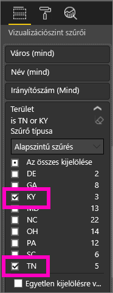
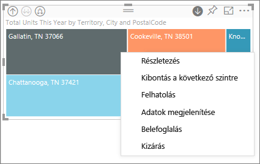
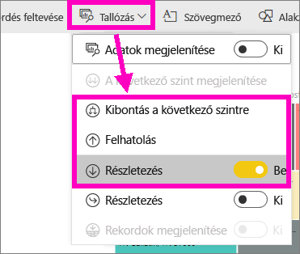
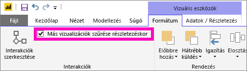
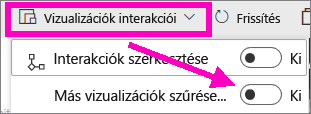

# Részletezési mód vizualizációkban a Power BI-ban

## A részletezéshez hierarchiára van szükség
Ha a vizualizáció mögött hierarchikus adatstruktúra található, a részletesebb adatszintek kibonthatók. Tegyük fel például, hogy egy vizualizáció az olimpiai érmek számát jeleníti meg, sportonkénti, szakágankénti és versenyszámonkénti adathierarchia alapján. Alapértelmezés szerint a vizualizáció az érmek számát sportok szerinti bontásban (pl. gimnasztika, síelés, vízi sportok.) jeleníti meg. Ugyanakkor mivel rendelkezik hierarchiával, egy-egy vizuális elem (például egy oszlop, egy sáv vagy egy kör) kiválasztásakor egyre részletesebb ábra jeleníthető meg. Ha a **vízi sportok** elemre kattint, megjeleníthetők az úszásra, műugrásra és vízilabdára vonatkozó adatok.  Ezután ha a **műugrásra** kattint, megtekintheti a műugró, toronyugró és szinkronugró versenyszámokra vonatkozó információkat.

Hierarchiát csak saját jelentéseihez adhat, mások által Önnel megosztottakhoz nem.
Nem tudja, mely Power BI-vizualizációk tartalmaznak hierarchiát?  Húzza a kurzort az egyik vizualizáció fölé. Ha az alábbi részletezésvezérlők megjelennek a felső sarkokban, a vizualizáció rendelkezik hierarchiával.

    
   

Sajátos hierarchiatípust képviselnek a dátumok. Amikor dátummezőt ad egy vizualizációhoz, a Power BI automatikusan felvesz egy évekből, negyedévekből, hónapokból és napokból álló időhierarchiát. Ha ezzel kapcsolatban további információra van szüksége, tekintse át a [vizualizációs hierarchiákat és a lehatolás működését](guided-learning/visualizations.yml?tutorial-step=18) áttekintő cikket.

  <iframe width="560" height="315" src="https://www.youtube.com/embed/MNAaHw4PxzE?list=PL1N57mwBHtN0JFoKSR0n-tBkUJHeMP2cP" frameborder="0" allowfullscreen></iframe>

> [!NOTE]
> Ha meg szeretné tanulni, hogyan hozhatók létre hierarchiák a Power BI Desktopot használva, tekintse meg a [How to create and add hierarchies](https://youtu.be/q8WDUAiTGeU) (Hierarchiák létrehozása és hozzáadása) című videót
> 

## Előfeltételek

1. A Power BI szolgáltatásban és a Power BI Desktopban a részletezéshez hierarchiával rendelkező vizualizációra van szükség. 
   
2. A lépések követéséhez [nyissa meg a Retail Analysis (Kiskereskedelmi elemzés) mintát](sample-datasets.md), majd hozzon létre egy fatérképet, mely a **Total Units This Year (Egységek éves száma összesen)** értéket (Értékek) **Territory** (Terület), **City** (Város), **PostalCode** (Irányítószám), és **Name** (Név) bontásban (Csoport) tudja megjeleníteni.  A fatérkép területből (Territory), városból (City), irányítószámból (Postal Code) és városnévből (Name) felépülő hierarchiával rendelkezik. Minden területhez egy vagy több város, minden városhoz egy vagy több irányítószám tartozik, és így tovább. Alapértelmezés szerint a vizualizáció csak a területi adatokat jeleníti meg, mert a lista első eleme a *Territory* (Terület).
   
   

2. A különféle részletezési ikonok együttműködését nehéz lehet átlátni, ezért most szűrni fogjuk a fatérképet, hogy csak ezt a két kisebb területet mutassa: **KY** és **TN**. Válassza ki a fatérképet, majd a **Vizualizáció szintű szűrők** alatt bontsa ki a **Terület** részt, és válassza ki a **KY** és a **TN** elemeket.

        

   Most már csak két terület jelenik meg a fatérképen.

   

## A részletezési funkciók elérésének három módja
A lehatolási, felhatolási és kibontási funkciókat több különféle módon is elérheti a hierarchiával rendelkező vizualizációknál. Ebben a cikkben alább az első módszer használatát mutatjuk be. Ha már megismerkedett a lehatolás és a kibontás alapjaival, mindhárom módszerrel elérheti ugyanazt az eredményt. Próbálja ki mindegyiket, és használja azt, amelyik leginkább tetszik Önnek.

- Az ikonok használatához mutasson egy vizualizációra.  

    

- A menü megjelenítéséhez kattintson jobb gombbal egy vizualizációra.
    
    

- A Power BI menüsávjában válassza a **Böngészés** gombot.

   

## A lehatolás útvonala
### Lehatolás
A vizualizációban való lehatoláshoz több módszert is használhat. A ***Lehatolás*** lehetőséggel a hierarchia következő szintjét érheti el, így ha a **Terület** szinten van, lehatolhat a város szintjére, majd az irányítószám, és végül a név szintjére is. Az útvonal minden lépésén új információhoz juthat.

### Kibontás

A ***Kibontás*** a jelenlegi nézethez egy új hierarchiaszintet ad hozzá. Így ha a **Terület** szinten van, kibonthatja, azt és hozzáadhat a fatérképhez várost, irányítószámot és nevet. Az útvonal minden lépése ugyanazt az információt jeleníti meg, és egy új szintet ad hozzá új információkkal.

Egyesével is lehatolhat és kibonthatja a szintet, de lehetőség van arra is, hogy egyszerre az összes mezőre végezze el a műveletet. 

## Lehatolás minden mezőre egyszerre

1. Kezdje a fatérkép legfelső szintjével, ahol a KY és a TN adatai láthatóak. Szélesítse ki a fatérképet: válassza ki az egyik fogópontot, és húzza a jobb oldalra. 

     .

2. Ha az ***összes szinten egyszerre*** szeretne lehatolni, kattintson a vizualizáció bal felső sarkában látható, lefelé mutató dupla nyílra  . A fatérkép most Kentucky és Tennessee városadatait mutatja. 

    
   
5. Hatoljon le még egyszer az irányítószám szintre a hierarchiában.

    

3. Ha vissza szeretne lépni, válassza a vizualizáció bal felső sarkában látható felfelé mutató nyilat .

## Lehatolás mezőnként
Ez a módszer a vizualizációk felső sarkaiban megjelenő lehatolási ikonokat használja. 

1. A lehatolási ikont kiválasztással kapcsolhatja be . Most már lehetősége van arra, hogy ***egyszerre egy mezőnyit hatoljon le***. 
   
   

   Ha nem kapcsolja be a lehatolási módot, akkor a rendszer nem lehatolást végez, hanem a jelentésoldalon szereplő többi diagram tekintetében keresztszűrést alkalmaz, amikor rákattint valamelyik vizualizációs elemre (pl. az egyik oszlopra, egy körre vagy levélcsomópontra).

2. Válassza ki a **TN**-hez tartozó *levélcsomópontot*. A fatérkép most megjeleníti az összes olyan várost Tennessee államban, amelyben van üzlet. 

    

2. Most folytathatja a lehatolást Tennessee államra, vagy lehatolhat Tennessee egy adott városára is, de lehetőség van arra is, hogy kibontást végezzen (lásd a **Minden mező kibontása** témát alább). Most folytassuk azzal, hogy egyszerre egy-egy mezőben végzünk lehatolást.  Válassza ki a **Knoxville, TN** elemet. A fatérkép most a Knoxville-ben található üzlet postai irányítószámát mutatja. 

   

    Nézze meg, hogyan változik a csempe, ahogy le- és felhatol a hierarchiában.  

## Az összes kibontása és egyszerre egy-egy mező kibontása
Egy olyan fatérkép, amely mindössze egy irányítószámot mutat, nem igazán hasznos.  Ezért bontsuk ki a hierarchiát egy szinttel lejjebb.  

1. Az aktív fatérképben válassza a *Kibontás lefelé* ikont   . A fatérkép most a hierarchia két szintjét mutatja: irányítószámot és üzletnevet. 

    

2. Ha meg akarja tekinteni a Tennesee-hez tartozó adatok mind a 4 hierarchiaszintjét, válassza a felhatolás nyilat addig, amíg el nem éri a fatérképen a második szintet, amely a **Total units this year by territory and city** (Összes egység ebben az évben terület és város szerint). 

    

3. Ügyeljen rá, hogy a lehatolás még be legyen kapcsolva  , majd válassza a *kibontás lefelé* ikont . A fatérkép most már további adatokat is megjelenít: a város és az állam mellett most már irányítószámot is mutat. 

    

4. Válassza a *kibontás lefelé* ikont még egyszer: ezzel megjeleníti a Tennesee-hez tartozó adatok mind a 4 hierarchiaszintjét a fatérképen. Ha még több részletet szeretne, mutasson rá egy levélcsomópontra.

   

## Más vizualizációk szűrése részletezéskor
A Részletezés mód használatakor el kell döntenie, hogy a lehatolás és a kibontás milyen hatással legyen az oldal többi vizualizációjára. 

Alapértelmezés szerint a lehatolás nem szűri a jelentés többi vizualizációját. Ez a funkció azonban bekapcsolható a Power BI Desktopban és a Power BI szolgáltatásban. 

1. A Desktopban válassza a **Formázás** lapfület, majd jelölje be a **Más vizualizációk részletező szűrése** lehetőség melletti jelölőnégyzetet.

    

2. Ha most lehatolást, felhatolást vagy kibontást végez egy hierarchiával rendelkező vizualizációnál, ez a művelet az oldal más vizualizációit is szűrni fogja. 

    

    

> [!NOTE]
> A Power BI szolgáltatásban ezt úgy engedélyezheti, ha a felső menüsávban kiválasztja a **Vizuális interakciók > Más vizualizációk részletező szűrése** lehetőséget.
>
> 

## A hierarchiatengely és hierarchiacsoport ismertetése
A hierarchiatengely és a hierarchiacsoport tulajdonképpen a megtekinteni kívánt adatok részletességét szabályozó eszközöket jelenti. A kategóriákba és alkategóriákba csoportosítható minden adat rendelkezik hierarchiával. Ez természetesen magában foglalja a dátumokat és az időt.

Ha egy Power BI-vizualizációt hierarchiával együtt szeretne létrehozni, jelöljön ki egy vagy több adatmezőt, amelyet a **Tengely**vagy a **Csoport** gyűjtőhöz ad, valamint az adatmezőkként vizsgálni kívánt adatokat, amelyeket az**Értékek** gyűjtőhöz ad. Ha a *Részletezés mód* ikonjai a vizualizáció jobb és bal felső sarkában jelennek meg, akkor biztos lehet benne, hogy az adatok hierarchikusak. 

Alapvetően kétféle hierarchikus adatokkal dolgozunk:
- Dátum- és időadatok – Ha egy Dátum/idő adattípussal rendelkező adatmezője van, akkor hierarchikus adatokkal dolgozik. A Power BI automatikusan létrehozza a hierarchiát azon adatmezőkhöz, amelyek értékei [Dátum/idő](https://msdn.microsoft.com/library/system.datetime.aspx) struktúra szerint elemezhetők. A **Tengely** vagy a **Csoport** gyűjtőhöz csak egy Dátum/Idő mezőt kell adnia.
- Kategorikus adatok – Ha az adatok algyűjteményeket tartalmazó gyűjteményekből származnak, vagy olyan adatsorokkal rendelkeznek, amelyeknek közös értékeik vannak, akkor hierarchikus adatokkal dolgozik.

A Power BI segítségével egyesével vagy részhalmazonként kibonthatja ezeket. Lehatolhat a szintenkénti részhalmazokig, vagy minden részhalmazt egyszerre megtekinthet egy szinten. Például lehatolhat egy adott évig, vagy megtekintheti az egyes évek eredményeit a hierarchiában lefelé haladva. Hasonlóképpen hatolhat felfelé is.

A következő szakaszok a legmagasabb, a középső és a legalsó nézetből való lehatolást ismertetik.

### Hierarchikus és időadatok
Ehhez a példához használja fel a [kiskereskedelmi elemzési mintát](sample-datasets.md), és hozzon létre egy halmozott oszlopdiagram típusú vizualizációt, amelynek tengelye a **Hónap**, az értékei pedig az **Összes eladás**.  

Bár a Tengely adatmezője a **Hónap**, a **Tengely** gyűjtőben továbbra is létrehoz egy **Év** kategóriát is. Ennek az az oka, hogy a Power BI a teljes Dátum/Idő-struktúrát megadja az összes beolvasott értékhez. A hierarchia tetején az év adatai jelennek meg.

A Részletezés módban kattintson a diagram sávjára, ha egy szinttel lejjebb szeretne lépni a hierarchiában. Itt három sávot láthat, amelyek az elérhető negyedéveknek felelnek meg. A bal felső sarokban található ikonok közül válassza az **Expand all down one level of the hierarchy** (Az összes kibontása a hierarchia egy szintjével lejjebb) lehetőséget. Ezt ismételje meg a hierarchia legalsó szintjével is, amely az egyes hónapok eredményeit jeleníti meg.

A vizualizáción kívül az egyes jelentések adataiban is láthatjuk a hierarchiát. Az alábbi táblázat egy jelentés egyetlen hónapjában vagy minden hónapjában végzett lehatolásának az **Adatok megjelenítése** műveletével kapott eredményeit jeleníti meg. 

Megfigyelheti, hogy az adatok megegyeznek a negyedéves és az éves jelentésekben, azonban ha lehatol az **Értékek** részletességi szintjéig, az egyetlen hónapra vonatkozó jelentés konkrétabb adatokat jelenít meg, az összes hónapra vonatkozó jelentés pedig több adatot tartalmaz.

|Kibontás módja|Év|Negyedév|Hónap|Nap|
| ---|:---:|:---:|:---:|---|
|Egyirányú|||||
|Összes|||||

### Hierarchikus kategóriaadatok
A gyűjteményekből és algyűjteményekből modellezett adatok hierarchikusak. Jó példák erre a helyadatok. Vegyünk például egy táblázatot egy olyan adatforrásban, amely az Ország, Állam, Város és Irányítószám oszlopokkal rendelkezik. Azok az adatok, amelyek megegyező Ország, Állam és Város értékekkel bírnak, hierarchikusak.

Ehhez a példához használja a [kiskereskedelmi elemzési mintát](sample-datasets.md). Hozzon létre egy halmozott oszlopdiagram típusú vizualizációt, amely az **Egységek éves számát** (Értékek) jeleníti meg a **Terület**, a **Város**, az **Irányítószám** és a **Név** szerint (Csoport).  

A Részletezés módban a bal felső sarokban található ikonok közül válassza az **Expand all down one level of the hierarchy** (Az összes kibontása a hierarchia egy szintjével lejjebb) lehetőséget háromszor.
Ekkor a hierarchia legalsó szintjén kell lennie, amely a Terület, a Város és az Irányítószám szerint jeleníti meg az eredményeket.

A vizualizáción kívül az egyes jelentések adataiban is láthatjuk a hierarchiát. Az alábbi táblázat egy jelentés egyetlen területén vagy minden területén végzett lehatolásának az **Adatok megjelenítése** műveletével kapott eredményeit jeleníti meg. A lehatolás során láthatja, hogy az egyetlen területre vonatkozó jelentés konkrétabb adatokat jelenít meg, az összes területre vonatkozó jelentés pedig több adatot tartalmaz.

| Kibontás módja|Terület|Település|Irányítószám|Név|
| ---|:---:|:---:|:---:|---|
|Egyirányú|||||
|Összes|||||

## Megfontolandó szempontok és korlátozások
* Ha dátum mező felvételekor a rendszer nem hoz létre automatikusan időhierarchiát, elképzelhető, hogy a „dátum” mező nem dátum mezőként lett elmentve. Ha Ön az adatkészlet tulajdonosa, nyissa meg *Adatok* nézetben a Power BI Desktopban, válassza ki a dátumot tartalmazó oszlopot, és a Modellezés lapfülön módosítsa az **Adattípust** **Dátumra** vagy **Dátum és időre**. Ha a jelentés meg lett osztva Önnel, kérje meg a tulajdonost a módosítások végrehajtására.  
  
  

## További lépések
[Vizualizációk a Power BI-jelentésekben](power-bi-report-visualizations.md)

[A Power BI-jelentések](service-reports.md)

[Power BI – Alapfogalmak](service-basic-concepts.md)

További kérdései vannak? [Kérdezze meg a Power BI közösségét](http://community.powerbi.com/)

