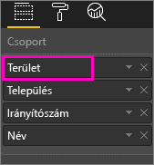
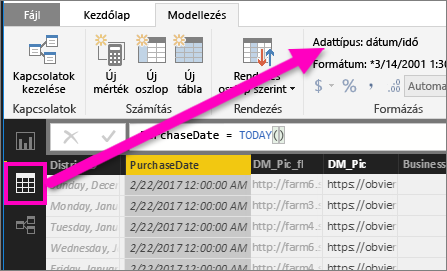

# Lehatolás a vizualizációk mélyebb szintjeire a Power BI-ban
## A lehatoláshoz hierarchiára van szükség
Ha a vizualizáció mögött hierarchikus adatstruktúra található, a részletesebb adatszintek kibonthatók. Tegyük fel például, hogy egy vizualizáció az olimpiai érmek számát jeleníti meg, sportonkénti, szakágankénti és versenyszámonkénti adathierarchia alapján. Alapértelmezés szerint a vizualizáció az érmek számát sportok (pl. gimnasztika, síelés, vízi sportok stb.) szerinti bontásban jeleníti meg. Ugyanakkor mivel rendelkezik hierarchiával, egy-egy vizuális elem (például egy oszlop, egy sáv vagy egy kör) kiválasztásakor egyre részletesebb ábra jeleníthető meg. Ha a **vízi sportok** elemre kattint, megjeleníthetők az úszásra, műugrásra és vízilabdára vonatkozó adatok.  Ezután ha a **műugrásra** kattint, megtekintheti a műugró, toronyugró és szinkronugró versenyszámokra vonatkozó információkat.

Hierarchiát csak saját jelentéseihez adhat, mások által Önnel megosztottakhoz nem.
Nem tudja, mely Power BI-vizualizációk tartalmaznak hierarchiát?  Húzza a kurzort az egyik vizualizáció fölé. Ha az alábbi részletezésvezérlők megjelennek a felső sarkokban, a vizualizáció rendelkezik hierarchiával.

    
   

Sajátos hierarchiatípust képviselnek a dátumok. Amikor dátummezőt ad egy vizualizációhoz, a Power BI automatikusan felvesz egy évekből, negyedévekből, hónapokból és napokból álló időhierarchiát. Ha ezzel kapcsolatban további információra van szüksége, tekintse át a [vizualizációs hierarchiákat és a lehatolás működését](guided-learning/visualizations.yml#step-18) áttekintő cikket.

  <iframe width="560" height="315" src="https://www.youtube.com/embed/MNAaHw4PxzE?list=PL1N57mwBHtN0JFoKSR0n-tBkUJHeMP2cP" frameborder="0" allowfullscreen></iframe>

> [!NOTE]
> Ha meg szeretné tanulni, hogyan hozhatók létre hierarchiák a Power BI Desktopot használva, tekintse meg a [How to create and add hierarchies](https://youtu.be/q8WDUAiTGeU) (Hierarchiák létrehozása és hozzáadása) című videót
> 
> 

## Két lehatolási módszer
A vizualizációkban kétféle módon lehet le- illetve felhatolni.  Ez a cikk mindkét módszert bemutatja. Mindkét módszer ugyanazt eredményezi. Használja azt, amelyiket könnyebbnek érzi.

> [!NOTE]
> A lépések követéséhez [nyissa meg a Retail Analysis (Kiskereskedelmi elemzés) mintát](sample-datasets.md) a Power BI szolgáltatásban, majd hozzon létre egy fatérképet, mely a **Total Units This Year (Egységek éves száma összesen)** értéket (Értékek) **Territory** (Terület), **City** (Város), **PostalCode** (Irányítószám), és **Name** (Név) bontásban (Csoport) tudja megjeleníteni.  
> 
> 

## 1. lehatolási módszer
Ez a módszer a vizualizációk felső sarkaiban megjelenő lehatolási ikonokat használja.

1. A Power BI-ban nyisson meg egy jelentést [Olvasó nézetben vagy Szerkesztő nézetben](service-reading-view-and-editing-view.md). A lehatoláshoz hierarchiával rendelkező vizualizációra van szükség. 
   
   Az alábbi animáción egy hierarchia látható.  A vizualizáció területből (Territory), városból (City), irányítószámból (Postal Code) és városnévből (Name) felépülő hierarchiával rendelkezik. Minden területhez egy vagy több város, minden városhoz egy vagy több irányítószám tartozik, és így tovább. Alapértelmezés szerint a vizualizáció csak a területi adatokat jeleníti meg, mert a lista első eleme a *Territory* (Terület).
   
   
2. A lehatolás engedélyezéséhez kattintson a vizualizáció jobb felső sarkában látható, nyilat ábrázoló ikonra. Ha az ikon sötét színű, az adatszintek közötti mozgás engedélyezve van (a lehatolási mód be van kapcsolva). Ha nem kapcsolja be a lehatolási üzemmódot, akkor a rendszer a jelentés oldalon szereplő többi diagram tekintetében keresztszűrést alkalmaz, amikor rákattint valamelyik vizualizációs elemre (pl. az egyik oszlopra vagy egy körre).    
   
   
3. Ha ***egyszerre egy mezőben*** szeretne lehatolni, kattintson rá a vizualizáció valamelyik elemére. Oszlopdiagram esetén ez az egyik oszlopot, fatérkép esetén pedig az egyik *levelet* jelenti. Nézze meg, hogyan változik a csempe, ahogy le- és felhatol a hierarchiában. Az alábbi animációban először az egységek területenkénti éves számát, majd a területenkénti és városonkénti, majd területenkénti, városonkénti és irányítószámonkénti, és végül a területenkénti, városonkénti, irányítószámonkénti és nevenkénti teljes éves számát mutatja. Ha ismét feljebb szeretne lépni, kattintson a vizualizáció bal felső sarkában látható **Felhatolás**  ikonra, ahogy az alább látható.
   
   
4. Ha az ***összes szintet egyszerre*** szeretné kibontani, kattintson a vizualizáció bal felső sarkában látható, lefelé mutató dupla nyílra.
   
   
5. Ha vissza szeretne lépni, kattintson a vizualizáció bal felső sarkában látható felfelé mutató nyílra.
   
   

## 2. lehatolási módszer
Ehhez a módszerhez a Power BI felső menüsorában található **Tallózás** legördülő menüt kell használni.

1. A Power BI-ban nyisson meg egy jelentést [Olvasó nézetben vagy Szerkesztő nézetben](service-reading-view-and-editing-view.md). A lehatoláshoz hierarchiával rendelkező vizualizációra van szükség. 
   
   Az alábbi ábrán egy hierarchia látható.  A vizualizáció területből (Territory), városból (City), irányítószámból (Postal Code) és városnévből (Name) felépülő hierarchiával rendelkezik. Minden területhez egy vagy több város, minden városhoz egy vagy több irányítószám tartozik, és így tovább. Alapértelmezés szerint a vizualizáció csak a területi adatokat jeleníti meg, mert a lista első eleme a *Territory* (Terület).
   
   
2. A lehatolás engedélyezéséhez válassza ki az egyik vizualizációt, amely így aktívvá válik. Ezután a Power BI felső menüsorából válassza ki a **Tallózás** > **Lehatolás** lehetőséget. A vizualizáció jobb felső sarkában látható lehatolás ikon sötét hátterűre változik.   
   
   
3. Ha sikerült engedélyezni a lehatolást, bontson ki egy-egy szintet a fatérkép egy-egy levelére kattintva. Az alábbi példában a kiválasztott terület neve **NC**, így a vizualizáció az észak-karolinai (North Carolina) területen éves szinten értékesített egységek számát mutatja, városonként.
   
   
4. Ha szeretné az összes szintet egyszerre kibontani, kattintson a **Tallózás** > **A következő szint megjelenítése** lehetőségre.
   
   
5. Az előző szintre történő visszalépéshez kattintson a **Tallózás** > **Felhatolás** lehetőségre.
   
   
6. A vizualizáció létrehozásához használt adatok megjelenítéshez kattintson az **Adatok megjelenítése** lehetőségre. Az adatokat a vizualizáció alatt megjelenő ablaktáblában fogja megjeleníteni a rendszer. Az ablaktábla a vizualizációs szintek közötti mozgás során is megmarad. Ha további információra van szüksége, olvassa át a [vizualizáció létrehozásához használt adatok megjelenítéséről](service-reports-show-data.md) szóló cikket.

## Megfontolandó szempontok és korlátozások
* Ha dátum mező felvételekor a rendszer nem hoz létre automatikusan időhierarchiát, elképzelhető, hogy a „dátum” mező nem dátum mezőként lett elmentve. Ha Ön az adatkészlet tulajdonosa, nyissa meg *Adatok* nézetben a Power BI Desktopban, válassza ki a dátumot tartalmazó oszlopot, és a Modellezés lapfülön módosítsa az **Adattípust** **Dátumra** vagy **Dátum és időre**. Ha a jelentés meg lett osztva Önnel, kérje meg a tulajdonost a módosítások végrehajtására.  
  
  

## További lépések
[Vizualizációk a Power BI-jelentésekben](power-bi-report-visualizations.md)

[A Power BI-jelentések](service-reports.md)

[Power BI – Alapfogalmak](service-basic-concepts.md)

További kérdései vannak? [Kérdezze meg a Power BI közösségét](http://community.powerbi.com/)

