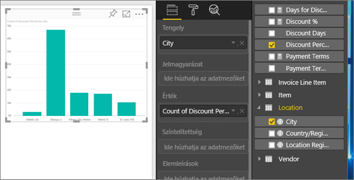
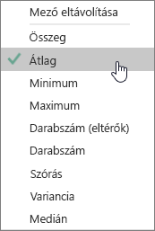
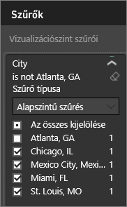
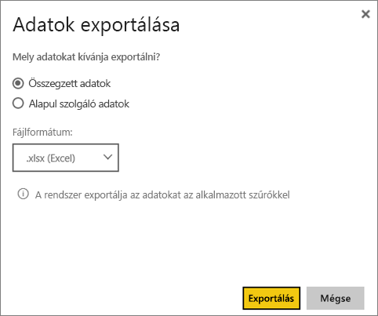

# Adatok exportálása vizualizációkból
Ha szeretné megtekinteni a vizualizáció létrehozásához használt adatokat, [megjelenítheti az adatokat a Power BI-ban](service-reports-show-data.md) vagy exportálhatja őket az Excelbe .xlsx- vagy .csv-fájlként.   

Tekintse meg, ahogy Will exportálja az adatokat az egyik jelentésében található vizualizációkból, menti őket .xlsx-fájlként, és megnyitja a fájlt az Excelben. Ezután a videó alatt látható részletes utasításokat követve próbálkozzon meg a feladat elvégzésével.

<iframe width="560" height="315" src="https://www.youtube.com/embed/KjheMTGjDXw" frameborder="0" allowfullscreen></iframe>

## Power BI-irányítópulton található vizualizációból
1. Kattintson a vizualizáció jobb felső sarkában található három pontra.

    
2. Kattintson az **Adatok exportálása** ikonra.

    
3. Az adatok exportálva lettek egy .csv-fájlba. Ha a vizualizáció szűrve van, akkor a letöltött adatok is szűrve lesznek.    
4. A böngésző megkéri, hogy mentse a fájlt.  A mentés után nyissa meg a .csv-fájlt az Excelben.

    

## Jelentésben található vizualizációból
Annak érdekében, hogy követni tudja a lépéseket, nyissa meg a [Beszerzéselemzési mintajelentést](sample-procurement.md) [Szerkesztési nézetben](service-reading-view-and-editing-view.md). [Adjon hozzá egy új üres jelentésoldalt](power-bi-report-add-page.md). Ezután kövesse az alábbi lépéseket, és adjon hozzá egy összesítést és egy vizualizáció-szintű szűrőt.

1. Hozzon létre egy új oszlopdiagramot.  A Mezők ablaktáblán válassza a **Hely > Város** és a **Számla > Kedvezmény százaléka** lehetőséget.  Előfordulhat, hogy a **Kedvezmény százalékát** át kell helyeznie az Érték mezőbe. 

    
2. Módosítsa a **Kedvezmény százaléka** összesítését **Darabszám** értékről **Átlag** értékre. Az Érték mezőben kattintson a **Kedvezmény százalékától** (előfordulhat, hogy **Kedvezmény mennyisége százalékban** néven találja) jobbra található nyílra, és válassza az **Átlag** lehetőséget.

    
3. Adjon hozzá egy szűrőt a **Városhoz** **Atlanta** eltávolításához.

   

   Most már készen állunk mindkét adatexportálási lehetőség kipróbálására. 

4. Kattintson a vizualizáció jobb felső sarkában található három pontra. Kattintson az **Adatok exportálása** elemre.

   
5. A Power BI online szolgáltatásban ha a vizualizáció összesítést tartalmaz (például ha módosította a **Szám** értéket *átlag*, **összeg** vagy *minimum* értékre), két lehetőség közül választhat: **Összegzett adatok** vagy **Mögöttes adatok**. A Power BI Desktopban csak az **Összegzett adatok** beállítás érhető el Az összesítésekről további információt az [Összesítések a Power BI-ban](service-aggregates.md) című cikkben találhat.

    
6. Válassza az **Összegzett adatok** > **Exportálás** lehetőséget, és válassza az .xlsx vagy .csv formátumot. A Power BI exportálja az adatokat.  Ha szűrőket alkalmazott a vizualizációhoz, az exportált adatok szűrve lesznek exportálva. Ha az **Exportálás** lehetőséget választja, a böngésző megkéri, hogy mentse a fájlt. A mentés után nyissa meg a fájlt az Excelben.

   **Összegzett adatok**: Válassza ezt a lehetőséget, ha exportálni szeretné a vizualizációban látható adatokat.  Az ilyen típusú export csak azokat az adatokat (oszlopokat és méréseket) jeleníti meg, amelyekkel létrehozta a vizualizációt.  Ha a vizualizáció összesítést tartalmaz, exportálja az összesített adatokat. Például ha egy 4 sávot megjelenítő sávdiagrammal rendelkezik, 4 sornyi adatot fog kapni. Az összegzett adatok .xlsx- és .csv-fájlként érhetők el.

   Ebben a példában az Excel-exportálás egy teljes értéket jelenít meg minden városhoz. Mivel Atlantát kiszűrtük, nem szerepel az eredmények között.  A táblázat első sorában azok a szűrők láthatók, amelyeket az adatok Power BI-ból való kinyerésére használtunk.

   
7. Most válassza ki a **Mögöttes adatok** > **Exportálás** lehetőséget, és válassza az .xlsx formátumot. A Power BI exportálja az adatokat. Ha szűrőket alkalmazott a vizualizációhoz, az exportált adatok szűrve lesznek exportálva. Ha az **Exportálás** lehetőséget választja, a böngésző megkéri, hogy mentse a fájlt. A mentés után nyissa meg a fájlt az Excelben.

   >[!WARNING]
   >A mögöttes adatok exportálása lehetővé teszi a felhasználók számára, hogy az összes részletes adatot (az adatokban szereplő minden sort) megtekintsék. A Power BI szolgáltatás rendszergazdái ezt kikapcsolhatják a cégük számára. Ha Ön egy adatkészlet tulajdonosa, a jogvédett oszlopokat „rejtett” állapotúra állíthatja, így azok nem jelennek meg a Mezők listájában a Desktopban vagy a Power BI szolgáltatásban.

   **Mögöttes adatok**: Válassza ezt a lehetőséget, ha a vizualizáció adatait ***és*** a modell további adatait szeretné megtekinteni (részletekért tekintse meg a lenti diagramot).  ha a vizualizáció összesítést tartalmaz, a *Mögöttes adatok* kiválasztása eltávolítja az összesítést. Ha az **Exportálás** lehetőséget választja, az adatokat egy .xlsx-fájlba exportálja a rendszer, és a böngésző megkéri, hogy mentse a fájlt. A mentés után nyissa meg a fájlt az Excelben.

   Ebben a példában az Excel-exportálás az adatkészletben található minden Város sorhoz egy sort jelenít meg, és az egyetlen bejegyzéshez tartozó kedvezmény százalékát mutatja. Más szóval az adatok nem összesítve, hanem egybesimítva lettek. A táblázat első sorában azok a szűrők láthatók, amelyeket az adatok Power BI-ból való kinyerésére használtunk.  

   

## Mögöttes adatok részleteinek exportálása
A **Mögöttes adatok** lehetőség kiválasztásakor több dolog történhet. Az adatok megértéséhez előfordulhat, hogy rendszergazdai vagy informatikusi segítségre lesz szüksége. A Power BI Desktop vagy a szolgáltatás jelentéskészítési nézetében megjelenik egy *mérték* a Mezők listában egy számológép ikonnal . A mértékek a Power BI Desktopban jönnek létre, a Power BI szolgáltatásban nem.

| A vizualizáció tartalma |                                                                              Az exportáláskor megjelenő elemek                                                                              |
|-----------------|-------------------------------------------------------------------------------------------------------------------------------------------------------------------------------------|
|   Összesítések    |                                                 az *első* összesítés és az összesítés teljes táblájának nem rejtett adatai                                                  |
|   Összesítések    | kapcsolódó adatok – ha a vizualizáció más, az összesítést tartalmazó adattáblához *\*\*kapcsolódó*\* adattáblák adatait használja (mindaddig, amíg a kapcsolat \*:1 vagy 1:1 mértékű) |
|    Mértékek     |                                      A vizualizáció összes mértéke *és* minden mérték azon adattáblákból, amelyek a vizualizációban használt mértékeket tartalmaznak                                      |
|    Mértékek     |                                       Minden nem rejtett adat az adott értéket tartalmazó adattáblákból (mindaddig, amíg a kapcsolat \*:1 vagy 1:1 mértékű)                                       |
|    Mértékek     |                                      Minden adat minden olyan táblából, amely a mértékeket \*:1/1:1 arányban tartalmazó táblákhoz kapcsolódik                                      |
|  Csak mértékek  |                                                   Minden nem rejtett oszlop minden kapcsolódó táblából (a mérték kiterjesztése érdekében)                                                   |
|  Csak mértékek  |                                                             A modellmértékek másolt sorainak összegzett adatai.                                                              |

## Korlátozások és szempontok
* A **Power BI Desktopból** és a **Power BI szolgáltatásból** legfeljebb 30 000 sor exportálható egy .csv-fájlba.
* Az .xlsx-fájlba legfeljebb 150 000 sor exportálható.
* Az *Alapul szolgáló adatok* használatával történő exportálás sikertelen lesz, ha az adatok forrása élő Analysis Services-kapcsolat, a verzió 2016-nál korábbi, és a modellben található táblák nem rendelkeznek egyedi kulccsal.  
* Az *Alapul szolgáló adatok* használatával történő exportálás sikertelen lesz, ha az *Adatot nem tartalmazó elemek megjelenítése* beállítás be van kapcsolva az exportálandó vizualizációra vonatkozóan.
* DirectQuery használatával az adatok maximálisan exportálható mennyisége 16 MB. Ez a sorok maximális számánál kisebb exportálást eredményezhet, különösen ha sok oszlop van, az adatokat nehéz tömöríteni, vagy egyéb, a fájl méretét és az exportált sorok számát csökkentő tényezők állnak fenn.
* Ha a vizualizáció egynél több adattábla adatait használja, az adatmodellben pedig nincs kapcsolat ezen táblák között, a rendszer csak az első tábla adatait exportálja. 
* Az egyéni vizualizációk és az R-vizualizációk jelenleg nem támogatottak.
* Az adatok exportálása nem érhető el a cégen kívüli olyan felhasználók számára, akik velük megosztott irányítópultot használnak. 
* A Power BI-ban egy mező (oszlop) átnevezéséhez kattintson duplán a mezőre,majd írja be az új nevet.  Ez az új név az úgynevezett *alias*. Előfordulhat, hogy egy Power BI-jelentésben így ismétlődő mezőnevek fordulnak elő, de az Excel nem engedélyezi az ismétlődő elemek használatát.  Így az adatok Excelbe való exportálásakor a mezők aliasai visszaállnak az eredeti mező- (oszlop-) nevekre.  
* Ha a .csv-fájlban Unicode-karakter található, a szöveg az Excelben hibásan jelenhet meg. A Jegyzettömbben azonban probléma nélkül megnyitható. Unicode-karakterek lehetnek például a pénznemek szimbólumai és az idegen szavak. Megkerülő megoldásként importálhatja a .csv-fájlt az Excelbe, közvetlen megnyitás helyett. Ehhez tegye a következőket:

  1. Nyissa meg az Excelt.
  2. Az **Adatok** lapon kattintson a **Külső adatok beolvasása** > **Szövegből** elemre.
* A Power BI-rendszergazdák letilthatják az adatok exportálását.

## Következő lépések
[A Power BI-irányítópultok](service-dashboards.md)  
[Power BI-jelentések](service-reports.md)  
[Power BI – Alapfogalmak](service-basic-concepts.md)

További kérdései vannak? [Kérdezze meg a Power BI közösségét](http://community.powerbi.com/)

