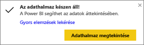
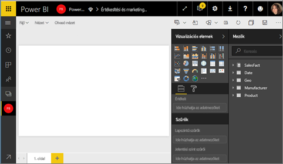
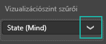
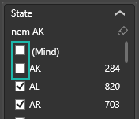
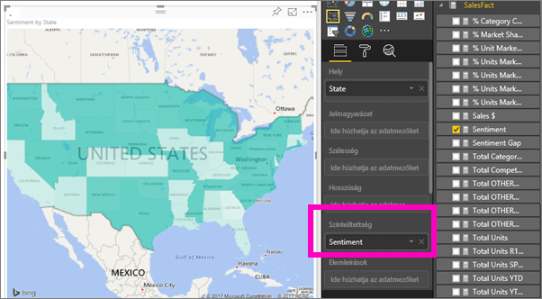
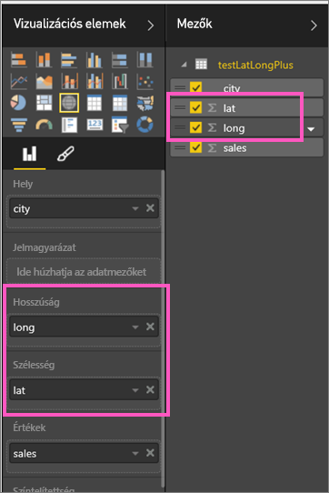

# Kitöltött (koropletikus) tematikus térképek a Power BI-ban (Oktatóanyag)
A tematikus térképek árnyalással, színezéssel vagy mintázattal jelenítik meg egy értéknek egy földrajzi területen vagy régión belüli viszonylagos eltéréseit.  A viszonylagos eltérések gyorsan megjeleníthetők a világostól (ritkább/kevesebb) a sötétig (gyakrabb/több) terjedő árnyalással.    

## Mit küld el a rendszer a Bingnek
A Power BI a Binggel integrálva adja meg az alapértelmezett térkép-koordinátákat (a geokódolás nevű eljárással). Amikor térképi vizualizációt hoz létre a Power BI szolgáltatásban vagy a Power BI Desktopban, akkor a **Hely**, **Szélesség** és **Hosszúság** gyűjtőben lévő (a vizualizáció létrehozásához használt) adatok továbbítódnak a Bingnek.

Lehetséges, hogy Önnek vagy a cégnek frissítenie kell a tűzfalat, hogy engedélyezze a hozzáférést azokhoz az URL-címekhez, amelyeket a Bing a geokódoláshoz használ.  Ezek az alábbiak:
* https://dev.virtualearth.net/REST/V1/Locations
* https://platform.bing.com/geo/spatial/v1/public/Geodata
* https://www.bing.com/api/maps/mapcontrol

A Bingnek küldött adatokról további információt, a geokódolás sikerességének növeléséhez pedig tippeket kaphat a [Tippek és trükkök térképi vizualizációkhoz](power-bi-map-tips-and-tricks.md) című cikkben.

## Mikor érdemes tematikus térképet használni
A tematikus térkép kitűnően alkalmas:

* mennyiségi információk térképi megjelenítésére.
* térbeli mintázatok és összefüggések kimutatására.
* szabványosított adatok esetén.
* társadalmi-gazdasági adatokkal végzett munkához.
* kiemelten fontos régiók esetén.
* a földrajzi helyek közötti eloszlás áttekintéséhez.

### Előfeltételek
- Power BI szolgáltatás vagy Power BI Desktop
- Értékesítési és marketing minta

Az oktatóanyag lépéseinek elvégzéséhez ne a Power BI Desktopot, hanem a Power BI szolgáltatást használja.

## Egyszerű tematikus térkép létrehozása
Ezen a videón Kim egy egyszerű térképet hoz létre és alakít át kitöltött tematikus térképpé.

<iframe width="560" height="315" src="https://www.youtube.com/embed/ajTPGNpthcg" frameborder="0" allowfullscreen></iframe>

1. Saját tematikus térkép létrehozásához jelentkezzen be a Power BI-ba, majd az **Adatok beolvasása \> Minták \> Értékesítés és Marketing \> Csatlakozás** lehetőség választásával [töltse le az Értékesítés és Marketing mintát](sample-datasets.md).
2. Amikor megkapja az értesítést a sikeres műveletről, válassza az **Adatkészlet megtekintése** lehetőséget.

   
3. A Power BI megnyit egy üres jelentésvásznat [Szerkesztő nézetben](service-interact-with-a-report-in-editing-view.md).

    
4. A Mezők panelen válassza a **Geo** \> **Állam** mezőt.    

   
5. [Alakítsa át a diagramot](power-bi-report-change-visualization-type.md) tematikus térképpé. Figyelje meg, hogy az **Állam** a **Hely** alatt jelenik meg. A Bing Térképek a **Hely** alatti mezőt használja a térkép létrehozásához.  A hely többféle létező földrajzi hely lehet: országok, államok, megyék, városok, irányítószámok vagy más postai kódok, stb. A Bing Térképek világszerte sok helyhez biztosít kitöltött térképformákat. A Hely alatt bevitt érvényes érték nélkül a Power BI nem tudja létrehozni a tematikus térképet.  

   
6. Szűrje a térképet úgy, hogy csak az Egyesült Államok szárazföldi területeit mutassa.

   a.  Keresse meg a **Szűrők** területet a Megjelenítések panel alján.

   b.  Vigye a kurzort az **Állam** fölé, és kattintson a kibontó sávnyílra.  
   

   c.  Jelölje be a **Mind** melletti jelölőnégyzetet, majd vegye ki a jelet az **AK** elem mellől.

   
7. A **SalesFact** \> **Vélemény** választásával adja azt hozzá a **Színtelítettség** alatt. A **Színtelítettség** alatti mezők szabják meg a térkép árnyalását.  
   
8. A tematikus térkép zöldre van színezve. A világoszöld alacsonyabb elégedettségi értékeket, a sötétkék magasabb elégedettséget, jobb véleményt jelent.  Ezen a képen Wyoming-állam (WY) van kijelölve, és látható, hogy az elégedettség nagyon magas, értéke 74.  
   
9. [A jelentés mentése](service-report-save.md).

## Kiemelés és keresztszűrés
A Szűrők panel használatáról a [Szűrő hozzáadása jelentéshez](power-bi-report-add-filter.md) című cikk nyújt tájékoztatást.

Egy hely kijelölése a Tematikus Térképen keresztszűrést végez a jelentés oldalon lévő többi vizualizációval és viszont.

A nyomonkövetéshez másolja be a tematikus térképét az *Értékesítés és Marketing* jelentés **Vélemény** oldalára.

1. Jelöljön ki egy államot a tematikus térképen.  Ezzel az oldalon lévő többi vizualizációt is kijelöli. Ha például **Texast** jelöli ki, akkor látható, hogy a vélemény értékelése 74, Texas a Központi \#23-as körzetben van, és az eladások többsége a Moderálás és a Kényelem szegmensből származik.   
   
2. Váltogassa a **Nem** és **Igen** kijelölését a vonaldiagramon. Ezzel úgy szűri a tematikus térképet, hogy a VanArsdel és a VanArsdel versenytársai értékelését mutassa.  
   

## Szempontok és hibaelhárítás
A térképadatok nem feltétlenül egyértelműek.  Van például egy Paris nevű város (Párizs) Franciaországban, de van egy Paris Texasban is. A földrajzi adatok feltehetően külön oszlopokban tárolódnak – Egy oszlopban a városok nevei, egy oszlopban az államoké vagy tartományoké, stb. – így a Bing nem mindig tudja eldönteni, hogy melyik Paris nevű városról van szó. Ha az adatkészlet földrajzi szélesség- és hosszúság-adatokat is tartalmaz, akkor a Power BI speciális mezőkkel támogatja a térképadatok egyértelművé tételét. Ehhez elég a szélesség értékét tartalmazó mezőt a Megjelenítések \> Szélesség területre húzni.  Tegye ugyanezt a hosszúság értékével is.  

Ha rendelkezik az adatkészlet Power BI Desktopban történő szerkesztéséhez szükséges jogosultsággal, akkor tekintse meg ezt a térképek kétértelműségének feloldásában segítő videót.

<iframe width="560" height="315" src="https://www.youtube.com/embed/Co2z9b-s_yM" frameborder="0" allowfullscreen></iframe>

Ha nem fér hozzá a szélességi és hosszúsági adatokhoz, akkor [kövesse ezt az útmutatást az adatkészlet frissítéséhez](https://support.office.com/article/Maps-in-Power-View-8A9B2AF3-A055-4131-A327-85CC835271F7).

A térképi vizualizációkhoz további segítséget nyújt a [Tippek és trükkök térképi vizualizációkhoz](power-bi-map-tips-and-tricks.md) című cikk.

## További lépések
[Tematikus térkép hozzáadása irányítópult-csempeként (megjelenítés rögzítése)](service-dashboard-tiles.md)    
 [Vizualizáció hozzáadása jelentéshez](power-bi-report-add-visualizations-i.md)  
 [Vizualizációk típusai a Power BI-ban](power-bi-visualization-types-for-reports-and-q-and-a.md)    
 [A használt vizualizáció típusának módosítása](power-bi-report-change-visualization-type.md)      
További kérdései vannak? [Kérdezze meg a Power BI közösségét](http://community.powerbi.com/)
