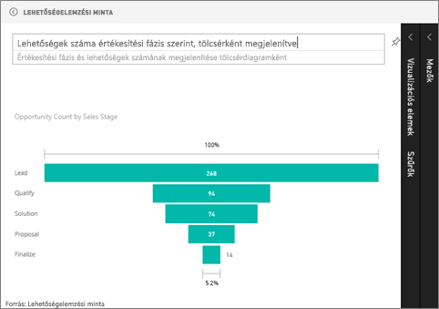

# Tölcsérdiagramok (oktatóanyag)
A tölcsérdiagramok segítségével vizualizálhatja az egymást követő összekapcsolt fázisokból álló lineáris folyamatokat. Ilyen például egy értékesítési tölcsér, amelyen keresztül az ügyfelek nyomon követhetőek az egyes fázisokban: Érdeklődő \> Minősített érdeklődő \> Lehetséges ügyfél \> Szerződés \> Zárás.  A tölcsér alakja egyetlen pillantásra megmutatja a lekövetett folyamat állapotát.

A tölcsér minden egyes szakasza a teljes mennyiséghez viszonyított százalékos arányt mutatja. Így az esetek többségében a tölcsérdiagram alakja valóban egy tölcsérhez hasonlít – az első szakasz a legszélesebb, majd a rákövetkező szakaszok egyre szűkülnek.  Persze a körte alakú tölcsérek is hasznosak – segítenek azonosítani a problémákat.  Általában véve azonban az első, a „bemeneti” szakasz a legszélesebb.

## Mikor érdemes tölcsérdiagramokat használni?
A tölcsérdiagram remek választás a következő esetekben:

* ha az adatok egymás követik, és legalább 4 fázisban következnek egymásból,
* ha az első fázis „elemeinek” száma várhatóan meghaladja az utolsó fáziséit,
* a fázisonkénti lehetőségek (bevétel/értékesítés/szerződések/stb.) számításához,
* a konverziós és megtartási arányok számításához,
* a lineáris folyamatok szűk keresztmetszeteinek felfedéséhez,
* a bevásárlókosár-munkafolyamatok nyomon követéséhez,
* az átkattintásos reklám-/marketingkampányok haladásának és sikerességének nyomon követéséhez.

## A tölcsérdiagramok használata
A tölcsérdiagramok:

* A jelentésekből és a Kérdések és válaszok felületről rögzíthetőek.
* Rendezhetőek.
* Támogatják a többszörös használatot.
* Kiemelhető és keresztszűrhető az egyazon jelentésoldalon lévő más vizualizációkkal.
* Használható az egyazon jelentésoldalon lévő más vizualizációk kiemelésére és keresztszűrésére.

## Alapszintű tölcsérdiagram létrehozása
A videóban Will egy tölcsérdiagramot hoz létre az Értékesítési és marketing minta használatával.

<iframe width="560" height="315" src="https://www.youtube.com/embed/maTzOJSRB3g" frameborder="0" allowfullscreen></iframe>

Most hozzon létre egy saját tölcsérdiagramot az egyes értékesítési fázisokban lévő lehetőségek megjelenítéséhez.

Ezek az utasítások a Lehetőségelemzési minta használatát feltételezik. A lépések követéséhez [töltse le a mintát](sample-datasets.md), jelentkezzen be a Power BI-ba, és válassza az **Adatok lekérése \> Minták \> Lehetőségelemzési minta \> Kapcsolódás** lehetőséget.

1. Kezdje a folyamatot [Szerkesztési nézetben](service-interact-with-a-report-in-editing-view.md) egy [üres jelentésoldalon](power-bi-report-add-page.md), és válassza a **SalesStage** \> **Sales Stage** mezőt.  
   
    
2. [Konvertálja a diagramot](power-bi-report-change-visualization-type.md) egy tölcsérré. Láthatja, hogy a **Sales Stage** mező a **Csoport** területen található. 
3. A **Mezők** ablaktáblán válassza a **Fact** \> **Opportunity Count** lehetőséget.
   
    
4. A mutatót az egyes sávok fölé húzva a rendszer rengeteg információt jelenít meg.
   
   * A fázis neve
   * A jelenleg az adott fázisban lévő lehetőségek száma
   * Átfogó konverziós ráta (az érdeklődő számának százalékában kifejezve) 
   * Fázisról fázisra az előző fázishoz viszonyított (ebben az esetben ez a Proposal Stage/Solution Stage) százalékos arány (a Csökkenés mértéke)
     
     
5. [Adja hozzá a tölcsért irányítópult-csempeként](service-dashboard-tiles.md). 
6. [Mentse a jelentést](service-report-save.md).

## Kiemelés és keresztszűrés
A Szűrök ablaktábla használatával kapcsolatos információkért lásd: [Szűrők hozzáadása jelentésekhez](power-bi-report-add-filter.md).

A tölcsér egyes sávjainak kiemelésével a rendszer keresztszűri a jelentésoldalon lévő többi vizualizációt... és viszont. A feladat következő lépéseként adjon hozzá néhány vizualizációt a tölcsérdiagramot tartalmazó jelentésoldalhoz.

1. A tölcséren jelölje ki a **Proposal** sávot. Ez kiemeli a lapon lévő többi vizualizáció megfelelő adatait is. A többszörös kijelöléshez használja a CTRL billentyűt.
   
   
2. A vizualizációk keresztkiemelési és keresztszűrési beállításaival kapcsolatban lásd: [A Power BI vizualizációk interakciója](service-reports-visual-interactions.md)

## Tölcsérdiagram létrehozása a Kérdések és válaszok felületen
Emeljen ki egy irányítópultot, amely legalább egy, a „Opportunity Tracking” (Lehetőségek nyomon követése) adatkészletből rögzített vizualizációt tartalmaz.  Amikor beír egy kérdést a Kérdések és válaszok felületen, a Power BI a kijelölt irányítópulttal társított (az iránytópulton rögzített csempékkel rendelkező) összes adatkészletben keresi a válaszokat. További információkért lásd: [Power BI – Alapfogalmak](service-basic-concepts.md).

1. Emeljen ki egy irányítópultot, amely legalább egy, a „Opportunity Tracking” (Lehetőségek nyomon követése) adatkészletből rögzített csempét tartalmaz.
2. Kezdje begépelni a kérdését angolul a Kérdések és válaszok mezőbe.
   
   
   
   Mindenképp írja be az „as funnel” kifejezést is, hogy a Power BI tudja, milyen típusú vizualizációt szeretne.

## További lépések
[Vizualizációtípusok a Power BI-ban](power-bi-visualization-types-for-reports-and-q-and-a.md)

[Vizualizáció rögzítése az irányítópulton](service-dashboard-pin-tile-from-report.md)

[Power BI – Alapfogalmak](service-basic-concepts.md)

További kérdései vannak? [Kérdezze meg a Power BI közösségét](http://community.powerbi.com/)

