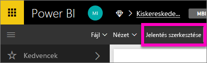
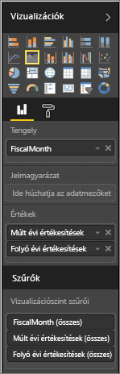
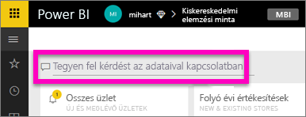

# Első lépések a Power BI Q&A-ben
## A Power BI Q&A használata a kiskereskedelmi elemzési mintával
Ha válaszokat keres az adatokban, néha az a leggyorsabb megoldás, ha természetes nyelven kérdez.  Ebben az útmutatóban két különböző módszert is megtekintünk ugyanannak a vizualizációnak a létrehozására: először felépítjük egy jelentésben, majd kérdést teszünk fel a Q&A-val. Noha a Power BI szolgáltatást fogjuk használni, a folyamat csaknem teljesen azonosan néz ki a Power BI Desktop használatával is.

A bemutatott megoldások elvégzéséhez rendelkeznie kell egy Ön által szerkeszthető jelentéssel, ezért a Power BI-ban elérhető egyik mintát fogjuk használni.

## 1. módszer: a jelentésszerkesztő használatával
1. Válassza a Power BI munkaterületén az **Adatok beolvasása** \> **Minták** \> **Kiskereskedelmi elemzési minta** > **Csatlakozás** menüpontot.
   
    
2. Az irányítópult tartalmaz egy területdiagram-csempét „Last Year Sales and This Year Sales.” (Elmúlt évi értékesítések és idei értékesítések) címmel.  Jelölje ki ezt a csempét. 
   
   * Ha ezt a csempét a Q&A-val hozták létre, a csempe kijelölésekor megnyílik a Q&A. 
   * Ezt a csempét azonban egy jelentésben hozták létre, ezért a jelentés megnyílik a vizualizációt tartalmazó oldalon.
3. Nyissa meg a jelentést szerkesztési nézetben a **Jelentés szerkesztése** lehetőséget választva.  Ha nem tulajdonosa a jelentésnek, akkor nem lesz lehetősége azt szerkesztési nézetben megnyitni.
   
    
4. Jelölje ki a területdiagramot, és tekintse át a beállításokat a **Mezők** ablaktáblán.  A jelentés létrehozója ennek a 3 értéknek a kiválasztásával építette fel a jelentést: (**Idő > FiscalMonth**, **Értékesítések > This Year Sales (Idei értékesítések)**, **Értékesítések > Last Year Sales (Múlt évi értékesítések) > Érték**), és ezeket a **Tengely** és az **Értékek** mezőterületen rendezte el.
   
    

## 2. módszer: a Q&A használatával
Hogyan lehet létrehozni ugyanezt a vonaldiagramot a Q&A-val?

1. Térjen vissza a Kiskereskedelmi elemzési minta irányítópulthoz.
2. A természetes nyelvet használva írjon be valami ehhez hasonlót a kérdezési mezőbe:
   
   **hogyan alakult az idei és a múlt évi értékesítés havi bontásban, területdiagramon ábrázolva**
   
   A kérdés beírása közben a Q&A kiválasztja a legjobb vizualizációt a válasz megjelenítéséhez; a kérdés módosítása közben a vizualizáció dinamikusan változik. A Q&A segít a kérdés megfogalmazásában is javaslatokkal, automatikus kiegészítéssel és helyesírási javításokkal.
   
   Amikor befejezi a kérdés beírását, az eredmény pontosan ugyanaz a diagram lesz, amelyet a jelentésben láttunk.  De így sokkal gyorsabban létre lehet hozni!
   
   
3. A jelentésekkel való munkavégzéshez hasonlóan a Q&A-ban hozzáférhet a Megjelenítések, a Szűrők és a Mezők ablaktáblához.  Nyissa meg ezeket az ablaktáblákat a vizualizáció további felfedezéséhez és módosításához.
4. A diagram irányítópultra való kitűzéséhez válassza a gombostű ikont .

## Következő lépések
[Q&A a Power BI-ban](power-bi-q-and-a.md)

[Megfelelő adatműködés biztosítása a Q&A és a Power BI használatánál](service-prepare-data-for-q-and-a.md)

További kérdései vannak? [Kérdezze meg a Power BI közösségét](http://community.powerbi.com/)

