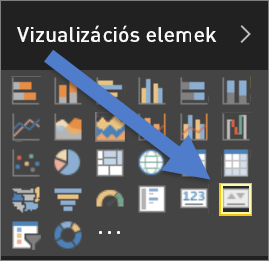
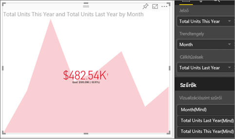

# KPI (teljesítménymutatós) vizuális elemek
A fő teljesítménymutató (KPI) olyan vizuális jel, amely egy mérhető cél terén elért előrehaladás mértékét jelzi. A KPI-kal kapcsolatos további információkért lásd: [Microsoft Developer Network](https://msdn.microsoft.com/library/hh272050).

## Mikor érdemes KPI-t használni?
A KPI remek választás:

* az előrehaladás mérésére (miben járok előrébb vagy miben maradtam le?)
* egy céltól való távolság mérésére (mennyivel járok előrébb vagy milyen messze vagyok tőle?)   

## KPI-vizualizációk követelményei
A fő teljesítménymutató (KPI) specifikus mérésen alapul, és úgy van kialakítva, hogy segítsen egy mutatószám jelenlegi értékének és állapotának egy meghatározott célhoz viszonyított értékelésében. Ezért a KPI-vizualizációhoz szükség van egy *alapmértékre*, amely egy értéket és egy *célmértéket* vagy -értéket ad eredményként, valamint egy küszöbértékre vagy célra.

> [!NOTE]
> Jelenleg a KPI-adatkészletnek tartalmaznia kell egy KPI célértékeit. Ha az adatkészlet nem tartalmaz ilyet, létrehozhat célokat, ha hozzáad egy célokat tartalmazó Excel-munkalapot az adatmodellhez vagy egy PBIX-fájlt.
> 
> 

## KPI létrehozása
Annak érdekében, hogy követni tudja a lépéseket, jelentkezzen be a Power BI szolgáltatásba, és válassza az **Adatok beolvasása > Minták > Kiskereskedelmi elemzési minta** lehetőséget. Létrehozunk egy KPI-t, amely egy értékesítési cél irányába tett előrehaladást méri.

Másik lehetőségként tekintse meg a videót, amelyben bemutatjuk, hogyan hozhat létre egyetlen mutatószámos vizualizációkat: mérőműszereket, kártyákat és KPI-ket.

<iframe width="560" height="315" src="https://www.youtube.com/embed/xmja6EpqaO0?list=PL1N57mwBHtN0JFoKSR0n-tBkUJHeMP2cP" frameborder="0" allowfullscreen></iframe>

1. Nyissa meg a jelentést a [Szerkesztési nézetben](service-reading-view-and-editing-view.md), és [adjon hozzá egy új oldalt](power-bi-report-add-page.md).    
2. Válassza a **Sales > Total Units This Year** (Értékesítés > Idei összes egység) mezőt.  Ez lesz a mutató.
3. Adjon hozzá **Time > Month** (Időpont > Hónap) értékeket.  Ez jelzi a trendet.
4. FONTOS: A **Month** mező szerint rendezze a diagramot. Miután átalakítja a vizualizációt KPI-vé, nincs lehetőség rendezésre.

    
5. Alakítsa át a vizualizációt KPI-vé a KPI ikon kiválasztásával a Vizualizációk panelen.
   
    
6. Adjon meg egy célt. Adja meg a múlt évi értékesítést célként. Húzza a **Total Units Last Year** (Tavalyi összes egység) mezőt a **Célkitűzések** mezőbe.
   
    
7. Ha szeretné, formázza a KPI-t a festőhenger ikon kiválasztásával, amely megnyitja Formátum panelt.
   
   * **Mutató** – szabályozza a mutatószám megjelenítési egységeit és tizedesjegyeit.
   * **Trendtengely** – amikor **Be** értékre van állítva, a trendtengely a KPI-vizualizáció háttereként jelenik meg.  
   * **Célok** – amikor **Be** értékre van állítva, a vizualizáció megjeleníti a célt és a távolságot a céltól százalékban.
   * **Színkódok > Irány** – néhány KPI magasabb érték esetén *jobb*, néhány pedig alacsonyabb érték esetén *jobb*. Vessük össze például a bevételeket a várakozási idővel. Általában a bevételek magasabb értéke jobbnak tekinthető, míg a várakozási idő magasabb értéke nem. Válassza a **high is better** (a nagyobb érték jobb) lehetőséget, és igény szerint módosítsa a színbeállításokat.

1. Ha már olyan a KPI, amilyennek szeretné, [rögzítse az irányítópultra](service-dashboard-pin-tile-from-report.md).

A KPI-k mobileszközökön is elérhetők, így mindig összhangban lehet a cég szívverésével.

## Megfontolandó szempontok és hibaelhárítás
* Amennyiben a KPI-je nem hasonlít a fentire, lehetséges, hogy hónapok szerint sorba kell rendeznie. Mivel a KPI-knél nem érhető el a rendezés lehetősége, a hónapok szerinti rendezést még *azelőtt* kell elvégeznie, hogy átalakítja a vizualizációt KPI-vé.

## Következő lépések

[Vizualizációk a Power BI-jelentésekben](power-bi-report-visualizations.md)

További kérdései vannak? [Kérdezze meg a Power BI közösségét](http://community.powerbi.com/)

