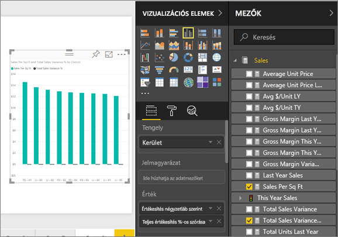
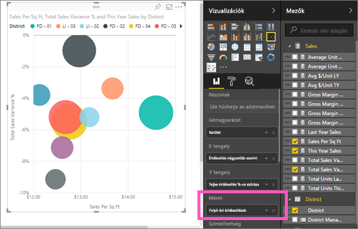
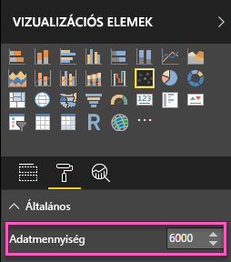
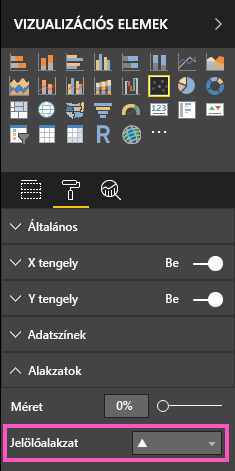
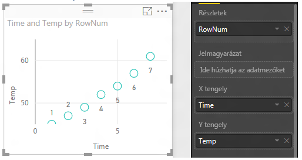
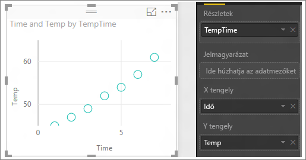

# Pontdiagramok és buborékdiagramok a Power BI-ban
A pontdiagramok mindig két értéktengellyel rendelkeznek. A vízszintes tengely mentén numerikus adatok egy készletét ábrázolják, a függőleges tengely mentén pedig numerikus adatok egy másik készletét. A diagram pontokat jelenít meg az x és y numerikus értékek metszéspontjában, így egyetlen adatponttá kombinálja ezeket az értékeket. Ezek az adatpontok egyenletesen vagy egyenetlenül oszthatók el a vízszintes tengely mentén az adatoktól függően.

A buborékdiagramokban az adatpontok helyett buborékok szerepelnek, és a buborékok *mérete* az adatok egy további dimenzióját jelöli.

Beállíthatja az adatpontok számát  

## Mikor érdemes pontdiagramot vagy buborékdiagramot használni?
### A pontdiagram remek választás a következő esetekben:
* 2 (pont) vagy 3 (buborék) **numerikus** érték közötti kapcsolatok megjelenítéséhez.
* Két számcsoport ábrázolásához xy koordináták sorozataként.
* Vonaldiagram helyett, amikor módosítani szeretné a vízszintes tengely skáláját.    
* A vízszintes tengely logaritmikus skálává alakításakor.
* Olyan munkalapadatok megjelenítéséhez, amelyekben értékpárok vagy az értékek csoportosított készletei szerepelnek. A pontdiagramokban módosíthatja a tengelyek független skáláit több információ megjelenítéséhez a csoportosított értékekről.
* Nagyméretű adatkészletek mintáinak megjelenítéséhez, például lineáris vagy nem lineáris trendek, fürtök és kiugró adatok megjelenítésével.
* Nagy számú adatpont összehasonlítására az időre való tekintet nélkül.  Minél több adatot tartalmaz a pontdiagram, annál jobb összehasonlítás végezhető.

### A buborékdiagram remek választás a következőkhöz:
* Ha az adatok 3 adatsorozattal rendelkeznek, amelyek mindegyike egy értékkészletet tartalmaz.
* Pénzügyi adatok ábrázolásához.  A különböző buborékméretek hasznosak adott értékek vizuális kiemeléséhez.
* Kvadránsokkal való használathoz.

## Pontdiagram létrehozása
Ebben a videóban megtekintheti, ahogy Will létrehoz egy pontdiagramot, majd az alábbi lépéseket követve maga is létrehozhat egyet.

<iframe width="560" height="315" src="https://www.youtube.com/embed/PVcfPoVE3Ys?list=PL1N57mwBHtN0JFoKSR0n-tBkUJHeMP2cP" frameborder="0" allowfullscreen></iframe>

Ez az útmutatás a Kiskereskedelmi elemzési mintát használja. Annak érdekében, hogy követni tudja a lépéseket, [töltse le a mintát](sample-datasets.md), mely a Power BI szolgáltatásban (az app.powerbi.com webhelyen) vagy a Power BI Desktopban használható.   

1. [Üres jelentésoldal](power-bi-report-add-page.md) létrehozásához válassza a sárga plusz ikont.
 
2. A Mezők panelen válassza az alábbi mezőket:
   - **Értékesítés** > **Értékesítés Négyzetláb szerint**
   - **Értékesítés** > **Teljes értékesítés %-os szórása**
   - **Kerület** > **Kerület**

     

     Ha a Power BI szolgáltatást használja, mindenképpen a [Szerkesztési nézetében](service-interact-with-a-report-in-editing-view.md) nyissa meg a jelentést.

3. Alakítsa át pontdiagrammá. A Vizualizáció panelen válassza a Pontdiagram ikont.

   .

4. Húzza a **Kerület** elemet a **Részletek** területről a **Jelmagyarázat** területre. A megjelenő pontdiagram a **Teljes értékesítési eltérés (%)** értéket jeleníti meg az Y tengely mentén, és az **Értékesítések négyzetlábanként** értéket az X tengely mentén. Az adatpontok színe a kerületeket jelzi:

    

Most adjunk hozzá egy harmadik dimenziót.

## Buborékdiagram létrehozása

1. A **Mezők** panelen húzza az **Értékesítések** > **Idei értékesítések** > **Érték** elemet a **Méret** területre. Az adatpontok az értékesítési értékkel arányos mértékben jelennek meg.
   
   

2. Vigye az egérmutatót egy buborék fölé. A buborék mérete az **Idei értékesítések** értékét tükrözi.
   
    

3. Ha a buborékdiagramon belüli adatpontok számát szeretné megváltoztatni, a **Vizualizációk** panel **Formázás** szakaszában bontsa ki az **Általános** kártyát, és állítsa az **Adatmennyiséget** a kívánt értékre. A maximális adatmennyiség értékeként bármilyen számot megadhat 10.000-ig. Ahogy egyre nagyobb számokat használ, javasolt először tesztelést végezni a megfelelő teljesítmény biztosítása érdekében. 

     

   > [!NOTE]
   > A nagy számú adatpont hosszabb betöltési idővel jár, ezért ha nagyon sok adatpontot használva szeretné közzétenni a jelentést, először mindenképp ajánlatos ellenőrizni weben és mobileszközökön is, hogy a teljesítmény megfelel-e a felhasználói elvárásoknak. Magasabb adatpontértékek esetén ajánlatos az eredményeket különféle méretekkel ellenőrizni, hogy biztosítható legyen a megfelelő teljesítmény.

4. [Formázhatja a vizualizáció színeit, a címkéket, a címeket, a hátteret és egyebeket](service-getting-started-with-color-formatting-and-axis-properties.md). A [kisegítő lehetőségek javítása](desktop-accessibility.md) érdekében érdemes lehet minden vonalhoz jelölőalakzatokat hozzáadni. A különböző jelölőalakzatok használata az egyes vonalakhoz megkönnyíti a jelentés használóinak a vonalak (vagy területek) elkülönítését egymástól. Ha a jelölőalakzatot szeretné kiválasztani, bontsa ki az **Alakzatok** kártyát, majd válasszon ki egy jelölőalakzatot.

      

   A jelölő alakzat alakja megváltoztatható rombuszra, háromszögre vagy négyszögre:

   

## Megfontolandó szempontok és hibaelhárítás

### **A pontdiagramon csak egy adatpont szerepel**
A pontdiagramon csak egyetlen adatpont szerepel, amely összesíti az X és az Y tengely összes értékét?  Vagy esetleg az összes értéket egyetlen vízszintes vagy függőleges vonal mentén összesíti?

Adjon egy mezőt a **Részletek** területhez annak megadásához, hogy a Power BI hogyan csoportosítsa az értékeket. A mezőnek egyedinek kell lennie minden egyes megjeleníteni kívánt ponthoz.  
Ilyen például egy egyszerű sorszám vagy azonosító mező:

Vagy ha nem szerepel ilyen az adatokban, hozzon létre egy mezőt, amely pontonként valami egyedivé fűzi össze az X és Y értékeket:

Új mező létrehozásához [a Power BI Desktop Lekérdezésszerkesztőjével adjon hozzá egy indexoszlopot](desktop-add-custom-column.md) az adatkészlethez.  Ezután adja hozzá ezt az oszlopot a vizualizáció **Részletek** területéhez.

## További lépések
[Vizualizációtípusok a Power BI-ban](power-bi-visualization-types-for-reports-and-q-and-a.md)

[Regisztráljon ingyenes próbára](https://powerbi.microsoft.com/get-started/)  

További kérdései vannak? [Kérdezze meg a Power BI közösségét](http://community.powerbi.com/)

