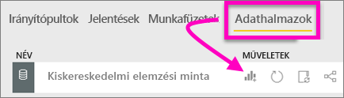
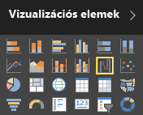
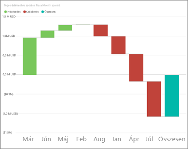
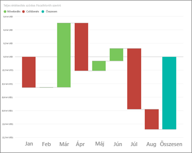
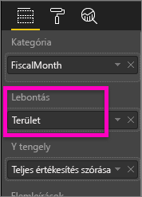
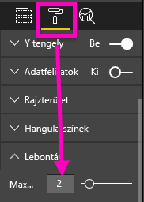
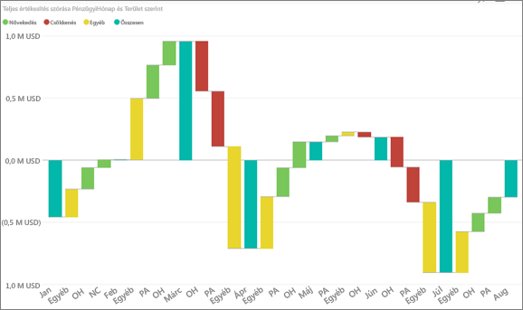

# Vízesésdiagramok a Power BI-ban
A vízesésdiagramok göngyölített összeget jelenítenek meg az értékek összeadásakor vagy kivonásakor. Ez hasznos annak megértéséhez, hogy egy kezdeti értékre (pl. nettó bevétel) hogyan hat egy sornyi pozitív és negatív változás.

Az oszlopok színkódolással rendelkeznek, így gyorsan megállapíthatja az értékek növekedését és csökkenését. A kezdeti és végértékeket tartalmazó oszlopok gyakran [a vízszintes tengelyről indulnak](https://support.office.com/article/Create-a-waterfall-chart-in-Office-2016-for-Windows-8de1ece4-ff21-4d37-acd7-546f5527f185#BKMK_Float "a vízszintes tengelyről indulnak"), míg a középső értékek lebegő oszlopokat képeznek. Emiatt a megjelenés miatt a vízesésdiagramokat híddiagramoknak is nevezik.

<iframe width="560" height="315" src="https://www.youtube.com/embed/qKRZPBnaUXM" frameborder="0" allow="autoplay; encrypted-media" allowfullscreen></iframe>

## Mikor érdemes vízesésdiagramot használni?
A vízesésdiagram remek választás a következőkhöz:

* ha a mérték az idősorok vagy különböző kategóriák között is változik;
* ha naplózni kívánja az összértéket befolyásoló főbb változásokat;
* ha a vállalat éves profitját szeretné ábrázolni különféle bevételi források megjelenítésével, majd az összbevétel (vagy veszteség) kiemelésével;
* ha a vállalat alkalmazottainak számát szeretné ábrázolni az év eleji és év végi értékekkel;
* ha szeretné megjeleníteni, hogy mennyi pénzt keresett és költött az egyes hónapok során, valamint a fiók folyóegyenlegét. 

## Vízesésdiagram létrehozása
A Power BI szolgáltatásban olyan vízesésdiagramot hozunk létre, amely megjeleníti a havi értékesítési eltérést (a becsült és a tényleges értékek közötti különbséget). Hogy követni tudja a lépéseket, jelentkezzen be a Power BI-ba, és válassza az **Adatok lekérése\> Minták \> Kiskereskedelmi elemzési minta** lehetőséget. 

1. Válassza az **Adatkészletek** lapot, és görgessen le az új „Kiskereskedelmi elemzés minta” adatkészletig.  A **Jelentés létrehozása** ikon kiválasztásával nyissa meg az adatkészletet jelentéskészítési nézetben. 
   
    
2. A **Mezők** panelen válassza az **Értékesítés \> Teljes értékesítési eltérés** lehetőséget. 
3. Konvertálja a diagramot **Vízesésdiagrammá**. Ha a **Teljes értékesítési eltérés** nem az **Y tengely** területén található, húzza át oda.
   
    
4. Válassza az **Idő**  \> **FiscalMonth** (Pénzügyi hónap) lehetőséget, és adja hozzá a **Kategória** területhez. 
   
    
5. Rendezze időrend szerint a vízesésdiagramot. A diagram jobb felső sarkában kattintson a három pontra (...), és válassza a **Sort by > FiscalMonth** lehetőséget.
   
    
   
    
6. Derítse ki részletesebben, hogy mi járul hozzá legnagyobb mértékben az egyes hónapok közötti változáshoz. Húzza a **Tároló** > **Terület** elemet a **Lebontás** gyűjtőbe.
   
    
7. A Power BI alapértelmezés szerint a havi növekedésekhez és csökkenésekhez hozzájáruló 5 fő tényezőt adja hozzá. Minket azonban csak az első 2 tényező érdekel.  A Formázás panelen válassza a **Lebontás** lehetőséget, és a **Maximum** beállítást állítsa 2 értékre.
   
    
   
    A vízesésdiagram gyors áttekintéséből kiderül, hogy Ohio és Pennsylvania területek járulnak hozzá a változáshoz a legnagyobb (negatív és pozitív) mértékben. 
   
    
8. Ez érdekes eredmény. Vajon azért van Ohio és Pennsylvania ilyen jelentős befolyással, mert ezen a két területen jóval több az értékesítés, mint a többin?  Ezt könnyedén ellenőrizhetjük. Hozzon létre egy térképet az idei és a múlt évi értékesítések terület szerinti megjelenítéséhez.  
   
    
   
    Az elkészült térkép alátámasztja ezt az elméletet.  Látható, hogy ezen a 2 területen volt a legmagasabb az értékesítés a tavalyi (buborék mérete) és az idei évben (buborék árnyékolása).

## Kiemelés és keresztszűrés
További információ a Szűrök ablaktábla használatáról: [Szűrők hozzáadása jelentésekhez](power-bi-report-add-filter.md).

A vízesésdiagram egyes oszlopainak kiemelésével a rendszer keresztszűri a jelentésoldalon lévő többi vizualizációt... és viszont. Azonban az Összesen oszlop nem aktivál kiemelést, és nem reagál a keresztszűrésre.

## Következő lépés

[Vizualizációtípusok a Power BI-ban](power-bi-visualization-types-for-reports-and-q-and-a.md)

