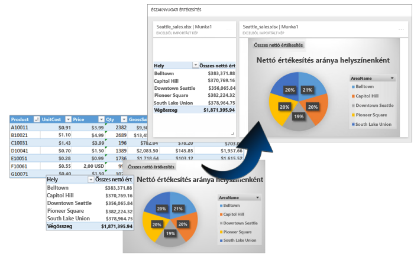
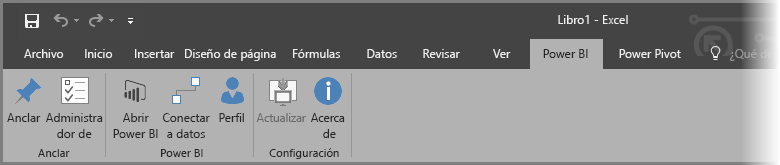
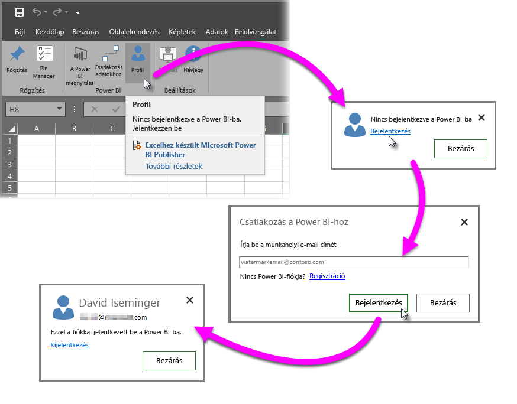
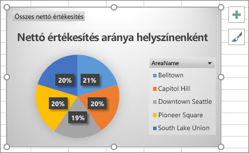
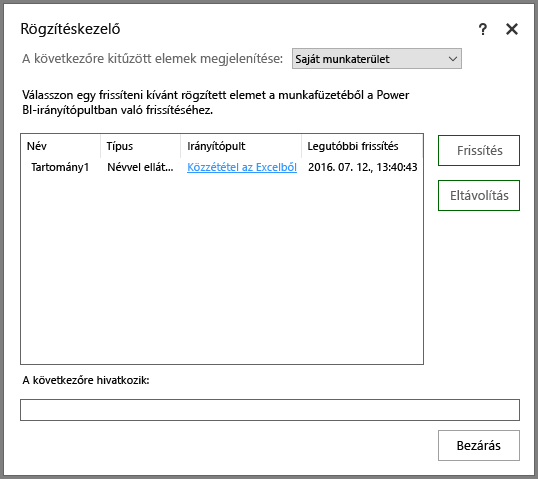
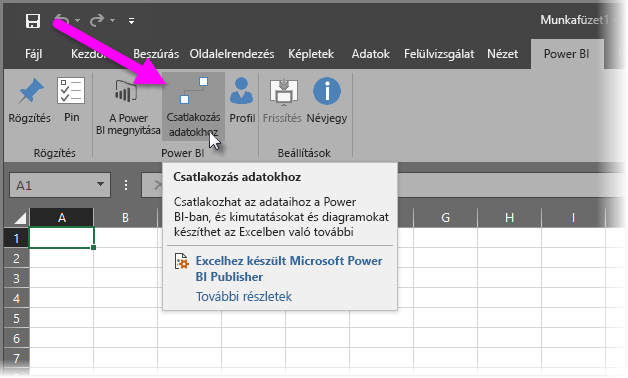
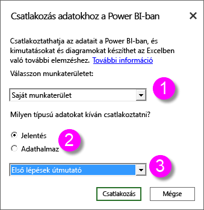
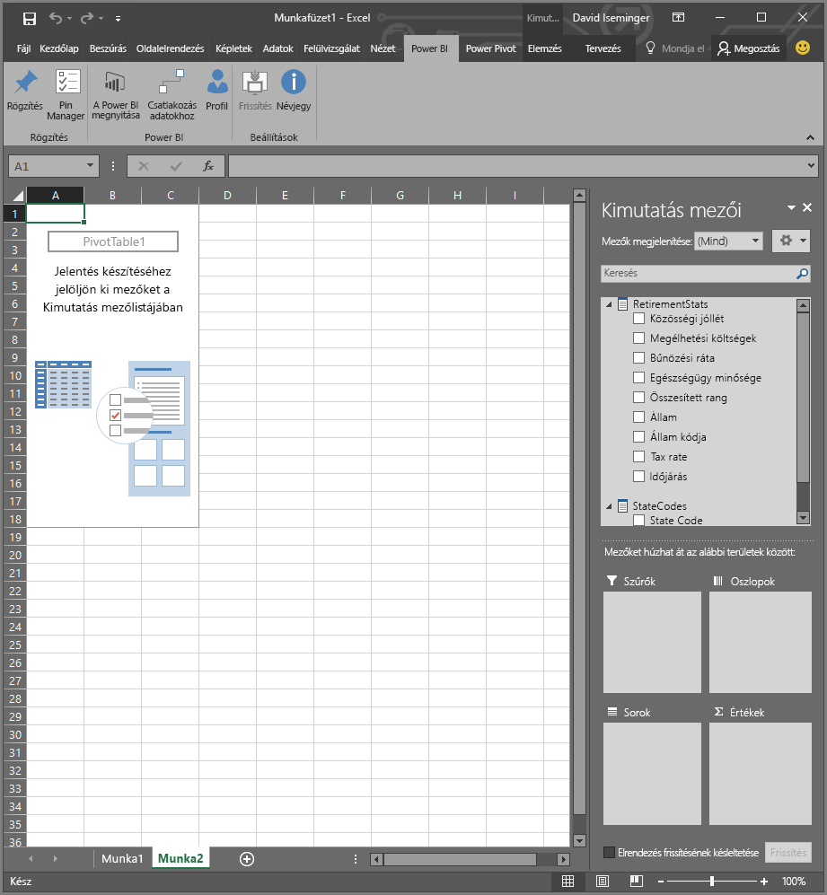
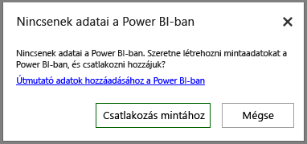

# Excelhez készült Power BI Publisher
A Microsoft **Excelhez készült Power BI Publisher** szolgáltatással pillanatképeket készíthet a fontos Excelbeli adatairól, például kimutatásokról, diagramokról és tartományokról, amelyeket aztán rögzíthet a Power BI irányítópultjain.

Milyen típusú adatokat rögzíthet? Szinte bármilyen, Excel-munkafüzetben található adatot. Kiválaszthat egy cellatartományt egy egyszerű táblázatból, egy kimutatásból vagy kimutatásdiagramból, illusztrációkból és képekből, valamint egyéb elemekből is.

Amit nem rögzíthet: Power View nézetben található térhatású térképeket és vizualizációkat. Emellett egyes elemeket rögzíthet, azonban nem érdemes; ilyenek például a Szeletelő vagy az Idősor szűrői.

Amikor egy Excel-elemet rögzít, egy új csempe jelenik meg a Power BI egy új vagy meglévő irányítópultján. Az új csempe egy pillanatkép, így nem dinamikus, azonban így is frissíthető. Ha például módosít egy rögzített kimutatást vagy diagramot, a Power BI irányítópultjának csempéje nem frissül automatikusan, a **Rögzítéskezelővel** azonban továbbra is frissítheti a rögzített elemeket. A **Rögzítéskezelőről** további információt a lenti szakaszokban találhat.

## Letöltés és telepítés
Az Excelhez készült Power BI Publisher egy letölthető és a Microsoft Excel 2007 és újabb verziók asztali verzióin telepíthető bővítmény.

[Az Excelhez készült Power BI Publisher letöltése](http://go.microsoft.com/fwlink/?LinkId=715729)

A Publisher letöltése után egy új **Power BI**-menüszalag jelenik meg az Excelben. Itt be- és kijelentkezhet a Power BI-ba, elemeket rögzíthet az irányítópultokon, és kezelheti a rögzített elemeket.

Az **Excelhez készült Power BI Publisher** bővítmény alapértelmezés szerint engedélyezve van, azonban ha mégsem jelenne meg a Power BI-menüszalag az Excelben, Önnek kell engedélyeznie. Kattintson a **Fájl** > **Beállítások** > **Bővítmények** > **COM-bővítmények** lehetőségre. Válassza az **Excelhez készült Microsoft Power BI Publisher** lehetőséget.

## Tartomány rögzítése egy irányítópulton
A munkalap bármely cellatartományát kiválaszthatja és rögzítheti annak pillanatképét egy meglévő vagy új Power BI-irányítópulton. Egy pillanatképeket több irányítópulton is rögzíthet.

Első lépésként be kell jelentkeznie a Power BI-ba.

1. Válassza a **Profil** lehetőséget az Excel **Power BI** szalagfülén. Ha már bejelentkezett a Power BI-ba, megjelenik egy párbeszédpanel, amely tudatja Önnel, hogy melyik fiókkal van jelenleg bejelentkezve. Ha ezt a fiókot szeretné használni, ugorjon a következő lépésre. Ha egy másik Power BI-fiókot szeretne használni, válassza a *Kijelentkezés* lehetőséget. Ha nincs bejelentkezve, lépjen a következő lépésre (2. lépés).
   
   
2. Ha nincs bejelentkezve, válassza az Excel **Power BI** szalagfülének **Profil** területén megjelenő **Bejelentkezés** hivatkozást, majd a **Csatlakozás a Power BI-hoz** párbeszédpanelen írja be a használni kívánt Power BI-fiók e-mail-címét, és kattintson a **Bejelentkezés** lehetőségre.
   
   

Ha be van jelentkezve, kövesse az alábbi lépéseket a tartomány rögzítéséhez:

1. Az Excelben válassza a **Power BI** szalagfület. Ekkor megjelenik a **Rögzítés** szalaggomb.
2. Válasszon ki egy tartományt az Excel-munkafüzetből.
3. Kattintson a **Power BI** menüszalagjának **Rögzítés** gombjára a **Rögzítés az irányítópulton párbeszédpanel** megjelenítéséhez. Ha még nem jelentkezett be a Power BI szolgáltatásba, a program ekkor bejelentkezést kér. Válasszon egy munkaterületet a **Munkaterület** legördülő listából. Ha a saját irányítópultján szeretne egy elemet rögzíteni, ellenőrizze, hogy a **Saját munkaterület** lehetőség van-e kiválasztva. Ha egy csoportos munkaterület irányítópultján szeretne egy elemet rögzíteni, válassza ki a csoportot a legördülő menüből.
4. Döntse el, hogy *meglévő* vagy *új* irányítópulton kíván rögzíteni.
5. A kijelölés irányítópulton való rögzítéséhez kattintson az **OK** gombra.
6. A **Rögzítés az irányítópulton** párbeszédpanelen válasszon ki egy meglévő irányítópultot a munkaterületen, vagy hozzon létre egy újat, majd kattintson az **OK** gombra.
   
   

## Diagram rögzítése egy irányítópulton
Kattintson a diagramra, majd a Rögzítés parancsra .

## Rögzített elemek kezelése
A **Rögzítéskezelővel** frissítheti a Power BI rögzített elemeihez rendelt csempéit, valamint eltávolíthatja a Power BI-irányítópultokon korábban rögzített elemeket.

A irányítópult csempéinek frissítéséhez a **Rögzítéskezelőben** válasszon ki egy vagy több elemet, majd kattintson a **Frissítés** lehetőségre.

Ha el szeretné távolítani egy Excelbeli rögzített elem és a hozzá tartozó irányítópult-csempe hozzárendelését, kattintson az **Eltávolítás** lehetőségre. Az **Eltávolítás** lehetőségre kattintva *nem* távolítja el az elemet az Excel-munkalapról, és a hozzá tartozó irányítópult-csempét sem törli. Csupán a rögzítést, azaz a köztük lévő *hozzárendelést* távolítja el. Az eltávolított elem ez után már nem jelenik meg a **Rögzítéskezelőben**. Ha ismét rögzíti az elemet, az új csempeként jelenik meg.

Ha rögzített elemeket (csempéket) szeretne eltávolítani az irányítópultokból, azt csak a Power BI-ban teheti meg. A törölni kívánt csempén kattintson a **Menü megnyitása** ikonra , majd a **Csempe törlése**    lehetőségre.

## Kapcsolódás adatokhoz a Power BI-ban
Az **Excelhez készült Power BI Publisher** 2016. júliusi kiadása óta (beleértve a jelenlegi kiadást) közvetlenül csatlakozhat a Power BI-beli adataihoz és elemezheti azokat az Excelben kimutatásokkal és kimutatásdiagramokkal. Így könnyen használhatja együtt a Power BI-t és az Excelt a legfontosabb adatok elemzéséhez.

A program az alábbi fejlesztésekkel bővült:

* A Power BI-adatokhoz való csatlakozáshoz szükséges illesztőprogramok automatikusan frissülnek minden kiadással, így nem kell Önnek telepítenie vagy kezelnie őket.
* Nem kell többé .odc fájlokat letöltenie a kapcsolatok létrehozásához – az **Excelhez készült Power BI Publisher** automatikusan létrehozza a kapcsolatokat a használni kívánt jelentés vagy adatkészlet kiválasztásakor.
* Mostantól több kapcsolatot és kimutatást létrehozhat egyetlen munkafüzetben.
* Javított, kifejezetten az **Excelhez készült Power BI Publisherre** szabott hibaüzenetek az alapértelmezett Excel-üzenetek helyett.

### Csatlakozás a Power BI-adatokhoz az Excelből
Ha Power BI-adatokhoz szeretne csatlakozni az **Excelhez készült Power BI Publisherrel**, kövesse az alábbi egyszerű lépéseket:

1. Győződjön meg róla, hogy bejelentkezett a Power BI-ba. A bejelentkezést (vagy egy másik fiókkal történő belépést) ismertető lépéseket a cikk korábbi szakaszaiban tekintheti meg.
2. Ha bejelentkezett a Power BI-ba a használni kívánt fiókkal, kattintson az Excelben a **Power BI** szalagfül **Csatlakozás adatokhoz** parancsára.
   
   
3. Az Excel egy HTTPS-kapcsolattal csatlakozik a Power BI-hoz, majd megjeleníti a **Power BI-adatok csatlakoztatása** párbeszédpanelt, ahol kiválaszthatja az adatokat tartalmazó *munkaterületet* (a lenti képen 1-es számmal jelölve), megadhatja a csatlakoztatni kívánt *adattípust*, amely egy **jelentés** vagy egy **adatkészlet** lehet (2), és egy legördülő listából (3) kiválaszthatja, melyik *rendelkezésre álló jelentéshez vagy adatkészlethez* szeretne csatlakozni.
   
   
4. A választások megadása után kattintson a **Power BI-adatok csatlakoztatása** párbeszédpanel **Csatlakozás** lehetőségére. Az Excel ekkor előkészít egy kimutatást, és megjeleníti a **Kimutatásmezők** ablaktáblát, ahol a csatlakoztatott Power BI-adatok közül választhat mezőket, és létrehozhat táblázatokat vagy diagramokat, amelyekkel elemezheti az adatokat.
   
   

Ha nincsenek adatai a Power BI-ban, az Excel ezt észleli, és mintaadatok létrehozását ajánlja fel, amelyekhez csatlakozhat és kipróbálhatja a funkciókat.

Az **Excelhez készült Power BI Publisher** ezen kiadásában érdemes észben tartania néhány dolgot:

* **Megosztott adatok** – A **Csatlakozás adatokhoz** területen nem érhetők el azok az adatok, amelyeket megosztottak Önnel, azonban nem láthatja őket a Power BI-ban.
* **Helyszíni SSAS** – Ha a kiválasztott adatkészlet egy helyszíni SQL Server Analysis Services (SSAS) szolgáltatásból származik, a Power BI adatkészlete pedig a DirectQuery funkcióval fér hozzá az adatokhoz, az **Excelhez készült Power BI Publisher** a helyszíni hálózati kapcsolaton keresztül fér hozzá az adatokhoz, *nem* pedig a Power BI-n keresztül. Emiatt ha egy felhasználó csatlakozni próbál az ilyen adatkészletekhez, csatlakoznia kell a helyszíni hálózathoz is, és hitelesítenie kell magát az adatokhoz való hozzáféréshez a tárolt adatok Analysis Services-példányának hitelesítési módjával.
* **Szükséges illesztőprogramok** - **Az Excelhez készült Power BI Publisher** automatikusan telepíti a szükséges illesztőprogramokat. Ezek között szerepel az Excel OLE DB illesztőprogram az Analysis Services szolgáltatáshoz. Ha a felhasználó (vagy bárki más) eltávolítja ezt az illesztőprogramot, a Power BI-adatokhoz való kapcsolódás megszűnik.
* **Az adatkészletnek mértékeket kell tartalmaznia** – Az adatkészletnek definiált modellmértékekkel kell rendelkeznie, az Excel ugyanis ezeket értékekként kezeli a kimutatásokban, és így tudja helyesen elemezni az adatokat. További információ a [mértékekről](desktop-measures.md).
* **Csoportok támogatása** – A megadott csoporton kívüli emberekkel megosztott adatkészletek nem támogatottak, így azokhoz nem csatlakozhat.
* **Ingyenes és Pro előfizetés** – A csoportokkal kapcsolatos műveletek nem támogatottak a Power BI ingyenes előfizetéseiben, az ingyenes felhasználók számára így nem jelennek meg a saját munkaterületen belüli csoportokkal megosztott adatkészletek és jelentések.
* **Megosztott jelentések és adatkészletek** – Az Önnel megosztott jelentésekhez és adatkészletekhez nem csatlakozhat.
* **Táblázatok használata adatmodellek helyett** – Az adatmodell nélküli Excel-táblázatok importálásával létrehozott adatkészletek és jelentések jelenleg nem támogatottak, így ezekhez nem csatlakozhat.

Ha létrehozott meggyőző diagramokat vagy más vizualizációkat, például adattartományokat, azokat könnyen rögzítheti a Power BI irányítópultjain, ahogyan azt korábban már ismertettük.

## Kapcsolódó cikkek
Az Excel és a Power BI együttes használatának és a hatékonyságuk maximálásának számos módja van. Erről további információt a következő cikkekben találhat.

* [Elemzés az Excelben](service-analyze-in-excel.md)
* [Elemzési problémák elhárítása az Excelben](desktop-troubleshooting-analyze-in-excel.md)

