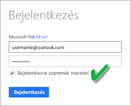

# CSV-fájlból létrehozott adatkészlet frissítése a OneDrive vagy a SharePoint Online szolgáltatásban
## Mik az előnyei?
Amikor .csv-fájlhoz kapcsolódik a OneDrive-on vagy a SharePoint Online-ban, a Power BI-ban létrejön egy adatkészlet. Ezután a .csv-fájlban lévő adatokat a Power BI importálja az adatkészletbe. Majd a Power BI automatikusan kapcsolódik a fájlhoz, és frissít minden változást a Power BI adatkészletében. Ha szerkeszti a .csv-fájlt a OneDrive vagy a SharePoint Online szolgáltatásban, a mentés után a módosítások általában körülbelül egy órán belül megjelennek a Power BI-ban. A Power BI-ban az adatkészleten alapuló vizualizációk szintén automatikusan frissülnek.

Ha a fájljai egy megosztott mappában találhatók a OneDrive Vállalati verzióban vagy a SharePoint Online-ban, más felhasználók is dolgozhatnak ugyanazon a fájlon. Mentés után a változtatások automatikusan frissülnek a Power BI-ban, általában egy órán belül.

Számos cég futtat olyan folyamatokat, amelyek automatikusan lekérdezik az adatbázisokban az adatokat, majd azokat minden nap .csv-fájlba mentik. Ha a fájlt a OneDrive-on vagy a SharePoint Online-ban tárolja, és minden nap felülírja ugyanazt a fájlt, ahelyett, hogy naponta újat hozna létre eltérő névvel, akkor a Power BI-ban kapcsolódhat ehhez a fájlhoz. A kapcsolódó adatkészlet a OneDrive-on vagy a SharePoint Online-ban lévő fájl frissítése után hamarosan szinkronizálva lesz. Az adatkészleten alapuló vizualizációk szintén automatikusan frissülnek.

## Mi támogatott?
A vesszővel tagolt értékfájlok egyszerű szöveges fájlok, ezért a külső adatforrásokhoz és jelentésekhez való kapcsolódás nem támogatott. Vesszővel tagolt fájlból létrehozott adatkészlet frissítését nem lehet ütemezni. Azonban, ha a fájl a OneDrive-on vagy a SharePoint Online-ban van, a Power BI automatikusan, óránként szinkronizálja a fájl változásait az adatkészlettel.

## OneDrive vagy OneDrive Vállalati verzió. Mi közöttük a különbség?
Ha rendelkezik személyes OneDrive-val és OneDrive Vállalati verzióval is, fontos, hogy azokat a fájlokat, amelyekhez kapcsolódni szeretne a Power BI-ban, a OneDrive Vállalati verziójában tartsa. Ennek az az oka, hogy minden bizonnyal két külön fiókot használ a két szolgáltatáshoz.

A OneDrive Vállalati verziójához való csatlakozás a Power BI szolgáltatásban általában zökkenőmentes, mert a Power BI-ba való bejelentkezéshez használt fiók gyakran megegyezik a OneDrive vállalati verziójához használttal. A személyes OneDrive-hoz viszont valószínűleg egy másik [Microsoft-fiókot](https://account.microsoft.com) használ.

Amikor bejelentkezik a Microsoft-fiókjával, mindenképp jelölje be a Bejelentkezve szeretnék maradni lehetőséget. A Power BI így tudja szinkronizálni a frissítéseket a Power BI-ban lévő adatkészletekkel.

Ha olyan módosítást hajt végre a OneDrive-on lévő fájlon, amely nem szinkronizálható a Power BI-ban található adatkészlettel, mert esetleg megváltoztak a Microsoft-fiók hitelesítő adatai, akkor kapcsolódnia kell a fájlhoz, és ismét importálnia kell azt a személyes OneDrive-járól.

## Hiba esetén
Ha megváltoztak a .csv-fájlban lévő adatok a OneDrive-ban, de ezek a változások a Power BI-ban nem tükröződnek, annak legvalószínűbb oka, hogy a Power BI nem tud kapcsolódni a OneDrive-hoz. Próbáljon kapcsolódni a fájlhoz és újra importálni. Ha a rendszer arra kéri, hogy jelentkezzen be, ügyeljen arra, hogy bejelölje a **Bejelentkezve szeretnék maradni** lehetőséget.

## Következő lépések
[Eszközök frissítési problémák elhárításához](service-gateway-onprem-tshoot.md)
[Frissítésekkel kapcsolatos hibaelhárítási forgatókönyvek](refresh-troubleshooting-refresh-scenarios.md)

További kérdései vannak? [Kérdezze meg a Power BI közösségét](https://community.powerbi.com/)

