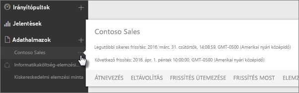
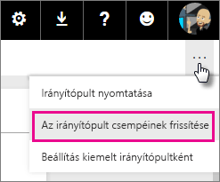
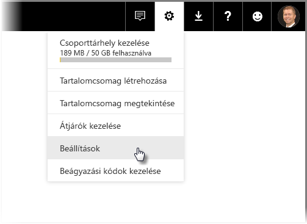
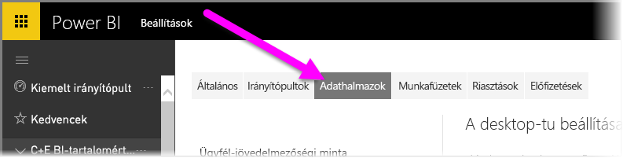
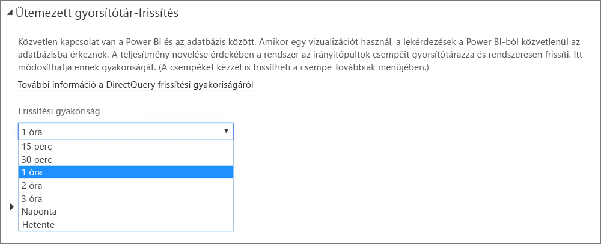

# Adatfrissítés a Power BI-ban
A jó döntések meghozatalában gyakran kritikus fontosságú a legfrissebb adatok lekérése. Már valószínűleg ismeri a Power BI Adatok lekérése funkcióját, amellyel adatokhoz csatlakozhat, illetve adatokat tölthet fel, és biztosan létrehozott már jelentéseket és egy irányítópultot is. Ezután célszerű meggyőződni arról, hogy az adatok valóban frissek és hibátlanok.

Sok esetben ehhez nem kell tennie semmit. Egyes adatok, például a Salesforce vagy a Marketo tartalomcsomagjai automatikusan frissülnek. Ha a kapcsolata élő kapcsolatot vagy DirectQueryt alkalmaz, az adatok naprakészek maradnak. Azonban más esetekben, például külső online vagy helyszíni adatforráshoz csatlakozó Excel-munkafüzetek vagy Power BI Desktop-fájlok esetén kézi frissítésre vagy frissítésütemezésre van szükség ahhoz, hogy a Power BI frissíthesse a jelentések és irányítópultok adatait.

Ez a cikk (és néhány másik) segít megérteni a Power BI adatfrissítésének működését és az ehhez szükséges teendőket attól függetlenül, hogy Önnek kell-e frissítésütemezést beállítania.

## Az adatfrissítés ismertetése
A frissítés beállítása előtt fontos megérteni a frissítendő adatok mivoltát és azok forrását.

Az *adatforrás* a jelentésekben és az irányítópultokon található adatok forrása. Ez lehet például online szolgáltatás, mint a Google Analytics vagy a QuickBooks, egy felhőbeli adatbázis, mint az Azure SQL Database, vagy a cége egy helyi számítógépén vagy kiszolgálóján tárolt adatbázis vagy fájl. Ezek mind adatforrások. Az adatforrás típusa határozza meg az adatfrissítés módját. Az egyes adatforrástípusok frissítéséről részletesen a [Mit lehet frissíteni?](#what-can-be-refreshed) című szakaszban írunk.

Amikor az Adatok lekérése funkcióval egy tartalomcsomaghoz vagy fájlhoz kapcsolódik, és adatokat tölt fel, vagy amikor egy élő adatforráshoz kapcsolódik, akkor a Power BI-ban automatikusan létrejön egy *adatkészlet*. A Power BI Desktopban és az Excel 2016-ban közzé is teheti a fájlt közvetlenül a Power BI szolgáltatásban, ami pont úgy működik, mint az Adatok lekérése funkció.

Bármelyik esetet választja, az adatkészlet a Power BI Saját munkaterület vagy Saját csoport területének tárolóiban jön létre. Az adatkészletek melletti **három pontra (…)**  kattintva részletesen megtekintheti egy jelentésben az adatokat, szerkesztheti a beállításokat, és beállíthatja a frissítést.

Az adatkészletek egy vagy több adatforrásból kérhetik le az adatokat. A Power BI Desktoppal például lekérhet adatokat egy SQL-adatbázisból, más típusú adatokat pedig egy online OData-csatornáról. Amikor közzéteszi a fájlt a Power BI-ban, egyetlen adatkészlet jön létre, az adatforrásai azonban az SQL-adatbázisra és az OData-csatornára is mutatnak majd.

Az adatkészletek az adatforrást leíró információt, az adatforrásbeli hitelesítő adatokat, legtöbb esetben pedig az adatoknak egy, az adatforrásból másolt részhalmazát is tartalmazzák. Amikor vizualizációkat hoz létre a jelentésekben és az irányítópultokon, az adatkészlet adataival dolgozik. Élő kapcsolat (például az Azure SQL Database) esetén az adatkészlet határozza meg az adatforrásból megjelenő adatokat. Ha élő kapcsolattal kapcsolódik az Analysis Services szolgáltatáshoz, az adatkészlet definíciója közvetlenül az Analysis Services szolgáltatástól érkezik.

> *Az adatok frissítésekor az adatforrásból a Power BI-ban tárolt adatkészlet adatai frissíti. Ez a frissítés teljes, és nem fokozatos.*
> 
> 

Amikor egy adatkészlet adatait frissíti – akár az Azonnali frissítés, akár egy ütemezett frissítés segítségével –, a Power BI az adatkészlet információival csatlakozik a definiált adatforrásokhoz, lekéri a frissített adatokat, majd betölti azokat az adatkészletbe. A jelentések és irányítópultok olyan vizualizációi, amelyek ezeken az adatokon alapulnak, automatikusan frissülnek.

Mielőtt továbbmennénk, fontos leszögeznünk valamit:

> *Függetlenül attól, hogy milyen gyakran frissíti az adatkészletet, vagy milyen gyakran tekinti meg az élő adatokat, az adatforrás adatainak kell először naprakésznek lenniük.*
> 
> 

A legtöbb cég naponta egyszer dolgozza fel az adatait, általában éjszaka. Ha egy olyan adatkészlet frissítését ütemezi, amelyet egy helyszíni adatbázishoz csatlakozó Power BI Desktop-fájlból hoztak létre, az informatikai részleg pedig ezt az SQL-adatbázist dolgozza fel esténként egyszer, csak napi egyszeri futásra kell beállítania az ütemezett frissítést. Ez történhet például az adatbázis feldolgozása után, de a munkaidő kezdete előtt. Természetesen nem minden eset ehhez hasonló. A Power BI szolgáltatással számos módon csatlakozhat olyan adatforrásokhoz, amelyek gyakran vagy valós időben frissülnek.

## Frissítéstípusok
A Power BI négy fő frissítéstípussal rendelkezik. Csomagfrissítés, modell-/adatfrissítés, csempefrissítés és vizuálistároló-frissítés.

### Csomagfrissítés
Ez szinkronizálja a Power BI Desktop- vagy Excel-fájlt a Power BI és a OneDrive vagy a SharePoint Online között. Ez a funkció nem kér le adatot az eredeti adatforrásból. A Power BI adatkészlete csak a OneDrive-ban vagy a SharePoint Online-ban található fájl adataival frissül.

### Modell-/adatfrissítés
Ez a Power BI adatkészletének frissítése az eredeti adatforrás adataival. Ezt ütemezheti, de azonnal is végrehajthatja. Ehhez a funkcióhoz egy átjáró szükséges a helyszíni adatforrásokhoz.

### Csempefrissítés
A csempefrissítés frissíti a gyorsítótár csempevizualizációit az irányítópulton az adatok módosulása után. Ez körülbelül 15 percenként történik meg. A csempefrissítést kényszerítheti is az irányítópult jobb felső sarkában található **három pontra (…)** , majd a **Az irányítópult csempéinek frissítése** lehetőségre kattintva.

További információ a gyakori csempefrissítési hibákról: [Csempékkel kapcsolatos hibák elhárítása](refresh-troubleshooting-tile-errors.md).

### Vizuálistároló-frissítés
A vizuális tároló frissítése frissíti a jelentés gyorsítótárazott vizualizációit az adatok módosulása után.

## Mit lehet frissíteni?
A Power BI-ban általában az Adatok lekérése paranccsal importál adatokat egy helyi meghajtó, a OneDrive vagy a SharePoint Online egy fájljából, illetve ezzel tesz közzé jelentéseket a Power BI Desktopból, valamint csatlakozik közvetlenül egy felhőbeli céges adatbázishoz. A Power BI szinte minden adata frissíthető, ennek szükségessége azonban attól függ, hogy hogyan jött létre az adatkészlet, valamint milyen adatforrásokhoz kapcsolódik. Nézzük, hogyan zajlik az adatfrissítés.

Mielőtt továbbmennénk, ismertetünk néhány fontos definíciót:

**Automatikus frissítés** – Ez azt jelenti, hogy nincs szükség felhasználói konfigurációra az adatkészlet rendszeres frissítéséhez. Az adatfrissítés beállításait a Power BI konfigurálja. Online szolgáltatók esetében a frissítés általában naponta egyszer történik. A OneDrive-ról betöltött fájlok esetében az automatikus frissítés körülbelül óránként történik az olyan adatoknál, amelyek nem egy külső adatforrásból származnak. Bár konfigurálhat különböző frissítésütemezési beállításokat és frissíthet manuálisan, erre valószínűleg nem lesz szüksége.

**Felhasználó által konfigurált kézi vagy ütemezett frissítés** – Ez azt jelenti, hogy kézzel frissíthet egy adatkészletet az Azonnali frissítés funkcióval, vagy beállíthat egy frissítésütemezést a Frissítés ütemezése funkcióval az adatkészlet beállításai között. Ez a frissítéstípus kötelező az olyan Power BI Desktop-fájlok és Excel-munkafüzeten esetében, amelyek külső online és helyszíni adatforrásokhoz csatlakoznak.

> [!NOTE]
> Az ütemezett frissítés idejének konfigurálásakor előfordulhat egy egy órás késés.
> 
> 

**Élő/DirectQuery** – Ez azt jelenti, hogy élő kapcsolat található a Power BI és az adatforrás között. A helyszíni adatforrások esetében a rendszergazdáknak konfigurálniuk kell egy adatforrást a céges átjáróban, felhasználói műveletekre azonban nincs szükség.

> [!NOTE]
> A teljesítmény növelése érdekében a DirectQuery segítségével csatlakoztatott adatokat tartalmazó irányítópultok automatikusan frissülnek. A csempéket kézzel is frissítheti a **Továbbiak** menüben.
> 
> 

## Helyi fájlok és a OneDrive-ban vagy a SharePoint Online-ban tárolt fájlok
Az adatfrissítés az olyan Power BI Desktop-fájlok és Excel-munkafüzeten esetében támogatott, amelyek külső online vagy helyszíni adatforrásokhoz csatlakoznak. Ez csak a Power BI adatkészletének adatait frissíti, a helyi fájlt nem.

A fájlok a OneDrive-ban vagy a SharePoint Online-ban való tárolása, valamint a Power BI-ból való kapcsolódás hozzájuk jelentős rugalmasságot nyújt. Azonban ezt a legnehezebb megérteni is. A OneDrive-ban vagy a SharePoint Online-ban tárolt fájlok ütemezett frissítése eltér a csomagfrissítéstől. További információt a [Frissítéstípusok](#types-of-refresh) szakaszban találhat.

### Power BI Desktop-fájl
| **Adatforrás** | **Automatikus frissítés** | **Felhasználó által konfigurált kézi vagy ütemezett frissítés** | **Átjáró szükséges** |
| --- | --- | --- | --- |
| A menüszalagon található Adatok lekérése funkcióval csatlakozhat az adatokhoz, valamint lekérheti azokat bármelyik listázott online adatforrásból. |Nem |Igen |Nem (lásd alább) |
| Az Adatok lekérése funkcióval csatlakozhat egy Analysis Services-adatforráshoz, és részletesen megtekintheti az adatait. |Igen |Nem |Igen |
| Az Adatok lekérése funkcióval csatlakozhat egy támogatott helyszíni DirectQuery-adatforráshoz, és részletesen megtekintheti az adatait. |Igen |Nem |Igen |
| Az Adatok lekérése funkcióval csatlakozhat az Azure SQL Database, az Azure SQL Data Warehouse és az Azure HDInsight Spark szolgáltatásokhoz, és lekérhet innen adatokat. |Igen |Igen |Nem |
| Az Adatok lekérése funkcióval csatlakozhat bármelyik listázott helyszíni adatforráshoz, és lekérhet innen adatokat. Ez alól kivételek a Hadoop-fájlok (HDFS) és a Microsoft Exchange. |Nem |Igen |Igen |

> [!NOTE]
> Ha a [**Web.Page**](https://msdn.microsoft.com/library/mt260924.aspx) függvényt használja, szüksége lesz egy átjáróra, ha az adatkészletet vagy a jelentést 2016. november 18. után újra közzétette.
> 
> 

További információ: [Power BI Desktop-fájlból létrehozott adatkészlet frissítése a OneDrive-ban](refresh-desktop-file-onedrive.md).

### Excel-munkafüzet
| **Adatforrás** | **Automatikus frissítés** | **Felhasználó által konfigurált kézi vagy ütemezett frissítés** | **Átjáró szükséges** |
| --- | --- | --- | --- |
| Az Excel adatmodelljébe be nem töltött munkalap adattáblái. |Igen, óránként *(csak a OneDrive/SharePoint Online esetében* |Csak kézzel *(csak a OneDrive/SharePoint Online esetében* |Nem |
| Az Excel adatmodelljének egyik táblájához csatolt munkalap adattáblái. |Igen, óránként *(csak a OneDrive/SharePoint Online esetében* |Csak kézzel *(csak a OneDrive/SharePoint Online esetében* |Nem |
| A Power Query* szolgáltatással csatlakozhat bármelyik listázott online adatforráshoz, és lekérhet innen adatokat, majd betöltheti őket az Excel adatmodelljébe. |Nem |Igen |Nem |
| A Power Query* szolgáltatással csatlakozhat bármelyik listázott helyszíni adatforráshoz, és lekérhet innen adatokat, majd betöltheti őket az Excel adatmodelljébe. Ez alól kivételek a Hadoop-fájlok (HDFS) és a Microsoft Exchange. |Nem |Igen |Igen |
| A Power Pivot szolgáltatással csatlakozhat bármelyik listázott online adatforráshoz, és lekérhet innen adatokat, majd betöltheti őket az Excel adatmodelljébe. |Nem |Igen |Nem |
| A Power Pivot szolgáltatással csatlakozhat bármelyik listázott helyszíni adatforráshoz, és lekérhet innen adatokat, majd betöltheti őket az Excel adatmodelljébe. |Nem |Igen |Igen |

*\* A Power Query az Excel 2016-ban Adatok beolvasása és átalakítása néven található meg.*

További részletes információ: [A OneDrive-on található Excel-munkafüzetből létrehozott adatkészlet frissítése](refresh-excel-file-onedrive.md).

### Vesszővel tagolt adatfájl (.csv) a OneDrive-ban vagy a SharePoint Online-ban
| **Adatforrás** | **Automatikus frissítés** | **Felhasználó által konfigurált kézi vagy ütemezett frissítés** | **Átjáró szükséges** |
| --- | --- | --- | --- |
| Egyszerű, vesszővel tagolt adatfájl (.csv) |Igen, óránként |Csak kézzel |Nem |

További részletes információ: [A OneDrive-ban tárolt, vesszővel tagolt (.csv) fájlból létrehozott adatkészlet frissítése](refresh-csv-file-onedrive.md).

## Tartalomcsomagok
A Power BI kétféle tartalomcsomaggal rendelkezik:

**Online szolgáltatások tartalomcsomagjai**: például Adobe Analytics, SalesForce és Dynamics CRM Online. Az online szolgáltatásokból létrehozott adatkészletek naponta egyszer automatikusan frissülnek. Bár ez valószínűleg nem szükséges, kézzel is frissítheti őket, vagy beállíthat egy frissítésütemezést. Mivel az online szolgáltatások a felhőben találhatók, nincs szükség átjáróra.

**Céges tartalomcsomagok**: a saját cég felhasználói által létrehozott és megosztott csomagok. A tartalomcsomag fogyasztói nem állíthatnak be frissítésütemezést vagy kézi frissítést. Csak a tartalomcsomag készítője állíthatja be a csomag adatkészleteinek frissítését. Az adatkészlet frissítési beállításai öröklődnek.

### Online szolgáltatások tartalomcsomagjai
| **Adatforrás** | **Automatikus frissítés** | **Felhasználó által konfigurált kézi vagy ütemezett frissítés** | **Átjáró szükséges** |
| --- | --- | --- | --- |
| Online szolgáltatások az Adatok lekérése &gt; Szolgáltatások területen |Igen |Igen |Nem |

### Céges tartalomcsomagok
A céges tartalomcsomagok adatkészleteinek frissítési jellemzői az adatkészlettől függnek. Ehhez lásd fentebb a helyi fájlok, a OneDrive és a SharePoint Online fájljaival kapcsolatos információkat.

További információ: [Céges tartalomcsomagok: bevezetés](service-organizational-content-pack-introduction.md).

## Élő kapcsolatok és DirectQuery a helyszíni adatforrásokhoz
A Helyszíni adatátjáróval a Power BI felületéről a helyszíni adatforrások számára küldhet lekérdezéseket. Amikor egy vizualizációt használ, a lekérdezések a Power BI-ból közvetlenül az adatbázisba érkeznek. A frissített adatok ezután visszatérnek, a vizualizációk pedig frissülnek. Mivel közvetlen kapcsolat van a Power BI és az adatbázis között, nincs szükség frissítésütemezésre.

Amikor egy SQL Service Analysis Services (SSAS) adatforráshoz csatlakozik élő kapcsolattal, a DirectQueryvel ellentétben az élő kapcsolat a gyorsítótárazás ellenében, a jelentés betöltésekor is futhat. Ez a viselkedés javítja a jelentés betöltési teljesítményét. Az SSAS-adatforrás legfrissebb adatait lekérheti a **frissítés** gombbal. Az SSAS-adatforrások tulajdonosai konfigurálhatják az adatkészlet ütemezett gyorsítótár-frissítésének gyakoriságát, így biztosíthatják, hogy a jelentések igény szerint frissüljenek. 

Amikor egy adatforrást konfigurál a Helyszíni adatátjáróval, az adatforrást használhatja ütemezett frissítési lehetőségként, ahelyett, hogy a személyes átjárót használná.

> [!NOTE]
> Ha az adatkészletet egy élő vagy DirectQuery-kapcsolathoz konfigurálta, az adatkészletek körülbelül óránként, vagy az adatok használatakor frissülnek. A *frissítési gyakoriságot* kézzel állíthatja be a Power BI *Ütemezett gyorsítótár-frissítés* beállításában.
> 
> 

| **Adatforrás** | **Élő lekérdezés/DirectQuery** | **Felhasználó által konfigurált kézi vagy ütemezett frissítés** | **Átjáró szükséges** |
| --- | --- | --- | --- |
| Analysis Services – táblázatos |Igen |Igen |Igen |
| Többdimenziós Analysis Services |Igen |Igen |Igen |
| SQL Server |Igen |Igen |Igen |
| SAP HANA |Igen |Igen |Igen |
| Oracle |Igen |Igen |Igen |
| Teradata |Igen |Igen |Igen |

További információt a [helyszíni adatátjárókkal](service-gateway-onprem.md) foglalkozó témakörben találhat.

## Felhőadatbázisok
A DirectQueryvel közvetlen kapcsolat jön létre a Power BI és a felhőadatbázis között. Amikor egy vizualizációt használ, a lekérdezések a Power BI-ból közvetlenül az adatbázisba érkeznek. A frissített adatok ezután visszatérnek, a vizualizációk pedig frissülnek. És mivel mind a Power BI, mind az adatforrás a felhőben található, nincs szükség személyes átjáróra.

Ha a vizualizációk esetében nincs felhasználói tevékenység, az adatok körülbelül óránként automatikusan frissülnek. A frissítési gyakoriságot az *Ütemezett gyorsítótár-frissítés* beállítással módosíthatja.

A gyakoriság beállításához kattintson a Power BI szolgáltatás jobb felső sarkában található **fogaskerék** ikonra, majd a **Beállítások** lehetőségre.

Ekkor megjelenik a **Beállítások** lap, ahol kiválaszthatja, melyik adatkészlet esetében szeretné módosítani a gyakoriságot. A lapon kattintson fent az **Adatkészletek** fülre.

Válassza ki az adatkészletet. Ekkor a jobb oldali ablaktáblában megjelennek az elérhető beállítások. A DirectQuery/élő kapcsolathoz a frissítési gyakoriságot az alábbi illusztrációnak megfelelően a legördülő menüből választhatja ki. Ez 15 percenkénti frissítéstől heti egy alkalomig terjedhet.

| **Adatforrás** | **Élő lekérdezés/DirectQuery** | **Felhasználó által konfigurált kézi vagy ütemezett frissítés** | **Átjáró szükséges** |
| --- | --- | --- | --- |
| SQL Azure Data Warehouse |Igen |Igen |Nem |
| Spark on HDInsight |Igen |Igen |Nem |

További információ: [Az Azure és a Power BI](service-azure-and-power-bi.md).

## Valós idejű irányítópultok
A valós idejű irányítópultok a Microsoft Power BI REST API-val vagy a Microsoft Stream Analytics segítségével ellenőrzik, hogy az adatok naprakészek-e. Mivel a valós idejű irányítópultokhoz nincs szükség frissítéskonfigurálásra, nem esnek a jelen cikk hatókörébe.

| **Adatforrás** | **Automatikus** | **Felhasználó által konfigurált kézi vagy ütemezett frissítés** | **Átjáró szükséges** |
| --- | --- | --- | --- |
| A Power BI REST API-val vagy a Microsoft Stream Analytics szolgáltatással fejlesztett egyéni alkalmazások |Igen, élő streaming |Nem |Nem |

További információ: [Valós idejű irányítópult létrehozása a Power BI-ban](https://msdn.microsoft.com/library/mt267603.aspx).

## Ütemezett frissítés beállítása
Az ütemezett frissítés konfigurálásával kapcsolatban további információt az [ütemezett frissítés konfigurálásáról](refresh-scheduled-refresh.md) szóló cikkben találhat.

## Gyakori adatfrissítési forgatókönyvek
Néha a legjobb módszer az adatfrissítés megismerésére néhány példa megtekintése. Az alábbiakban néhány gyakori adatfrissítési forgatókönyvet ismertetünk:

### Excel-munkafüzet adattáblázatokkal
Egy olyan Excel-munkafüzettel dolgozik, amely több táblázatnyi adatot is tartalmaz, azonban ezek nincsenek betöltve az Excel adatmodelljébe. Az Adatok lekérése funkcióval feltöltötte a munkafüzetet a helyi meghajtóból a Power BI-ba, és létrehozott egy irányítópultot. Azonban azóta módosította a munkafüzet táblázatait a helyi meghajtón, és szeretné frissíteni az irányítópultot a Power BI-ban az új adatokkal.

Sajnos ebben az esetben a frissítés nem támogatott. Az irányítópult adatkészletének frissítéséhez újra fel kell töltenie a munkafüzetet. Van azonban egy remek megoldás: helyezze a munkafüzetet a OneDrive-ra vagy a SharePoint Online-ra!

Amikor egy OneDrive-on vagy a SharePoint Online-on tárolt fájlhoz csatakozik, a jelentések és az irányítópultok a fájlhoz hűen jelenítik meg az adatokat. Ebben az esetben ugyanúgy, mint ahogy az Excel-munkafüzetben szerepelnek. A Power BI automatikusan, körülbelül óránként ellenőrzi a fájlt, frissítéseket keresve. Ha módosítja a OneDrive-on vagy a SharePoint Online-on tárolt munkafüzetet, a módosítások az irányítópulton és a jelentésekben is megjelennek egy órán belül. A frissítést nem kell kézzel beállítania. Azonban ha azonnal látni szeretné a frissítéseket a Power BI-ban, kézzel frissítheti az adatkészletet az Azonnali frissítés funkcióval.

További információ: [Excel-adatok a Power BI-ban](service-excel-workbook-files.md), vagy [A OneDrive-on található Excel-munkafüzetből létrehozott adatkészlet frissítése](refresh-excel-file-onedrive.md).

### Egy céges SQL-adatbázishoz kapcsolódó Excel-munkafüzet
Tegyük fel, hogy egy SalesReport.xlsx nevű Excel-munkafüzettel dolgozik a helyi számítógépén. Az Excel Power Query funkciójával csatlakozott egy céges kiszolgálón található SQL-adatbázishoz, és lekérte az értékesítési adatokat, amelyeket betöltött az adatmodellbe. Minden reggel, amikor megnyitotta a munkafüzetet, a Frissítés paranccsal frissítette a kimutatásokat.

Most szeretné a Power BI-ban megtekinteni az értékesítési adatokat, így az Adatok lekérése funkcióval csatlakozik a helyi meghajtón található SalesReport.xlsx munkafüzethez, és feltölti azt.

Ebben az esetben kézzel frissítheti a SalesReport.xlsx adatkészletének adatait, vagy beállíthat egy frissítésütemezést. Mivel az adatok valójában a céges SQL-adatbázisból származnak, le kell töltenie és telepítenie kell egy átjárót. Amikor ezzel kész, és konfigurálta az átjárót, nyissa meg a SalesReport adatkészletének beállításait, és jelentkezzen be az adatforrásba. Ezt csak egyszer kell elvégeznie. Ezután beállíthat egy frissítésütemezést, a Power BI így automatikusan csatlakozik az SQL-adatbázishoz, és lekéri az adatokat. A jelentések és az irányítópultok is automatikusan frissülnek.

> [!NOTE]
> Ez csak a Power BI adatkészletén belül frissíti az adatokat. A helyi fájl nem fog frissülni.
> 
> 

További információ: [Excel-adatok a Power BI-ban](service-excel-workbook-files.md), [Power BI Gateway – Personal](personal-gateway.md), [Helyszíni adatátjáró](service-gateway-onprem.md), [Excel-munkafüzetből létrehozott adatkészlet frissítése helyi meghajtón](refresh-excel-file-local-drive.md).

### Power BI Desktop-fájl egy OData-csatorna adataival
Ebben az esetben a Power BI Desktop Adatok lekérése funkciójával csatlakozott egy OData-csatorna fontos népszámlálási adataihoz, majd importálta őket.  Több jelentést is létrehozott a Power BI Desktopban, majd a fájlt WACensus néven mentette egy céges megosztón. Ezután közzétette a fájlt a Power BI-ban.

Ebben az esetben kézzel frissítheti a WACensus adatkészletének adatait, vagy beállíthat egy frissítésütemezést. Mivel az adatforrás adatai egy online OData-csatornáról származnak, nem kell telepítenie egy átjárót, azonban a WACensus adatkészletének beállításai között be kell jelentkeznie az OData-adatforrásába. Ezután beállíthat egy frissítésütemezést, a Power BI így automatikusan csatlakozik az OData-csatornához, és lekéri az adatokat. A jelentések és az irányítópultok is automatikusan frissülnek.

További információ: [Közzététel a Power BI Desktopból](desktop-upload-desktop-files.md), [Power BI Desktop-fájlból létrehozott adatkészlet frissítése helyi meghajtón](refresh-desktop-file-local-drive.md), [Power BI Desktop-fájlból létrehozott adatkészlet frissítése a OneDrive-on](refresh-desktop-file-onedrive.md).

### A cég egy másik felhasználója által megosztott tartalomcsomag
Csatlakozott egy céges tartalomcsomaghoz. Ez tartalmaz egy irányítópultot, több jelentést és egy adatkészletet.

Ebben a forgatókönyvben nem állíthat be frissítést az adatkészlet számára. A tartalomcsomagot létrehozó adatelemző felelőssége az adatkészlet frissítése, az adatforrásoktól függően.

Ha a tartalomcsomag irányítópultjai és jelentései nem frissülnek, lépjen kapcsolatba a tartalomcsomagot létrehozó adatelemzővel.

További információ: [Céges tartalomcsomagok: bevezetés](service-organizational-content-pack-introduction.md), [A céges tartalomcsomagok működése](service-organizational-content-pack-copy-refresh-access.md).

### Egy online szolgáltatótól (például a Salesforce-tól) származó tartalomcsomag
A Power BI-ban az Adatok lekérése funkcióval csatlakozott egy online szolgáltató, például a Salesforce adataihoz, amelyeket aztán importált. Itt nincs más teendője. A Salesforce-adatkészlet minden nap automatikusan frissül. 

A legtöbb online szolgáltatóhoz hasonlóan a Salesforce is naponta egyszer frissíti az adatait, általában éjjel. Kézzel is frissítheti a Salesforce-adatkészletet, vagy beállíthat egy frissítésütemezést, de erre nincs szükség, mivel a Power BI automatikusan frissíti az adatkészletet, a jelentéseket és az irányítópultokat.

További információ: [A Power BI-hoz készült Salesforce-tartalomcsomag](service-connect-to-salesforce.md).

## Hibaelhárítás
Általában azért történnek hibák, mert a Power BI nem tud bejelentkezni az adatforrásokba, vagy az adatkészlet helyszíni adatforráshoz csatlakozik, mert az átjáró offline állapotban van. Győződjön meg arról, hogy a Power BI be tud jelentkezni az adatforrásokba. Ha az adatforrásokba való bejelentkezéshez használt jelszó megváltozik, vagy ha a Power BI kijelentkezik az adatforrásból, próbáljon meg ismét bejelentkezni az adatforrásokba az Adatforrás azonosító adatai részben.

Hibaelhárítással kapcsolatos további információ: [Frissítéssel kapcsolatos hibák hibaelhárítási eszközei](service-gateway-onprem-tshoot.md) és [Frissítési forgatókönyvekkel kapcsolatos hibák elhárítása](refresh-troubleshooting-refresh-scenarios.md).

## További lépések
[Frissítéssel kapcsolatos hibák hibaelhárítási eszközei](service-gateway-onprem-tshoot.md)  
[Frissítési forgatókönyvekkel kapcsolatos hibák elhárítása](refresh-troubleshooting-refresh-scenarios.md)  
[Power BI Gateway – Personal](personal-gateway.md)  
[Helyszíni adatátjáró](service-gateway-onprem.md)  

További kérdései vannak? [Kérdezze meg a Power BI közösségét](http://community.powerbi.com/)

