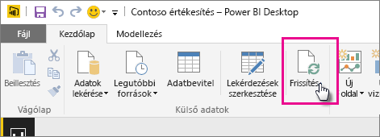

# Power BI Desktop-fájlból létrehozott adatkészlet frissítése helyi meghajtón
## Mi támogatott?
A Power BI-ban az Azonnali frissítés és a Frissítés ütemezése támogatott a helyi meghajtóról importált Power BI Desktop fájlokból létrehozott adatkészletek esetében, ahol az Adatok lekérése/Lekérdezésszerkesztő használatával történik a csatlakozás a következő adatforrásokhoz, illetve az adatbetöltés azokról:

### Személyes Power BI-átjáró
* A Power BI Desktop Adatok lekérése és Lekérdezésszerkesztő területein látható összes online adatforrás.
* A Power BI Desktop Adatok lekérése és Lekérdezésszerkesztő területein látható összes helyszíni adatforrás a Hadoop-fájl (HDFS) és a Microsoft Exchange kivételével.

<!-- Refresh Data sources-->
[!INCLUDE [refresh-datasources](./includes/refresh-datasources.md)]

> [!NOTE]
> Egy telepített és futó átjáró szükséges ahhoz, hogy a Power BI csatlakozhasson a helyszíni adatforrásokhoz és frissíthesse az adatkészletet.
> 
> 

Közvetlenül a Power BI Desktopban végezhet egyszeri, manuális frissítést, ha a Kezdőlap szalagon a Frissítés lehetőséget választja. Amikor itt a Frissítés elemet választja, a *fájl* modelljében lévő adatok az eredeti adatforrásból származó frissített adatokkal frissülnek. Ez a frissítéstípus, amely teljes mértékben magából a Power BI Desktop alkalmazásból történik, különbözik a Power BI manuális vagy ütemezett frissítésétől, és fontos megérteni ezt a különbséget.

Amikor a Power BI Desktop-fájlt a helyi meghajtóról importálja, a modellel kapcsolatos adatokat és más információkat a Power BI szolgáltatás egy adatkészletébe tölti. A Power BI szolgáltatásban (nem a Power BI Desktopban) azért érdemes frissíteni az adatkészletben lévő adatokat, mert ezen alapulnak a Power BI szolgáltatásban lévő jelentések. Mivel az adatforrások külső adatforrások, manuálisan frissítheti az adatkészletet az **Azonnali frissítéssel**, vagy beállíthat egy frissítési ütemtervet a **Frissítés ütemezésével**.

Az adatkészlet frissítésekor a Power BI nem csatlakozik a helyi meghajtón lévő fájlhoz a frissített adatok lekérdezése érdekében. Az adatkészletben lévő információkkal közvetlenül az adatforrásokhoz csatlakozik a frissített adatok lekérdezése érdekében, majd az adatkészletbe tölti azokat.

> [!NOTE]
> Az adatkészletben lévő frissített adatokat a rendszer nem szinkronizálja vissza a helyi meghajtón lévő fájllal.
> 
> 

## Hogyan ütemezhetem a frissítést?
Frissítés ütemezésének beállításakor a Power BI közvetlenül az adatforrásokhoz csatlakozik az adatkészletben lévő csatlakozási információkkal és hitelesítő adatokkal a frissített adatok lekérdezése érdekében, majd a frissített adatokat az adatkészletbe tölti. A jelentésekben és irányítópultokon a Power BI szolgáltatás ezen adatkészletére alapuló összes vizualizáció is frissül.

Az ütemezett frissítés beállításáról további részleteket az [ütemezett frissítés konfigurálásáról szóló részben](refresh-scheduled-refresh.md) olvashat.

## Hiba esetén
Általában azért történnek hibák, mert a Power BI nem tud bejelentkezni az adatforrásokba, vagy ha az adatkészlet helyszíni adatforráshoz csatlakozik, mert az átjáró offline állapotban van. Győződjön meg arról, hogy a Power BI be tud jelentkezni az adatforrásokba. Ha az adatforrásokba való bejelentkezéshez használt jelszó megváltozik, vagy ha a Power BI kijelentkezik az adatforrásból, próbáljon meg ismét bejelentkezni az adatforrásokba az Adatforrás azonosító adatai részben.

Mindenképpen hagyja bejelölve az **Értesítést kérek e-mailben, ha sikertelen a frissítés** jelölőnégyzetet. Azonnal tudnia kell, ha egy ütemezett frissítés meghiúsul.

## Hibaelhárítás
Néha az adatok frissítése nem a várt módon történik. Ezt általában egy átjáróval kapcsolatos hiba okozza. Az átjáró-hibaelhárítással kapcsolatos cikkekben találja az eszközöket és az ismert hibákat.

[A Helyszíni adatátjáróval kapcsolatos hibák elhárítása](service-gateway-onprem-tshoot.md)

[A személyes Power BI Gateway hibáinak elhárítása](service-admin-troubleshooting-power-bi-personal-gateway.md)

További kérdései vannak? [Kérdezze meg a Power BI közösségét](http://community.powerbi.com/)

