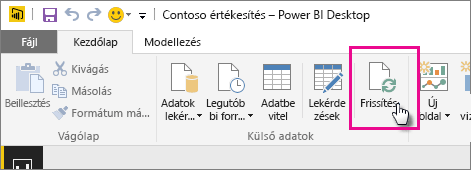
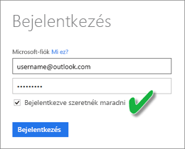

# A OneDrive vagy a SharePoint Online szolgáltatásban tárolt adatkészletek frissítése
A fájlok importálása a OneDrive vagy a SharePoint Online szolgáltatásból a Power BI szolgáltatásba nagyszerű mód arra, hogy biztosítsa, hogy a **Power BI Desktopban** végzett munkája szinkronban maradjon a Power BI szolgáltatással.

## A Power BI Desktop-fájlok OneDrive vagy SharePoint Online szolgáltatásban való tárolásának előnyei
Ha egy **Power BI Desktop**-fájlt a OneDrive vagy a SharePoint Online szolgáltatásban tárol, a rendszer a fájl modelljébe töltött összes adatot importálja az adatkészletbe, és a fájlban létrehozott összes jelentést betölti a Power BI szolgáltatásba a **Jelentések** közé. Amikor módosítja a fájlt a OneDrive vagy SharePoint Online szolgáltatásban, például új mértékeket ad hozzá, módosítja az oszlopneveket vagy szerkeszti a vizualizációkat, a fájl mentésekor ezek a módosítások a Power BI szolgáltatásban is frissülnek, általában egy órán belül.

Közvetlenül a Power BI Desktopban végezhet egyszeri, manuális frissítést, ha a Kezdőlap szalagon a Frissítés lehetőséget választja. Amikor itt a Frissítés elemet választja, a *fájl* modelljében lévő adatok az eredeti adatforrásból származó frissített adatokkal frissülnek. Ez a frissítéstípus, amely teljes mértékben magából a Power BI Desktop alkalmazásból történik, különbözik a Power BI manuális vagy ütemezett frissítésétől, és fontos megérteni ezt a különbséget.

Amikor a Power BI Desktop-fájlt a OneDrive-ról vagy a SharePoint Online-ról importálja, a rendszer az adatokat a modellel kapcsolatos más információkkal együtt a Power BI egy adatkészletébe tölti. A Power BI szolgáltatásban (nem a Power BI Desktopban) azért érdemes frissíteni az adatkészletben lévő adatokat, mert ezen alapulnak a Power BI szolgáltatásban lévő jelentések. Mivel az adatforrások külső adatforrások, manuálisan frissítheti az adatkészletet az **Azonnali frissítéssel**, vagy beállíthat egy frissítési ütemtervet a **Frissítés ütemezésével**.

Az adatkészlet frissítésekor a Power BI nem csatlakozik a OneDrive vagy a SharePoint Online szolgáltatásban lévő fájlhoz a frissített adatok lekérdezéséhez. Az adatkészletben lévő információkkal közvetlenül az adatforrásokhoz csatlakozik a frissített adatok lekérdezése érdekében, majd az adatkészletbe tölti azokat. Az adatkészlet frissített adatait a rendszer nem szinkronizálja vissza a OneDrive vagy a SharePoint Online szolgáltatásban lévő fájllal.

## Mi támogatott?
A Power BI-ban az Azonnali frissítés és a Frissítés ütemezése támogatott a helyi meghajtóról importált Power BI Desktop fájlokból létrehozott adatkészletek esetében, ahol az Adatok lekérése/Lekérdezésszerkesztő használatával történik a csatlakozás a következő adatforrásokhoz, illetve az adatbetöltés azokról:

### Személyes Power BI-átjáró
* A Power BI Desktop Adatok lekérése és Lekérdezésszerkesztő területein látható összes online adatforrás.
* A Power BI Desktop Adatok lekérése és Lekérdezésszerkesztő területein látható összes helyszíni adatforrás a Hadoop-fájl (HDFS) és a Microsoft Exchange kivételével.

<!-- Refresh Data sources-->
[!INCLUDE [refresh-datasources](./includes/refresh-datasources.md)]

> [!NOTE]
> Egy telepített és futó átjáró szükséges ahhoz, hogy a Power BI csatlakozhasson a helyszíni adatforrásokhoz és frissíthesse az adatkészletet.
> 
> 

## OneDrive vagy OneDrive Vállalati verzió. Mi közöttük a különbség?
Ha rendelkezik személyes OneDrive-val és OneDrive Vállalati verzióval is, a Power BI-ba importálni kívánt fájlokat ajánlott a OneDrive Vállalati verziójában tartani. Ennek az az oka, hogy minden bizonnyal két külön fiókot használ a két szolgáltatáshoz.

A OneDrive Vállalati verziójához való csatlakozás a Power BI szolgáltatásban általában zökkenőmentes, mert a Power BI-ba való bejelentkezéshez használt fiók gyakran megegyezik a OneDrive vállalati verziójához használttal. A személyes OneDrive-hoz viszont valószínűleg egy másik [Microsoft-fiókot](http://www.microsoft.com/account/default.aspx) használ.

Amikor bejelentkezik a Microsoft-fiókjával, mindenképp jelölje be a Bejelentkezve szeretnék maradni lehetőséget. A Power BI ezután szinkronizálni tudja a Power BI Desktopban végrehajtott fájlfrissítéseket a Power BI adatkészleteivel.  
    

Ha olyan módosítást hajt végre a OneDrive-on lévő fájlon, amely nem szinkronizálható a Power BI-ban található adatkészlettel vagy jelentésekkel, mert esetleg megváltoztak a Microsoft-fiók hitelesítő adatai, csatlakoznia kell, és ismét importálnia kell a fájlt a személyes OneDrive-járól.

## Hogyan ütemezhetem a frissítést?
Frissítés ütemezésének beállításakor a Power BI közvetlenül az adatforrásokhoz csatlakozik az adatkészletben lévő csatlakozási információkkal és hitelesítő adatokkal a frissített adatok lekérdezése érdekében, majd a frissített adatokat az adatkészletbe tölti. A jelentésekben és irányítópultokon a Power BI szolgáltatás ezen adatkészletére alapuló összes vizualizáció is frissül.

Az ütemezett frissítés beállításáról további részleteket az [ütemezett frissítés konfigurálásáról szóló részben](refresh-scheduled-refresh.md) olvashat.

## Hiba esetén
Általában azért történnek hibák, mert a Power BI nem tud bejelentkezni az adatforrásokba, vagy ha az adatkészlet helyszíni adatforráshoz csatlakozik, mert az átjáró offline állapotban van. Győződjön meg arról, hogy a Power BI be tud jelentkezni az adatforrásokba. Ha az adatforrásokba való bejelentkezéshez használt jelszó megváltozik, vagy ha a Power BI kijelentkezik az adatforrásból, próbáljon meg ismét bejelentkezni az adatforrásokba az Adatforrás azonosító adatai részben.

Ha módosításokat végez egy OneDrive-on tárolt Power BI Desktop-fájlon, és menti azt, majd ezek a módosítások nem jelennek meg a Power BI-ban nagyjából egy órán belül, ennek az lehet az oka, hogy a Power BI nem tud csatlakozni a OneDrive-hoz. Próbáljon meg ismét csatlakozni a OneDrive-on tárolt fájlhoz. Ha a rendszer arra kéri, hogy jelentkezzen be, ügyeljen arra, hogy bejelölje a Bejelentkezve szeretnék maradni lehetőséget. Mivel a Power BI nem tudott csatlakozni a OneDrive szolgáltatáshoz, és így nem tudta szinkronizálni a fájl adatait, újra importálnia kell az adott fájlt.

Mindenképpen hagyja bejelölve az **Értesítést kérek e-mailben, ha sikertelen a frissítés** jelölőnégyzetet. Azonnal tudnia kell, ha egy ütemezett frissítés meghiúsul.

## Hibaelhárítás
Néha az adatok frissítése nem a várt módon történik. Ezt általában egy átjáróval kapcsolatos hiba okozza. Az átjáró-hibaelhárítással kapcsolatos cikkekben találja az eszközöket és az ismert hibákat.

[A Helyszíni adatátjáróval kapcsolatos hibák elhárítása](service-gateway-onprem-tshoot.md)

[A személyes Power BI Gateway hibáinak elhárítása](service-admin-troubleshooting-power-bi-personal-gateway.md)

További kérdései vannak? [Kérdezze meg a Power BI közösségét](http://community.powerbi.com/)

