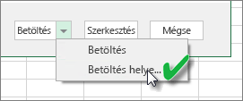
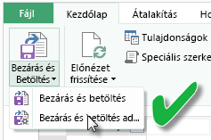
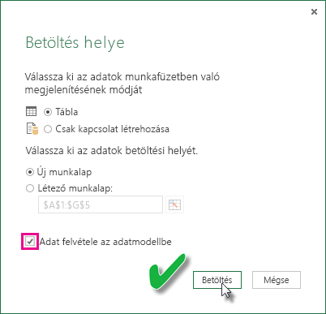

# Excel-munkafüzetből létrehozott adatkészlet frissítése helyi meghajtón
## Mi támogatott?
A Power BI-ban a Frissítés most és a Frissítés ütemezése támogatott az olyan helyi meghajtóról importált Excel-munkafüzetekből létrehozott adatkészleteknél, ahol a Power Queryt (az Excel 2016-ban Adatok beolvasása és átalakítása) vagy a Power Pivotot használják a következő adatforrások valamelyikéhez való kapcsolódásra, és az adatok Excel-adatmodellbe való betöltésére:  

### Power BI Gateway – Personal
* Minden online adatforrás megjelenik az Excelhez készült Microsoft Power Queryben.
* Minden helyszíni adatforrás megjelenik a Power Queryben a Hadoop-fájlokat (HDFS) és a Microsoft Exchange-t kivéve.
* Minden online adatforrás megjelenik a Power Pivotban.\*
* Minden helyszíni adatforrás megjelenik a Power Pivotban a Hadoop-fájlokat (HDFS) és a Microsoft Exchange-t kivéve.

<!-- Refresh Data sources-->
[!INCLUDE [refresh-datasources](./includes/refresh-datasources.md)]

> **Megjegyzések:**  
> 
> * Ahhoz, hogy a Power BI helyszíni adatforrásokhoz kapcsolódhasson és frissíthesse az adatkészletet telepítve kell lennie és futnia kell egy átjárónak.
> * Az Excel 2013 használatakor győződjön meg róla, hogy frissítette-e a Power Queryt a legújabb verzióra.
> * A frissítés nem támogatott azokból az Excel-munkafüzetekből, amelyeket olyan helyi meghajtóról importáltak, ahol az adatok csak munkafüzetekben vagy kapcsolt táblákban léteznek. A OneDrive-on tárolt és onnan importált munkafüzetek adatainak frissítése támogatott. További információért lásd: [A OneDrive-on vagy a SharePoint Online-ban található Excel-munkafüzetből létrehozott adatkészlet frissítése](refresh-excel-file-onedrive.md).
> * Amikor helyi meghajtóról importált Excel-munkafüzetből létrehozott adatkészletet frissít, csak az adatforrásokból lekérdezett adatok frissülnek. Ha módosítja az adatszerkezetet az Excelben vagy a Power Pivotban, például létrehoz egy új mértéket, vagy megváltoztatja egy oszlop nevét, ezek a módosítások nem másolódnak át az adatkészletbe. Ha ilyen módosításokat végez, akkor újra fel kell töltenie vagy újra közzé kell tennie a munkafüzetet. Ha várhatóan rendszeresen módosítja a munkafüzet szerkezetét, és szeretné, ha ezek a módosítások tükröződnének a Power BI adatkészletében anélkül, hogy újra fel kellene azokat tölteni, fontolja meg a munkafüzet OneDrive-ra való áthelyezését. A Power BI automatikusan frissíti a OneDrive-ról importált és tárolt munkafüzetek szerkezetét és munkalapadatait.
> 
> 

## Hogyan ellenőrizhetem, hogy betöltődtek-e az adatok az Excel-adatmodellbe?
Ha a Power Queryt (az Excel 2016-ban Adatok beolvasása és átalakítása) használja az adatforráshoz való kapcsolódáshoz, több lehetőség is a rendelkezésére áll, ahová az adatokat betöltheti. Ahhoz, hogy biztosan betöltse az adatokat az adatmodellbe, válassza az **Adatok hozzáadása az adatmodellhez** lehetőséget a **Betöltés a megadott helyre** párbeszédpanelen.

> [!NOTE]
> Az itt látható képeken az Excel 2016 látható.
> 
> 

A **Navigátorban** kattintson a **Betöltés a megadott helyre...** menüpontra.  
    

Másik lehetőségként a Navigátorban a **Szerkesztés** elemre kattintva megnyílik a Lekérdezésszerkesztő. Itt kattintson a **Bezárás és betöltés adott helyre...** menüpontra.  
    

Ekkor ne felejtse el bejelölni a **Betöltés a megadott helyre** párbeszédpanelen az **Adatok hozzáadása az adatmodellhez** jelölőnégyzetet.  
    

### Mi történik, ha a Power Pivotban használom a Külső adatok beolvasása lehetőséget?
Ezt is megteheti. Ha bármikor a Power Pivotot használja helyszíni vagy online adatforráshoz való kapcsolódásra és az adatok lekérdezésére, az adatok automatikusan betöltődnek az adatmodellbe.

## Hogyan ütemezhetek frissítést?
Frissítés ütemezésének beállításakor a Power BI közvetlenül az adatforrásokhoz csatlakozik az adatkészletben lévő csatlakozási információkkal és hitelesítő adatokkal a frissített adatok lekérdezése érdekében, majd a frissített adatokat az adatkészletbe tölti. A jelentésekben és irányítópultokon a Power BI szolgáltatás ezen adatkészletére alapuló összes vizualizáció is frissül.

Az ütemezett frissítés beállításáról további részleteket az [ütemezett frissítés konfigurálásáról szóló részben](refresh-scheduled-refresh.md) olvashat.

## Hiba esetén
Általában azért történnek hibák, mert a Power BI nem tud bejelentkezni az adatforrásokba, vagy ha az adatkészlet helyszíni adatforráshoz csatlakozik, mert az átjáró offline állapotban van. Győződjön meg arról, hogy a Power BI be tud jelentkezni az adatforrásokba. Ha megváltozik az adatforrásba való bejelentkezésre használt jelszó, vagy a Power BI-t kijelentkezteti egy adatforrás, próbáljon újra bejelentkezni az adatforrásokba az Adatforrás azonosító adatai használatával.

Hagyja bejelölve az **Értesítést kérek e-mailben, ha sikertelen a frissítés** jelelölőnégyzetet. Hasznos, ha azonnal tudomást szerez róla, ha egy ütemezett frissítés nem sikerül.

>[!IMPORTANT]
>A Power Pivothoz csatlakozó és onnan lekérdezett OData-csatornák frissítése nem támogatott. Ha OData-csatornát használ adatforrásként, használja a Power Queryt.

## Hibaelhárítás
Néha az adatok frissítése nem a várt módon történik. Ezt általában egy átjáróval kapcsolatos hiba okozza. Az átjáró-hibaelhárítással kapcsolatos cikkekben találja az eszközöket és az ismert hibákat.

[A Helyszíni adatátjáróval kapcsolatos hibák elhárítása](service-gateway-onprem-tshoot.md)

[A személyes Power BI Gateway hibáinak elhárítása](service-admin-troubleshooting-power-bi-personal-gateway.md)

## Következő lépések
További kérdései vannak? [Kérdezze meg a Power BI közösségét](http://community.powerbi.com/)

