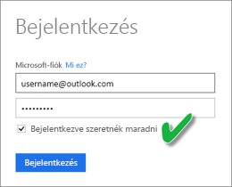
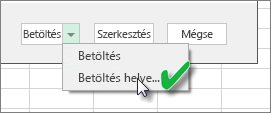
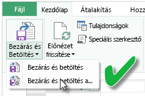
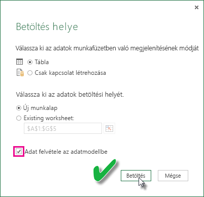

# A OneDrive-on vagy a SharePoint Online-on található Excel-munkafüzetből létrehozott adatkészlet frissítése
Importálhat a helyi gépén vagy egy felhőbeli tárhelyben (például a OneDrive Vállalati verzióban vagy a SharePoint Online-on) tárolt Excel-munkafüzeteket. Ebben a cikkben a felhőbeli tárhelyek az Excel-fájlokkal való használatának előnyeit ismertetjük. További információ az Excel-fájlok a Power BI-ba való importálásáról: [Adatok lekérdezése Excel-munkafüzetből](service-excel-workbook-files.md).

## Mik az előnyök?
A fájlok importálása a OneDrive vagy a SharePoint Online szolgáltatásból nagyszerű mód arra, hogy biztosítsa, hogy az Excelben végzett munkája szinkronban maradjon a Power BI szolgáltatással. A rendszer a fájl modelljébe töltött összes adatot importálja az adatkészletbe, és a fájlban létrehozott összes jelentést betölti a Power BI szolgáltatásba a Jelentések közé. Ha módosítja a fájlt a OneDrive vagy SharePoint Online szolgáltatásban, például új mértékeket ad hozzá, módosítja az oszlopneveket vagy szerkeszti a vizualizációkat, a fájl mentésekor ezek a módosítások a Power BI szolgáltatásban is frissülnek, általában egy órán belül.

Amikor egy Excel-munkafüzetet importál a személyes OneDrive-fiókjából, annak minden adatát, például a munkalapok táblázatait vagy az Excel-adatmodellbe betöltött adatokat, valamint az adatmodell struktúráját is importálja egy új adatkészletbe a Power BI-ban. A program újra létrehozza a Power View-vizualizációkat a Jelentések területen. A Power BI frissítéseket keresve automatikusan, körülbelül óránként csatlakozik a munkafüzethez a OneDrive-on vagy a SharePoint Online-on. Ha a munkafüzet megváltozott, a Power BI frissíti a Power BI szolgáltatás adatkészleteit és jelentéseit.

Az adatkészletet a Power BI szolgáltatásban frissítheti. Az adatkészlet manuális vagy ütemezett frissítése esetén a Power BI közvetlenül a külső adatforrásokhoz csatlakozik, és azoktól kéri le a feltöltött adatokat, amelyeket ezt követően betölt az adatkészletbe. Ha egy adatkészletet a Power BI-ban frissít, azzal nem frissíti a OneDrive-on vagy a SharePoint Online-on található munkafüzet adatait. 

## Mi támogatott?
A Power BI-ban az Azonnali frissítés és a Frissítés ütemezése támogatott a helyi meghajtóról importált Power BI Desktop fájlokból létrehozott adatkészletek esetében, ahol az Adatok lekérése/Lekérdezésszerkesztő használatával történik a csatlakozás a következő adatforrásokhoz, illetve az adatbetöltés azokról:  

### Személyes Power BI-átjáró
* A Power BI Desktop Adatok lekérése és Lekérdezésszerkesztő területein látható összes online adatforrás.
* A Power BI Desktop Adatok lekérése és Lekérdezésszerkesztő területein látható összes helyszíni adatforrás a Hadoop-fájl (HDFS) és a Microsoft Exchange kivételével.

<!-- Refresh Data sources-->
[!INCLUDE [refresh-datasources](./includes/refresh-datasources.md)]

> [!NOTE]
> Egy telepített és futó átjáró szükséges ahhoz, hogy a Power BI csatlakozhasson a helyszíni adatforrásokhoz és frissíthesse az adatkészletet.
> 
> 

## OneDrive vagy OneDrive Vállalati verzió. Mi közöttük a különbség?
Ha rendelkezik személyes OneDrive-val és OneDrive Vállalati verzióval is, a Power BI-ba importálni kívánt fájlokat ajánlott a OneDrive Vállalati verziójában tartani. Ennek az az oka, hogy minden bizonnyal két külön fiókot használ a két szolgáltatáshoz.

A OneDrive Vállalati verziójához való csatlakozás a Power BI szolgáltatásban általában zökkenőmentes, mert a Power BI-ba való bejelentkezéshez használt fiók gyakran megegyezik a OneDrive vállalati verziójához használttal. A személyes OneDrive-hoz viszont valószínűleg egy másik [Microsoft-fiókot](https://account.microsoft.com) használ.

Amikor bejelentkezik a Microsoft-fiókjával, mindenképp jelölje be a Bejelentkezve szeretnék maradni lehetőséget. A Power BI ezután szinkronizálni tudja a Power BI Desktopban végrehajtott fájlfrissítéseket a Power BI adatkészleteivel.  
    

Ha olyan módosítást hajt végre a OneDrive-on lévő fájlon, amely nem szinkronizálható a Power BI-ban található adatkészlettel vagy jelentésekkel, mert esetleg megváltoztak a Microsoft-fiók hitelesítő adatai, csatlakoznia kell a személyes OneDrive-jához, és ismét importálnia kell a fájlt.

## Csatlakozási lehetőségek Excel-fájlokhoz
Amikor egy OneDrive Vállalati verziós vagy SharePoint Online-beli Excel-munkafüzethez csatlakozik, két lehetősége van a munkafüzet tartalmának a Power BI-be való importálására.

[**Excel-adatok importálása a Power BI szolgáltatásba**](service-excel-workbook-files.md#import-or-connect-to-an-excel-workbook-from-power-bi) – Ha egy Excel-munkafüzetet importál a OneDrive Vállalati verzióból vagy a SharePoint Online-ból, a művelet a fent ismertetett módon működik.

[**Excel-adatok elérése, kezelése és megtekintése a Power BI-ban**](service-excel-workbook-files.md#one-excel-workbook--two-ways-to-use-it) – Ezzel a beállítással létrehoz egy közvetlen kapcsolatot a Power BI-ból a OneDrive Vállalati verziós vagy SharePoint Online-beli munkafüzetéhez.

Amikor így csatlakozik egy Excel-munkafüzethez, a Power BI-ban nem jön létre adatkészlet. A munkafüzet azonban megjelenik a Power BI Jelentések területén, a neve mellett pedig egy Excel ikon lesz látható. Az Excel Online-tól eltérő módon, ha a munkafüzetét a Power BI-ból csatlakoztatja, amennyiben az olyan külső adatforrásokhoz kapcsolódik, amelyek az Excel-adatmodellbe töltenek be adatokat, frissítésütemezést állíthat be.

Ha így állít be frissítésütemezést, az egyetlen különbség az, hogy a frissített adatok a munkafüzet adatmodelljébe kerülnek a OneDrive-on vagy a SharePoint Online-on, és nem a Power BI egyik adatkészletébe.

## Hogyan ellenőrizhetem, hogy betöltődtek-e az adatok az Excel-adatmodellbe?
Ha a Power Queryt (az Excel 2016-ban Adatok beolvasása és átalakítása) használja az adatforráshoz való kapcsolódáshoz, több lehetőség is a rendelkezésére áll, ahová az adatokat betöltheti. Ahhoz, hogy biztosan betöltse az adatokat az adatmodellbe, válassza az **Adatok hozzáadása az adatmodellhez** lehetőséget a **Betöltés a megadott helyre** párbeszédpanelen.

> [!NOTE]
> Az itt látható képeken az Excel 2016 látható.
> 
> 

A **Navigátorban** kattintson a **Betöltés a megadott helyre...** menüpontra.  
    

Másik lehetőségként a Navigátorban a **Szerkesztés** elemre kattintva megnyílik a Lekérdezésszerkesztő. Itt kattintson a **Bezárás és betöltés adott helyre...** menüpontra.  
    

Ekkor ne felejtse el bejelölni a **Betöltés a megadott helyre** párbeszédpanelen az **Adatok hozzáadása az adatmodellhez** jelölőnégyzetet.  
    

### Mi történik, ha a Power Pivotban használom a Külső adatok beolvasása lehetőséget?
Ezt is megteheti. Ha bármikor a Power Pivotot használja helyszíni vagy online adatforráshoz való kapcsolódásra és az adatok lekérdezésére, az adatok automatikusan betöltődnek az adatmodellbe.

## Hogyan ütemezhetek frissítést?
Frissítés ütemezésének beállításakor a Power BI közvetlenül az adatforrásokhoz csatlakozik az adatkészletben lévő csatlakozási információkkal és hitelesítő adatokkal a frissített adatok lekérdezése érdekében, majd a frissített adatokat az adatkészletbe tölti. A jelentésekben és irányítópultokon a Power BI szolgáltatás ezen adatkészletére alapuló összes vizualizáció is frissül.

Az ütemezett frissítés beállításáról további részleteket az [ütemezett frissítés konfigurálásáról szóló részben](refresh-scheduled-refresh.md) olvashat.

## Hiba esetén
Általában azért történnek hibák, mert a Power BI nem tud bejelentkezni az adatforrásokba, vagy ha az adatkészlet helyszíni adatforráshoz csatlakozik, mert az átjáró offline állapotban van. Győződjön meg arról, hogy a Power BI be tud jelentkezni az adatforrásokba. Ha megváltozik az adatforrásba való bejelentkezésre használt jelszó, vagy a Power BI-t kijelentkezteti egy adatforrás, próbáljon újra bejelentkezni az adatforrásokba az Adatforrás azonosító adatai használatával.

Hagyja bejelölve az **Értesítést kérek e-mailben, ha sikertelen a frissítés** jelelölőnégyzetet. Azonnal tudnia kell, ha egy ütemezett frissítés meghiúsul.

## Fontos megjegyzések
\* A Power Pivothoz csatlakozó és onnan lekérdezett OData-csatornák frissítése nem támogatott. Ha OData-csatornát használ adatforrásként, használja a Power Queryt.

## Hibaelhárítás
Néha az adatok frissítése nem a várt módon történik. Ezt általában egy átjáróval kapcsolatos hiba okozza. Az átjáró-hibaelhárítással kapcsolatos cikkekben találja az eszközöket és az ismert hibákat.

[A Helyszíni adatátjáróval kapcsolatos hibák elhárítása](service-gateway-onprem-tshoot.md)

[A személyes Power BI Gateway hibáinak elhárítása](service-admin-troubleshooting-power-bi-personal-gateway.md)

További kérdései vannak? [Kérdezze meg a Power BI közösségét](http://community.powerbi.com/)

