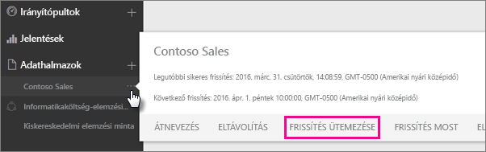
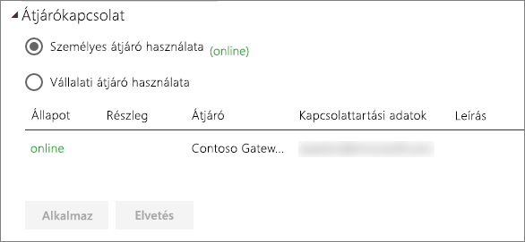
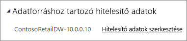
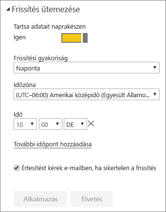

# Ütemezett frissítés beállítása

>[!NOTE]
>Két havi inaktivitás után az adatkészlet ütemezett frissítése szünetel. További információért lásd a [*Frissítés ütemezése*](#schedule-refresh) szakaszt a cikk későbbi részében.
> 
> 

Ha az adatkészlet támogatja a Frissítés most és a Frissítés ütemezése használatával történő ütemezett frissítést, van néhány követelmény és beállítás, amelyek fontosak a sikeres frissítéshez. Ezek az **Átjárókapcsolat**, az **Adatforrás azonosító adatai** és a **Frissítés ütemezése**. Most vizsgáljuk meg közelebbről mindegyiket.

Ez a cikk ismerteti mind a [Power BI Gateway – Personal](personal-gateway.md), mind a [Helyszíni adatátjáró](service-gateway-onprem.md) esetében rendelkezésre álló beállításokat.

Az Frissítés ütemezése képernyőre való váltáshoz tegye a következőt:

1. Kattintson az **Adatkészletek** alatt található egyik adatkészlet melletti **három pontra (...)**.
2. Válassza a **Frissítés ütemezése** lehetőséget.
   
    

## Átjárókapcsolat
Itt eltérő beállításokkal találkozhat, attól függően, hogy az interneten személyes vagy vállalati átjáró érhető-e el.

Ha nem érhető el átjáró, akkor az **Átjáróbeállítások** le vannak tiltva. A személyes átjáró telepítésének módját ismertető üzenet is látható.

Ha rendelkezik beállított személyes átjáróval, és az online állapotú, akkor kiválasztható lesz. Ha nem áll rendelkezésre, akkor offline állapotúként jelenik meg.

A nagyvállalati átjárót is kiválaszthatja, ha az a rendelkezésére áll. Csak akkor fog rendelkezésre álló nagyvállalati átjárót látni, ha a fiókja szerepel az adott átjáróhoz konfigurált adatforrás Felhasználók lapján.

## Adatforráshoz tartozó hitelesítő adatok
### Power BI Gateway – Personal
Ha a személyes átjárót használja az adatok frissítésére, meg kell adnia a háttéradatforráshoz való kapcsolódásra használt hitelesítő adatokat. Ha online szolgáltatásból kapcsolódott egy tartalomcsomaghoz, a kapcsolódáshoz megadott hitelesítő adatokat a rendszer az ütemezett frissítéshez is felhasználja.

Az adatforrásokba csak az első alkalommal kell bejelentkeznie, amikor a frissítési funkciót használja az adatkészleten. Miután megadta a hitelesítő adatokat, azok megőrződnek az adatkészlettel.

> [!NOTE]
> Bizonyos hitelesítési módszereknél, ha az adatforrásba való bejelentkezésre használt jelszó lejár vagy megváltozik, akkor azt az adatforrásnál is meg kel változtatnia az Adatforrás azonosító adataiban.
> 
> 

Ha nem jó mennek a dolgok, a problémát általában az okozza, hogy az átjáró offline állapotú, mert nem tud bejelentkezni a Windowsba és nem tudja elindítani a szolgáltatást, vagy a Power BI nem tud bejelentkezni az adatforrásokba a frissített adatok lekérdezéséhez. Ha nem sikerül a frissítés, ellenőrizze az adatkészlet beállításait. Ha az átjárószolgáltatás offline állapotú, a hibát az Átjáró állapota területen tekintheti meg. Ha a Power BI nem tud bejelentkezni az adatforrásokba, akkor hiba jelenik meg az Adatforrás azonosító adatai területen.

### Helyszíni adatátjáró
Ha a Helyszíni adatátjárót használja az adatok frissítésére, akkor nem kell hitelesítő adatokat megadnia, mert azokat az átjáró rendszergazdája határozta meg az adatforráshoz.

> [!NOTE]
> Ha helyszíni SharePointhoz csatlakozik adatfrissítéshez, a Power BI csak az *Anonim*, az *Alapvető* és a *Windows (NTLM/Kerberos)* hitelesítési módszereket támogatja. A Power BI nem támogatja sem az *ADFS*, sem az *űrlapalapú hitelesítési* módszereket a helyszíni SharePoint-adatforrások adatainak frissítéséhez.
> 
> 

## Frissítés ütemezése
Az ütemezett frissítés szakaszban határozhatja meg az adatkészlet frissítésének gyakoriságát és időszakait. Néhány adatforráshoz nem szükséges átjáró, hogy elérhető legyen konfigurálásra. Másokhoz átjáró szükséges.

A beállítások megadásához a **Tartsa adatait naprakészen** csúszkát az **Igen** értékre kell beállítani.

> [!NOTE]
> A Power BI szolgáltatás az ütemezett frissítési időponthoz képest **15 percen** belül kezdeményezi a frissítést.
> 
> 

> [!NOTE]
> Két havi inaktivitás után az adatkészlet ütemezett frissítése szünetel. Az adatkészlet akkor számít inaktívnak, ha egyetlen felhasználó sem látogatott meg az adatkészleten alapuló egyetlen irányítópultot és jelentést sem. Ekkor az adatkészlet tulajdonosa egy e-mailt kap az ütemezett frissítés szüneteltetéséről, és az adatkészlet frissítési ütemezése **letiltott** állapotúként jelenik meg. Az ütemezett frissítés folytatásához egyszerűen látogasson el bármelyik, az adatkészleten alapuló irányítópultra vagy jelentéshez.
> 
> 

## Mi támogatott?
Bizonyos adatkészletek ütemezett frissítése eltérő átjárók esetében támogatott. Az alábbi referencia alapján megértheti, milyen lehetőségek vannak.

### Power BI Gateway – Personal
**Power BI Desktop**

* A Power BI Desktop Get Data és Query Editor ablakaiban megjelenő összes adatforrás.
* A Power BI Desktop Get Data és Query Editor ablakaiban megjelenő összes helyszíni adatforrás, kivéve a Hadoop-fájlokat (HDFS) és a Microsoft Exchange-t.

**Excel**

> [!NOTE]
> Az Excel 2016-os vagy újabb verziójában a Power Query már a menüszalag Adatok lapfülén található az Adatok beolvasása és átalakítása szakaszban.
> 
> 

* Minden online adatforrás megjelenik az Excelhez készült Microsoft Power Queryben.
* Minden helyszíni adatforrás megjelenik a Power Queryben a Hadoop-fájlokat (HDFS) és a Microsoft Exchange-t kivéve.
* Minden online adatforrás megjelenik a Power Pivotban.\*
* Minden helyszíni adatforrás megjelenik a Power Pivotban a Hadoop-fájlokat (HDFS) és a Microsoft Exchange-t kivéve.

<!-- Refresh Data sources-->
[!INCLUDE [refresh-datasources](./includes/refresh-datasources.md)]

## Hibaelhárítás
Néha az adatok frissítése nem a várt módon történik. Ezt általában egy átjáróval kapcsolatos hiba okozza. Az átjáró-hibaelhárítással kapcsolatos cikkekben találja az eszközöket és az ismert hibákat.

[A Helyszíni adatátjáróval kapcsolatos hibák elhárítása](service-gateway-onprem-tshoot.md)

[A személyes Power BI Gateway hibáinak elhárítása](service-admin-troubleshooting-power-bi-personal-gateway.md)

## Következő lépések
[Adatfrissítés a Power BI-ban](refresh-data.md)  
[Power BI Gateway – Personal](personal-gateway.md)  
[Helyszíni adatátjáró](service-gateway-onprem.md)  
[A Helyszíni adatátjáróval kapcsolatos hibák elhárítása](service-gateway-onprem-tshoot.md)  
[A személyes Power BI Gateway hibáinak elhárítása](service-admin-troubleshooting-power-bi-personal-gateway.md)  

További kérdései vannak? [Kérdezze meg a Power BI közösségét](http://community.powerbi.com/)

