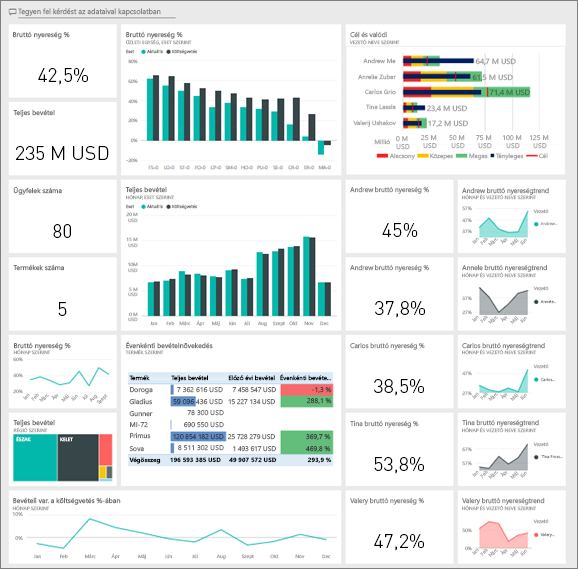
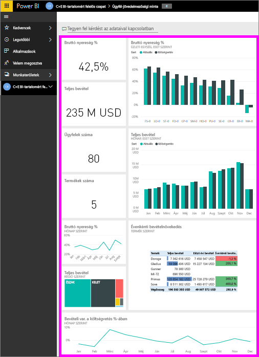
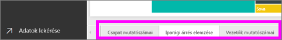
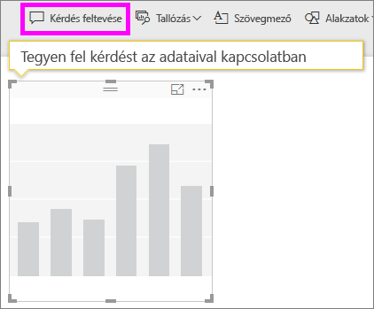
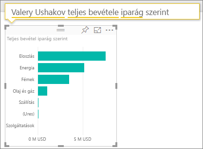
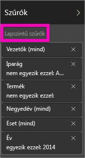
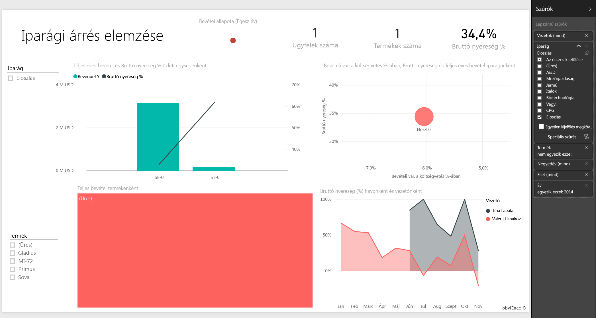
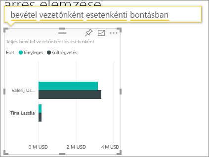

# Ügyfél-jövedelmezőségi minta a Power BI-hoz: bemutató

## Az Ügyfél-jövedelmezőségi minta áttekintése
Az „Ügyfél-jövedelmezőségi minta” nevű csomag egy marketinganyagokat készítő céghez tartozó irányítópultot, jelentést és adatkészletet tartalmaz. Az irányítópult létrehozásával a pénzügyi vezető figyelni tudja az 5 üzleti egység kezelőjéhez (vezetőjéhez), a termékekhez, az ügyfelekhez és a bruttó árréshez tartozó fontosabb metrikákat. A pénzügyi vezető egyetlen pillantással láthatja, hogy mely tényezők vannak hatással a jövedelmezőségre.

Ez a minta abba a sorozatba tartozik, amely a Power BI üzleti jellegű adatokkal, jelentésekkel, és irányítópultokkal történő használatát mutatja be. Az adatok az obviEnce-től ([www.obvience.com](http://www.obvience.com/)) származó valós, de anonimizált adatok. Többféle formátumban is elérhetőek: tartalomcsomagként vagy alkalmazásként, Excel-munkafüzetként és .pbix kiterjesztésű Power BI Desktop-fájlként is. Lásd az [Adatkészletmintákat](sample-datasets.md).

## Előfeltételek
Ha érdekli a megoldás, tartson velünk. Ebben az oktatóanyagban a Power BI szolgáltatást és az Ügyfél-jövedelmezőségi minta tartalomcsomagot használjuk.  Mivel azonban a jelentéssel való munka nagyon hasonló, a Power BI Desktopot is használhatja a PBIX-mintafájllal, hogy követni tudja a bemutatott műveleteket. A tartalomcsomaghoz és a PBIX-fájlhoz való kapcsolódáshoz alább talál útmutatót.

### Tartalomcsomag letöltése ehhez a mintához

1. Nyissa meg a Power BI szolgáltatást (app.powerbi.com), és jelentkezzen be.
2. A bal alsó sarokban válassza az **Adatok lekérése** lehetőséget.

    
3. Ekkor megjelenik az Adatok lekérése lap. Itt kattintson a **Minták** ikonra.

   
4. Válassza ki az **Ügyfél-jövedelmezőségi mintát**, majd válassza a **Kapcsolódás** lehetőséget.  

   
5. A Power BI importálja a tartalomcsomagot, és egy új irányítópultot, jelentést és adatkészletet ad hozzá az aktuális munkaterülethez. Az új tartalmakat sárga csillag jelöli. A mintákkal kipróbálhatja a Power BI funkcióit.  

   

### .pbix-fájl letöltése ehhez a mintához

Lehetőség van a mintát .pbix-fájlként is letölteni, amelyet a Power BI Desktoppal való használatra terveztek.
[Ügyfél-jövedelmezőségi minta](http://download.microsoft.com/download/6/A/9/6A93FD6E-CBA5-40BD-B42E-4DCAE8CDD059/Customer-Profitability-Sample-PBIX.pbix)

### Excel-munkafüzet letöltése ehhez a mintához

Ha a minta adatforrását is szeretné megvizsgálni, használja az [(Excel-munkafüzetként)](http://go.microsoft.com/fwlink/?LinkId=529781) letölthető változatát. A munkafüzet megtekinthető és módosítható Power View-lapokat tartalmaz. A nyers adatokat a **Power Pivot > Kezelés** lehetőségre kattintva nézheti meg.

## Mi olvasható le az irányítópultról?

A **Saját munkaterület** alatt keresse meg az Ügyfél-jövedelmezőségi mintához tartozó irányítópultot:

### Vállalati szintű irányítópult-csempék
1. Nyisson meg az irányítópultot a Power BI szolgáltatásban. Ezek az irányítópult-csempék magas szintű, fontos vállalati metrikák megtekintését teszik lehetővé a pénzügyi vezetőnek.  Amint észrevesz valami érdekeset, a vezető az adott csempére kattintva le tud hatolni a mélyebb adatszintekre.

2. Tekintse át a csempéket az irányítópult bal oldalán.

    

- A cég bruttó árrése 42,5%.
- 80 ügyfélről van szó.
- 5 különböző termék értékesítése történik.
- A legalacsonyabb százalékos, költségvetéshez viszonyított bevételvariancia februárban volt, míg a legmagasabb azt követően márciusban.
- A bevétel nagy része a keleti és az északi régióból származik. A bruttó árrés soha nem haladta meg a költségvetést, bár az ER-0 és az MA-0 további vizsgálatot igényel.
- Az évhez tartozó teljes bevétel megközelíti a költségvetést.

### Vezetőre vonatkozó irányítópult-csempék
Az irányítópult jobb oldalán található csempék a csapat mutatószámait tartalmazzák. A pénzügyi vezetőnek követnie kell a régiós vezetők teljesítményét, és ezek a csempék teszik lehetővé számára a profit magas szintű áttekintését – a százalékos bruttó árrés használatával. Ha a százalékos bruttó árrés trendje váratlan értékeket mutat bármely vezetőhöz kapcsolódóan, a pénzügyi vezető alaposabb vizsgálatot végezhet.

- Carlos kivételével minden vezető meghaladta az értékesítési célkitűzést. Ezzel együtt azonban Carlos tényleges értékesítési adatai a legmagasabbak.
- Annelie százalékos bruttó árrése a legalacsonyabb, de folyamatos növekedés tapasztalható március óta.
- Valery százalékos bruttó árrése jelentősen csökken.
- Andrew pedig ingadozó értékeket produkált az évben.

## Az irányítópult alapjául szolgáló adatok megismerése
Ezen az irányítópulton szerepelnek olyan csempék, amelyek jelentésre vagy Excel-munkafüzetre mutatnak.

### Az Excel Online adatforrás megnyitása
Az irányítópulton szereplő „Target vs Actual” és „Year Over Year Revenue Growth” nevű csempék Excel-munkafüzetből lettek az irányítópultra rögzítve. Ha bármely csempét kiválasztja, a Power BI megnyitja az adatforrást, ami esetünkben az Excel Online.

1. Válassza ki az Excelből rögzített csempék valamelyikét. Ekkor megnyílik az Excel Online a Power BI szolgáltatásban.
2. Figyelje meg, hogy a munkafüzetnek három lapon vannak adatai. Nyissa meg a „Revenue” (Bevétel) lapot.
3. Vizsgáljuk meg, miért nem sikerült Carlosnak elérnie a célkitűzést.  
    a. Az „Executive” (Vezetők) csúszka használatával válassza ki a **Carlos Grilo** tételt.   
    b. Az első kimutatásból megtudhatjuk, hogy Carlos elsődleges termékére, a Primusra vonatkozóan a bevétel 152%-kal csökkent a tavalyi évhez képest. Az Éves változást megjelenítő diagram azt mutatja, hogy Carlos eredménye a legtöbb hónapban a költségvetés alatti.  

    

    

4. Folytassa a böngészést, és ha talál valami érdekeset, a jobb felső sarokban található **Rögzítés**  elemet választva [rögzítheti is egy irányítópultra](service-dashboard-pin-tile-from-excel.md).

5. A böngésző vissza gombját használva térhet vissza az irányítópulthoz.

### Az alapul szolgáló Power BI-jelentés megnyitása
Az Ügyfél-jövedelmezőségi minta irányítópultján található csempék többsége az alapul szolgáló Ügyfél-jövedelmezőségi minta jelentésből lett rögzítve az irányítópulton.

1. A jelentés Olvasó nézetben való megnyitásához válassza ki a csempék egyikét.

2. A jelentés 3 oldalból áll. A jelentés alján látható fülek mindegyike egy-egy oldalt jelöl.

    

    * A „Csapat mutatószámai” az 5 vezető teljesítményére és üzleti mutatóira fókuszál.
    * Az „Iparági árrés elemzése” lehetőséget biztosít a jövedelmezőség elemzésére az egész iparág jelenlegi teljesítményéhez viszonyítva.
    * A „Vezetők mutatószámai” az egyes vezetők teljesítményét mutatják a Cortanában való formázott megjelenítéshez.

### Csapat mutatószámai lap

Nézzük meg két csapattag teljesítményét részletesen, és lássuk, mely adatokba kaphatunk betekintést. A bal oldali szeletelőn Andrew nevének kiválasztásával szűrheti a jelentésoldalt, így csak Andrew adatai jelennek meg.

* A KPI gyors ellenőrzésekor láthatja, hogy Andrew **bevételi állapota** zöld színű. Azaz Andrew jól teljesít.
* A „Százalékos, költségvetéshez viszonyított bevételvariancia hónap szerint” diagram azt mutatja, hogy a februári csökkenést leszámítva Andrew összességében jól teljesít. Domináns területe a keleti régió, 49 ügyfelet kezel, és 5 termékkel foglalkozik (a 7 termékből). A százalékos bruttó árrése nem a legmagasabb, de nem is a legkisebb.
* A „Teljes éves bevétel és a százalékos, költségvetéshez viszonyított bevételvariancia hónap szerint” diagram egyenletes profitot mutat. Azonban, ha az adatokat a **Középső** négyszögre kattintva szűrjük a regionális fatérképen, láthatjuk, hogy Andrew csak márciusban és csak Indianában termelt bevételt. Ez vajon szándékos, vagy alaposabb vizsgálatot igényel?

Most térjünk át Valeryre. A szeletelőn Valery nevének kiválasztásával szűrheti a jelentésoldalt, így csak Valery adatai jelennek meg.  

* Vegye észre, hogy a **Teljes éves bevétel állapota** nevű KPI piros színű. Ez mindenképpen további vizsgálatot igényel.
* A bevételvariancia is aggasztó képet fest – Valery nem teljesíti a bevételi árrés követelményeit.
* Valery csak 9 ügyféllel rendelkezik, mindössze 2 terméket kezel, és szinte kizárólag északi ügyfelekkel foglalkozik. Ez a specializáció magyarázhatja a metrikákban tapasztalható túlzott ingadozást.
* Az **Észak** négyszög kiválasztásával a fatérképen látható, hogy Valery bruttó árrése az északi régióban összhangban van az általános árrésre vonatkozó teljesítménnyel.
* Az egyéb **régiós** négyszögeket kiválasztva érdekes történet bontakozik ki: a százalékos bruttó árrés 23% és 79% között ingadozik, és a bevételi számok az északi régiót kivéve rendkívül szezonálisak.

A feltárás folytatásával kideríthető, hogy Valery régiója miért is nem teljesít jól. Nézze meg a régiókat, a többi üzleti egységet, valamint a jelentés következő lapját – az „Iparági árrés elemzése” lapot.

### Iparági árrés elemzése
Ez a jelentéslap az adatok egy másik szeletét mutatja meg. A teljes iparág bruttó árrését vizsgálja szegmens szerinti bontásban. A pénzügyi vezető ezt a lapot használva hasonlíthatja össze a cég és az üzleti egységek metrikáit az iparági metrikákkal, és mindez segít megmagyarázni a különböző trendeket és a jövedelmezőséget. Talán furcsa, hogy a csapat-specifikus „Bruttó árrés hónap és vezetőnév szerint” területi diagram szerepel ezen a lapon. Viszont lehetővé teszi a lap szűrését az üzleti egységek vezetői szerint.  

Hogyan változik a jövedelmezőség az iparágban? Hogyan oszlanak meg a termékek és az ügyfelek iparági bontásban? Válasszon legalább egy iparágat a bal felső sarokban. (A fogyasztási cikkek iparágától kezdve) A szűrő törléséhez használja a radír ikont.

A buborékdiagramon a pénzügyi vezető a legnagyobb buborékokat keresheti meg, hiszen ezek befolyásolják a legnagyobb mértékben a bevételt. Ha a területi diagramon a vezetők nevére kattintva szűri a lapot, egyszerűen tekintheti meg az egyes vezetők teljesítményét iparági szegmens szerint.

* Andrew teljesítménye több különböző iparági szegmensben érzékelhető a jelentősen eltérő százalékos bruttó árrésnek (elsősorban a pozitív oldalon) és a százalékos varianciának köszönhetően.
* Annelie diagramja hasonló, azzal a különbséggel, hogy ő csak pár iparági szegmensre koncentrál (a szövetségi szegmensre és a Gladius nevű termékre fókuszálva).
* Carlos egyértelműen a szolgáltatási szegmensre koncentrál, és szép profitot termel. Nagy mértékben növelte a százalékos varianciát a high-tech szektorban, és egy számára új szegmensben (ipar) rendkívül jó teljesítményt ért el a költségvetéshez viszonyítva.
* Tina több szegmensre koncentrál, és ő rendelkezik a legmagasabb százalékos bruttó árréssel, de a buborékok jellemzően kis mérete azt mutatja, hogy a cég profitjára gyakorolt hatása minimális.
* Valery, aki csak egy termékért felel, mindössze 5 iparági szegmensre koncentrál. Az iparági befolyása szezonális, de mivel mindig nagy méretű buborékokat hoz létre, jelentős hatást gyakorol a cég profitjára. Magyarázható az iparággal a csökkenő teljesítmény?

### Vezetők mutatószámai
Ez a lap Cortana-válaszkártya formátumú. További információ: [Cortana-válaszkártyák létrehozása](service-cortana-answer-cards.md)

## Részletes adatfeltárás Q&A-kérdések feltevésével
Az elemzéshez hasznos lenne megállapítani, hogy mely iparág termeli a legtöbb bevételt Valerynek. Használjuk a Q&A-t.

1. Nyissa meg a jelentést szerkesztési nézetben a **Jelentés szerkesztése** lehetőséget választva. A Szerkesztési nézet csak akkor érhető el, ha Ön a jelentés tulajdonosa, vagy más néven **létrehozója**. Ha azonban a jelentést megosztották Önnel, akkor nem nyithatja meg Szerkesztési nézetben.

2.  A Q&A kérdésmező megnyitásához a felső menüsávban válassza a **Kérdés feltevése** lehetőséget.

    

3. Írja be a következőt: **Valery teljes bevétele iparág szerint**. Figyelje meg, ahogy a vizualizáció frissül, miközben beírja a kérdést.

    

   A forgalmazás képviseli Valery legnagyobb bevételi területét.

### Részletes feltárás szűrők hozzáadásával
Vessen egy pillantást a *Forgalmazás* iparágra.  

1. Nyissa meg az „Iparági árrés elemzése” jelentésoldalt.
2. Anélkül, hogy bármilyen vizualizációt kijelölne a jelentéslapon, bontsa ki a jobb oldalon lévő Szűrő ablaktáblát (ha az még nincs kibontva). A Szűrők ablaktáblán csak lapszintű szűrők láthatók.  

   
3. Keresse meg az **Iparág** szűrőt, és a nyíl kiválasztásával bontsa ki a listát. Adjon hozzá egy lapszűrőt a Forgalmazás iparághoz. Először törölje az összes kijelölést **Az összes kijelölése** jelölőnégyzet bejelölésének törlésével. Majd válassza a **Forgalmazás** elemet.  

   
4. A „Bruttó árrés hónap és vezető neve szerint" területdiagramon az látható, hogy csak Valery és Tina rendelkezik ügyféllel ebben az iparágban, és csak Valery foglalkozott ezzel az iparággal júniustól novemberig.   
5. Válassza ki **Tina** és  **Valery** nevét a „Bruttó árrés hónap és vezető neve szerint" területdiagram jelmagyarázatában. Figyelje meg, hogy Tina teljesítménye a „Teljes bevétel termék szerint” diagram adatai alapján meglehetősen kicsi Valery teljesítményéhez képest.
6. Ha a tényleges bevételt szeretné megtekinteni, a Q&A használatával kérdezzen rá a következőre: **teljes forgalmi bevétel környezet és vezető szerint**.  

     

    Hasonlóan lehet megvizsgálni más iparágakat, és akár az ügyfelek vizualizációhoz való hozzáadásával is feltárhatók a Valery teljesítménye mögötti okok.

Ebben a környezetben nyugodtan kísérletezhet. Bármikor dönthet úgy, hogy nem menti a változtatásokat. De ha mégis mentené őket, bármikor lekérheti a minta egy új másolatát az **Adatok lekérése** lehetőséggel.

Letöltheti [kizárólag a minta adatkészletét (Excel-munkafüzetét) is](http://go.microsoft.com/fwlink/?LinkId=529781).

## Következő lépések: Kapcsolódás a saját adatokhoz
Reméljük, hogy ez a bemutató segített megérteni a Power BI-irányítópultok, a Q&A és a jelentések segítségével történő ügyféladat-elemzést. Most Önön a sor – kapcsolódjon a saját adataihoz. A Power BI használatával számos különböző adatforráshoz kapcsolódhat. További információ a [Power BI használatának első lépéseiről](service-get-started.md).

[Vissza a Power BI-mintákhoz](sample-datasets.md)  
