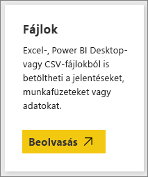
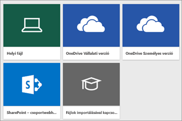
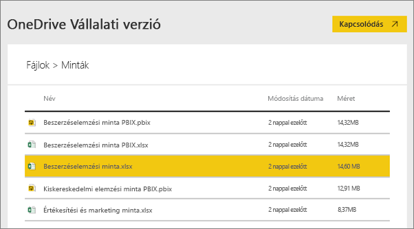
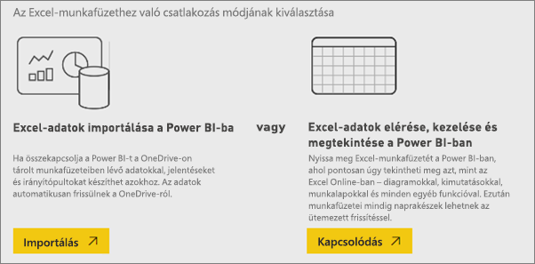
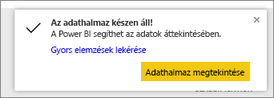
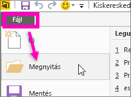

# Milyen mintaadatok használhatók a Power BI-ban?
Tegyük fel, hogy kezdő felhasználó a Power BI-ban, és egyelőre adatok nélkül szeretné kipróbálni.  Vagy már van egy adatkészlete, de mivel (még) nem ismeri a Power BI működését, aggódik, hogy valahogy kárt tesz az adatkészletben.

Aggodalomra semmi ok! Az obviEnce ([www.obvience.com](http://www.obvience.com/)) és a Microsoft jóvoltából több mintát is kipróbálhat, amíg jobban meg nem ismeri a Power BI-t.  Az adatok névtelenek, és különböző szektorokhoz tartoznak: pénzügy, HR, értékesítés és egyebek. Az online dokumentáció olvasásakor olyan oktatóanyagokkal és példákkal találkozhat, amelyek ezeket a mintákat használják, így mindig követheti őket.      

   

Ezek a minták több formátumban is elérhetők: tartalomcsomagként, különálló Excel-munkafüzetként és .pbix-fájlként is. Ha nem tudja, ezek mik, vagy hogyan veheti őket használatba, ne aggódjon. A cikk későbbi szakaszaiban ezekre is kitérünk. Minden mintához készítettünk egy *bemutatót*, amely egy olyan cikkfajta, amely a minta hátterét ismerteti, és különböző forgatókönyveken vezeti Önt végig. Ilyen forgatókönyv lehet például a felettesi kérdésekre való válaszadás, a versenyképes elemzések keresése, a megosztható jelentések és irányítópultok létrehozása vagy egy üzleti váltás megmagyarázása.   

Azonban mielőtt belekezdenénk, olvassa el a minták használatáról szóló alábbi jogi útmutatót. Ezt követően bemutatjuk a mintákat, illetve azok használatát.   

## A Power BI Excel-mintamunkafüzeteinek használati útmutatója
A Power BI-minták használata előtt, kérjük, olvassa el az alábbi tudnivalókat.

©2015 Microsoft Corporation. Minden jog fenntartva. A dokumentumok és munkafüzetek az adott állapotban érhetők el. A munkafüzetekben megjelenő adatokat és nézeteket, beleértve az URL-címeket és egyéb internetes webhelyhivatkozásokat, értesítés nélkül módosíthatjuk. Ezeket csak saját felelősségre használhatja. Egyes példák csak szemléltető céllal jelennek meg, és nem valódi esetek. Szándékos vagy következtetett kapcsolattal nem rendelkeznek a valósággal. A Microsoft nem vállal kifejezett vagy törvényi garanciát az itt megjelenő információért.

A munkafüzetek nem ruházzák fel Önt semmilyen joggal a Microsoft-termékekben szereplő szellemi tulajdon felett. A munkafüzetet csak hivatkozási céllal, belső használatra kaphatja meg, és csak ilyen céllal készíthet róla másolatot.

A munkafüzeteket és a kapcsolódó adatokat az obviEnce szolgáltatja. [www.obvience.com](http://www.obvience.com)

Az obviEnce egy független szoftverszállító és szellemitulajdon-inkubátor, amely a Microsoft üzleti intelligenciájával foglalkozik. A cég szorosan együttműködik a Microsofttal az ajánlott eljárások kidolgozásában és a Microsoft üzletiintelligencia-megoldásainak kreatív tervezésében, fejlesztésében és üzembe helyezésében.

A munkafüzetek és azok adatai az obviEnce LLC tulajdonát képezik, és kizárólag a Power BI iparági mintaadatokkal használható funkcióinak bemutatására szolgálnak.

A munkafüzetek és/vagy azok adatainak használata csak a fenti esetre terjedhet ki (amely minden munkafüzet Info munkalapján is megtalálható). A munkafüzetet és minden vizualizációt az alábbi szerzői jogi nyilatkozattal kell ellátni: obviEnce ©.

A lenti hivatkozások bármelyikére kattintva és az Excel-munkafüzeteket vagy a .pbix-fájlokat letöltve elfogadja az itt ismertetett feltételeket.

## Rendelkezésre álló minták
Nyolc különböző mintát használhat.  Mindegyik egy-egy szektorhoz kapcsolódik.

### Ügyfél-jövedelmezőségi minta  
[Ügyfél-jövedelmezőségi minta: bemutató](sample-customer-profitability.md)

Ez az iparági minta egy pénzügyi igazgató az igazgatókra, termékekre és ügyfelekre vonatkozó fő mérőszámait elemzi. Segítségével megvizsgálhatja, hogy milyen tényezők befolyásolják a cég jövedelmezőségét.

### Emberi erőforrások minta  
[Emberi erőforrások minta: bemutató](sample-human-resources.md)

Ez az iparági minta egy cég felvételi stratégiájával foglalkozik, és az újonnan felvett, az aktív és a már máshol dolgozó alkalmazottakat elemzi.  Az adatok elemzésével trendeket azonosíthat a távozásokra és a felvételi stratégia esetleges előítéleteire nézve.

### Informatikaköltség-elemzési minta 
[Informatikaköltség-elemzési minta: bemutató](sample-it-spend.md)

Ez az iparági minta egy cég informatikai részlegének tervezett és valós kiadásait hasonlítja össze. Ez az összevetés segít kimutatni, hogy milyen pontosan tervezte a cég az idei évet, és segít feltárni a tervtől jelentősen eltérő területeket. A példában szereplő cég egy éves tervezési cikluson halad végig, és minden negyedévben elkészíti a legfrissebb becslést a pénzügyi év informatikai költségeinek elemzéséhez.

### Lehetőségelemzési minta  
[Lehetőségelemzési minta: bemutató](sample-opportunity-analysis.md)

Ez az iparági minta egy szoftvercég értékesítési csatornáit elemzi. Az értékesítési vezetők régiók, az ügylet mérete és a csatorna alapján követik a lehetőségeket és figyelik a közvetlen és a partneri értékesítési csatornákat.

### Beszerzéselemzési minta  
[Beszerzéselemzési minta: bemutató](sample-procurement.md)

Ez az iparági minta egy pénzügyi igazgató az igazgatókra, termékekre és ügyfelekre vonatkozó fő mérőszámait elemzi. Segítségével megvizsgálhatja, hogy milyen tényezők befolyásolják a cég jövedelmezőségét.

### Kiskereskedelmi elemzési minta  
[Kiskereskedelmi elemzési mintaa: bemutató](sample-retail-analysis.md)

Ez az iparági minta a több üzletben és körzetben értékesített cikkek kiskereskedelmi értékesítési adatait elemzi. A mérőszámok a folyó év teljesítményét vetik össze a tavalyival a következő területeken: értékesítés, egységek, bruttó nyereség, eltérés, új üzletek elemzett adatai.

### Értékesítési és marketing minta  
[Értékesítési és marketing minta: bemutató](sample-sales-and-marketing.md)

Ez az iparági minta egy gyártással foglalkozó céget, a VanArsdel kft.-t elemzi. Segítségével a marketingigazgató megfigyelheti az iparágat és a VanArsdel piaci részesedését.  A minta elemzésével megismerheti a cég piaci részesedését, értékesítési adatait és a vele kapcsolatos véleményeket.

### Szállítói minőségi minta  
[Szállítói minőségi minta: bemutató](sample-supplier-quality.md)

Ez az iparági minta az ellátási láncok egyik tipikus problémájára, a szállítók minőségelemzésére helyezi a hangsúlyt. Az elemzésben két fő mérőszám játszik szerepet: a hibák összesített száma és a hibák által okozott összesített állásidő. A mintának két fő célja van: feltárni, hogy a minőséget tekintve kik a legjobb és legrosszabb szállítók, és azonosítani, hogy mely üzemek végzik jobban a hibák feltárását és elutasítását, hogy minimalizálják az állásidőt.

Most már ismeri a választási lehetőségeket. Ideje megismerni a minták beszerzésének módját is.  

## A minták beszerzése
Ahogyan fent olvashatta, a minták több formátumban elérhetők: tartalomcsomagként, Excel-munkafüzetként és .pbix-fájlként. Ezeket egyesével ismertetjük, a tartalomcsomagokkal kezdve.

## Power BI-minták tartalomcsomagként
A tartalomcsomag az egyetlen olyan mintaformátum, amely a Power BI szolgáltatáson belül elérhető, és nem máshonnan kell beszerezni. A tartalomcsomagok alapvetően egy vagy több irányítópultból, adatkészletből és jelentésből álló csomagok, amelyeket felhasználók hoznak létre, és a Power BI-ban használhatók. A tartalomcsomagokat általában munkatársakkal osztják meg. Mindegyik Power BI-beli minta-tartalomcsomag tartalmaz egy adatkészletet, egy jelentést és egy irányítópultot.  A tartalomcsomagok a Power BI Desktopban nem érhetők el. További információ a tartalomcsomagokról: [A Power BI tartalomcsomagjai – bevezetés](service-organizational-content-pack-introduction.md).

### Minta-tartalomcsomag beszerzése és megnyitása a Power BI szolgáltatásban
1. Nyissa meg a Power BI-t (app.powerbi.com), és jelentkezzen be.
2. A bal alsó sarokban válassza az **Adatok lekérése** lehetőséget.

    
3. Ekkor megjelenik az Adatok lekérése lap. Itt kattintson a **Minták** ikonra.

   
4. Válasszon egy mintát. Ekkor megjelenik a minta leírása. Kattintson a **Csatlakozás** lehetőségre.  

   
5. A Power BI importálja a tartalomcsomagot, és egy új irányítópultot, jelentést és adatkészletet ad hozzá az aktuális munkaterülethez. Az új tartalmakat sárga csillag jelöli. A mintákkal kipróbálhatja a Power BI funkcióit.  

   

Az új adatokkal már nyugodtan dolgozhat.  Próbálja ki az oktatóanyagaink lépéseit a minta-tartalomcsomagokkal, vagy csak nyissa meg a Power BI-t, és fedezze fel a funkciókat.

## Power BI-minták Excel-fájlként
A minta-tartalomcsomagok Excel-munkafüzetként is elérhetők. Az Excel-munkafüzeteket a Power BI-hoz alakítottuk ki.  

1. A fájlokat egyenként letöltheti az alábbi hivatkozásokról, vagy [egyszerre, egy ZIP-fájlban](http://go.microsoft.com/fwlink/?LinkId=535020). Ha már tapasztalt felhasználó, célszerű letöltenie az Excel-munkafüzeteket és felfedezni vagy szerkeszteni az adatmodelleket.

   * [Kiskereskedelmi elemzési minta](http://go.microsoft.com/fwlink/?LinkId=529778)
   * [Szállítói minőségelemzési minta](http://go.microsoft.com/fwlink/?LinkId=529779)
   * [Emberi erőforrások minta](http://go.microsoft.com/fwlink/?LinkId=529780)
   * [Ügyfél-jövedelmezőségi minta](http://go.microsoft.com/fwlink/?LinkId=529781)
   * [Lehetőségkövetési minta](http://go.microsoft.com/fwlink/?LinkId=529782)
   * [Informatikaköltség-elemzési minta](http://go.microsoft.com/fwlink/?LinkId=529783)
   * [Beszerzéselemzési minta](http://go.microsoft.com/fwlink/?LinkId=529784)
   * [Értékesítési és marketing minta](http://go.microsoft.com/fwlink/?LinkId=529785)
2. Mentse a letöltött fájlt. Fontos, hogy hova menti a fájlt.

   *   **Helyi meghajtó** – Ha a fájlt a saját számítógépére vagy a cég valamilyen más helyére mentette, a Power BI-ból importálhatja a fájlt Power BI-ba. Mivel a fájl ténylegesen a helyi meghajtón marad, a teljes fájl valójában nem kerül a Power BI-ba. Valójában az történik, hogy létrejön egy új adatkészlet az Ön Power BI-webhelyén, a rendszer pedig betölti abba az adatokat és – olykor – az adatmodellt. Ha a fájlban jelentések is találhatók, azok a Power BI-webhelyen, a Jelentések között fognak megjelenni.
   *  **OneDrive – Vállalati verzió** – Ha OneDrive Vállalati verzióval rendelkezik, és a Power BI-hoz is használt fiókkal jelentkezik be oda, akkor a leghatékonyabb megoldást választja ahhoz, hogy a Power BI Desktop- vagy a .CSV-fájl, az adatbázis, a jelentések és az irányítópultok szinkronban maradjanak a Power BI-ban. Mivel a Power BI és a OneDrive egyaránt a felhőben található, a Power BI nagyjából óránként kapcsolódik a OneDrive-on található fájlhoz. Ha bármilyen változást érzékel, az adatkészlet, a jelentések és az irányítópultok automatikusan frissülnek a Power BI-ban.
   *  **OneDrive – Személyes verzió** – A OneDrive Vállalati verzió számos előnyét akkor is élvezheti, ha fájljait a saját OneDrive-fiókjába menti. A legnagyobb különbség az, hogy amikor a fájlt először csatlakoztatja (az Adatok lekérése > Fájlok > OneDrive személyes verzió paranccsal), akkor a Microsoft-fiókjával kell a OneDrive-ba jelentkeznie, és ez általában eltér attól a fióktól, amelyet a Power BI-ba való belépéshez használ. Amikor a Microsoft-fiókjával jelentkezik be a OneDrive-ba, mindenképp jelölje be a Bejelentkezve szeretnék maradni lehetőséget. Így a Power BI képes lesz nagyjából óránként kapcsolódni a fájlhoz, és gondoskodni róla, hogy a Power BI-ban lévő adatkészlet szinkronban legyen.
   *  **SharePoint-csoportwebhelyek** – A Power BI-ban lévő fájloknak a SharePoint-csoportwebhelyekre történő mentése nagyjából ugyanúgy zajlik, mint a OneDrive Vállalati verzió esetében. A legnagyobb különbség a Power BI és a fájl csatlakoztatásának módja. Ehhez megadhat egy URL-címet, vagy csatlakozhat a gyökérmappához.
3. Nyissa meg a Power BI-t (app.powerbi.com), és jelentkezzen be.

   > [!TIP]
   > Ezen a ponton célszerű létrehozni egy új irányítópultot, és az importálni kívánt fájl után elnevezni.  Ellenkező esetben amikor importálja az Excel-adatkészletet, a Power BI nem hoz létre egy új, a minta után elnevezett irányítópultot, hanem egy csempét ad az aktuálisan megnyitott irányítópulthoz. A csempére kattintva megnyithatja az adatkészlet jelentését. Ez nem nagy probléma, mivel később bármikor létrehozhat egy új irányítópultot, de ha egy új irányítópulttal kezdi a munkát, azzal átugorhat néhány lépést.
   >
   >
4. A bal alsó sarokban válassza az **Adatok lekérése** lehetőséget.

    
5. Ekkor megjelenik az Adatok lekérése lap. Itt válassza a **Fájlok > Lekérés** lehetőséget.

     
6. Nyissa meg a letöltött minta helyét.

   
7. Jelölje ki a OneDrive Vállalati verzióra mentett fájlt (ebben az esetben a **Beszerzéselemzés.xlsx-t**), majd válassza a **Csatlakozás** lehetőséget.

   
8. Döntse el, hogy importálni szeretné az adatokat, vagy inkább megnyitná a munkafüzetet a Power BI-ban, és megtekintené úgy, ahogy az az Excel Online-ban szerepel.

    
9. Ha az **Importálás** lehetőséget választja, a Power BI importálja a minta-munkafüzetet, és egy új adatkészletként adja hozzá, amelyet **Beszerzéselemzési mintának** nevez el.  Ha a munkafüzet tartalmaz Power View-lapokat, -táblákat, -tartományokat vagy egy adatmodellt, a Power BI egy azonos nevű jelentést is létrehoz. Ha pedig még nincs megnyitva irányítópult, a Power BI létrehoz egy újat. (Ha már megnyitott egy irányítópultot, mielőtt az **Adatok lekérése** lehetőséget választotta, egy üres csempe jelenik meg rajta.  A csempére kattintva az imént hozzáadott adatkészlet jelentésére léphet). Az új tartalom neve megegyezik a minta nevével, a program pedig egy sárga csillaggal jelöli.
10. Amikor megjelenik **Az adatkészlet készen áll.** képernyő, válassza az **Adatkészlet megtekintése** vagy a **Gyors elemzések lekérése** lehetőséget, vagy a Power BI bal oldali navigációs sávján keresse és nyissa meg a társított jelentést vagy irányítópultot.  

     

### (Nem kötelező) Az Excel-minták megtekintése magában az Excelben
Szeretné tudni, hogyan alakulnak át az Excel-munkafüzet adatai Power BI-adatkészletekké és -jelentésekké? Ha megnyitja a mintákat az ***Excelben***, és végignézi a munkalapokat, megértheti a konvertálás működését.

* Amikor először nyit meg egy minta-munkafüzetet az Excelben, két figyelmeztetés jelenhet meg. Az első tudatja Önnel, hogy a munkafüzet védett nézetben van. Kattintson a **Szerkesztés engedélyezése** lehetőségre. A második tudatja Önnel, hogy a munkafüzet külső adatkapcsolatokkal rendelkezik. Válassza a **Tartalom engedélyezése** lehetőséget.
* Minden munkafüzet több munkalapot tartalmaz. Mivel ezek az Excel-minták mind legalább egy, vizualizációkkal ellátott Power View-lapot tartalmaznak, az Excel-fájlok a Power BI-ba való importálásakor egy adatkészlet **és** egy jelentés is létrejön.

   Előfordulhat, hogy [engedélyeznie kell a Power View bővítményt](https://support.office.com/article/Create-a-Power-View-sheet-in-Excel-2013-B23D768D-7586-47FE-97BD-89B80967A405#__toc328591957).
* Hol vannak a tényleges adatok? A Power Pivot-adatmodellben. Az adatok megtekintéséhez a **PowerPivot** lapon válassza az **Adatmodell kezelése** lehetőséget.

    Nem látja a PowerPivot lapot? [Engedélyezze a Power Pivot bővítményt](https://support.office.com/article/Start-Power-Pivot-in-Microsoft-Excel-2013-add-in-A891A66D-36E3-43FC-81E8-FC4798F39EA8).
* Az Info lapon a minta készítőjéről, az obviEnce-ről találhat információkat.

## Power BI-minták .pbix-fájlként
A minta-tartalomcsomagok .pbix-fájlként is elérhetők. A .pbix-fájlok a Power BI Desktop szolgáltatáshoz lettek kialakítva.  

1. A fájlokat letöltheti az alábbi hivatkozásokkal.

   * [Kiskereskedelmi elemzési minta](http://download.microsoft.com/download/9/6/D/96DDC2FF-2568-491D-AAFA-AFDD6F763AE3/Retail-Analysis-Sample-PBIX.pbix)
   * [Szállítói minőségelemzési minta](http://download.microsoft.com/download/8/C/6/8C661638-C102-4C04-992E-9EA56A5D319B/Supplier-Quality-Analysis-Sample-PBIX.pbix)
   * [Emberi erőforrások minta](http://download.microsoft.com/download/6/9/5/69503155-05A5-483E-829A-F7B5F3DD5D27/Human-Resources-Sample-PBIX.pbix)
   * [Ügyfél-jövedelmezőségi minta](http://download.microsoft.com/download/6/A/9/6A93FD6E-CBA5-40BD-B42E-4DCAE8CDD059/Customer-Profitability-Sample-PBIX.pbix)
   * [Lehetőségkövetési minta](http://download.microsoft.com/download/9/1/5/915ABCFA-7125-4D85-A7BD-05645BD95BD8/Opportunity-Analysis-Sample-PBIX.pbix)
   * [Informatikaköltség-elemzési minta](http://download.microsoft.com/download/E/9/8/E98CEB6D-CEBB-41CF-BA2B-1A1D61B27D87/IT-Spend-Analysis-Sample-PBIX.pbix)
   * [Beszerzéselemzési minta](http://download.microsoft.com/download/D/5/3/D5390069-F723-413B-8D27-5888500516EB/Procurement-Analysis-Sample-PBIX.pbix)
   * [Értékesítési és marketing minta](http://download.microsoft.com/download/9/7/6/9767913A-29DB-40CF-8944-9AC2BC940C53/Sales-and-Marketing-Sample-PBIX.pbix)
2. Mentse a letöltött fájlt.
3. A Desktopban válassza a **Fájl > Megnyitás** lehetőséget, majd navigáljon arra a helyre, ahova a .pbix-mintafájlt mentette.

   
4. A megnyitáshoz kattintson a .pbix-fájlra.

## További lépések
[A Power BI alapvető fogalmai](service-basic-concepts.md)

[Oktatóanyag: Csatlakozás a Power BI-mintákhoz](sample-tutorial-connect-to-the-samples.md)

[Adatforrások a Power BI-ban](service-get-data.md)

További kérdései vannak? [Kérdezze meg a Power BI közösségét](http://community.powerbi.com/)
