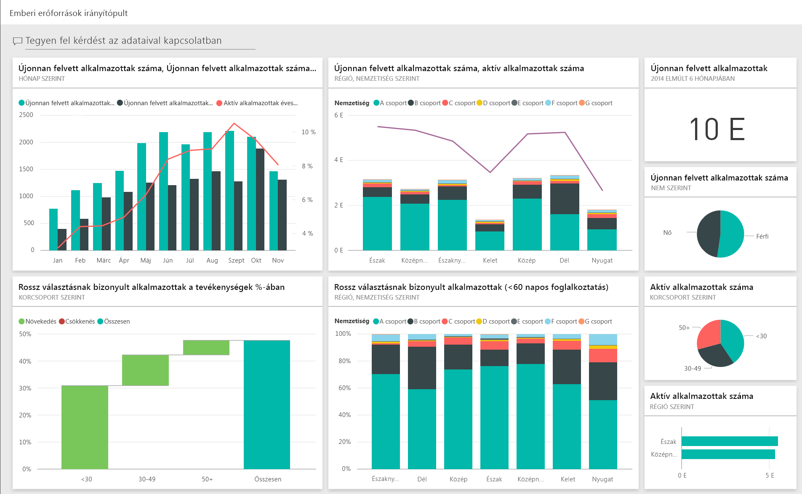
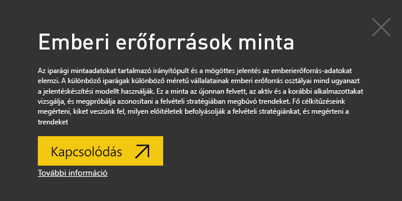
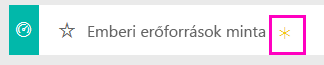
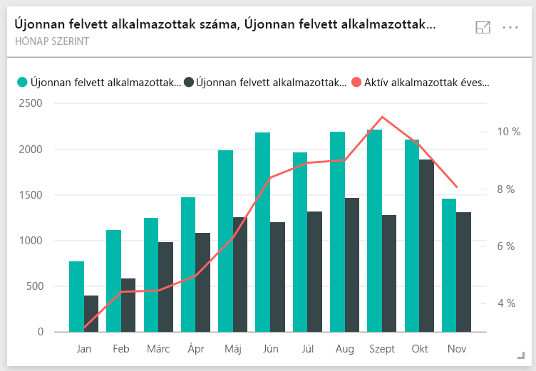
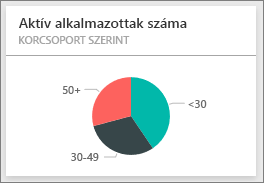
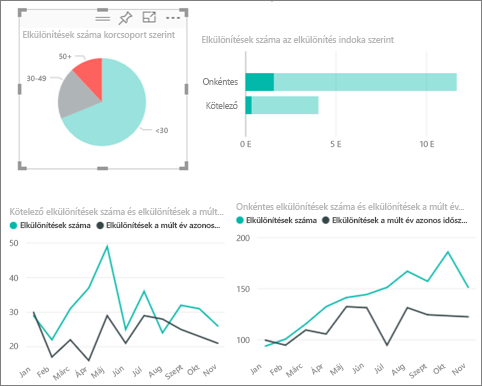
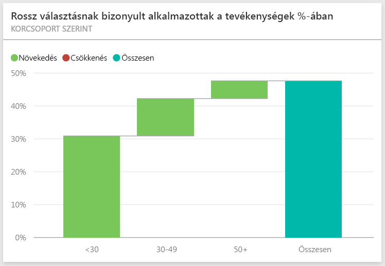
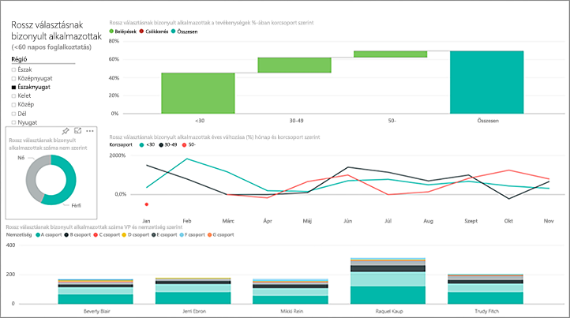
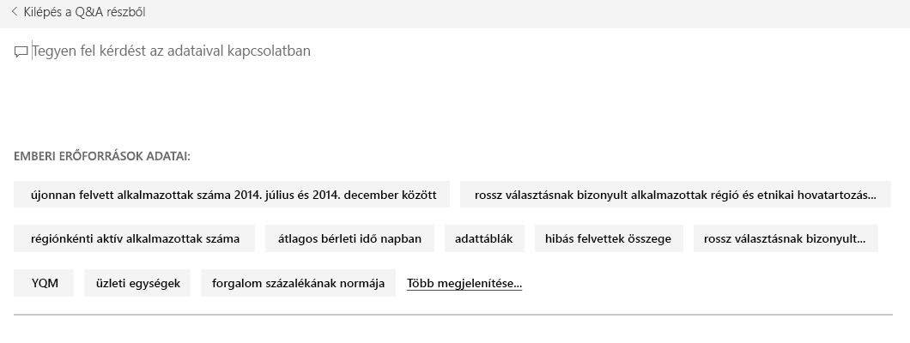
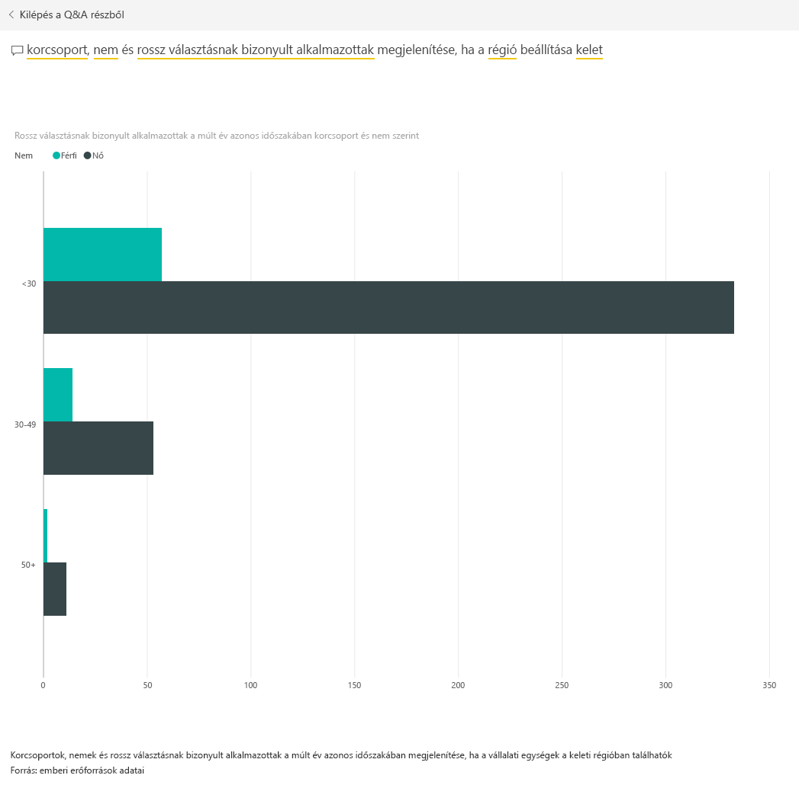

# Emberi erőforrások minta a Power BI-hoz: bemutató

## Az Emberi erőforrások minta áttekintése
A különböző iparágak különböző méretű vállalatainak emberi erőforrás osztályai mind ugyanazt a jelentéskészítési modellt használják. Ez a minta az újonnan felvett, az aktív és a korábbi alkalmazottakat vizsgálja, és megpróbálja azonosítani a felvételi stratégiában megbúvó trendeket. A fő célkitűzésünk, hogy megismerjük:

* Kiket veszünk fel
* Milyen előítéletek befolyásolják a felvételi stratégiánkat
* Milyen trendeket mutatnak a távozások

Ez a minta egy olyan sorozat részét képezi, amely bemutatja, hogyan használhatja a Power BI-t üzleti adatokkal, jelentésekkel és irányítópultokkal. Az adatok az obviEnce-től ([www.obvience.com](http://www.obvience.com/)) származó valós, de anonimizált adatok. Többféle formátumban is elérhetőek: tartalomcsomagként vagy alkalmazásként, Excel-munkafüzetként és .pbix kiterjesztésű Power BI Desktop-fájlként is. További információt a [Mintaadatkészletek](sample-datasets.md) című témakörben talál.

## Előfeltételek

 Használat előtt a mintát tartalomcsomagként, .pbix-fájlként vagy Excel-munkafüzetként le kell töltenie.

### Tartalomcsomag letöltése ehhez a mintához

1. Nyissa meg a Power BI szolgáltatást (app.powerbi.com), és jelentkezzen be.
2. A bal alsó sarokban válassza az **Adatok lekérése** lehetőséget.
   
    
3. Ekkor megjelenik az Adatok lekérése lap. Itt kattintson a **Minták** ikonra.
   
   
4. Válassza ki az **Emberi erőforrások mintát**, majd válassza a **Kapcsolódás** lehetőséget.  
   
   
5. A Power BI importálja a tartalomcsomagot, és egy új irányítópultot, jelentést és adatkészletet ad hozzá az aktuális munkaterülethez. Az új tartalmakat sárga csillag jelöli. 
   
   
  
### .pbix-fájl letöltése ehhez a mintához

Lehetőség van a mintát .pbix-fájlként is letölteni, amelyet a Power BI Desktoppal való használatra terveztek. 

 * [Emberi erőforrások minta](http://download.microsoft.com/download/6/9/5/69503155-05A5-483E-829A-F7B5F3DD5D27/Human Resources Sample PBIX.pbix)

### Excel-munkafüzet letöltése ehhez a mintához
Letöltheti [kizárólag a minta adatkészletét (Excel-munkafüzetét) is](http://go.microsoft.com/fwlink/?LinkId=529780). A munkafüzet megtekinthető és módosítható Power View-lapokat tartalmaz. A nyers adatokat a **Power Pivot > Kezelés** lehetőségre kattintva nézheti meg.

## Újonnan felvett alkalmazottak
Elsőként vizsgáljuk meg az újonnan felvett alkalmazottakat.

1. A munkaterületén válassza az **Irányítópultok** lapot, és nyissa meg a Human Resources (Emberi erőforrások) irányítópultot.
2. Az irányítópulton válassza a **New Hire Count, New Hires Same Period Last Year, Actives YoY % Change** **By Month** (Újonnan felvett alkalmazottak száma, Újonnan felvett alkalmazottak száma a tavalyi év megegyező időszakában, Aktív alkalmazottak éves változása %-ban, hónapok szerint) csempét.  
     

   Ekkor megnyílik a „Human Resources Sample” jelentés **New Hires** (Újonnan felvett alkalmazottak) nevű oldala.  

   

A következőket figyelheti meg:

* A **New Hire Count, New Hires SPLY és Actives YoY % Change, kategória: Month** (Újonnan felvett alkalmazottak száma, Újonnan felvett alkalmazottak a tavalyi év megegyező időszakában és Aktív alkalmazottak éves változása %-ban, hónapok szerint) kombinált diagram szerint az idei év minden hónapjában több alkalmazottat vettünk fel, mint a tavalyi év adott hónapjaiban, és ez a különbség bizonyos hónapokban jelentős mértékű.
* A **New Hire Count és Active Employee Count, kategória: Region és Ethnicity** (Újonnan felvett alkalmazottak száma és Aktív alkalmazottak száma régiók és nemzetiségek szerint) kombinált diagramon az látható, hogy az **East** (Keleti) régióban kevesebb embert veszünk fel.
* A **New Hires YoY Var, kategória Age Group** (Újonnan felvett alkalmazottak éves változása korcsoportok szerint) vízesésdiagramon látható, hogy többnyire fiatalabb embereket veszünk fel. Ez valószínűleg annak tudható be, hogy a munkák többnyire nap közben végezhetők.
* A **New Hire Count, kategória: Gender** (Újonnan felvett alkalmazottak száma nemek szerint) tortadiagramon egy kiegyenlített arányt láthatunk.

Talál további elemzéseket is, például hogy melyik az a régió, amelyben a nemek aránya nem ennyire kiegyenlített? Válasszon ki különböző korcsoportokat és neveket, hogy feltárhassa a korok, nemek, régiók és nemzetiségek közötti kapcsolatokat.

A felső navigációs sávon válassza az irányítópult nevét, hogy visszatérjen az irányítópultra.

## Aktív és korábbi alkalmazottak összehasonlítása
Vizsgáljuk meg a vállalat jelenlegi és korábbi alkalmazottainak adatait.

Az irányítópulton válassza az **Active Employee Count by Age Group** (Aktív alkalmazottak száma korcsoport szerint) csempét.  

Ekkor megnyílik a „Human Resources Sample” jelentés **Active Employees vs. Separations** (Aktív alkalmazottak vs. távozások) nevű oldala.  

**Fontos elemek**:

* A bal oldalon található kombinált diagramon látható az aktív alkalmazottak és a távozások éves változása. Az idei évben a gyors felvételeknek köszönhetően több aktív alkalmazottunk van, de a távozások száma is nagyobb, mint a tavalyi évben.
* Augusztusban volt a legmagasabb a távozások száma. Válasszon ki különböző korcsoportokat, nemeket vagy régiókat, és nézze meg, talál-e kiugró adatokat.
* Ha megnézzük a tortadiagramot, láthatjuk, hogy az aktív alkalmazottak között közel egyenletes a nemek és a korcsoportok eloszlása. Válasszon ki különböző korcsoportokat, hogy megnézhesse a nemek közti különbségeket életkorok szerint. Minden korcsoport esetén egyenlő a nemek aránya?

## A távozások okai
Nézzük meg a jelentést Szerkesztő nézetben. Válassza a bal felső sarokban a **Jelentés szerkesztése** lehetőséget.

Módosítsa a tortadiagramot úgy, hogy ne az aktív alkalmazottakat mutassa, hanem a távozásokat.

1. Válassza ki az **Active Employee Count, kategória: Age Group** tortadiagramot.
2. A **Mezők** ablaktáblán válassza az **Employees** (Alkalmazott) mellett található nyilat az Employees tábla kibontásához. Távolítsa el a pipát az **Active Employee Count** (Aktív alkalmazottak száma) mellett található jelölőnégyzetből, hogy eltávolítsa ezt a mezőt a diagramból.
3. Pipálja be az Employees (Alkalmazottak) táblán a **Separation Count** (Távozások száma) mellett található jelölőnégyzetet, hogy hozzáadja az **Értékek** gyűjtőhöz.
4. A jelentésvásznon válassza ki a **Voluntary** (Felmondás) sávot a **Separation Count, kategória: Separation Reason** (távozások száma távozási okok szerint) sávdiagramon. Ez kiemeli a többi vizualizáción azokat az alkalmazottakat, akik saját maguk mondtak fel.
5. Kattintson a Separation Count, kategória: Age Group (Távozások száma korcsoportok szerint) tortadiagram 50+ jelzésű szeletére.

   Nézze meg a jobb alsó sarokban található Separations, kategória: Reason (Távozások okok szerint) vonaldiagramot. Ez a diagram úgy van szűrve, hogy csak a felmondásokat mutassa.  
   

   Megfigyelt valamilyen trendet az 50+ korcsoportban? Az év utolsó szakaszában az 50 évnél idősebbek közül többen mondtak fel. Ezt a területet érdemes lenne további adatokkal kivizsgálni.
6. Követheti ugyanezeket a lépések az **Active Employee Count, kategória: Gender** (Aktív alkalmazottak száma nemek szerint) tortadiagram esetén is, ha az aktív alkalmazottakat a távozásokra cseréli. Nézze meg a felmondások adatait nemek szerint, hogy talál-e bennük valamilyen elemzést.
7. Kattintson a **Power BI** feliratra a navigációs sávon, hogy visszatérjen az irányítópulthoz. Ha szeretné, mentheti a módosításait.

## Rossz választásnak bizonyult alkalmazottak
Az utolsó terület a rossz választásnak bizonyult alkalmazottakat vizsgálja. Azok az alkalmazottak bizonyultak rossz választásnak, akik 60 napnál kevesebbet töltöttek a vállalatnál. Gyorsan veszünk fel embereket. De vajon jó jelölteket vesszük fel?

1. Válassza a **Bad Hires as % of Actives by Age Group** (Rossz választásnak bizonyult alkalmazottak %-a az Aktívakhoz képest, korcsoportok szerint) irányítópult-csempét. Ez megnyitja a jelentés 3-ik, „Bad Hires” (Rossz választásnak bizonyult alkalmazottak) nevű oldalát.

     
2. A bal oldalon található Region (Régió) szeletelőn pipálja be a **Northwest** (Északnyugat) melletti jelölőnégyzetet, és jelölje ki a Bad Hire Count, kategória: Gender (Rossz választásnak bizonyult alkalmazottak nemek szerint) fánkdiagramon a **Male** (Férfi) szeletet.  Nézze meg a Bad Hires” (Rossz választásnak bizonyult alkalmazottak) oldal többi vizualizációját. Több a rossz választás a férfiak között, mint a nők között, és nagyon sok rossz választás van az A csoportban.
     
3. Ha megnézzük a **Bad Hires, kategória: Gender** (Rossz választásnak bizonyult alkalmazottak nemek szerint) fánkdiagramot és a **Region** (Régió) szeletelővel egymás után kijelöljük az egyes régiókat, akkor észrevehetjük, hogy az East (Keleti) az egyedüli olyan régió, ahol több női alkalmazott bizonyult rossz választásnak, mint ahány férfi.  
4. A felső navigációs sávon válassza az irányítópult nevét, hogy visszatérjen az irányítópultra.

## Kérdés feltétele a Q&A mezőben
A [Q&A kérdésmezőben](power-bi-tutorial-q-and-a.md) természetes nyelvet használva tehet fel kérdéseket. A Q&A felismeri a beírt szavakat, és kitalálja, hogy az adatkészletben hol találja meg a választ.

1. Kattintson a Q&A kérdésmezőre. Még azelőtt, hogy gépelni kezdene, észreveheti, hogy javaslatok is találhatók a Q&A mezőben:

   
2. Választhat egyet ezek közül, vagy írja be a **show age group, gender and bad hires SPLY  where region is east** (mutassa a korcsoportot, a nemeket, és a rossz választásnak bizonyult alkalmazottakat a tavalyi év azonos időszakában, a keleti régióban) kérdést.  

   

   Észrevehető, hogy a legtöbb rossz választásnak bizonyult női alkalmazott 30 évnél fiatalabb.

Ebben a környezetben nyugodtan kísérletezhet. Nem kötelező menteni a módosításokat. Ha mégis menti őket, az **Adatok lekérése** lehetőséggel bármikor letöltheti a minta egy új másolatát.

## Következő lépések: Kapcsolódás a saját adatokhoz
Reméljük, hogy ez a bemutató segített megérteni, hogy miképpen elemezheti az emberi erőforrások adatait a Power BI irányítópultok, a Q&A és a jelentések használatával. Most Önön a sor – kapcsolódjon a saját adataihoz. A Power BI használatával számos különböző adatforráshoz kapcsolódhat. További tudnivalók a [Power BI használatának első lépéseiről](service-get-started.md).  
