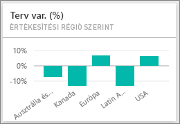
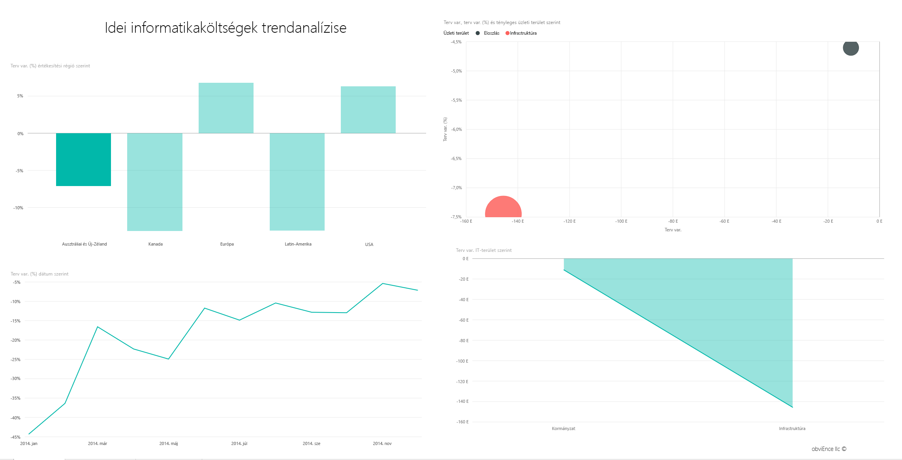
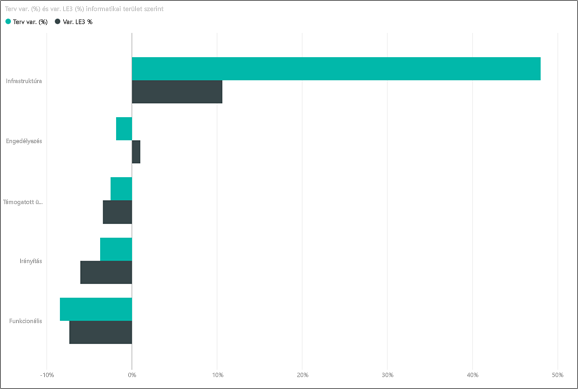
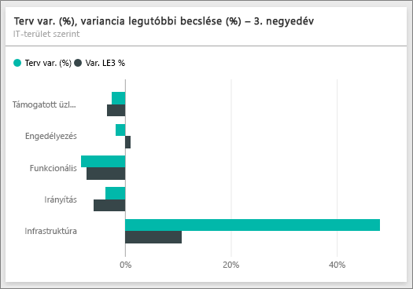
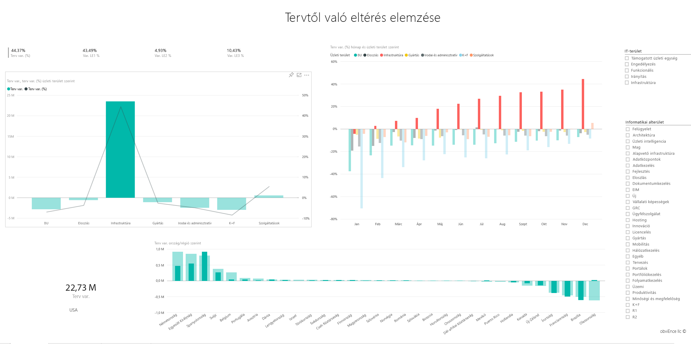

# Informatikaköltség-elemzési minta a Power BI-hoz: bemutató
Az Informatikaköltség-elemzés [tartalomcsomag](service-organizational-content-pack-introduction.md) (irányítópult, jelentés és adatkészlet) egy informatikai osztály költségeinek terv- és tényadatait elemzi. Az összevetés segít megérteni, hogy milyen pontosan tervezte a cég az idei évet, és feltárhatóvá teszi a tervtől jelentősen eltérő területeket. A példában szereplő cég egy éves tervezési cikluson halad végig, és minden negyedévben friss becslést készít (Latest Estimate - LE) a pénzügyi év informatikai költségeiben bekövetkezett változások elemzéséhez.

Ez a minta abba a sorozatba tartozik, amely a Power BI üzleti jellegű adatokkal, jelentésekkel, és irányítópultokkal történő használatát mutatja be. Az adatok az obviEnce-től (<http://obvience.com/>) származó valós, de anonimizált adatok.

>[!Note] 
Letöltheti [csak az adatkészletet (Excel-munkafüzet) ehhez a mintához](http://go.microsoft.com/fwlink/?LinkId=529783). A munkafüzet megtekinthető és módosítható Power View-lapokat tartalmaz. A nyers adatok megtekintéséhez válassza a **Power Pivot > Kezelés** lehetőséget.

## Az Informatikaköltség-elemzés minta irányítópultja
Az irányítópulton látható két számcsempe, a **Var Plan %** (Tervtől való százalékos eltérés) és a **Variance Latest Estimate % Quarter 3** (A 3. negyedévi friss becsléstől való százalékos eltérés) bemutatja a cég általános teljesítményét a tervhez és a friss negyedévi becsléshez képest (LE3 = 3. negyedévi friss becslés). A tervtől való átlagos eltérés körülbelül 6 %. Tárja fel az eltérés okát – mikor, hol, és mely kategóriában jelentkezik?

## „Idei informatikaköltségek trendanalízise” oldal
Ha a **Var Plan % by Sales Region** (Tervtől való százalékos eltérés értékesítési régiók szerint) csempére kattint, megnyílik az Informatikaköltség-elemzés mintajelentés „informatikaköltségek trendanalízise ” oldala. Egy pillantással felmérheti, hogy az USA és Európa területén pozitív, Kanadában, Latin-Amerikában és Ausztráliában negatív az eltérés. Míg az USA területén körülbelül +6 % az eltérés a legfrissebb becsléshez képest, Ausztráliában ez az érték körülbelül -7 %.

De ha csupán ezt az egy diagramot vizsgálja, téves következtetésre juthat. A nagyobb összefüggések megértéséhez meg kell vizsgálnia a dollárban kifejezett tényleges összegeket is.

1. A „Tervtől való százalékos eltérés régiók szerint” diagramon jelölje ki **Ausztráliát és Új-Zélandot**, és tekintse meg a „Tervtől való eltérés informatikai terület szerint” diagramot. 
   
   
2. Most válassza ki az **USA** elemet. Így már világosabb a kép – a teljes költség Ausztráliára eső része elenyésző az USA-hoz képest.
   
    Mi a teendő most, hogy leszűkítette az elemzést az USA területére? Vizsgálja meg, hogy az USA területén belül melyik kategória okozza az eltérést.

## Kérdések az adatokról
1. A felső navigációs sávon, az **Informatikaköltség-elemzés minta** lehetőségre kattintva visszatérhet az irányítópultokhoz.
2. A kérdés mezőbe írja be a következőt: „show IT areas, var plan % and var le3 % bar chart” (mutassa az informatikai területeket, a tervtől való százalékos eltérést, és a le3 értéktől való százalékos eltérést).
   
    
   
   Az első informatikai területen (**Infrastruktúra**), igen jelentős a százalékos különbség az eredeti tervhez és a legfrissebb becsléshez képest mért eltérés között.

## „Idei költségelemek szerinti ráfordítás” oldal
Térjen vissza az irányítópulthoz, és tekintse meg a **Var Plan %, Var LE3%** (Tervtől való százalékos eltérés és a LE3 értéktől való százalékos eltérés) csempét.

Az infrastruktúra területe a tervtől való hatalmas pozitív eltéréssel tűnik ki.

1. Ha erre a csempére kattint, megnyílik az Informatikaköltség-elemzés minta jelentésének „Idei költségelemek szerinti ráfordítás” oldala.
2. Kattintson az **Infrastruktúra** sávra a bal alsó „Var Plan % and Var LE3 % by IT Area” (tervtől való százalékos eltérés, és a LE3 értéktől való százalékos eltérés informatikai területek szerint) diagramon, és tekintse meg a balra található „Var Plan % by Sales Region" (tervtől való százalékos eltérés értékesítési régiók szerint) diagramot.
   
    
3. A jelentősen eltérő költségelem megtalálásához kattintson a szeletelőben az egyes költségelemcsoportokra.
4. A legnagyobb eltérést mutató részterület megtalálásához az **Egyéb** elem kijelölése mellett kattintson az informatikai terület **Infrastruktúra** elemére, és kattintson az „Informatikai részterületek” szeletelő elemeire.  
   
   A **Hálózatkezelés** részterületen jelentős eltérés mutatkozik.
   
   Úgy látszik, a cég juttatásként telefonos szolgáltatásokat osztott ki az alkalmazottainak, de ez nem szerepelt a tervben. 

## „Tervtől való eltérés elemzése” oldal
Maradjon a jelentésben, és kattintson az alul látható „Plan Variance Analysis” (Tervtől való eltérés elemzése) lapra, amely megnyitja a jelentés 3.oldalát.

Ha a bal oldali „Var Plan, and Var Plan % by Business Area” (Tervtől való eltérés és Tervtől való százalékos eltérés üzleti területek szerint) összetett diagramon az Infrastruktúra oszlopra kattint, az oldal többi részén kiemelheti az infrastruktúra értékeit.

A „Var plan% by Month and Business Area” (Tervtől való százalékos eltérés hónapok és üzleti területek szerint) diagramon megfigyelheti, hogy az infrastruktúránál február körül pozitív eltérés jelent meg, amelynek mértéke azóta is növekszik. Szintén figyelje meg az infrastruktúra tervtől való eltérését országok szerint, és vesse ezt össze az összes üzleti területre vonatkozó értékkel. A jobb oldali „Informatikai terület” és „Informatikai részterület” szeletelők használatával kiemelés helyett szűrheti az oldal többi részén látható értékeket. Az adatok másféle elemzéséhez kattintson a jobb oldalon látható különböző informatikai területekre. Az informatikai részterületek kijelölésével a részterületek szintjén tekintheti meg az eltéréseket.

## A jelentés szerkesztése
Kattintson a **Jelentés szerkesztése** elemre a bal felső sarokban, és nyissa meg a Szerkesztési nézetet.

* Áttekintheti a lapok felépítését – a mezőket az egyes diagramokban és a szűrőket az oldalakon
* Lapokat és diagramokat vehet fel ugyanazon adatok alapján
* Módosíthatja az egyes diagramok vizualizációjának típusát
* Rögzítheti a diagramokat az irányítópulton

Ebben a környezetben nyugodtan kísérletezhet. Mindig hozhat olyan döntést, hogy nem menti a módosításokat. De ha mégis menteni szeretné őket, bármikor lekérheti a minta új másolatát az Adatok lekérése lehetőséggel.

## Következő lépések: Kapcsolódás a saját adatokhoz
Reméljük, hogy ez a bemutató segített megérteni, hogy miképpen elemezheti az informatikai költségek adatait a Power BI irányítópultok, a Q&A és a jelentések használatával. Most Önön a sor – kapcsolódjon a saját adataihoz. A Power BI használatával számos különböző adatforráshoz kapcsolódhat. További tudnivalók a [Power BI használatának első lépéseiről](service-get-started.md).

