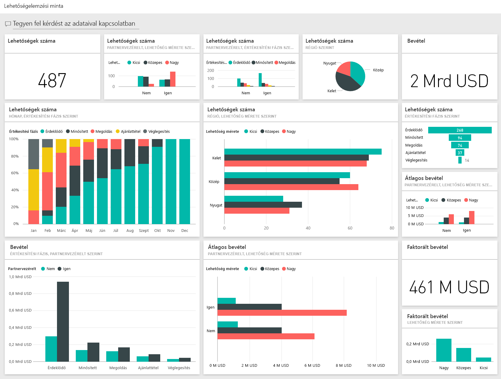
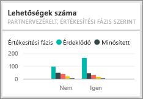

# Lehetőségelemzési minta a Power BI-hoz: bemutató

## A Lehetőségelemzési minta áttekintése
A **Lehetőségelemzési minta** egy olyan szoftvercég irányítópultját (és ahhoz kapcsolódó jelentését) tartalmazza, amely 2 értékesítési csatornával rendelkezik: egy *közvetlen-* és egy *partnercsatornával*. Ezt az irányítópultot az értékesítési vezető azért hozta létre, hogy követni lehessen vele az üzleti lehetőségeket és a bevételeket a régiók, az ügylet mérete és a csatorna szerinti eloszlásban.

Az értékesítési vezető a bevétel tekintetében két adatra támaszkodik:

* **Bevétel** – A bevétel értékesítő által becsült összege.
* **Faktorált bevétel** – Bevétel X valószínűségi % képlettel számított érték. Általánosan elfogadott, hogy ez az érték pontosabb előrejelzést ad a ténylegesen várható értékesítési bevételről. A valószínűséget az határozza meg, hogy az ügylet melyik ***Értékesítési szakasznál*** tart.
  * Lead (Érdeklődés) ‒ 10%  
  * Qualify (Minősített) – 20%  
  * Solution (Megoldás kiválasztása) – 40%  
  * Proposal (Ajánlattétel) – 60%  
  * Finalize (Véglegesítés) – 80%

  

Ez a minta egy olyan sorozat részét képezi, amely bemutatja, hogyan használhatja a Power BI-t üzleti adatokkal, jelentésekkel és irányítópultokkal. Az adatok az obviEnce-től ([www.obvience.com](http://www.obvience.com/)) származó valós, de anonimizált adatok.

## Előfeltételek

 Használat előtt a mintát [tartalomcsomagként](https://docs.microsoft.com/en-us/power-bi/sample-opportunity-analysis#get-the-content-pack-for-this-sample), [.pbix-fájlként](http://download.microsoft.com/download/9/1/5/915ABCFA-7125-4D85-A7BD-05645BD95BD8/Opportunity-Analysis-Sample-PBIX.pbix) vagy [Excel-munkafüzetként](http://go.microsoft.com/fwlink/?LinkId=529782) le kell töltenie.

### Tartalomcsomag letöltése ehhez a mintához

1. Nyissa meg a Power BI szolgáltatást (app.powerbi.com), és jelentkezzen be.
2. A bal alsó sarokban válassza az **Adatok lekérése** lehetőséget.
   
    
3. Ekkor megjelenik az Adatok lekérése lap. Itt kattintson a **Minták** ikonra.
   
   
4. Válassza a **Lehetőségelemzési mintát**, majd a **Kapcsolódás** lehetőséget.  
  
   
   
5. A Power BI importálja a tartalomcsomagot, és egy új irányítópultot, jelentést és adatkészletet ad hozzá az aktuális munkaterülethez. Az új tartalmakat sárga csillag jelöli. 
   
   
  
### .pbix-fájl letöltése ehhez a mintához

Lehetőség van a mintát .pbix-fájlként is letölteni, amelyet a Power BI Desktoppal való használatra terveztek. 

 * [Lehetőségelemzési minta](http://download.microsoft.com/download/9/1/5/915ABCFA-7125-4D85-A7BD-05645BD95BD8/Opportunity%20Analysis%20Sample%20PBIX.pbix)

### Excel-munkafüzet letöltése ehhez a mintához
Letöltheti [kizárólag a minta adatkészletét (Excel-munkafüzetét) is](http://go.microsoft.com/fwlink/?LinkId=529782). A munkafüzet megtekinthető és módosítható Power View-lapokat tartalmaz. A nyers adatokat a **Power Pivot > Kezelés** lehetőségre kattintva nézheti meg.

## Mi olvasható le az irányítópultról?
Az irányítópultot az értékesítési vezető azért hozta létre, hogy nyomon követhesse a számára legfontosabb mutatókat. Ha észrevesz valami érdekeset, az adott csempére kattintva le tud hatolni a mélyebb adatszintekre.

1. A vállalati bevétel 2 milliárd dollár, a faktorált bevétel pedig 461 millió dollár.
2. Az üzleti lehetőségek száma és a bevétel a jól ismert tölcsér mintát követik, vagyis az összesített értékek értékesítési szakaszonként csökkenő tendenciát mutatnak.
3. A legtöbb üzleti lehetőség a keleti (East) régióban van.
4. A nagyobb üzleti lehetőségek több bevételt generálnak, mint a közepes, vagy a kis lehetőségek.
5. A partnerek nagy ügyletei több bevételt generálnak: 8 millió dollárt, a közvetlen értékesítésből származó 6 millió dolláros bevétellel szemben.

Ahhoz, hogy az üzlet létrejöjjön, ugyanannyi energiát kell fektetni a nagynak, a közepesnek és a kicsinek minősülő lehetőségekbe is, ezért érdemes mélyebbre ásni, és többet kideríteni a nagy lehetőségekkel kapcsolatos adatokból.

A jelentés első oldalának a megnyitásához kattintson az **Opportunity Count by Partner Driven and Sales Stage** (Partnerek hatáskörébe tartozó üzleti lehetőségek értékesítési szakaszonként) feliratú csempére.  

## A jelentés oldalainak felfedezése
### A jelentés első oldalának címe "Opportunity Count Overview" (Lehetőségek számának áttekintése).

* A lehetőségek száma szempontjából a keleti régió vezet.  
* A lap szűréséhez válasszon ki egy-egy régiót a tortadiagramról. A partnerek mindegyik régióban több nagy lehetőségekkel rendelkeznek.   
* Az Opportunity Count by Partner Driven and Opportunity Size (Partnerek hatáskörébe tartozó üzleti lehetőségek száma és az üzleti lehetőségek mérete) oszlop jól mutatja, hogy a legtöbb nagy lehetőség partnerek hatáskörébe tartozó (Partner driven) lehetőség, ugyanakkor a közepes és kis lehetőségek nagyobb része a közvetlen céges (nem partnervezérelt) értékesítéshez tartozik.
* A regionális számok közötti különbség megtekintéséhez kattintson az egyes értékesítési szakaszok (Sales Stage) nevére. Látni fogja, hogy bár szám szerint a keleti (East) régióban van a legtöbb lehetőség, a Solution (Megoldás kiválasztása), Proposal (Ajánlattétel) és Finalize (Véglegesítés) szakaszokban már hasonló számú lehetőséggel rendelkezik mindhárom régió. Ez azt jelenti, hogy a középső (Central) és a nyugati (West) régióban több ügyletet sikerül végigvinni.

### A jelentés második oldalának címe „Revenue Overview” (Bevétel áttekintése).
Ez a lap hasonló nézőpontot kínál az adatokhoz, de a lehetőségek száma helyett a bevételt jeleníti meg.  

* A keleti (East) régió nem csak a lehetőségek száma, de jövedelem tekintetében is vezet.  
* Ha a megjelenített lehetőségeket a partnerek hatáskörébe tartozó lehetőségekre szűkíti (a jobb felső sarokban megjelenő **Yes** (Igen) gombot használva), 1,5 millárd dolláros és 294 millió dolláros bevétel látható. Hasonlítsa ezt össze a 644 millió dolláros és a 166 millió dolláros közvetlen céges értékesítésből várható (nem partnervezérelt) bevétellel.  
* A nagy ügyfelekhez kapcsolódó, partnerek hatókörébe tartozó üzleti lehetőségek átlagos bevétele (8 millió) nagyobb, mint a közvetlen céges értékesítéshez tartozó nagy üzleteké (6 millió).  
* A partnerek hatókörébe tartozó üzletek között a nagy lehetőségekhez tartozó átlagos bevétel majdnem kétszerese a közepes lehetőségekhez tartozó átlagos bevételnek (4 millió).  
* A partnerek hatókörébe tartozó és közvetlen céges értékesítéshez tartozó kis és közepes üzleti lehetőségek átlagos bevétele nagyságrendileg hasonló.   

Mindezekből tisztán látszik, hogy a partnerek eredményesebbek az ügyfelek felé történő értékesítés tekintetében.  Valószínűleg érdemes lenne több ügyletet lecsatornázni a partnerekhez.

### A jelentés harmadik oldalának címe "Region Stage Counts" (Lehetősége száma régiónként és értékesítési szintenként).
Ez az oldal hasonló adatokat tekint át, csak régiók és értékesítési szakasz szerinti bontásban.  

* Ha a keleti régió adataira szűr (a tortadiagram **East** (Kelet) szeletére kattintva), megláthatja, hogy a keleti régióban majdnem azonos arányban oszlanak meg az üzleti lehetőségek a partnerek és a céges értékesítés között.
* A legtöbb nagy lehetőség a központi régióhoz tartozik, a legtöbb kis lehetőség a keleti régióhoz, a közepes lehetőségek száma pedig a nyugati régióban a legnagyobb.

### A Jelentés negyedik oldalának címe: „Upcoming Opportunities” (Várható lehetőségek)
Ismét hasonló tényezőket vizsgálunk, de most az idő perspektívájából.  

A pénzügyi vezető ezt az oldalt használja a munkaterhelés időbeli elosztásához. Ha megvizsgálja az értékesítési szakaszonként és havonta várható bevétel lehetőségeket, előre tud tervezni.

* A Finalize (Véglegesítés) szinthez tartozó átlagos bevétel a legmagasabb. Ezeknek az ügyleteknek a lezárása élvezi a legmagasabb prioritást.
* A hónapok szerinti szűrés (a jobb oldali sávban látható hónapnevek kiválasztásával) azt mutatja, hogy Januárban nagy arányban várhatók véglegesítési (Finalize) szakaszba kerülő üzleti lehetőségek, 75 millió dollárnyi faktorált bevétellel. Februárban ugyanakkor többnyire közepes méretű ügyletek kerülnek majd megoldásválasztási (Solution) és ajánlattételi (Proposal) szakaszba.
* A faktorált bevétellel kapcsolatos számok az értékesítési szakasztól, a lehetőségek számától és az ügylet méretétől függően váltakoznak. Ha szeretne további összefüggéseket felfedezni, vegyen fel további szűrőket a jobboldali Szűrők ablaktáblát használva.

Ebben a környezetben nyugodtan kísérletezhet. Bármikor dönthet úgy, hogy nem menti a változtatásokat. De ha mégis mentené őket, bármikor lekérheti a minta egy új másolatát az **Adatok lekérése** lehetőséggel.

## Következő lépések: Kapcsolódás saját adatokhoz
Reméljük, hogy ez a bemutató segített megérteni, hogyan tárhat fel összefüggéseket a lehetőségkövetési adatokból a Power BI irányítópultokat, Q&A-t és jelentéseket használva. Most Önön a sor – kapcsolódjon a saját adataihoz. A Power BI használatával számos különböző adatforráshoz kapcsolódhat. Tudjon meg többet a [Power BI használatának első lépéseiről](service-get-started.md).

[Minták letöltése](sample-datasets.md)  
