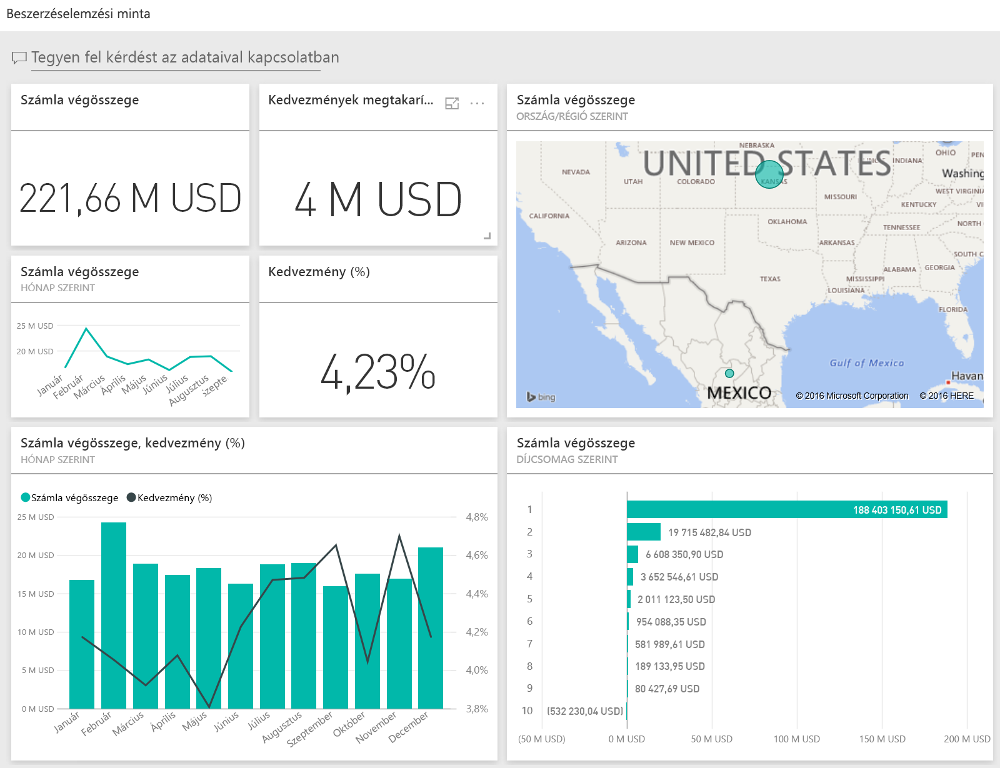
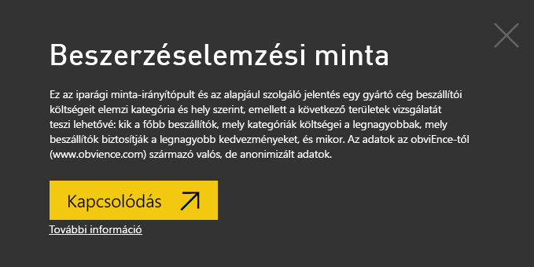
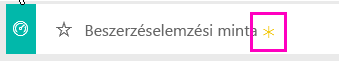
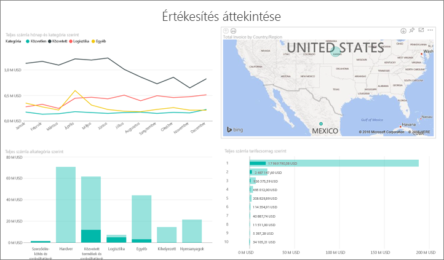
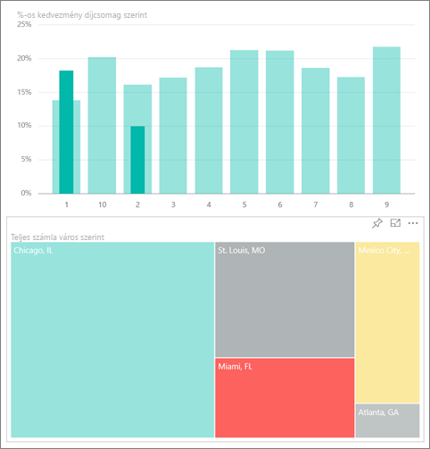
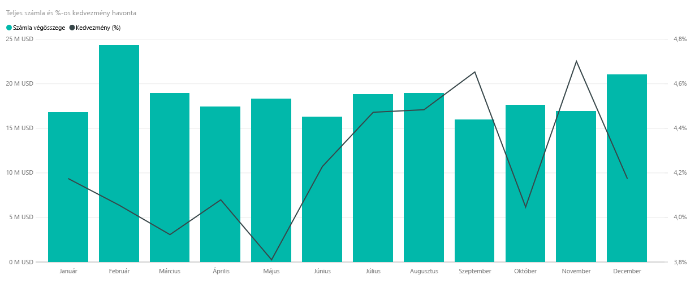
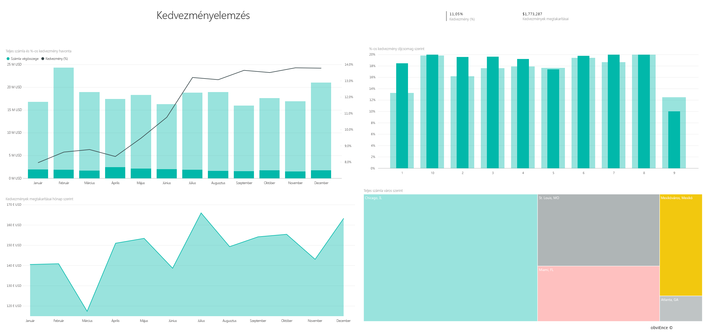

# Beszerzéselemzési minta a Power BI-hoz: bemutató

## A Beszerzéselemzési minta áttekintése
Ez az iparági mintaként szolgáló irányítópult és a mögöttes jelentés egy gyártással foglalkozó cég beszállítói költségeit elemzi kategória és hely szerint. A mintában az alábbi területek ismerhetők meg:

* Kik a fő beszállítók?
* Mely kategóriák költségei a legmagasabbak?
* Mely beszállítók biztosítják a legnagyobb kedvezményeket, és mikor?

Ez a minta egy olyan sorozat részét képezi, amely bemutatja, hogyan használhatja a Power BI-t üzleti adatokkal, jelentésekkel és irányítópultokkal. Az adatok az obviEnce-től ([www.obvience.com](http://www.obvience.com/)) származó valós, de anonimizált adatok.

## Előfeltételek

 Használat előtt a mintát [tartalomcsomagként](https://docs.microsoft.com/power-bi/sample-procurement#get-the-content-pack-for-this-sample), [.pbix-fájlként](http://download.microsoft.com/download/D/5/3/D5390069-F723-413B-8D27-5888500516EB/Procurement%20Analysis%20Sample%20PBIX.pbix) vagy [Excel-munkafüzetként](http://go.microsoft.com/fwlink/?LinkId=529784) le kell töltenie.

### Tartalomcsomag letöltése ehhez a mintához

1. Nyissa meg a Power BI szolgáltatást (app.powerbi.com), és jelentkezzen be.
2. A bal alsó sarokban válassza az **Adatok lekérése** lehetőséget.
   
    
3. Ekkor megjelenik az Adatok lekérése lap. Itt kattintson a **Minták** ikonra.
   
   
4. Válassza a **Beszerzéselemzési minta** elemet, majd a **Kapcsolódás** lehetőséget.  
  
   
   
5. A Power BI importálja a tartalomcsomagot, és egy új irányítópultot, jelentést és adatkészletet ad hozzá az aktuális munkaterülethez. Az új tartalmakat sárga csillag jelöli. 
   
   
  
### .pbix-fájl letöltése ehhez a mintához

Lehetőség van a mintát .pbix-fájlként is letölteni, amelyet a Power BI Desktoppal való használatra terveztek. 

 * [Beszerzéselemzési minta](http://download.microsoft.com/download/D/5/3/D5390069-F723-413B-8D27-5888500516EB/Procurement%20Analysis%20Sample%20PBIX.pbix)

### Excel-munkafüzet letöltése ehhez a mintához
Letöltheti [kizárólag a minta adatkészletét (Excel-munkafüzetét) is](http://go.microsoft.com/fwlink/?LinkId=529784). A munkafüzet megtekinthető és módosítható Power View-lapokat tartalmaz. A nyers adatokat a **Power Pivot > Kezelés** lehetőségre kattintva nézheti meg.

## Költési trendek
Először nézzük meg a költési trendeket kategória és hely szerint.  

1. A munkaterületen nyissa meg az **Irányítópultok** lapot, és válassza a Beszerzéselemzés nevű irányítópultot.
2. Válassza ki a **Teljes számla ország/régió szerint** nevű csempét az irányítópulton. Megjelenik a Beszerzéselemzési minta című jelentés Költések áttekintése nevű lapja.

    

Az alábbiak figyelhetők meg:

* A **Teljes számla hónap és kategória szerint** nevű vonaldiagramon: a **Közvetlen** kategória következetes költéssel rendelkezik, a **Logisztika** kategória csúcsértéke decemberben van, míg az **Egyéb** nevű kategóriáé februárban.
* A **Teljes számla ország/régió** szerint nevű térképen:a költések többsége az Egyesült Államokban történik.
* A **Teljes számla alkategória szerint** nevű oszlopdiagramon:a **Hardver**, valamint a **Közvetett termékek és szolgáltatások** képviselik a legnagyobb költési kategóriát.
* A Teljes számla szint szerint nevű sávdiagramon: az ügyfelek többsége 1. szintű (első 10-be tartozó) beszállítónak minősül. Ez segít a beszállítói kapcsolatok jobb kezelésében.

## Mexikói költések
Nézzük meg a mexikói költési területeket.

1. A tortadiagramon válassza ki a **Mexikó** nevű térképbuborékot. Látható, hogy a Teljes számla alkategória szerint nevű oszlopdiagramon a legtöbb kategóriát a **Közvetett termékek és szolgáltatások** alkategória képviseli.

   
2. Részletezheti a **Közvetett termékek és szolgáltatások** nevű oszlopot:

   * Válassza ki a lehatolási nyilat  a diagram jobb felső sarkában.
   * Válassza ki a **Közvetett termékek és szolgáltatások** nevű oszlopot.

      Ebben a kategóriában a legnagyobb költést az értékesítés és a marketing képviseli.
   * Válassza ki újra **Mexikót** a térképen.

      A legnagyobb mexikói költés ebben a kategóriában a karbantartás és a javítás.

      
3. Válassza ki a felfelé mutató nyilat a diagram bal felső sarkában a felhatoláshoz.
4. Válassza ki a nyilat újra a lehatolás kikapcsolásához.  
5. A **Power BI** elem felső navigációs sávon való kiválasztásával térhet vissza a munkaterületre.

## Különböző városok értékelése
A kiemelések használatával értékelheti a különböző városokat.

1. Válassza ki a **Teljes számla és kedvezményszázalék hónap szerint** nevű csempét az irányítópulton. A jelentésben megnyílik a Kedvezmény elemzése lap.
2. A **Teljes számla város szerint** fatérképen az egyes városok kiválasztásával hasonlíthatja össze őket. A Miamihoz tartozó szinte összes számla 1. szintű beszállítóktól származik.

   

## Beszállítói kedvezmények
Most tekintsük át a beszállítóktól származó kedvezményeket, valamint azokat az időszakokat, amikor a legtöbb kedvezményt kapjuk.

Pontosabban az alábbi kérdéseket tehetjük fel:

* A kedvezmények eltérnek-e havonként, vagy megegyeznek minden egyes hónapban?
* Egyes városok több kedvezményt kapnak-e más városokhoz képest?

### Kedvezmény havonta
A **Teljes számla és kedvezményszázalék hónap szerint** nevű kombinált diagramon látható, hogy **február** a leginkább, és **szeptember** a legkevésbé forgalmas hónap. Most nézzük meg az ezekhez a hónapokhoz tartozó kedvezményszázalékot.
Látható, hogy a mennyiség növekedésével a kedvezmény mértéke csökken, valamint ha a mennyiség alacsony, a kedvezmény megnő. Minél több kedvezményre van szükség, annál kedvezőtlenebb ajánlatot kapunk.

### Kedvezmény városonként
Egy másik feltárható terület a városonként kapott kedvezmény. Válassza ki az egyes városokat a fatérképen, és láthatja, hogyan változik a többi diagram.

* St. Louis-ban (Missouri) csúcsértéket ért el februárban a teljes számlaérték, valamint áprilisban esett a legalacsonyabb szintre a kedvezményekkel elérhető megtakarítás.
* A mexikói Mexikóvárosban a legmagasabb a kedvezményszázalék értéke (11,05%), míg Atlantában (Georgia) a legkisebb (0,08%).

### A jelentés szerkesztése
Válassza ki a **Jelentés szerkesztése** elemet a bal felső sarokban, és nyissa meg a szerkesztési nézetet.

* Áttekintheti a lapok felépítését
* Lapokat és diagramokat vehet fel ugyanazon adatok alapján
* Módosíthatja a diagram vizualizációs típusát – például fatérképről gyűrűdiagramra
* Rögzítheti azokat az irányítópulton

Ebben a környezetben nyugodtan kísérletezhet. Nem kötelező menteni a módosításokat. Ha mégis menti őket, az **Adatok lekérése** lehetőséggel bármikor letöltheti a minta egy új másolatát.

## Következő lépések: Kapcsolódás saját adatokhoz
Reméljük, ez a bemutató segített megérteni a Power BI-beli irányítópultok és jelentések segítségével történő beszerzési adatelemzést. Most Önön a sor &#151; kapcsolódjon a saját adataihoz. A Power BI-jal számos adatforráshoz kapcsolódhat. További tudnivalók a [Power BI használatának első lépéseiről](service-get-started.md).
