# Kiskereskedelmi elemzési minta a Power BI-hoz: bemutató

Ez az iparági minta-irányítópult és a mögöttes jelentés a több üzletben és körzetben értékesített cikkek kiskereskedelmi értékesítési adatait elemzi. A mérőszámok a folyó év teljesítményét vetik össze a tavalyival a következő területeken: értékesítés, egységek, bruttó nyereség, eltérés, új üzletek elemzett adatai. Az adatok az obviEnce-ről ([www.obvience.com](http://www.obvience.com)) származó valós, de anonimizált adatok.

Letöltheti [kizárólag a minta adatkészletét is (Excel-munkafüzet)](http://go.microsoft.com/fwlink/?LinkId=529778).

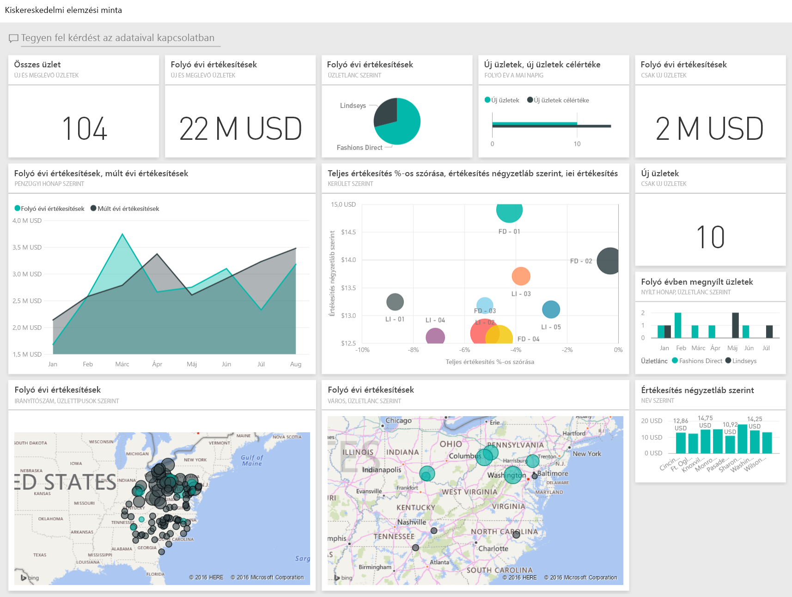

## Az irányítópult elindítása és a jelentés megnyitása
1. Az irányítópulton kattintson az „Összes üzlet” csempére:
   
   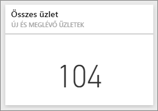  
   
   Ekkor megnyílik a jelentés „Üzleti értékesítések áttekintése” oldala. Amint látható, összesen 104 üzlet van, amiből 10 új. Két üzletlánc működik, a Fashions Direct és a Lindseys. A Fashions Direct üzleteinek nagyobb az átlagos mérete.
2. A kördiagramon kattintson a **Fashions Direct** elemre.
   
   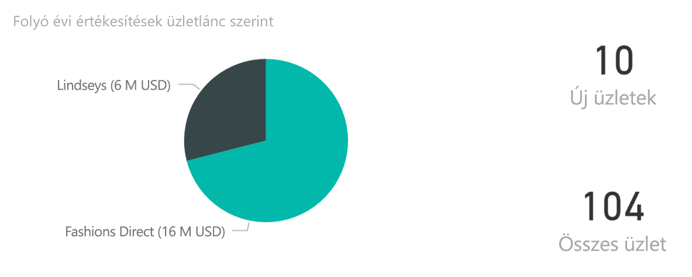  
   
   Tekintse meg az eredményt a buborékdiagramon:
   
   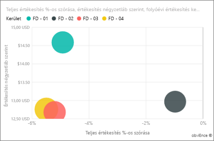  
   
   Az egy négyzetlábra eső átlagos értékesítési arány az FD-01-es körzetben a legnagyobb, az értékesítések eltérése a tavalyihoz képest az FD-02-es körzetben a legalacsonyabb, az FD-03-as és az FD-04-es körzetek teljesítménye általában a legrosszabb.
3. Kattintson az egyes buborékokra vagy diagramokra annak megtekintéséhez, hogy ennek hatására milyen keresztkijelölések jönnek létre.
4. Az irányítópulthoz úgy térhet vissza, hogy a felső navigációs sávon (webhely-navigációs eszközön) az irányítópult nevére kattint. 
   
   
5. Az irányítópulton kattintson a „Folyó évi értékesítések” csempére.
   
   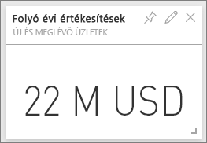
   
   Ez egyenértékű azzal, mintha a kérdés mezőbe beírná a „This year sales” (Folyó évi értékesítések) szöveget.
   
   Ekkor az alábbi képernyő jelenik meg:
   
   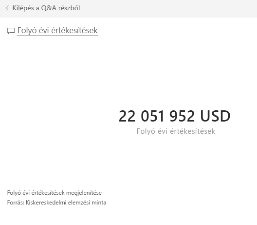

## A Power BI Q&A funkcióban létrehozott csempe áttekintése
Tárja fel a részleteket.

1. Egészítse ki a kérdést a „this year sales **by district**” (folyó évi értékesítés körzetek szerint) szövegre. Tekintse meg az eredményt: A rendszer automatikusan sávdiagramba rendezte a választ, és más kifejezéseket is felkínál:
   
   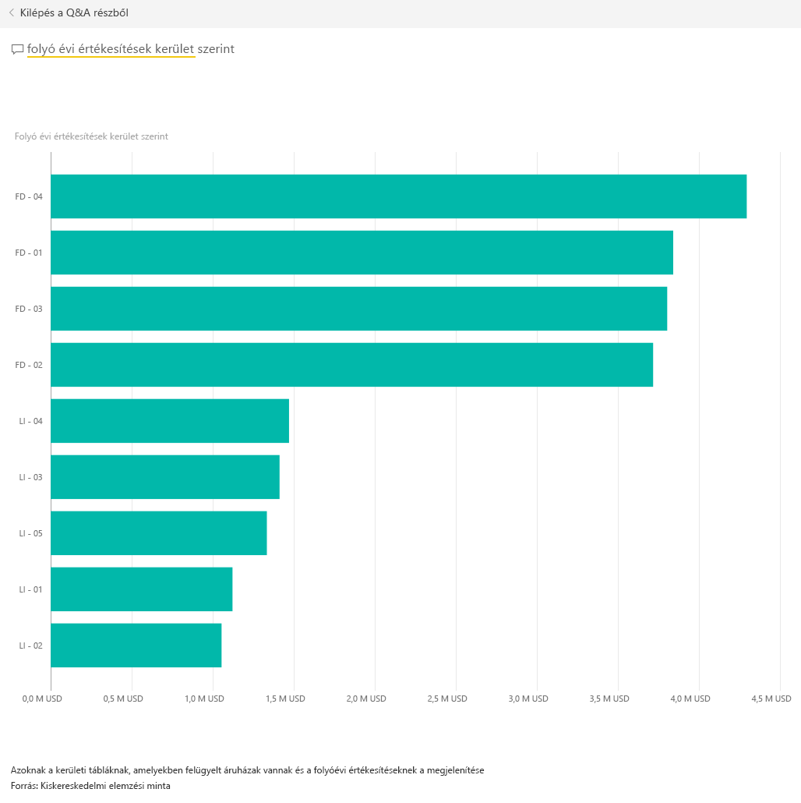
2. Most egészítse ki a kérdést a „this year sales **by zip and chain**” (folyó évi értékesítés irányítószám és üzletlánc szerint) szövegre.
   
   Figyelje meg, hogy a rendszer miképpen válaszol a megfelelő diagramokkal az éppen beírt kérdésre.
3. Játsszon egy kicsit: tegyen fel többféle kérdést, és tekintse meg a válaszul kapott eredményeket.
4. Amikor elkészült, térjen vissza az irányítópulthoz.

## Mélyebb adatelemzés
Most tárjon fel egy részletesebb szintet, ahol megvizsgálhatja az egyes körzetek teljesítményét.

1. Az irányítópulton kattintson a folyó és a tavalyi év értékesítési adatait összevető csempére.
   
   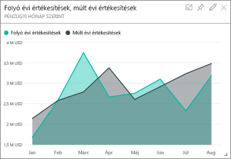
   
   Figyelje meg, milyen nagymértékben ingadozott az Eltérés % értéke a tavalyi évhez képest, és hogy a január, az április és a július hónapok különösen rosszul teljesítettek.
   
   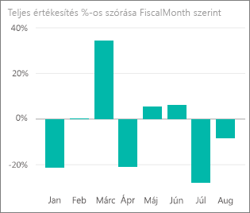
   
   Próbálja meg szűkítéssel kideríteni a probléma okát.
2. Kattintson a buborékdiagramra, majd jelölje ki a **020-Mens** (Férfiak) elemet.
   
   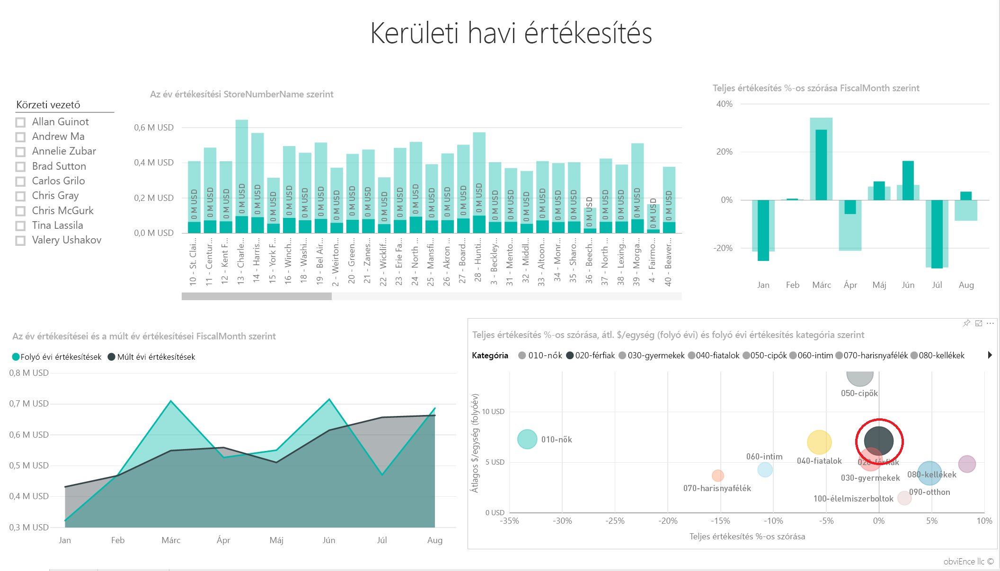  
   
   Figyelje meg, hogy a Férfiak kategóriát áprilisban nem érintette olyan rosszul a változás, mint a vállalkozás egészét, de a január és a július itt is problémát jelent.
3. Most kattintson a **010-Womens’ buborékra** (Nők).
   
   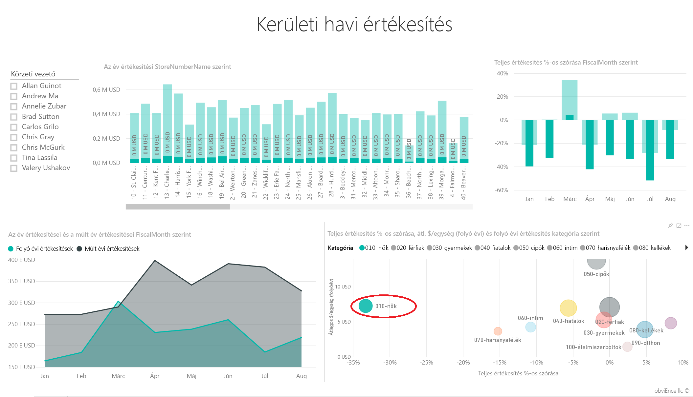
   
   Figyelje meg, hogy a Nők kategória minden hónapban rosszabbul teljesített, mint a vállalkozás egésze, és szinte minden hónapban sokkal rosszabbul teljesített a tavalyinál.
4. Kattintson ismét a buborékra a szűrő törléséhez.

## A szeletelő kipróbálása
Tekintse meg az egyes körzetek eredményeit.

1. Válassza ki Allan Guinot nevét a bal oldalon, felül található szeletelőben.
   
   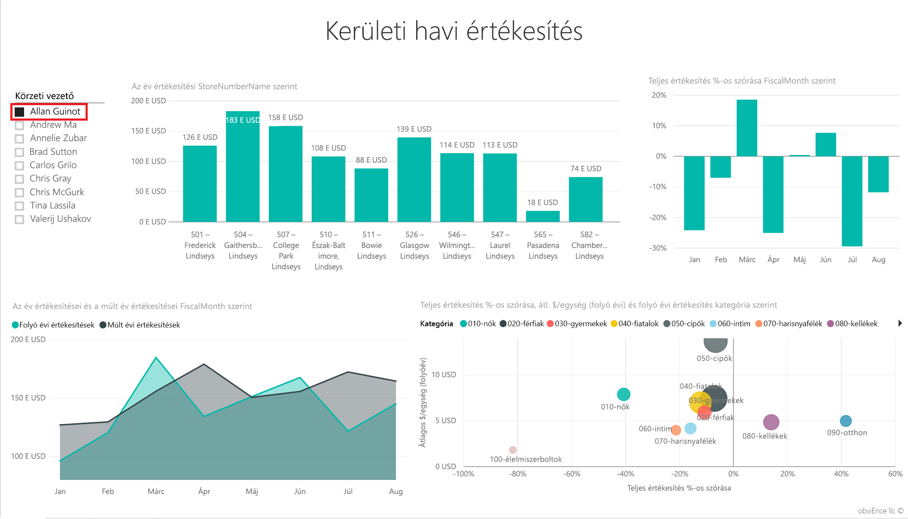
   
   Figyelje meg, hogy Allan körzete márciusban és júniusban jobban teljesített, mint tavaly.
2. Hagyja kijelölve Allant, és kattintson a Nők buborékra.
   
   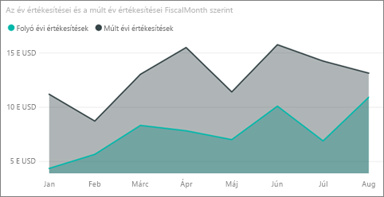
   
   Figyelje meg, hogy a Nők kategóriában Allan körzete egyszer sem érte el a tavalyi eredményt.
3. Vizsgálja meg a többi körzeti vezetőt és a kategóriákat – Milyen egyéb következtetések vonhatók le?
4. Amikor elkészült, térjen vissza az irányítópulthoz.

## Mit árulnak el az adatok az értékesítés folyó évi alakulásáról?
Végezetül vessen egy pillantást a vállalkozás növekedésére – az idén új üzletek nyíltak.

1. Kattintson az „Folyóévben megnyílt üzletek” csempére.
   
   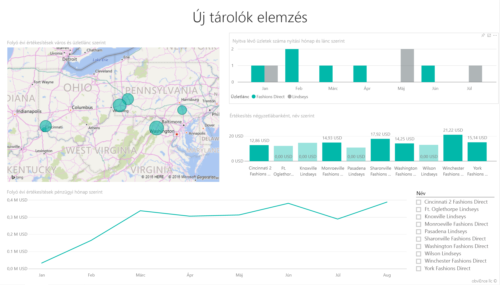
   
   A csempe világosan mutatja, hogy idén több Fashions Direct üzlet nyílt, mint Lindseys.
2. Vizsgálja meg az „Egy négyzetlábra eső értékesítés üzletnév szerint” diagramot:
   
   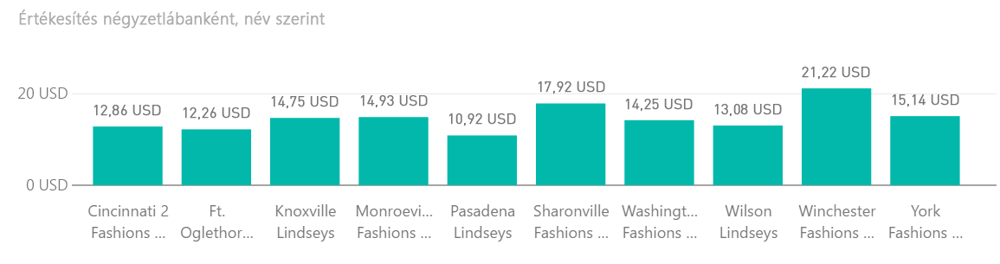
   
    Az új üzletek egy négyzetlábra eső átlagos értékesítési adataiban jelentős eltérések mutatkoznak.
3. Kattintson a Fashions Direct feliratra a jobb felső diagramon. Figyelje meg, hogy még ugyanazon a láncon belül is jelentősen meghaladja a legjobban teljesítő üzlet (a Winchester Fashions Direct) 21,22 dolláros eredménye a leggyengébb üzlet (Cincinnati 2 Fashions Direct) 12,86 dolláros eredményét.
   
   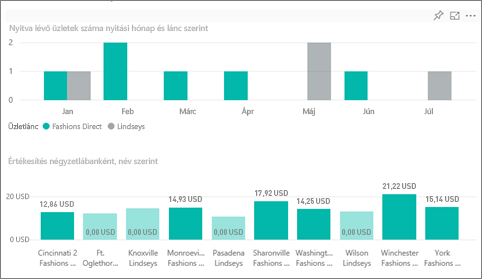
4. Kattintson a szeletelőben a Winchester Fashions Direct elemre, és vizsgálja meg a vonaldiagramot. Az első értékesítési eredményeket februárban jelentették.
5. Kattintson a szeletelőben a Cincinnati 2 Fashions Direct elemre: a megjelenő vonaldiagramból kiderül, hogy az üzlet júniusban nyílt meg, és valószínűleg ez a legrosszabbul teljesítő üzlet.
6. Ahogy korábban, most is kattinthat a diagramokon lévő egyéb sávokra, vonalakra és buborékokra a további összefüggések elemzéséhez.

Ebben a környezetben bármit nyugodtan kipróbálhat. Mindig hozhat olyan döntést, hogy nem menti a módosításokat. De ha mégis mentené őket, bármikor lekérheti a minta új másolatát az Adatok lekérése lehetőséggel.

## Csatlakozás az adatokhoz
Reméljük, hogy ez a bemutató segített megérteni a Power BI irányítópultok, Q&A és jelentések segítségével történő kiskereskedelmi adatelemzést. Most Önön a sor – csatlakozzon a saját adataihoz. A Power BI használatával számos különböző adatforráshoz csatlakozhat. További információkért lásd: [Első lépések a Power BI használatával](service-get-started.md).

## További lépések
* [A Kiskereskedelmi elemzési minta tartalomcsomag letöltése](sample-tutorial-connect-to-the-samples.md)    
* [A fenti Power BI-mintához tartozó Excel-munkafüzet letöltése](http://go.microsoft.com/fwlink/?LinkId=529778)    
* [Adatbeolvasás (a Power BI-ban)](service-get-data.md)    
* [Power BI – Alapfogalmak](service-basic-concepts.md)    
* További kérdései vannak? [Kérdezze a Power BI-közösséget!](http://community.powerbi.com/)

