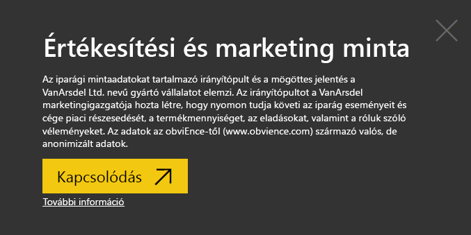
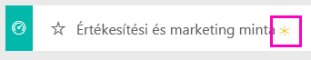
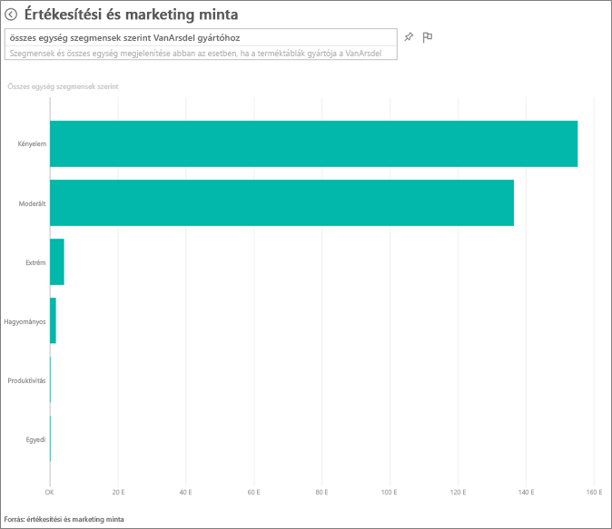
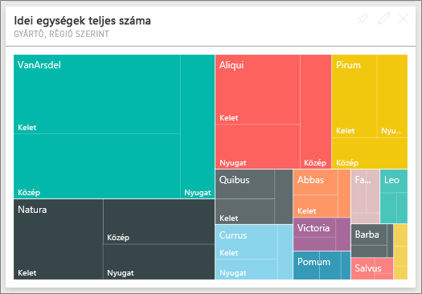
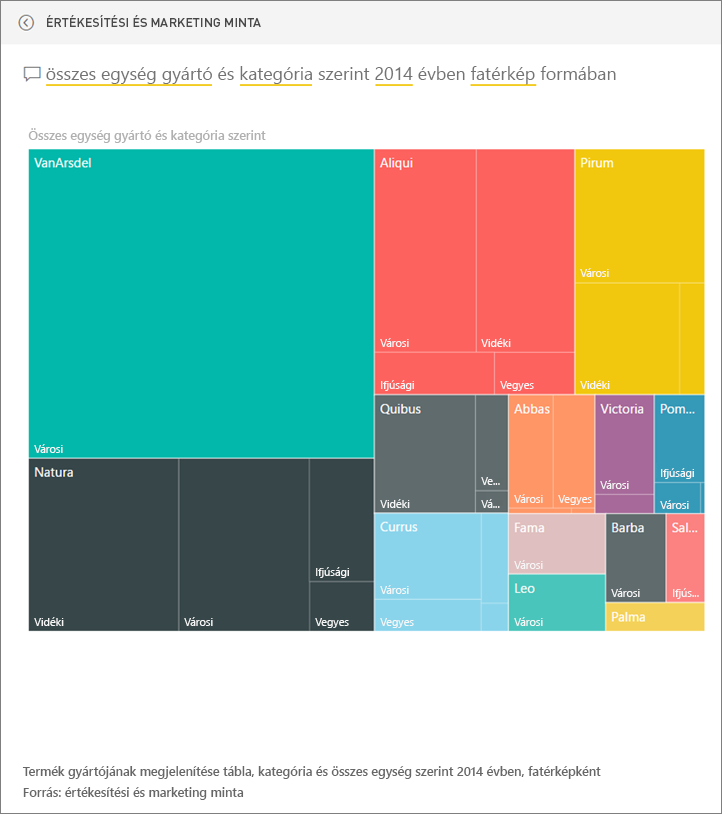
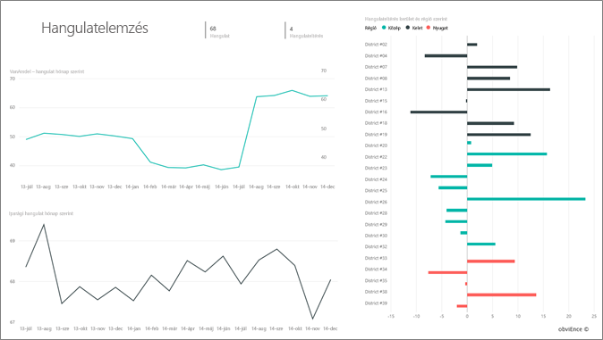
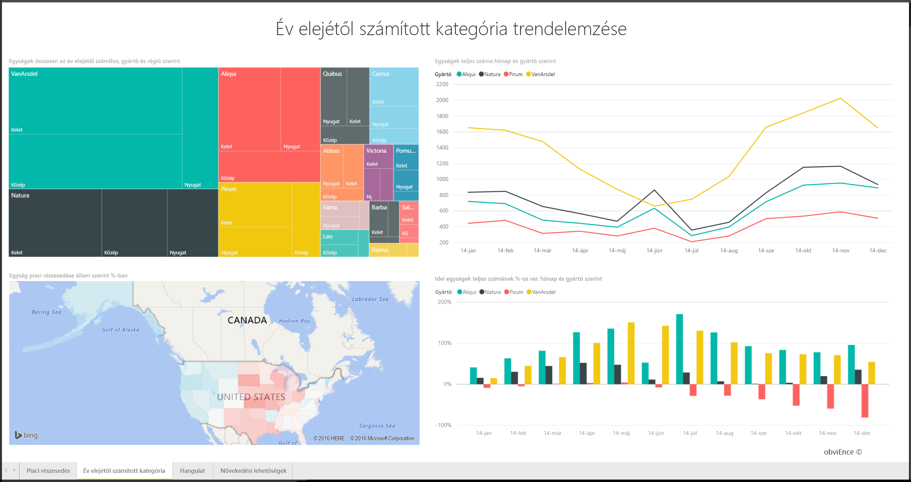
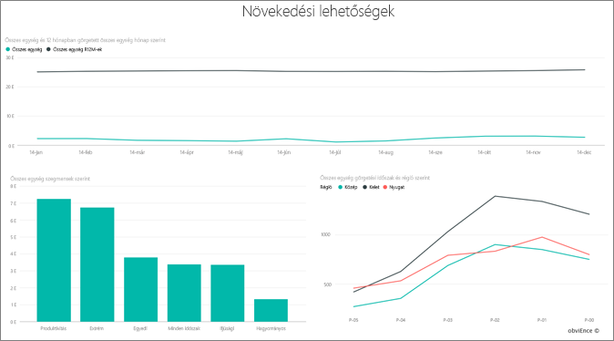

# Értékesítési és marketing minta a Power BI-hoz: bemutató

## Értékesítési és marketing minta: áttekintés
Az **Értékesítési és marketing minta** egy VanArsdel Ltd nevű kitalált gyártó céghez tartozó irányítópultot és jelentést tartalmaz. Az irányítópultot a VanArsdel marketingigazgatója hozta létre, hogy nyomon tudja követi az iparág eseményeit és cége piaci részesedését, a termékmennyiséget, az eladásokat, valamint a róluk szóló véleményeket.

A VanArsdel számos versenytárssal rendelkezik, de piacvezető az iparágában. A marketingigazgató növelni szeretné a piaci részesedést, és fel szeretné deríteni a növekedési lehetőségeket. Valamilyen okból azonban a VanArsdel piaci részesedése csökkenni kezdett, júniusban jelentős mértékű zuhanással.

Ez a minta egy olyan sorozat részét képezi, amely bemutatja, hogyan használhatja a Power BI-t üzleti adatokkal, jelentésekkel és irányítópultokkal. Az adatok az obviEnce-től (www.obvience.com) származó valós, de anonimizált adatok.

## Előfeltételek

 Használat előtt a mintát [tartalomcsomagként](https://docs.microsoft.com/en-us/power-bi/sample-sales-and-marketing#get-the-content-pack-for-this-sample), [.pbix-fájlként](http://download.microsoft.com/download/9/7/6/9767913A-29DB-40CF-8944-9AC2BC940C53/Sales and Marketing Sample PBIX.pbix) vagy [Excel-munkafüzetként](http://go.microsoft.com/fwlink/?LinkId=529785) le kell töltenie.

### Tartalomcsomag letöltése ehhez a mintához

1. Nyissa meg a Power BI szolgáltatást (app.powerbi.com), és jelentkezzen be.
2. A bal alsó sarokban válassza az **Adatok lekérése** lehetőséget.
   
    
3. Ekkor megjelenik az Adatok lekérése lap. Itt kattintson a **Minták** ikonra.
   
   
4. Válassza ki az **Értékesítési és marketing mintát**, majd válassza a **Kapcsolódás** lehetőséget.  
  
   
   
5. A Power BI importálja a tartalomcsomagot, és egy új irányítópultot, jelentést és adatkészletet ad hozzá az aktuális munkaterülethez. Az új tartalmakat sárga csillag jelöli. 
   
   
  
### .pbix-fájl letöltése ehhez a mintához

Lehetőség van a mintát .pbix-fájlként is letölteni, amelyet a Power BI Desktoppal való használatra terveztek. 

 * [Értékesítési és marketing minta](http://download.microsoft.com/download/9/7/6/9767913A-29DB-40CF-8944-9AC2BC940C53/Sales%20and%20Marketing%20Sample%20PBIX.pbix)

### Excel-munkafüzet letöltése ehhez a mintához
Letöltheti [kizárólag a minta adatkészletét (Excel-munkafüzetét) is](http://go.microsoft.com/fwlink/?LinkId=529785). A munkafüzet megtekinthető és módosítható Power View-lapokat tartalmaz. A nyers adatokat a **Power Pivot > Kezelés** lehetőségre kattintva nézheti meg.

## Mi olvasható le az irányítópultról?
Kezdjük a bemutatót az irányítópulton, és tekintsük meg a csempéket, melyek rögzítése mellett döntött a marketingigazgató. A piaci részesedéssel, az eladásokkal és a cégről szóló véleményekkel kapcsolatos információk jelennek meg. Emellett láthatók az adatok régió, időpont és versenytársak szerinti bontásban is.

* A bal oldali oszlopban látható csempéken az elmúlt évi iparági értékesítési mennyiség (50 ezer), a piaci részesedés (32,86 %), az értékesítési mennyiség (16 ezer), a véleménypontszám (68-as) a vélemények közötti eltérés (4) és az összes eladott egység mennyisége (1 millió) jelenik meg.
* A felső vonaldiagramon a piaci részesedés ingadozása jelenik meg az idő függvényében. A piaci részesedés komolyan visszaesik júniusban. Emellett a 12 hónapos gördülő (R12M) részesedés, amely egy ideig növekedett, kezd stagnálni.
* A legnagyobb versenytárs az Aliqui (ami egyértelműen látszik a középső oszlopdiagram csempéjén).
* Üzleti tevékenységünk legnagyobb része a keleti és a középső régióban zajlik.
* Az alsó vonaldiagramon az látható, hogy a júniusi visszaesés nem szezonális – egy versenytársnál sem jelentkezik ugyanez a tendencia.
* A két „Total Units” („Egységek összesen”) csempén az eladott egységek száma látható szegmens, illetve régió/gyártó szerint. Az iparág legnagyobb piaci szegmensei a **Termelékenység** és a **Kényelem**.

### A Q&A használata a részletesebb adatok feltárásához
#### Mely szegmensek meghatározók az értékesítésünk szempontjából? Ez megfelel az iparági trendeknek?
1. Válassza a „Total Units Overall by Segment” („Egységek összesítése szegmens szerint”) csempét. Ekkor megnyílik a Q&A.
2. Írja be a **for VanArsdel** (a VanArsdel esetében) kifejezést a meglévő lekérdezés végére. A Q&A értelmezi a kérdést, és megjeleníti a frissített diagramot, amely megadja a választ. A termékmennyiség legnagyobb részét a Kényelem és a Moderálás kategória adja.

   
3. A **Moderálás** és a **Kényelem** kategóriában nagyon magas a részesedésünk; ezekben a szegmensekben vagyunk versenyképesek.
4. A felső navigációs sávban (webhely-navigációs eszközön) az irányítópult nevét választva lépjen vissza az irányítópultra.

#### Milyen az összes egység piaci részesedése kategória (és régió) szerint?
1. Figyelje meg a „Total Units YTD by Manufacturer, Region” („Egységek összesen az év elejétől számítva, gyártó és régió szerint”) csempét. Vajon milyen az összes egység piaci részesedése kategória szerint?

   
2. Az irányítópult tetején található kérdésmezőbe írja be a **total units by manufacturer and category for 2014 as a treemap** (összes egység gyártó és kategória szerint 2014-ben, fatérkép diagramként) kérdést. Figyelje meg, ahogy a vizualizáció frissül, miközben beírja a kérdést.
   
3. Az eredmények összehasonlításához rögzítse a diagramot az irányítópulton. Nagyon érdekes, hogy 2014-ben a VanArsdel csak olyan termékeket értékesített, melyek az **Urbánus** kategóriába tartoznak.
4. Lépjen vissza az irányítópultra.

Az irányítópultokon emellett jelentések is hozzáférhetők.  Ha egy csempe egy mögöttes jelentés alapján készült, a csempére kattintva megnyílik az adott jelentés.

Ezen az irányítópulton, a 12 hónapos gördülő (R12M) sorban az látható, hogy a piaci részesedés már nem növekszik az idő múlásával, sőt, egy kicsit még csökken is. És vajon miért zuhan jelentősen a piaci részesedés júniusban? A további vizsgálathoz a vizualizációra kattintva nyissa meg az alapjául szolgáló jelentést.

### A jelentés 4 oldalból áll
#### A jelentés 1. oldala a VanArsdel piaci részesedésére összpontosít.

1. Tekintse meg az alul található „Total Units by Month and isVanArsdel” („Összes egység hónap és aszerint, hogy a VanArsdelé-e”) oszlopdiagramot. A fekete oszlop jelöli a VanArsdelt (a mi termékeinket), a zöld pedig a versenytársainkat. A 2014. júniusában a VanArsdel által tapasztalt visszaesés a versenytársaknál nem jelentkezett.
2. A középen, jobb oldalon található „Total Category Volume by Segment” („Kategóriák összesített mennyisége szegmens szerint”) sávdiagram a VanArsdel 2 legjobb szegmensére van szűrve. Tekintse meg, hogyan készült a szűrő:  

   a.  Bontsa ki a Szűrők ablaktáblát a jobb oldalon.  
   b.  Kattintson a vizualizációra annak kijelöléséhez.  
   c.  Figyelje meg, hogy a Látványelemszint szűrői szakaszban a **Szegmens** úgy van szűrve, hogy csak a **Kényelem** és a **Moderálás** kategóriát tartalmazza.  
   d.  Módosítsa a szűrőt úgy, hogy a Szegmens lehetőséget választva kibontja a szakaszt, majd a **Termelékenység** lehetőséget választva ezt a szegmenst is hozzáadja.  
3. A „Total Units by Month and isVanArsdel” („Összes egység hónap és aszerint, hogy a VanArsdelé-e”) diagramon válassza a jelmagyarázatban szereplő fekete „Igen” lehetőséget az oldal a VanArsdel szerinti keresztszűréséhez. Figyelje meg, hogy a Termelékenység szegmensben nem vagyunk versenyképesek.
4. Válassza ismét a fekete „Igen” lehetőséget a szűrő eltávolításához.
5. Vessen egy pillantást a vonaldiagramra. Ezen a havi piaci részesedés, illetve a 12 hónapos gördülő piaci részesedés látható. A 12 hónapos gördülő adatok segítik a havi ingadozások simítását, és szemléltetik a hosszú távú trendeket. A Kényelem és a Moderálás szegmenst kiválasztva a sávdiagramon megtekintheti, hogy mekkora az piaci részesedés ingadozása az egyes szegmensekben. A Moderálás szegmensben jóval nagyobb a piaci részesedés ingadozása, mint a Kényelem szegmensben.

Még mindig nem tudjuk, hogy miért zuhant a piaci részesedés júniusban. Ellenőrizzük a céggel kapcsolatos véleményeket.

#### A jelentés 3. oldala a véleményekre összpontosít.

Tweetek, a Facebook, blogok, cikkek és egyebek járulnak hozzá a véleményekhez, melyek két vonaldiagramon jelennek meg. A bal felső véleménydiagramon az látható, hogy a termékeinkkel kapcsolatos vélemények többnyire semlegesek voltak egészen februárig. Ezután viszont jelentős romlás indult meg februárban, mely júniusban érte el a mélypontját. Mi történt, ami kiválthatta a vélemények ezen romlását? Külső forrásokat is ellenőriznünk kell. Februárban több cikkben és blogbejegyzésben is a legrosszabbként értékelték az iparágban a VanArsdel ügyfélszolgálatát. Ez a rossz sajtóvisszhang közvetlen összefüggésben volt az ügyfelek véleményével és az eladásokkal. A VanArsdel keményen dolgozott az ügyfélszolgálata javításán, amire az ügyfelek és az iparágban is felfigyeltek. Júliustól növekedésnek indultak a pozitív vélemények, majd elértek egy minden eddiginél jobb, 60 feletti értéket. A céggel kapcsolatos vélemények ezen javulását láthatóan tükrözi az 1. és a 3. oldalon látható „Total Units by Month” („Összes egység havonta”) diagram is. Talán ez részben megmagyarázza a piaci részesedés júniusi visszaeséseit?

A vélemények közötti eltérés egy másik olyan terület, melyet érdemes felderíteni: mely körzetekben a legnagyobb a vélemények közötti eltérés, hogyan használhatja ezt ki a vezetőség, és hogyan tárhatók fel módszerek ennek más körzetekbe való átültetésére.

#### A jelentés 2. oldala a kategóriák év elejétől számított trendjeire összpontosít

* Az összes ebbe a kategóriába tartozó cég közül a VanArsdel a legnagyobb, a legnagyobb versenytársaink pedig a Natura, az Aliqui és a Pirium. Szemmel tartjuk őket.
* Az Aliqui növekszik, de hozzánk képest továbbra is kicsi a termékmennyiségük.
* A fatérképen a VanArsdel zöld színnel van jelölve. Keleten az ügyfelek a versenytársainkat részesítik előnyben, a középső régióban megfelelően teljesítünk, és keleten a legalacsonyabb a részesedésünk.
* A földrajzi elhelyezkedés kihat az eladott egységek számára. A legtöbb gyártó számára a keleti a meghatározó régió, a VanArsdel pedig a középső régióban is erős jelenléttel rendelkezik.
* A jobb alsó „Total Units YTD Var % by Month and Manufacturer” („Összes egység százalékos változása az év elejétől számítva, hónap és gyártó szerint”) diagramon pozitív eltérés látható, ami jó jel; jobban teljesítünk, mint tavaly, viszont ez így van egy versenytárs, az Aliqui esetében is.

#### A jelentés 4. oldala a versenyző termékek elemzésére összpontosít.

* A bal alsó diagramon a VanArsdel két legerősebb szegmensének kivételével minden más kategóriaszegmens megjelenik. Ha az oszlopokra kattintva kategória szerinti szűrést végez, meghatározhatja a lehetséges területeket, melyeken a VanArsdel terjeszkedhet. Az **Extrém** és a **Termelékenység** szegmens gyorsabban növekszik, mint a többi.
* Ezekben a szegmensekben azonban nem vagyunk versenyképesek. Ha be szeretnénk lépni ezekre a területekre, az adatok alapján meghatározhatjuk, hogy melyik régióban melyik szegmens népszerű. Tovább vizsgálhatunk például olyan kérdéseket, hogy melyik régió növekszik gyorsabban, és hogy ki lenne a legnagyobb versenytársunk ebben a szegmensben.
* Emlékszik még a piaci részesedés júniusi visszaesésére? A június nagyon jelentős hónap a Termelékenység szegmensben – egy olyan szegmensben, melyben jelenleg egyáltalán nem vagyunk versenyképesek. Ez segíthet magyarázni a piaci részesedésünk júniusi visszaesését.

A vizualizációk a VanArsdel, szegmens, hónap és régió szerinti szűrésével felderíthetjük a VanArsdel növekedési lehetőségeit.

Ebben a környezetben nyugodtan kísérletezhet. Bármikor dönthet úgy, hogy nem menti a változtatásokat. De ha mégis mentené őket, bármikor lekérheti a minta egy új másolatát az **Adatok lekérése** lehetőséggel.

## Következő lépések: Kapcsolódás a saját adatokhoz
Reméljük, hogy ez a bemutató segített megérteni, hogyan tárhat fel összefüggéseket az értékesítési és marketingadatokban Power BI-irányítópultok, a Q&A és jelentések használatával. Most Önön a sor – kapcsolódjon a saját adataihoz. A Power BI használatával számos különböző adatforráshoz kapcsolódhat. További tudnivalók a [Power BI használatának első lépéseiről](service-get-started.md).  
