# Szállítói minőségelemzési minta a Power BI-hoz: bemutató

## A Szállítói minőségelemzési minta rövid áttekintése
Ez az iparági minta-irányítópult és az alapjául szolgáló jelentés az ellátási láncok egyik tipikus problémájára, a szállítók minőségelemzésére helyezi a hangsúlyt.
Az elemzésben két fő mérőszám játszik szerepet: a hibák összesített száma és a hibák által okozott összesített állásidő. A mintának két fő célkitűzése van:

* Feltárni, hogy a minőséget tekintve kik a legjobb és legrosszabb szállítók
* Azonosítani, hogy mely üzemek végzik jobban a hibák feltárását és elutasítását, hogy minimalizálják az állásidőt

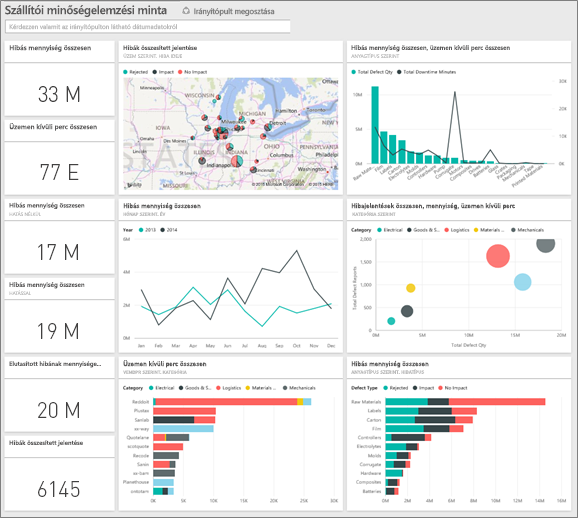

Ez a minta egy olyan sorozat részét képezi, amely bemutatja, hogyan használhatja a Power BI-t üzleti adatokkal, jelentésekkel és irányítópultokkal.
Az adatok az obviEnce-től ([www.obvience.com](http://www.obvience.com/)) származó valós, de anonimizált adatok.

## Előfeltételek

 Használat előtt a mintát [tartalomcsomagként](https://docs.microsoft.com/en-us/power-bi/sample-supplier-quality#get-the-content-pack-for-this-sample), [.pbix-fájlként](http://download.microsoft.com/download/8/C/6/8C661638-C102-4C04-992E-9EA56A5D319B/Supplier-Quality-Analysis-Sample-PBIX.pbix) vagy [Excel-munkafüzetként](http://go.microsoft.com/fwlink/?LinkId=529779) le kell töltenie.

### Tartalomcsomag letöltése ehhez a mintához

1. Nyissa meg a Power BI szolgáltatást (app.powerbi.com), és jelentkezzen be.
2. A bal alsó sarokban válassza az **Adatok lekérése** lehetőséget.
   
    
3. Ekkor megjelenik az Adatok lekérése lap. Itt kattintson a **Minták** ikonra.
   
   
4. Válassza a **Szállítói minőségelemzési mintát**, majd a **Kapcsolódás** lehetőséget.  
  
   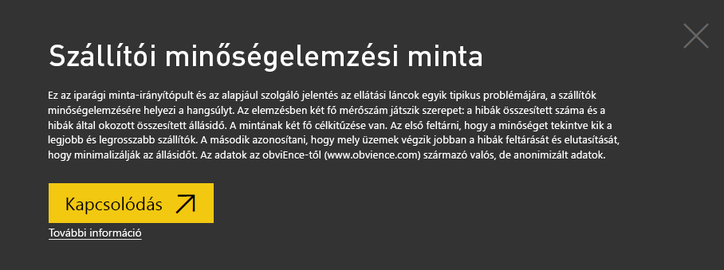
   
5. A Power BI importálja a tartalomcsomagot, és egy új irányítópultot, jelentést és adatkészletet ad hozzá az aktuális munkaterülethez. Az új tartalmakat sárga csillag jelöli. 
   
   
  
### .pbix-fájl letöltése ehhez a mintához

Lehetőség van a mintát .pbix-fájlként is letölteni, amelyet a Power BI Desktoppal való használatra terveztek. 

 * [Szállítói minőségelemzési minta](http://download.microsoft.com/download/8/C/6/8C661638-C102-4C04-992E-9EA56A5D319B/Supplier-Quality-Analysis-Sample-PBIX.pbix)

### Excel-munkafüzet letöltése ehhez a mintához
Letöltheti [kizárólag a minta adatkészletét (Excel-munkafüzetét) is](http://go.microsoft.com/fwlink/?LinkId=529779). A munkafüzet megtekinthető és módosítható Power View-lapokat tartalmaz. A nyers adatokat a **Power Pivot > Kezelés** lehetőségre kattintva nézheti meg.

## Hibás anyagok által okozott állásidő
Nézzük meg a hibás anyagok által okozott állásidők elemzését, és hogy mely gyártók voltak a felelősek.  

1. Az irányítópulton válassza a **Total Defect Quantity** (Hibák összesített száma) vagy a **Total Downtime Minutes** (Állásidő összesített percei) számcsempét.  

   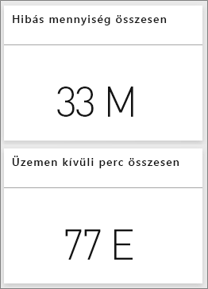  

   Ekkor megnyílik a „Supplier Quality Analysis Sample” jelentés „Downtime Analysis” (Állásidő elemzése) nevű oldala. Itt az látható, hogy összesen 33 millió hibás anyagcikkünk van, és hogy ezek összesen 77 ezer percnyi állásidőt okoztak. Vannak olyan anyagok, amelyek között kevesebb a hibás darab, azonban azok hatalmas késéseket, így hosszabb állásidőt okozhatnak. Vizsgáljuk meg ezeket az anyagokat a jelentés oldalon.  
2. Ha megnézzük, a **Defects and Downtime (min) by Material Type** (Hibák és állásidő (percben) anyagtípusok szerint) kombinált diagram **Total Downtime Minutes** (Állásidő összesített percei) sorát, akkor láthatjuk, hogy a hullámosított anyagok okozzák a leghosszabb állásidőket.  
3. Válassza ki a **Corrugate** (Hullámosított) oszlopot ebben a kombinált diagramban, hogy megnézhesse, mely üzemekre gyakorolja a legnagyobb negatív hatást, és hogy melyik gyártó a felelős.  

     
4. Válasszon ki önálló üzemeket a térképen, hogy megnézhesse, melyik gyártó vagy anyag felelős az adott üzem állásidejéért.

### Melyek a legrosszabb szállítók?
 Szeretnénk megtalálni a nyolc legrosszabb szállítót és meghatározni, hogy az állásidő hány százalékáért felelősek. Ezt úgy tehetjük meg, ha a **Downtime (min) by Vendor** (Állásidő (percben) gyártónként) területdiagramot egy fatérképre módosítjuk.  

1. A jelentés 3-ik, „Downtime Analysis” (Állásidő elemzése) nevű oldalán válassza a **Jelentés szerkesztése** lehetőséget a bal felső sarokban.  
2. Válassza ki a **Downtime (min) by Vendor** (Állásidő (percben) gyártónként) területdiagramot, majd a Megjelenítések ablaktáblán válassza a Fatérkép lehetőséget.  

   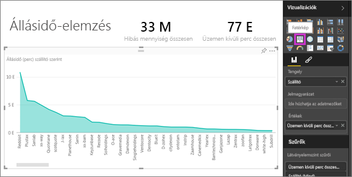  

    A fatérkép automatikusan beteszi a **Vendor** (Gyártó) mezőt a **Csoport** gyűjtőbe.  

    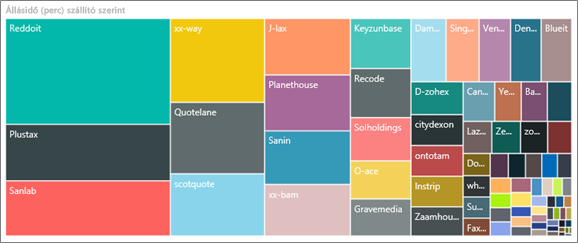  

   Ebben a fatérképben a nyolc legrosszabb gyártót a bal oldalon található nyolc blokk mutatja. Azt is láthatjuk, hogy ők felelősek az összes állásidő körülbelül 50%-áért.  
3. Válassza a **Supplier Quality Analysis Sample** lehetőséget a navigációs sáv tetején, hogy visszatérjen az irányítópultra.

### Üzemek összehasonlítása
Most pedig nézzük meg, hogy mely üzemek találják meg és utasítják el hatékonyabban a hibás anyagokat, csökkentve ezzel az állásidőt.  

1. Válassza ki a **Total Defect Reports by Plant, Defect Type** (Hibák összesített jelentése üzemek és hibatípusok szerint) térképcsempét.  

    Ekkor megnyílik a jelentés „Supplier Quality”(Szállítói minőség) nevű oldala.  

     
2. A térkép jelmagyarázatában válassza ki az **Impact** (Negatív hatás) körét.  

    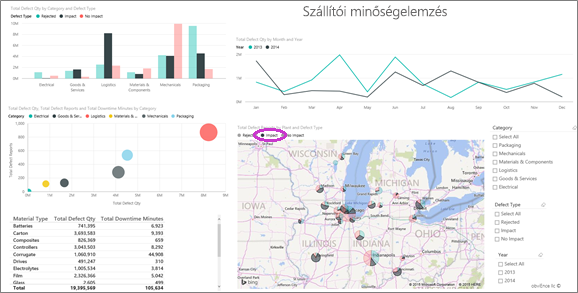  

    A buborékdiagramban látható, hogy a **Logistics** (Logisztika) a legproblémásabb kategória – a „hibák összesített száma”, „hibák összesített jelentése” és az „állásidő összesített percei” tekintetében is ez a legnagyobb. Vizsgáljuk meg alaposabban ezt a kategóriát.  
3. Válassza ki a Logistics (Logisztika) buborékját a buborékdiagramban, majd figyelje meg a Illinois állambeli Sprigfieldben és Naperville-ben található üzemeket. Naperville láthatóan jobban kezeli a hibás anyagokat, ugyanis sokszor elutasítja azokat, amelyek így csak kevésszer vannak rá negatív hatással, míg Springfield esetén nagyobb számú negatív hatást figyelhetünk meg.  

   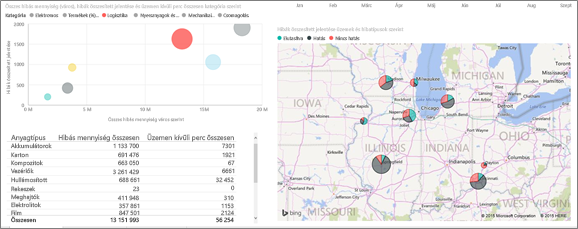  
4. Válassza a **Supplier Quality Analysis Sample** lehetőséget a navigációs sáv tetején, hogy visszatérjen az aktív munkaterületére.

## Melyik anyagot kezelik a legjobban?
Azokat az anyagokat kezelik a legjobban, amelyek a legkevesebb állásidőt okozzák, vagy amelyeknél a hibás anyagok – mennyiségüktől függetlenül – nincsenek negatív hatással.

* Az irányítópulton nézze meg a **Total Defect Quantity by Material Type, Defect Type** (Hibák összesített száma anyagtípus és hibatípusok szerint) csempét.

  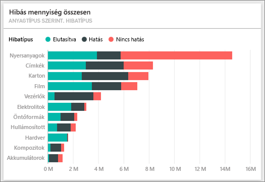

Látható, hogy a **Raw Materials** (Nyersanyagok) esetében nagyon magas a hibák összes száma, azonban ezek többsége el lett utasítva vagy nem gyakorolt negatív hatást.

Ellenőrizzük, hogy a nyersanyagok a nagy mennyiségű hibás anyag ellenére nem okoznak sok állásidőt.

* Az irányítópulton nézze meg a **Total Defect Qty, Total Downtime Minutes by Material Type** (Hibák összesített száma, Állásidő összesített percei anyagtípusok szerint) csempét.

  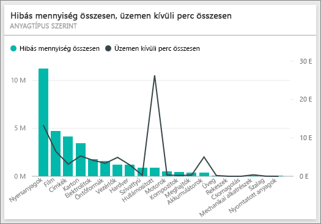

Látható, hogy a nyersanyagokat jól kezelik: több közöttük a hibás, de kevesebb percnyi összes állásidőt okoznak.

### Hibák és állásidő összehasonlítása évek szerint
1. Válassza ki a **Total Defect Reports by Plant, Defect Type** (Hibák összesített jelentése üzemek és hibatípusok szerint) térképcsempét, hogy megnyissa a jelentés első, „Supplier Quality” (Szállítói minőség) nevű oldalát.
2. Észrevehető, hogy a **Defect Qty** (Hibás anyagok mennyisége) 2014-ben nagyobb, mint 2013-ban.  

    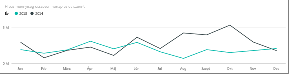  
3. Vajon a hibák megnövekedett száma több állásidőt is maga után von? Hogy ezt megtudjuk, feltehetünk egy kérdést a Q&A mezőben.  
4. Válassza a **Supplier Quality Analysis Sample** lehetőséget a navigációs sáv tetején, hogy visszatérjen az irányítópultra.  
5. Mivel már tudjuk, hogy a nyersanyagok esetén a legmagasabb a hibák száma, írjuk be a kérdés mezőbe a „show material types, year and total defect qty” (mutassa az anyagtípusokat, az évet és a hibák összesített számát) kérdést.  

    Sokkal több hibás nyersanyag volt 2014-ben, mint 2013-ban.  

    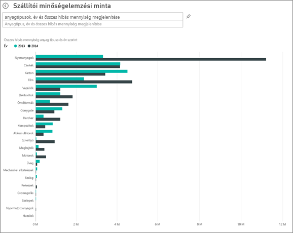  
6. Változtassuk meg a kérdést a „show material types, year and total downtime minutes” (mutassa az anyagtípusokat, az évet és az állásidő összesített perceit) kérdésre.  

   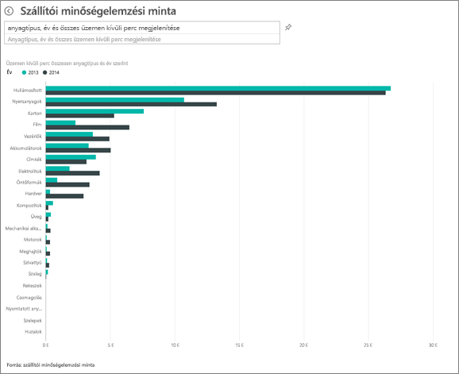

A nyersanyagok által okozott állásidők nagyjából megegyeztek 2013-ban és 2014-ben, dacára annak, hogy 2014-ben sokkal több nyersanyag volt hibás.

Kiderült, hogy 2014-ben a hibás nyersanyagok megnövekedett száma nem vonta maga után a hibás nyersanyagok által okozott állásidő növekedését.

### Hibák és állásidő összehasonlítása hónapról hónapra
Nézzünk meg egy másik, szintén a hibák összesített számához kapcsolódó irányítópult-csempét.  

1. Válassza a bal felső sarokban a kérdés mező felett található visszafelé mutató nyilat , hogy visszajusson az irányítópultjára.  

    Ha alaposabban megvizsgálja a **Total Defect Quantity by Month, Year** (Hibák összesített száma hónapok és évek szerint) csempét, észreveheti, hogy 2014 első felében hasonló mennyiségű hibás anyag volt, mint 2013-ban, azonban 2014 második felében a hibás anyagok száma ugrásszerűen megnőtt.  

    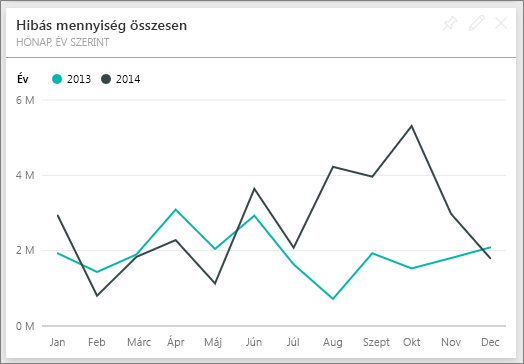  

    Nézzük meg, hogy ez maga után vont-e egy azonos mértékű növekedést az állásidő perceiben.  
2. Írja be a keresőmezőbe a „total downtime minutes by month and year as a line chart” (állásidő összesített percei, hónapok és évek szerint, vonaldiagramként) kérdést.  

   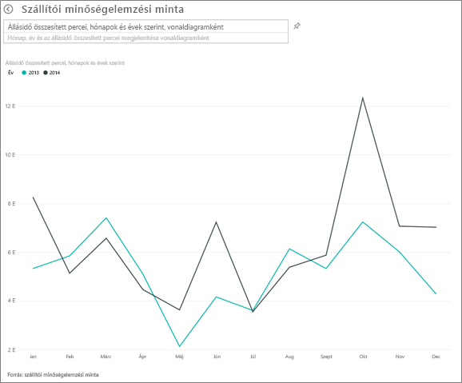

   Látható az állásidő percek ugrásszerű növekedése júniusban és októberben, de ezt leszámítva a hibás anyagok számának ugrásszerű növekedése nem eredményezett jelentős növekedést az állásidőben. Ez azt mutatja, hogy jól kezeljük a hibás anyagokat.  
3. Válassza a kérdés mezőtől jobbra található gombostű ikont , hogy kitűzze ezt a diagramot az irányítópultján.  
4. A kiugró hónapok vizsgálatához tegyen fel különböző kérdéseket, például a „total downtime minutes in October by plant”(állásidő összesített percei októberben üzemek szerint) kérdést, hogy megnézze az októberi állásidő perceit anyagtípusok szerint, az üzemek helyszíne szerint, kategória szerint stb.    
5. Válassza a bal felső sarokban a kérdés mező felett található visszafelé mutató nyilat , hogy visszajusson az irányítópultjára.

Ebben a környezetben nyugodtan kipróbálhat bármit. Bármikor dönthet úgy, hogy nem menti a változtatásokat. De ha mégis mentené őket, bármikor lekérheti a minta egy új másolatát az **Adatok lekérése** lehetőséggel.

## Következő lépések: Kapcsolódás saját adatokhoz
Reméljük, ebből a bemutatóból megtudta, hogyan elemezheti a szállítók minőségét Power BI-irányítópultok, a Q&A és Power BI-jelentések használatával. Most Önön a sor – kapcsolódjon a saját adataihoz. A Power BI használatával számos különböző adatforráshoz kapcsolódhat. További tudnivalók a [Power BI használatának első lépéseiről](service-get-started.md).
