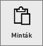
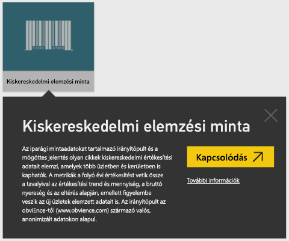
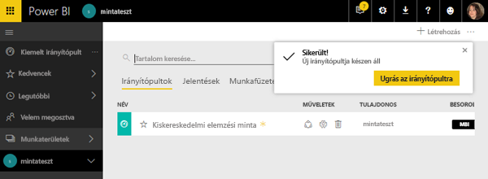
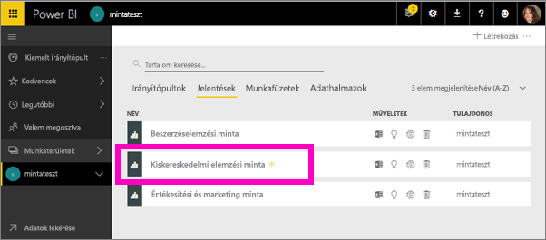
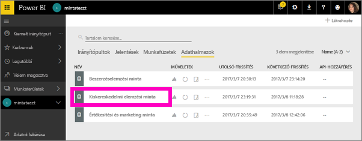
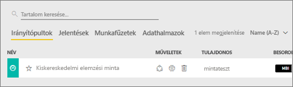
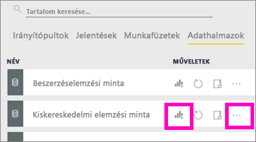
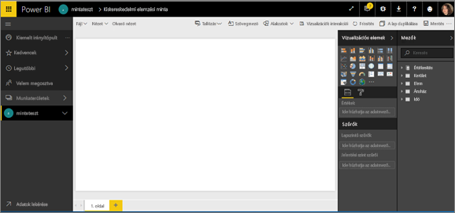
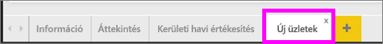
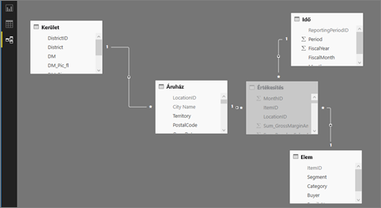

# Power BI-példák

Javasoljuk, hogy először [A Power BI mintaként használható adatkészletei](sample-datasets.md) cikket olvassa el. Ebben a cikkben megismerkedhet a mintákkal, azok beszerzésével, mentési helyével, használatával, valamint az egyes mintákhoz kapcsolódó történetekkel. Ha pedig már tisztában van az alapokkal, akkor térjen vissza ehhez az oktatóanyaghoz.   

### Előfeltételek
A minták elérhetőek a Power BI szolgáltatáshoz és a Power BI Desktophoz is. A lépésekhez a Kiskereskedelmi elemzési mintát fogjuk használni.

Az ebben az oktatóanyagban használt *Kiskereskedelmi elemzési* minta tartalomcsomag irányítópultot, jelentést és adatkészletet is tartalmaz.
Ahhoz, hogy megismerkedjen az adott tartalomcsomaggal és az ahhoz tartozó forgatókönyvvel, lehetséges, hogy először érdemes megtekintenie [a Kiskereskedelmi elemzési minta bemutatóját](sample-retail-analysis.md).

## Az oktatóanyag ismertetése
Ez az oktatóanyag az alábbi témákat ismerteti: 
- Hogyan importálható tartalomcsomag-minta, hogyan adható hozzá a Power BI szolgáltatáshoz, és hogyan nyitható meg a tartalom. A *tartalomcsomagok* olyan típusú minták, ahol az adatkészlethez irányítópult és jelentés is mellékelve van. 
-  Hogyan nyitható meg a mintát tartalmazó .pbix-fájl a Power BI Desktopban.

## Minták és a Power BI szolgáltatás

1. Nyissa meg a Power BI szolgáltatást, és jelentkezzen be (app.powerbi.com).
2. A bal oldali navigációs ablaktábla alján kattintson az **Adatok lekérése** elemre. Ha nem látja az **Adatok lekérése** elemet, a  lehetőség kiválasztásával bővítse ki a navigációs panelt.
   
   
5. Válassza a **Minták** lehetőséget.  
   
   
6. Válassza a *Kiskereskedelmi elemzési minta* elemet, majd a **Kapcsolódás** lehetőséget.   
   
   

## Pontosan mit is importáltunk?
A mintaként használható tartalomcsomagok esetében a **Kapcsolódás** lehetőség kiválasztásakor a Power BI tulajdonképpen az adott tartalomcsomag másolatát tölti be és tárolja az Ön számára a felhőben. Mivel a tartalomcsomagot létrehozó személy adatkészletet, jelentést és irányítópultot is foglalt a csomagba – a **Kapcsolódás** lehetőségre történő kattintáskor mindezek lekérése megtörténik. 

1. A Power BI létrehozza az új irányítópultot, és felveszi azt az **Irányítópultok** lapon található listára. Sárga csillag jelzi, hogy új elemről van szó.
   
   
2. Nyissa meg a **Jelentések** lapot.  Itt egy új, *Retail Analysis Sample* (Kiskereskedelmi elemzési minta) nevű jelentést fog látni.
   
   
   
   Ezt követően tekintse meg az **Adatkészletek** lapot.  Található itt egy új adatkészlet is.
   
   

## Az új tartalmak vizsgálata
Most vizsgálja meg saját maga is az irányítópultot, az adatkészletet és a jelentést. Számos lehetséges módja van az irányítópultok, jelentések és adatkészletek közötti navigációnak, az alábbiakban ezek közül csupán egyet mutatunk be.  

> [!TIP]
> Szeretne egy kis kezdeti segítséget?  [A Kiskereskedelmi elemzési minta bemutatója](sample-retail-analysis.md) részletes útmutatóval szolgál ehhez a mintához.
> 
> 

1. Lépjen vissza az **Irányítópultok** lapra, és válassza a *Retail Analysis Sample* (Kiskereskedelmi elemzési minta) irányítópultot annak megnyitásához.    
   
   
2. Ekkor megnyílik az irányítópult.  Az irányítópulton számos vizualizáció-csempe található.
   
   
3. Válassza ki az egyik csempét az alapul szolgáló jelentés megnyitásához.  Ebben a példában a területdiagramot (rózsaszín kerettel jelöltük az előző képen) választjuk ki. A jelentés a területdiagramot tartalmazó oldalnál nyílik meg.
   
    
   
   > [!NOTE]
   > Ha az adott csempe a [Power BI Q&A](power-bi-q-and-a.md) szolgáltatásával lett létrehozva, akkor a Q&A oldalnak kellett volna megnyílnia. Ha a csempét az [Excelből rögzítették](service-dashboard-pin-tile-from-excel.md), akkor az Excel Online nyílt volna meg a Power BI-ban.
   > 
   > 
1. Lépjen vissza az **Adatkészletek** lapra, ahol az adatkészlet átvizsgálását illetően számos lehetőség közül választhat.  Nem tudja megnyitni és megtekinteni az összes sort és oszlopot (ahogy a Power BI Desktop vagy az Excel esetében meg tudná tenni).  Ha valaki megoszt egy tartalomcsomagot a kollégáival, akkor jellemzően az elemzéseket kívánja megosztani, nem pedig közvetlen hozzáférést adni a kollégáinak az adatokhoz. Ez azonban nem jelenti azt, hogy ne tudná elvégezni az adatkészlet átvizsgálását.  
   
   
   
   * Az adatkészlet átvizsgálásának egyik módja, ha az alapoktól kezdve létrehozza saját vizualizációit és jelentéseit.  Kattintson a diagram ikonra  az adatkészlet jelentésszerkesztési módban történő megnyitásához.
     
       
   * Az adatkészlet átvizsgálásának másik módja a [Gyors elemzések](service-insights.md) szolgáltatás futtatása. Kattintson a három pontra (...), és válassza az **Elemzések lekérése** lehetőséget. Ha az elemzések elkészültek, válassza az **Elemzések megtekintése** lehetőséget.
     
       

## Minták és a Power BI Desktop 
Amikor először nyitja meg a PBIX-fájlt, az Jelentés nézetben nyílik meg, amelyben bármennyi, vizualizációt tartalmazó jelentésoldalt megvizsgálhat, létrehozhat és módosíthat. A Jelentés nézet felülete nagyjából ugyanazzal a kialakítással rendelkezik, mint egy jelentés Szerkesztési nézete a Power BI szolgáltatásban. Többek között áthelyezheti a vizualizációkat, vagy másolhatja, beillesztheti és egyesítheti őket.

A különbség az, hogy ha a Power BI Desktopot használja, dolgozhat lekérdezésekkel, és modellezheti az adatokat annak érdekében, hogy az adatai a legjobb elemzést tegyék lehetővé a jelentésekben. Ezután mentheti a Power BI Desktop-fájlt bárhová, ahová szeretné, legyen az a helyi lemez vagy a felhő.

1. Nyissa meg a [Kiskereskedelmi elemzési minta .pbix-fájlját](http://download.microsoft.com/download/9/6/D/96DDC2FF-2568-491D-AAFA-AFDD6F763AE3/Retail%20Analysis%20Sample%20PBIX.pbix) a Power BI Dekstopban. 

    

1. A fájl Jelentés nézetben nyílik meg. Figyelje meg, hogy a jelentésszerkesztő alján négy lapfül jelenik meg. Ez azt jelzi, hogy a jelentés 4 oldalt tartalmaz, és az aktuálisan kiválasztott oldal a „New Stores” (Új üzletek). 

    .

3. Ha a jelentésszerkesztőt részletesebben is szeretné megismerni, olvassa el [A jelentésszerkesztő bemutatása](service-the-report-editor-take-a-tour.md) című témakört.

## Pontosan mit is importáltunk?
Amikor a Desktopban megnyitja a minta PBIX-fájlt, a Power BI valójában az adatok másolatát használja, és az adatokat a felhőben tárolja. A Desktopból elérhető a jelentés és az ***alapul szolgáló adatkészlet*** is. Az adatok betöltésekor a Power BI Desktop megkísérli megkeresni és létrehozni a kapcsolatokat Ön helyett.  

1. A táblázat  ikont választva válthat [Adatnézetre](desktop-data-view.md).
 
    

    Az Adatnézet segítségével megvizsgálhatja, felderítheti és megismerheti Power BI Desktop-modellben lévő adatokat. Az adatnézettel másképp tekintheti meg a táblákat, oszlopokat és adatokat, mint a Lekérdezésszerkesztőben. Az adatnézettel a modellbe való betöltésük után tekintheti meg az adatokat.

    Az adatok modellezésekor előfordulhat, hogy csak meg szeretné tekinteni egy tábla vagy oszlop aktuális tartalmát anélkül, hogy ehhez egy vizualizációt vagy jelentésvásznat kellene létrehoznia akár a sorok szintjéig. Ez különösen jellemző, amikor mértékeket vagy számított oszlopokat hoz létre, vagy amikor azonosítani szeretné az adatok típusát vagy kategóriáját.

1. A  ikont választva válthat [Kapcsolat nézetre](desktop-relationship-view.md).
 
    

    A Kapcsolat nézet megjeleníti a modellben szereplő összes táblát, oszlopot és kapcsolatot. Itt létrehozhat kapcsolatokat, valamint megtekintheti és módosíthatja is azokat.

## Az új tartalmak vizsgálata
Most vizsgálja meg saját maga is az adatkészletet, a kapcsolatokat és a jelentést. Az első lépésekhez segítséget kaphat az [Első lépések a Desktop használatához](desktop-getting-started.md) című témakörben.    

## Következő lépések
[Power BI – Alapfogalmak](service-basic-concepts.md)

[Minták a Power BI szolgáltatáshoz](sample-datasets.md)

[Power BI-adatforrások](service-get-data.md)

További kérdései vannak? [Kérdezze meg a Power BI közösségét](http://community.powerbi.com/)

