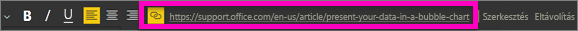
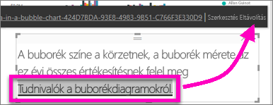

# Hivatkozás hozzáadása szövegmezőhöz egy jelentésben
A szövegmezőket hozzá lehet adni jelentésekhez, rögzíteni lehet irányítópultokra a jelentésekből, és hozzá lehet őket közvetlenül adni az irányítópultokhoz. A hivatkozásokat hozzá lehet adni a szövegmezőkhöz, függetlenül attól, hol vannak.  

> **MEGJEGYZÉS**: A Power BI-táblákban és -mátrixokban szereplő hivatkozáskoról lásd: [Hivatkozások a táblákban](power-bi-hyperlinks-in-tables.md). A szövegdobozok **irányítópulthoz** való hozzáadásáról lásd: [Csempe hozzáadása közvetlenül az irányítópultról](service-dashboard-add-widget.md). 
> 
> 

<iframe width="560" height="315" src="https://www.youtube.com/embed/_3q6VEBhGew#t=0m55s" frameborder="0" allowfullscreen></iframe>

## Hivatkozás hozzáadása szövegmezőhöz egy jelentésben
1. [Hozzon létre egy szövegmezőt, és írjon bele valamilyen szöveget](power-bi-reports-add-text-and-shapes.md). 
2. Emelje ki a meglévő szöveget, vagy adjon hozzá új szöveget hivatkozásként való használathoz.
   
   
3. Kattintson a hivatkozás ikonra  .
4. Írja vagy illessze be az URL-címet a hivatkozás mezőbe, és kattintson a **Kész** gombra.
   
   
5. Ellenőrizze a hivatkozást.  
   
   
   
   * Vigye a kurzort a kijelölt szöveg tetszőleges részére az URL-cím megjelenítéséhez.  
     
      
   * Kattintson az URL-címre a lap új böngészőablakban való megnyitásához.

## A hivatkozásnak a szöveg megtartásával való eltávolításához
1. A szövegmezőben jelölje ki a hivatkozást a kiemeléséhez,
   
     
2. Válassza az **Eltávolítás** gombot. 

## Következő lépések
[Szövegmezők Power BI-jelentésekben](power-bi-reports-add-text-and-shapes.md)

További kérdései vannak? [Kérdezze meg a Power BI közösségét](http://community.powerbi.com/)

