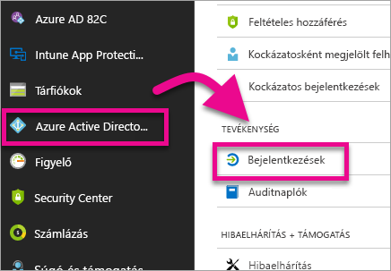
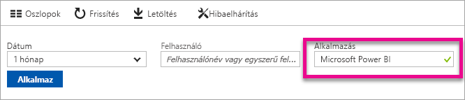
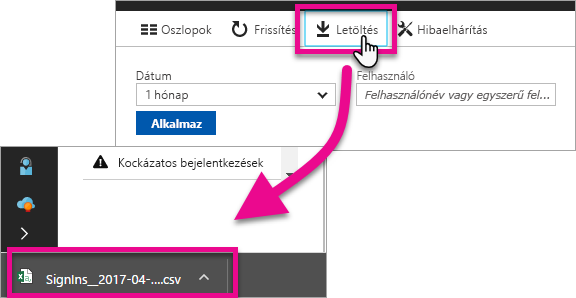

# Bejelentkezett Power BI-felhasználók keresése
Ha Ön egy bérlői rendszergazda, és szeretné megtekinteni a Power BI-ba bejelentkezett felhasználók listáját, használhatja ehhez az Azure Active Directory hozzáférési és használati jelentéseit.

<iframe width="640" height="360" src="https://www.youtube.com/embed/1AVgh9w9VM8?showinfo=0" frameborder="0" allowfullscreen></iframe>

A tevékenységjelentést az [új](https://docs.microsoft.com/azure/active-directory/active-directory-reporting-activity-sign-ins) és a [klasszikus](https://docs.microsoft.com/azure/active-directory/active-directory-view-access-usage-reports) Azure Active Directory- (Azure AD) portálon egyaránt elérheti. A fenti videó a klasszikus portált használja példaként, de a jelen cikk az új portál használatát ismerteti.

> [!NOTE]
> Ez a tevékenységjelentés a Power BI ingyenes és Pro-felhasználóit egyaránt tartalmazza, és nem különbözteti meg a felhasználókat a licencük alapján.
> 
> 

## Követelmények
A bejelentkezési tevékenységek jelentésének megtekintéséhez az alábbi követelményeknek kell megfelelnie.

* Az adatok eléréséhez globális rendszergazdai, biztonsági rendszergazdai vagy biztonsági olvasói szerepkör szükséges.
* A saját bejelentkezéseikhez minden (nem rendszergazdai) felhasználó hozzáférhet.
* A bejelentkezési tevékenységek teljes jelentésének megtekintéséhez a bérlőnek Prémium szintű Microsoft Azure AD-licenccel kell rendelkeznie.

## Bejelentkezések megtekintése az Azure-portállal
Az Azure AD-portálon megtekintheti a bejelentkezési tevékenységeket.

1. Nyissa meg az **Azure-portált**, és válassza az **Azure Active Directory** lehetőséget.
2. Válassza a **Tevékenység** csoportban lévő **Bejelentkezések** lehetőséget.
   
    
3. Szűrjön a kívánt alkalmazásra a **Microsoft Power BI** vagy a **Power BI Gateway** lehetőség választásával, majd válassza az **Alkalmaz** gombot.
   
    A **Microsoft Power BI** lehetőség választásával a szolgáltatáshoz kapcsolódó bejelentkezési tevékenységeket tekintheti meg, a **Power BI Gateway** lehetőség választása esetén pedig a Helyszíni adatátjáróhoz kapcsolódó bejelentkezési adatok láthatók.
   
    

## Az adatok exportálása
A bejelentkezési adatokat kétféle módon exportálhatja. Egy CSV-fájl letöltésével, illetve a PowerShell használatával.

### CSV-fájl letöltése
A tevékenységlapon válassza az eszköztár **Letöltés** gombját. Ezzel a gombbal letöltheti a szűrt adatokat egy CSV-fájlban.

### PowerShell
A bejelentkezési adatokat PowerShell segítségével is exportálhatja. Elérhető ehhez egy [minta](https://docs.microsoft.com/azure/active-directory/active-directory-reporting-api-sign-in-activity-samples#powershell-script) az Azure AD dokumentációjában.

> [!NOTE]
> A PowerShell-minta használatához kövesse az [Azure AD Reporting API elérésének előfeltételeit](https://docs.microsoft.com/azure/active-directory/active-directory-reporting-api-prerequisites).
> 
> 

## Adatmegőrzés
A bejelentkezéshez kapcsolódó adatok legfeljebb 30 napig érhetők el. Bővebb információt az [Azure Active Directory-jelentések adatmegőrzési szabályzatában](https://docs.microsoft.com/azure/active-directory/active-directory-reporting-retention) találhat.

## Következő lépések
[Bejelentkezési tevékenységre vonatkozó jelentések az Azure Active Directory portálon (Új portál)](https://docs.microsoft.com/azure/active-directory/active-directory-reporting-activity-sign-ins)  
[Hozzáférési és használati jelentések megtekintése (Klasszikus portál)](https://docs.microsoft.com/azure/active-directory/active-directory-view-access-usage-reports#view-or-download-a-report)  
[Minta PowerShell-parancsfájl a bejelentkezések megtekintéséhez](https://docs.microsoft.com/azure/active-directory/active-directory-reporting-api-sign-in-activity-samples#powershell-script)  
[Az Azure Active Directory-jelentések adatmegőrzési szabályzata](https://docs.microsoft.com/azure/active-directory/active-directory-reporting-retention)  
[Naplózás használata a cégnél](service-admin-auditing.md)  
[A Pro próbaverzió kiterjesztett aktiválása](service-extended-pro-trial.md)

További kérdései vannak? [Kérdezze meg a Power BI közösségét](https://community.powerbi.com/)

