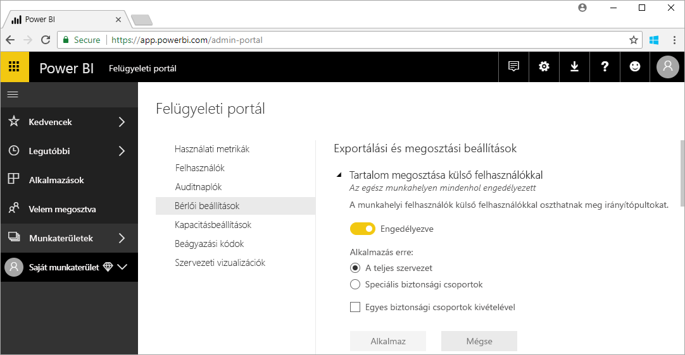

# Mit jelent a Power BI-felügyelet?

A Power BI-felügyelet egy Power BI-bérlő kezelését jelenti, beleértve az irányítási szabályzatok konfigurálását, a használat figyelését, valamint a licencek, a kapacitás és a szervezeti erőforrások üzembe helyezését is. Ez a cikk áttekintést nyújt a felügyeleti szerepekről, a feladatokról és az eszközökről, és további részleteket tartalmazó forrásokra mutató hivatkozásokat is felsorol.

A Power BI-t önkiszolgáló üzleti intelligenciához terveztük, a rendszergazda pedig felügyeli a Power BI-bérlőn belüli adatokat, folyamatokat és szabályzatokat. A Power BI-rendszergazda kulcsfontosságú tagja annak a csapatnak, amelyben részt vesznek még a BI-fejlesztők, az elemzők és más szerepkörrel rendelkezők is. A rendszergazda segít abban, hogy a szervezet elérje a legfontosabb célkitűzéseket:

- Információ arról, hogy a felhasználóknak milyen KPI-kre és metrikákra van _ténylegesen_ szüksége
- A szállítási idő csökkentése az IT által vezetett vállalati jelentéseknél
- A Power BI-üzembehelyezés bevezetésének és a befektetési megtérülésnek a növelése

A fő feladat az, hogy az üzleti felhasználók eredményesebbek lehessenek, és hogy biztosítani lehessen a jogszabályi és az egyéb szabályozásoknak való megfelelőséget. A feladatok közé tartozhat a segítségnyújtás és támogatás, és sok esetben az is, hogy az üzleti felhasználókat segítse a munkavégzésben.

## A Power BI-jal kapcsolatos rendszergazdai szerepkörök

A Power BI-adminisztrációhoz számos szerepkör kapcsolódik, amelyeket az alábbi táblázatban foglaltunk össze.

| **Rendszergazdatípus** | **Felügyeleti hatókör** | **Power BI-hatókör** |
| --- | --- | --- |
| Office 365 globális rendszergazda | Office 365 | Felügyelheti a Power BI-bérlő és más szolgáltatások minden aspektusát. |
| Office 365 számlázási adminisztrátor | Office 365 | Power BI-licenceket szerezhet be az Office 365-előfizetéseken keresztül. |
| Power BI-szolgáltatásadminisztrátor | Power BI-bérlő | Teljes felügyeleti jogosultsága van a Power BI-bérlőre és annak felügyeleti funkcióira vonatkozóan (kivéve a licencelést). |
| Power BI Prémium kapacitásadminisztrátor | Egy Prémium-kapacitás | Teljes körű felügyelettel rendelkezik a prémium szintű kapacitás és annak adminisztratív funkciói fölött. |
| Power BI Embedded kapacitásadminisztrátor | Egy Embedded-kapacitás | Teljes körű felügyelettel rendelkezik az embedded szintű kapacitás és annak adminisztratív funkciói fölött. |

Az Office 365 és az Azure Active Directory globális rendszergazdáinak rendszergazdai jogosultságai vannak a Power BI-ban. Az Office 365 globális rendszergazdája más felhasználókhoz rendelhetnek Power BI-rendszergazdai szerepköröket, amely csak a Power BI-funkciókra vonatkozó felügyeleti jogosultságot biztosít.

A Power BI szolgáltatás-rendszergazdáinak hozzáférése van a Power BI portálhoz, ahol a működéssel, a biztonsággal és a figyeléssel kapcsolatos különféle bérlőszintű beállítások érhetőek el. A szolgáltatás-rendszergazdák teljes hozzáféréssel rendelkeznek a Power BI-bérlő összes erőforrásához. A szolgáltatás-rendszergazdák a legtöbb esetben azonosítják a problémákat, majd az erőforrás tulajdonosát kérik fel a hiba elhárítására.

A Power BI szolgáltatás-rendszergazdai szerepköre nem tartalmaz jogosultságot licencek felhasználókhoz való hozzárendeléséhez vagy az auditnaplók megtekintéséhez az Office 365-ben. Ezért jelenleg a Power BI nem felügyelhető teljes mértékben olyan felhasználók által, akik kizárólag Power BI-szolgáltatásrendszergazdai szerepkörrel rendelkeznek.

## Felügyeleti feladatok

A rendszergazdák sokféle feladatot látnak el a Power BI-bérlő szervezeten belüli támogatásához. Ezeket a feladatokat az alábbi táblázatban foglaltuk össze.

| **Feladatkör** | **Tipikus feladatok** |
| --- | --- |
| A Power BI-bérlő kezelése |<ul><li>Kulcsfontosságú Power BI-funkciók engedélyezése és letiltása <li>Jelentéskészítés a használatról és a teljesítményről <li>Auditálási események áttekintése és kezelése</ul>|
| Power BI-licencek beszerzése és hozzárendelése |<ul><li>Felhasználók feliratkozásának kezelése <li>Pro-licencek vásárlása és hozzárendelése <li>Felhasználók Power BI-hozzáférésének letiltása</ul>|
| Prémium szintű kapacitás kezelése |<ul><li>Prémium kapacitás beszerzése és kezelése <li>A szolgáltatás színvonalának biztosítása|
| Embedded-kapacitás kezelése |<ul><li>Embedded-kapacitás beszerzése a Power BI-funkciók használatának egyszerűbbé tétele érdekében független szoftverszolgáltatók és fejlesztők számára</ul>|
| Belső szabályzatoknak, jogszabályoknak és előírásoknak való megfelelőség biztosítása | <ul><li>Besorolás és üzleti adatok kezelése <li>Tartalom közzétételére és megosztásra vonatkozó szabályzatok betartatása</ul>|
| Power BI-erőforrások kezelése |<ul><li>Munkaterületek kezelése <li>Egyéni vizualizációk közzététele <li>A Power BI más alkalmazásokban való beágyazásához használt kódok ellenőrzése|
| A bérlő felhasználóinak támogatása és segítségnyújtás számukra |<ul><li>Adathozzáférési és más problémák elhárítása</ul>|
| Egyéb feladatok |<ul><li>A Power BI Desktop üzembe helyezése például a System Center Configuration Manager használatával <li>A Power BI mobilalkalmazás üzemelő példányainak kezelése az Intune-nal <li>Az adatvédelem és a biztonság, többek között a forrásadatok biztonságának kezelése</ul>|

## Felügyeleti eszközök

A Power BI-adminisztrációhoz számos eszköz használható, amelyeket az alábbi táblázatban foglaltunk össze. A rendszergazdák a legtöbb időt általában a Power BI felügyeleti portálján töltik, és szükség szerint más eszközöket is használhatnak.

| **Eszköz** | **Tipikus feladatok** |
| --- | --- |
| Power BI felügyeleti portál |<ul><li>Felhasználók Power BI-hozzáférésének letiltása <li>Prémium kapacitás beszerzése és kezelése <li>A szolgáltatás színvonalának biztosítása <li>Besorolás és üzleti adatok kezelése <li>Tartalom közzétételére és megosztásra vonatkozó szabályzatok betartatása <li>Munkaterületek kezelése <li>Egyéni vizualizációk közzététele <li>A Power BI más alkalmazásokban való beágyazásához használt kódok ellenőrzése <li>Adathozzáférési és más problémák elhárítása</ul>|
| Office 365 Felügyeleti központ |<ul><li>Felhasználók feliratkozásának kezelése <li>Pro-licencek vásárlása és hozzárendelése</ul>|
| Office 365 Security & Compliance Center |<ul><li>Auditálási események áttekintése és kezelése</ul>|
| Az Azure Active Directory (AAD) az Azure Portalon |<ul><li>További hozzáférési engedélyek konfigurálása a Power BI-erőforrásokhoz az AAD használatával <li>Power BI Embedded-kapacitás kiépítése</ul>|
| PowerShell-parancsmagok |<ul><li>Munkaterületek és más Power BI-funkciók kezelése parancsfájlokkal</ul>|
| Felügyeleti API-k |<ul><li>A Power BI-rendszergazdai feladatokhoz egyéni felügyeleti eszközöket is létrehozhat. A Power BI Desktoppal használhatóak például az alábbi API-k a felügyelethez kapcsolódó adatokat használó jelentések létrehozására</ul>|

## Következő lépések

Ebből a cikkből megismerhette a Power BI-rendszergazdai feladatok lényegesebb aspektusait, az egyes szerepköröket, a hozzájuk kapcsolódó feladatokat és a felhasználható eszközöket. Ha közelebbről is meg szeretné ismerni ezeket, az alábbi két forrást ajánljuk figyelmébe.

[A Power BI felügyeleti portál használata](service-admin-portal.md)

[Gyakori kérdések a Power BI-felügyelettel kapcsolatban](service-admin-faq.md)

További kérdései vannak? [Kérdezze meg a Power BI közösségét](http://community.powerbi.com/)

