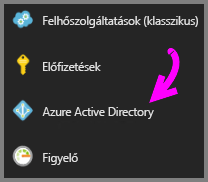
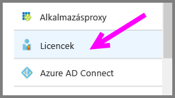
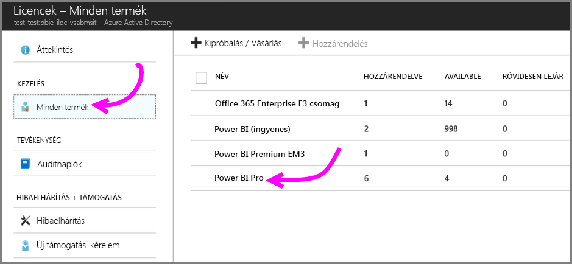
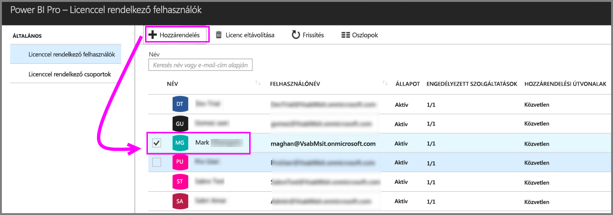

# Rövid útmutató: Power BI Pro-licencek felhasználókhoz rendelése az Azure-ban

A Power BI Pro egyéni licenc, amely hozzáférést biztosít a Power BI szolgáltatásban minden tartalomhoz és funkcióhoz, többek között megosztható a tartalom, és lehetőség van más Pro-felhasználókkal való együttműködésre is. Csak a Pro szintű felhasználók tehetnek közzé és használhatnak tartalmat alkalmazás-munkaterületeken, oszthatnak meg irányítópultokat, és iratkozhatnak fel irányítópultokra és jelentésekre. Ez a cikk azt ismerteti, hogyan végezhető el a Power BI Pro-licenc hozzárendelése az Azure-ban. Licenceket az [Office 365-ben is hozzárendelhet](service-admin-assigning-power-bi-pro-licenses.md).

## Előfeltételek

A Power BI által Active Directory-keresésekhez használt Azure-előfizetés tulajdonosának kell lennie.

A kezdéshez [legalább egy licencet meg kell vásárolnia](service-admin-purchasing-power-bi-pro.md).

## Licencek hozzárendelése egyéni felhasználói fiókokhoz

Az alábbi lépésekkel rendelheti hozzá a Power BI Pro-licenceket egyéni felhasználói fiókokhoz:

1. Nyissa meg az [Azure Portalt](https://ms.portal.azure.com/#@microsoft.onmicrosoft.com/dashboard/private/39bc3cf7-31a4-43f6-954c-f2d69ca2f0). 

2. A bal oldali navigációs sávon válassza az **Azure Active Directory** lehetőséget.

    

3. Az **Azure Active Directory** alatt válassza a **Licencek** lehetőséget.

    

4. A **Licencek** alatt válassza a **Minden termék**, majd a **Power BI Pro** lehetőséget a licenccel rendelkező felhasználók listájának megjelenítéséhez.

    

5. Power BI Pro-licenc további felhasználói fiókhoz való rendeléséhez válassza a **Hozzárendelés** lehetőséget.

    

## Következő lépések

Javasoljuk, hogy a licencek hozzárendelése után ismerkedjen meg közelebbről is a Power BI Pro használatával.

[A Power BI Pro használata a szervezetben](service-admin-power-bi-pro-in-your-organization.md)

[Bejelentkezett Power BI-felhasználók keresése](service-admin-access-usage.md)

További kérdései vannak? [Kérdezze meg a Power BI közösségét](https://community.powerbi.com/)