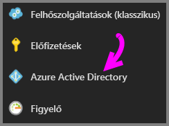
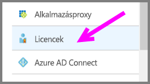
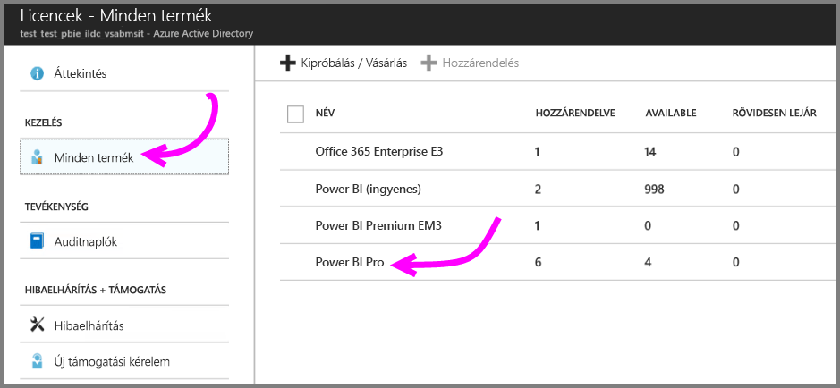
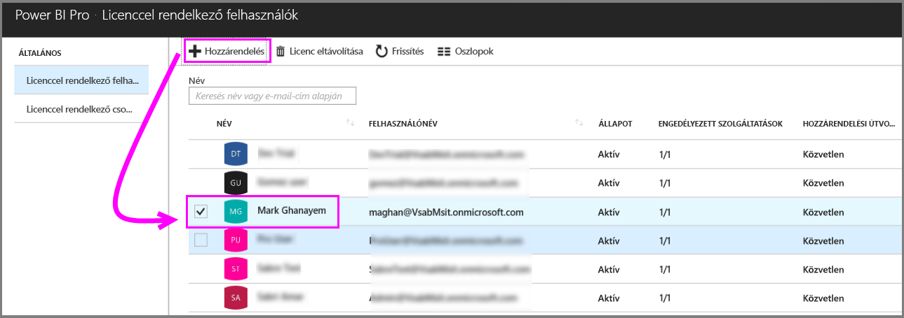
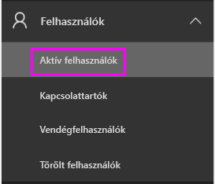
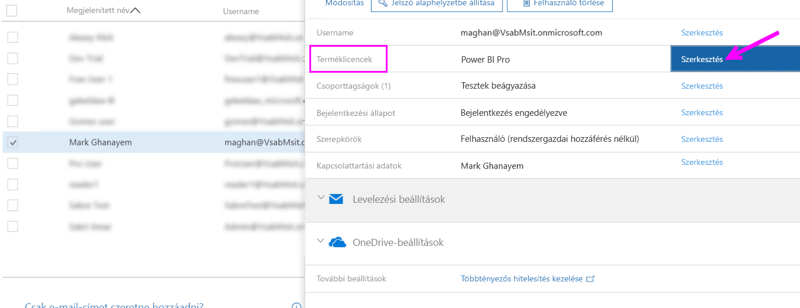
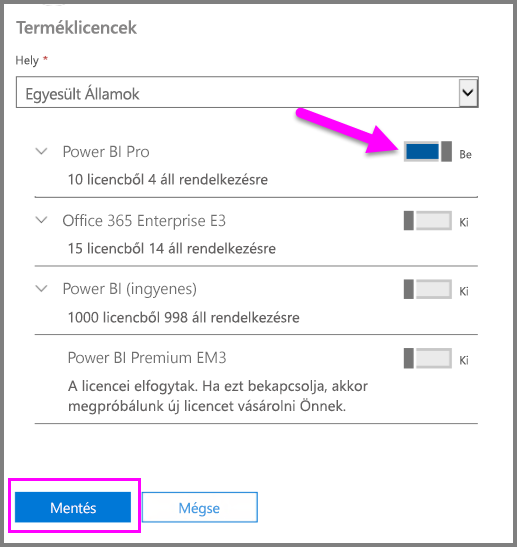
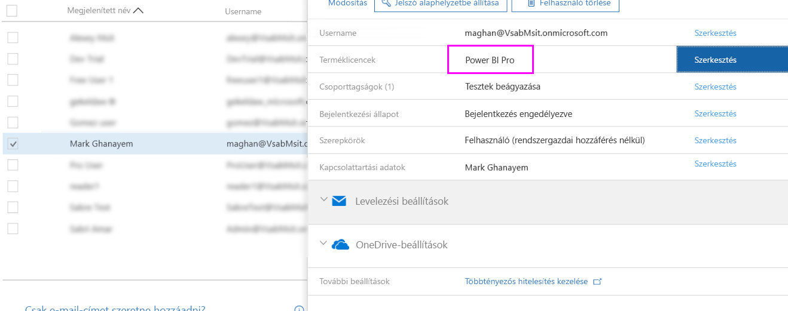

# Power BI Pro-licencek felhasználókhoz rendelése

A rendszergazdák több felügyeleti portál és PowerShell-parancsmag segítségével is elvégezhetik a Power BI Pro-licencek felhasználókhoz rendelését. A Power BI-licencek kezelését a háttérben az Azure Active Directory (Azure AD) végzi.

* Az Azure-előfizetéssel rendelkező felhasználók használhatják az Azure Active Directory panelt az [Azure Portalon](https://ms.portal.azure.com/#@microsoft.onmicrosoft.com/dashboard/private/39bc3cf7-31a4-43f6-954c-f2d69ca2f0). 

* A globális rendszergazdák és a felhasználói fiókok rendszergazdái használhatják az [Office 365 Felügyeleti központot](https://portal.office.com/AdminPortal/Home#/homepage).

## Power BI Pro-licencek kezelése az Azure Portalon

A Power BI az Azure AD szolgáltatásaira épül. Az Azure AD tárolja a felhasználói fiókokat és csoportokat, valamint az egyéb beállításokat, például a megvásárolt termékek információit.

### Licencek hozzárendelése egyéni felhasználói fiókokhoz

Ha rendelkezik Azure-előfizetéssel, az alábbi lépésekkel hozzárendelheti a Pro-licenceket egyéni felhasználói fiókokhoz:

1. Nyissa meg az [Azure Portalt](https://ms.portal.azure.com/#@microsoft.onmicrosoft.com/dashboard/private/39bc3cf7-31a4-43f6-954c-f2d69ca2f0). 

2. Válassza a bal oldali navigációs sávon az Azure Active Directory lehetőséget.

    

3. Az Azure Active Directory panelen válassza a Licencek lehetőséget.

    

4. A licencelt felhasználók listájának megjelenítéséhez a Licencek panelen válassza a Minden termék lehetőséget, majd válassza a Power BI Pro lehetőséget.

    

5. Power BI Pro-licenc további felhasználói fiókhoz való rendeléséhez válassza a Hozzárendelés lehetőséget.

    

> [!NOTE]
> A licenceléssel kapcsolatos legtöbb feladatot végrehajthatja az Azure Portalon, további Power BI Pro-licenceket azonban itt nem tud vásárolni. Power BI Pro-licencek vásárlásához használja az Office 365 Felügyeleti központot. További információkért lásd: [A Power BI Pro megvásárlása](https://docs.microsoft.com/en-us/power-bi/service-admin-purchasing-power-bi-pro).
>

## Power BI Pro-licencek kezelése az Office 365 Felügyeleti központban

Ha Ön globális rendszergazda, akkor az Office 365 Felügyeleti központban megvásárolhatja a Power BI Pro-előfizetéseket, és kezelheti a cég vonatkozó licenceit.

Office 365-ös rendszergazdaként az alábbi lépésekkel rendelheti hozzá a Pro-licenceket egyéni felhasználói fiókokhoz:

1. Keresse fel az Office 365 felügyeleti központot.

2. A bal oldali navigációs panelen válassza a Felhasználók, majd az „Aktív felhasználók” lehetőséget.

    

3. Jelöljön ki egy vagy több felhasználót, és kattintson a „Terméklicencek szerkesztése” lehetőségre.

    

4. A Power BI Pro területen állítsa a kapcsolót Be állásra, majd kattintson a Mentés gombra.

    

5. Az Állapot oszlopban ellenőrizze, hogy a kijelölt fiók(ok)hoz sikeresen hozzá lett-e rendelve a Power BI Pro-licenc.

    

> [!NOTE]
> Ha nincs több felhasználható licenc az előfizetésében, további licencek hozzáadásához bontsa ki a Számlázás csoportot a bal oldali navigációs panelen, és válassza az Előfizetések lehetőséget. Az Előfizetések lapon válassza a Power BI Pro előfizetést, majd kattintson a „Licencek hozzáadása/eltávolítása” hivatkozásra.
>

## Következő lépések
[A Power BI Pro használata a szervezetben](service-admin-power-bi-pro-in-your-organization.md)
 
[A Pro meghosszabbított próbaverziójának aktiválása](service-extended-pro-trial.md)
 
[A Power BI szolgáltatási szerződése egyéni felhasználók számára](https://powerbi.microsoft.com/terms-of-service/)
 
[A Power BI Premium hirdetménye](https://aka.ms/pbipremium-announcement)
 
[Bejelentkezett Power BI-felhasználók keresése](service-admin-access-usage.md)

További kérdései vannak? [Kérdezze meg a Power BI közösségét](https://community.powerbi.com/)