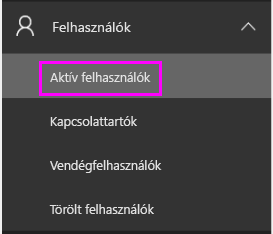
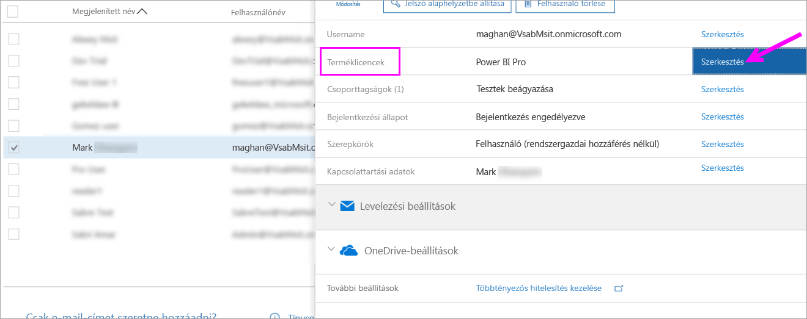
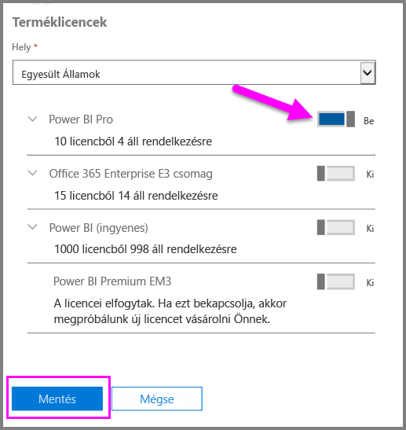
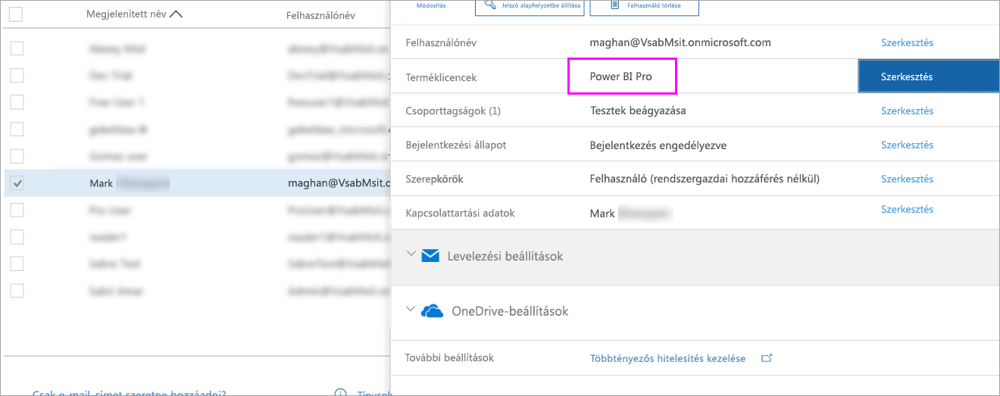

# Gyorsútmutató: Power BI Pro-licencek felhasználókhoz rendelése az Office 365-ben

A Power BI Pro egyéni licenc, amely hozzáférést biztosít a Power BI szolgáltatásban minden tartalomhoz és funkcióhoz, többek között megosztható a tartalom, és lehetőség van más Pro-felhasználókkal való együttműködésre is. Csak a Pro szintű felhasználók tehetnek közzé és használhatnak tartalmat alkalmazás-munkaterületeken, oszthatnak meg irányítópultokat, és iratkozhatnak fel irányítópultokra és jelentésekre. Ez a cikk azt ismerteti, hogyan végezhető el a Power BI Pro-licenc hozzárendelése az Office 365-ben. Licenceket az [Azure-ban is hozzárendelhet](service-admin-assigning-power-bi-pro-licenses-azure.md).

## Előfeltételek

Az Office 365-ben [**globális rendszergazda** vagy **Felhasználói fiókadminisztrátor**](https://support.office.com/article/about-office-365-admin-roles-da585eea-f576-4f55-a1e0-87090b6aaa9d?ui=en-US&rs=en-US&ad=US) szerepkörrel kell rendelkeznie.

A kezdéshez [legalább egy licencet meg kell vásárolnia](service-admin-purchasing-power-bi-pro.md).

## Licencek hozzárendelése egyéni felhasználói fiókokhoz

Az alábbi lépésekkel rendelheti hozzá a Power BI Pro-licenceket egyéni felhasználói fiókokhoz:

1. Nyissa meg az [Office 365 Felügyeleti központot](https://portal.office.com/adminportal/home#/homepage).

2. A bal oldali navigációs panelen válassza a **Felhasználók**, majd az **Aktív felhasználók** lehetőséget.

    

3. Válasszon ki egy felhasználót, majd a **Terméklicencek** területen válassza a **Szerkesztés** lehetőséget.

    

4. A **Power BI Pro** területen állítsa a kapcsolót **Be** állásra, majd kattintson a **Mentés** gombra.

    

5. Az **Állapot** oszlopban ellenőrizze, hogy a kijelölt fiókhoz sikeresen hozzá lett-e rendelve a Power BI Pro-licenc.

    

## Következő lépések

Javasoljuk, hogy a licencek hozzárendelése után ismerkedjen meg közelebbről is a Power BI Pro használatával.

[A Power BI Pro használata a szervezetben](service-admin-power-bi-pro-in-your-organization.md)

[Bejelentkezett Power BI-felhasználók keresése](service-admin-access-usage.md)

További kérdései vannak? [Kérdezze meg a Power BI közösségét](https://community.powerbi.com/)