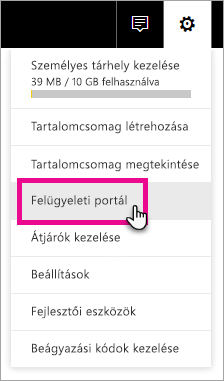
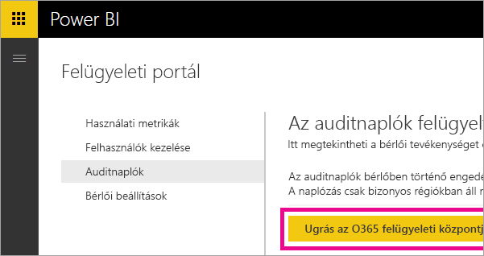
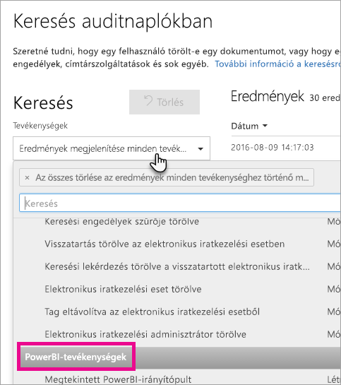
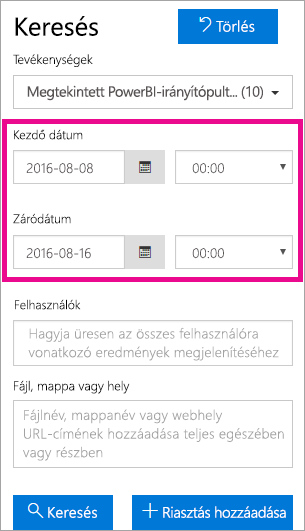
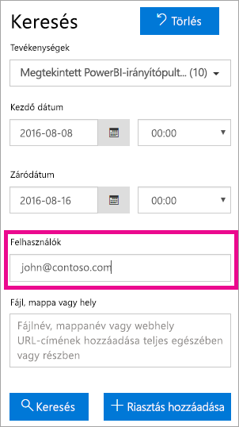

# <a name="using-auditing-within-your-organization"></a>Naplózás használata a cégnél

Megtudhatja, hogyan használhatja a Power BI naplózási funkcióját a végrehajtott műveletek figyelésére és vizsgálatára. Ehhez a Biztonsági és megfelelőségi központot vagy a PowerShellt használhatja.

Ha tisztában van azzal, hogy a Power BI-bérlőn ki, milyen műveletet és mely elemeken végez el, sokat segíthet a munkahelyének a követelményeknek (például a jogszabályi követelményeknek és a rekordkezelésnek) való megfelelésben.

A naplózási adatokat dátumtartomány, felhasználó, irányítópult, jelentés, adatkészlet és tevékenységtípus szerint szűrheti. A tevékenységeket le is töltheti egy CSV-fájlban, és offline elemezheti.

## <a name="requirements"></a>Követelmények
Az auditnaplók eléréséhez az alábbi követelményeknek kell megfelelnie:

- Az Office 365 Biztonsági és megfelelőségi központ naplózási szakaszának eléréséhez Exchange Online-licenccel kell rendelkeznie (melyet a Office 365 nagyvállalati E3 és E5 csomagra való előfizetések tartalmaznak).
- Globális rendszergazdának kell lennie, vagy pedig olyan Exchange-rendszergazdai szerepkörrel kell rendelkeznie, mely hozzáférést biztosít az auditnaplóhoz. 

  Az Exchange-rendszergazdai szerepkörök az Exchange Felügyeleti központban szabályozhatók. További információ: [Az Exchange Online engedélyei](https://technet.microsoft.com/library/jj200692(v=exchg.150).aspx).

- Ha rendelkezik hozzáféréssel az auditnaplóhoz, de nem globális rendszergazda vagy a Power BI szolgáltatás rendszergazdája, nem lesz hozzáférése a Power BI felügyeleti portáljához. Ebben az esetben az Office 365 Biztonsági és megfelelőségi központra mutató közvetlen hivatkozást kell beszereznie.

> [!NOTE]
> A Power BI-hoz készült auditnaplóknak a bérlőben történő megtekintéséhez a bérlőben szükség van legalább egy Exchange-postaláda licencre.

## <a name="accessing-your-audit-logs"></a>A naplók elérése

A Power BI-naplók vizsgálatához lépjen be az O365 Biztonsági és megfelelőségi központba.

1. Kattintson a jobb felső sarokban található **fogaskerék ikonra**.

2. Válassza a **Felügyeleti portál** lehetőséget.
   
   

3. Válassza a **Naplók** lehetőséget.
 
4. Válassza az **Ugrás az O365 felügyeleti központjára** lehetőséget.
   
   

Másik lehetőségként megnyithatja az [Office 365 | Biztonsági és megfelelőségi központot](https://protection.office.com/#/unifiedauditlog).

> [!NOTE]
> Ha a nem rendszergazdai fiókoknak hozzáférést szeretne adni a naplóhoz, az engedélyeket az Exchange Online Felügyeleti központban kell hozzárendelnie. Hozzáadhat például egy felhasználót egy meglévő szerepkörcsoporthoz, például a Szervezetfelügyelet csoporthoz, vagy létrehozhat egy új szerepkörcsoportot a Naplók szerepkörrel. További információ: [Az Exchange Online engedélyei](https://technet.microsoft.com/library/jj200692\(v=exchg.150\).aspx).

## <a name="search-only-power-bi-activities"></a>Keresés csak Power BI-tevékenységek között

A keresési eredményeket az alábbi módszerrel korlátozhatja kizárólag Power BI-tevékenységekre.

1. A **Naplókeresés** lapon kattintson a **Keresés** lehetőség alatti **Tevékenységek** elem legördülő menüjére.

2. Válassza a **Power BI-tevékenységek** lehetőséget.
   
   

3. A mező bezárásához kattintson bárhová a mezőn kívül.

A keresések ekkor csak a Power BI-tevékenységekre korlátozódnak.

## <a name="search-the-audit-logs-by-date"></a>Naplók keresése dátum szerint

A naplók között kereshet dátumtartomány szerint a „Kezdő dátum” és a „Záró dátum” mezőkkel. Az elmúlt hét nap alapértelmezés szerint ki van jelölve. A dátum és idő az Egyezményes világidő (UTC) formátumában jelenik meg. A megadható maximális dátumtartomány 90 nap. Ha a dátumtartomány nagyobb 90 napnál, hibaüzenet jelenik meg.

> [!NOTE]
> Ha a maximális értéket (90 napot) adott meg, a kezdő dátumnak a jelenlegi időt írja be. Ellenkező esetben hibaüzenet jelenik meg, mely szerint a kezdő dátum korábban van a záró dátumnál. Ha az elmúlt 90 napban bekapcsolta a naplózást, a maximális dátumtartomány nem kezdődhet a naplózás bekapcsolásának napja előtt.



## <a name="search-the-audit-logs-by-users"></a>Naplók keresése felhasználók szerint

A naplóbejegyzések között kereshet adott felhasználók által elvégzett tevékenységeket. Ehhez írjon be egy vagy több felhasználónevet a „Felhasználók” mezőbe.  A felhasználónév a Power BI-ba való bejelentkezéshez használt név. Egy e-mail-cím formátumával rendelkezik.
Ha a szervezet minden felhasználójáról (és szolgáltatásfiókjáról) szeretne eredményt kapni, hagyja üresen a mezőt.



## <a name="viewing-search-results"></a>Keresési eredmények megtekintése

A Keresés gombra kattintás után néhány másodperccel megjelennek az eredmények az Eredmények területen. A keresés befejeztével megjelenik a keresési eredmények száma. 

> [!NOTE]
> Legfeljebb 1000 esemény jelenhet meg egyszerre. Ha több mint 1000 esemény felel meg a keresési feltételeknek, csak a legutóbbi 1000 esemény jelenik meg.

Az eredmények az alábbi adatokat tartalmazzák az eseményekről.

| **Oszlop** | **Definíció** |
| --- | --- |
| Dátum |Az esemény dátuma és időpontja (UTC formátumban). |
| IP-cím |Az esemény naplózásakor használt eszköz IP-címe. Az IP-cím IPv4 vagy IPv6 formátumban jelenik meg. |
| Felhasználó |Az eseményt előidéző műveletet végrehajtó felhasználó (vagy szolgáltatásfiók). |
| Tevékenység |A felhasználó által végrehajtott tevékenység. Ez az érték megfelel a Tevékenységek legördülő menüben kiválasztott tevékenységeknek. Az Exchange felügyeleti naplójának eseményei esetén ez az érték egy Exchange-parancsmag. |
| Elem |A megfelelő tevékenység által létrehozott vagy módosított objektum. Például a megtekintett vagy módosított fájl, vagy a frissített felhasználói fiók. Nem minden tevékenységhez jelenik meg érték ebben az oszlopban. |
| Részlet |A tevékenységek további részletei. Nem minden tevékenységhez jelenik meg érték ebben az oszlopban sem. |

> [!NOTE]
> Kattintson az Eredmények terület egyik oszlopfejlécére az eredmények rendezéséhez. Az eredményeket A-tól Z-ig vagy visszafelé rendezheti. A Dátum fejlécre kattintva az eredményeket a legrégebbitől a legújabbig vagy visszafelé rendezheti.

## <a name="view-the-details-for-an-event"></a>Az esemény részleteinek megtekintése

Ha további részletekre kíváncsi egy eseménnyel kapcsolatban, kattintson az esemény rekordjára a keresési eredmények listájában. Ekkor megjelenik a Részletek lap, ahol megtekintheti az eseményrekord részletes tulajdonságait. A megjelenő tulajdonságok típusa az esemény helyéül szolgáló Office 365-szolgáltatástól függ. További részletek megjelenítéséhez válassza a **További információ** lehetőséget.

Az alábbi táblázat ismerteti a megjelenő információkat.

| **Paraméter vagy esemény** | **Leírás** | **További részletek** |
| --- | --- | --- |
| Letöltött Power BI-jelentés |A program minden alkalommal naplózza ezt a tevékenységet, amikor valaki letölt egy jelentést. |Jelentés neve, Adatkészlet neve |
| Jelentés létrehozása |A program minden alkalommal naplózza ezt a tevékenységet, amikor valaki létrehoz egy új jelentést. |Jelentés neve, Adatkészlet neve |
| Jelentés szerkesztése |A program minden alkalommal naplózza ezt a tevékenységet, amikor valaki szerkeszt egy jelentést. |Jelentés neve, Adatkészlet neve |
| Adatkészlet létrehozása |A program minden alkalommal naplózza ezt a tevékenységet, amikor valaki létrehoz egy adatkészletet. |Adatkészlet neve, DataConnectivityMode |
| Adatkészlet törlése |A program minden alkalommal naplózza ezt a tevékenységet, amikor valaki töröl egy adatkészletet. |Adatkészlet neve, DataConnectivityMode |
| Power BI-alkalmazás létrehozása |A program minden alkalommal naplózza ezt a tevékenységet, amikor valaki létrehoz egy Power BI-alkalmazást. |Alkalmazás neve, Engedélyek, Munkaterület neve |
| Power BI-alkalmazás telepítése |A program minden alkalommal naplózza ezt a tevékenységet, amikor valaki telepít egy Power BI-alkalmazást. |Alkalmazás neve |
| Power BI-alkalmazás frissítése |A program minden alkalommal naplózza ezt a tevékenységet, amikor valaki frissít egy Power BI-alkalmazást. |Alkalmazás neve, Engedélyek, Munkaterület neve |
| Megkezdett Power BI-próbaidőszak (kiterjesztett) |A program minden alkalommal naplózza ezt a tevékenységet, amikor egy felhasználó elfogadja a kiterjesztett próbaverziót, amely 2018. május 31-ig érhető el. | |
| Power BI-adatkészlet elemezve |A program minden alkalommal naplózza ezt a tevékenységet, amikor valaki egy Power BI-adatkészletet elemez az Excelben. | |
| Power BI-átjáró létrehozva |A program minden alkalommal naplózza ezt a tevékenységet, amikor valaki létrehoz egy új átjárót. |Átjáró neve, Átjáró típusa |
| Power BI-átjáró törölve |A program minden alkalommal naplózza ezt a tevékenységet, amikor valaki töröl egy átjárót. |Átjáró neve, Átjáró típusa |
| Adatforrás hozzáadva a Power BI-átjáróhoz |A program minden alkalommal naplózza ezt a tevékenységet, amikor valaki hozzáad egy adatforrást az átjáróhoz. |Átjáró neve, Átjáró típusa, Adatforrás neve, Adatforrás típusa |
| Adatforrás törölve a Power BI-átjáróból |A program minden alkalommal naplózza ezt a tevékenységet, amikor valaki töröl egy adatforrást az átjáróból. |Átjáró neve, Átjáró típusa, Adatforrás neve, Adatforrás típusa |
| Power BI-átjáró rendszergazdái módosítva |A program minden alkalommal naplózza ezt a tevékenységet, amikor valaki módosítja (hozzáadja/törli) az átjáró rendszergazdáit. |Átjáró neve, Hozzáadott felhasználók, Eltávolított felhasználók |
| Power BI-átjáró adatforrásának felhasználó módosítva |A program minden alkalommal naplózza ezt a tevékenységet, amikor valaki módosítja (hozzáadja/törli) az átjáró felhasználóit. |Átjáró neve, Hozzáadott felhasználók, Eltávolított felhasználók |
| SetScheduledRefresh (Ütemezett frissítés beállítása) |A program minden alkalommal naplózza ezt a tevékenységet, amikor valaki új frissítést ütemez egy adatkészlethez. |Adatkészlet neve, Frissítési gyakoriság (percben) |

## <a name="using-powershell-to-search"></a>Keresés a PowerShell-lel

A PowerShell-lel hozzáférhet a naplókhoz a bejelentkezésétől függően. Ehhez az Exchange Online-t kell megnyitnia. Íme egy példa a Power BI-naplóbejegyzések lekérésére vonatkozó parancsra.

> [!NOTE]
> A New-PSSession parancs használatához a fiókjának Exchange Online-licenccel kell rendelkeznie, Önnek pedig hozzá kell férnie a bérlő naplójához.

```
Set-ExecutionPolicy RemoteSigned

$UserCredential = Get-Credential

$Session = New-PSSession -ConfigurationName Microsoft.Exchange -ConnectionUri https://outlook.office365.com/powershell-liveid/ -Credential $UserCredential -Authentication Basic -AllowRedirection

Import-PSSession $Session
Search-UnifiedAuditLog -StartDate 9/11/2016 -EndDate 9/15/2016 -RecordType PowerBI -ResultSize 1000 | Format-Table | More
```

További információ az Exchange Online-hoz való csatlakozásról: [Csatlakozás az Exchange Online-hoz a PowerShell-lel](https://technet.microsoft.com/library/jj984289\(v=exchg.160\).aspx).

További információ a paraméterekről és a Search-UnifiedAuditLog parancsról: [Search-UnifiedAuditLog](https://technet.microsoft.com/library/mt238501\(v=exchg.160\).aspx).

Ha szeretne megtekinteni egy példát a PowerShell-lel történő naplókeresésre, valamint a bejegyzések alapján történő Power BI Pro-licencek hozzárendelésére, tekintse meg a [Using Power BI audit log and PowerShell to assign Power BI Pro licenses](https://powerbi.microsoft.com/blog/using-power-bi-audit-log-and-powershell-to-assign-power-bi-pro-licenses/) (Power BI Pro-licencek hozzárendelése a Power BI naplóival és a PowerShell-lel) című cikket.

## <a name="export-the-power-bi-audit-log"></a>A Power BI-napló exportálása

A Power BI-naplót exportálhatja egy CSV-fájlba.

1. Válassza az **Eredmények exportálása** lehetőséget.

2. Válassza a **Betöltött eredmények mentése** vagy **Az összes eredmény letöltése** lehetőséget.
   
   

## <a name="record-and-user-types"></a>Rekord- és felhasználótípusok

A naplóbejegyzések RecordType (Rekordtípus) és UserType (Felhasználótípus) értékekkel rendelkeznek. Minden Power BI-bejegyzés RecordType (Rekordtípus) értéke 20.

A teljes felsorolást itt találja: [Az Office 365 naplójának részletes tulajdonságai](https://support.office.com/article/Detailed-properties-in-the-Office-365-audit-log-ce004100-9e7f-443e-942b-9b04098fcfc3)

## <a name="list-of-activities-audited-by-power-bi"></a>A Power BI által naplózott tevékenységek listája

| Tevékenység | Leírás | További részletek |
| --- | --- | --- |
| CreateDashboard (Irányítópult létrehozása) |A program minden alkalommal naplózza ezt a tevékenységet, amikor valaki létrehoz egy új irányítópultot. |– Irányítópult neve. |
| EditDashboard (Irányítópult szerkesztése) |A program minden alkalommal naplózza ezt a tevékenységet, amikor valaki átnevez egy irányítópultot. |– Irányítópult neve. |
| DeleteDashboard (Irányítópult törlése) |A program minden alkalommal naplózza ezt a tevékenységet, amikor valaki töröl egy irányítópultot. |– Irányítópult neve. |
| PrintDashboard (Irányítópult nyomtatása) |A program minden alkalommal naplózza ezt az eseményt, amikor valaki kinyomtat egy irányítópultot. |– Irányítópult neve.<br/>– Adatkészlet neve |
| ShareDashboard (Irányítópult megosztása) |A program minden alkalommal naplózza ezt a tevékenységet, amikor valaki megoszt egy irányítópultot. |– Irányítópult neve.<br/>– Címzett e-mail-címe.<br/>– Adatkészlet neve.<br>– Újraosztási engedélyek. |
| ViewDashboard (Irányítópult megtekintése) |A program minden alkalommal naplózza ezt a tevékenységet, amikor valaki megtekint egy irányítópultot. |– Irányítópult neve. |
| ExportTile (Csempe exportálása) |A program minden alkalommal naplózza ezt a tevékenységet, amikor valaki adatokat exportál egy irányítópult csempéjéből. |– Csempe neve.<br/>– Adatkészlet neve. |
| DeleteReport (Jelentés törlése) |A program minden alkalommal naplózza ezt a tevékenységet, amikor valaki töröl egy jelentést. |– Jelentés neve. |
| ExportReport (Jelentés exportálása) |A program minden alkalommal naplózza ezt a tevékenységet, amikor valaki adatokat exportál egy jelentés csempéjéből. |– Jelentés neve.<br/>– Adatkészlet neve. |
| PrintReport (Jelentés nyomtatása) |A program minden alkalommal naplózza ezt az eseményt, amikor valaki kinyomtat egy jelentést. |– Jelentés neve.<br/>– Adatkészlet neve. |
| PublishToWebReport (Jelentés közzététele a weben) |A program minden alkalommal naplózza ezt az eseményt, amikor valaki közzétesz egy jelentést a weben. |– Jelentés neve.<br/>– Adatkészlet neve. |
| ViewReport (Jelentés megtekintése) |A program minden alkalommal naplózza ezt a tevékenységet, amikor valaki megtekint egy jelentést. |– Jelentés neve. |
| ExploreDataset (Adatkészlet feltárása) |A program minden alkalommal naplózza ezt a tevékenységet, amikor Ön kijelöl és feltár egy adatkészletet. |– Adatkészlet neve |
| DeleteDataset (Adatkészlet törlése) |A program minden alkalommal naplózza ezt az eseményt, amikor valaki töröl egy adatkészletet. |– Adatkészlet neve. |
| CreateOrgApp (Szervezeti alkalmazás létrehozása) |A program minden alkalommal naplózza ezt a tevékenységet, amikor valaki létrehoz egy szervezeti tartalomcsomagot. |– A szervezeti tartalomcsomag neve.<br/>– Irányítópultok nevei.<br/>– Jelentések nevei.<br/>– Adatkészletek nevei. |
| CreateGroup (Csoport létrehozása) |A program minden alkalommal elindítja ezt a tevékenységet, amikor valaki létrehoz egy csoportot. |– Csoport neve. |
| AddGroupMembers (Csoporttagok hozzáadása) |A program minden alkalommal naplózza ezt a tevékenységet, amikor valaki hozzáad egy tagot egy Power BI-munkaterülethez. |– Csoport neve.<br/>– E-mail-címek. |
| UpdatedAdminFeatureSwitch (Frissített rendszergazdai funkciókapcsoló) |A program minden alkalommal naplózza ezt az eseményt, amikor valaki módosít egy rendszergazdai funkciókapcsolót. |– Kapcsoló neve.<br/>– Új kapcsoló állapota. |
| OptInForProTrial (Regisztráció a Pro csomag próbaverziójára) |A program minden alkalommal naplózza ezt az eseményt, amikor egy felhasználó kipróbálja a Power BI Pro szolgáltatást. |– E-mail-cím |

## <a name="next-steps"></a>Következő lépések

[Power BI Felügyeleti portál](service-admin-portal.md)  
[Power BI Premium – mi ez?](service-premium.md)  
[A Power BI Pro megvásárlása](service-admin-purchasing-power-bi-pro.md)  
[Engedélyek az Exchange Online-ban](https://technet.microsoft.com/library/jj200692\(v=exchg.150\).aspx)  
[Csatlakozás az Exchange Online-hoz a PowerShell-lel](https://technet.microsoft.com/library/jj984289\(v=exchg.160\).aspx)  
[Search-UnifiedAuditLog](https://technet.microsoft.com/library/mt238501\(v=exchg.160\).aspx)  
[Az Office 365 naplójának részletes tulajdonságai](https://support.office.com/article/Detailed-properties-in-the-Office-365-audit-log-ce004100-9e7f-443e-942b-9b04098fcfc3)  

További kérdései vannak? [Kérdezze meg a Power BI közösségét](http://community.powerbi.com/)