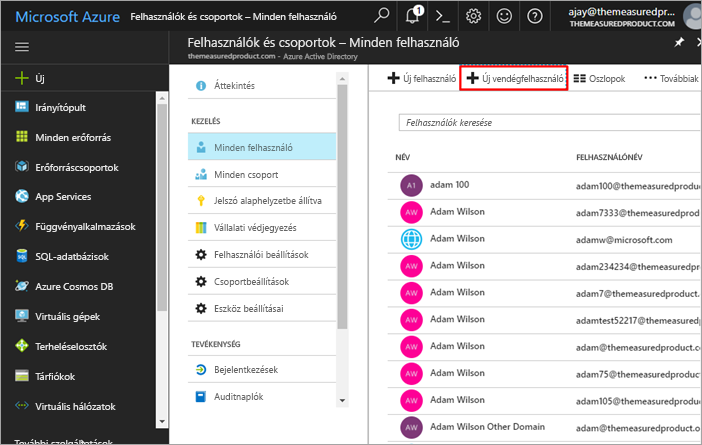
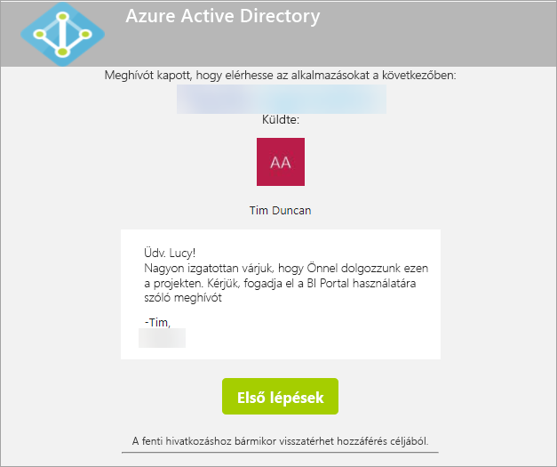
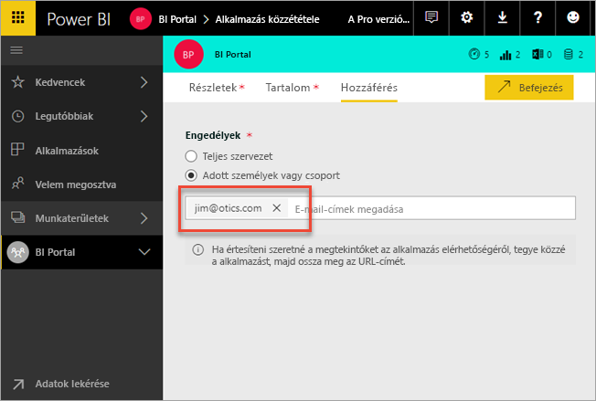
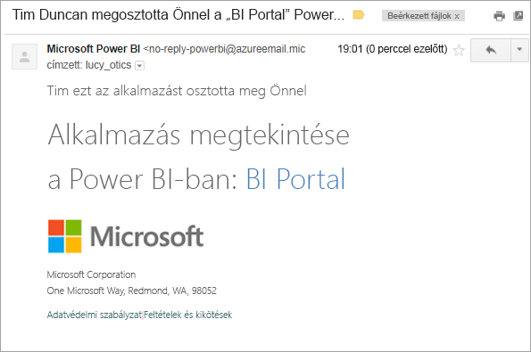
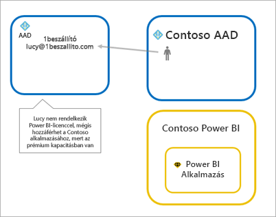
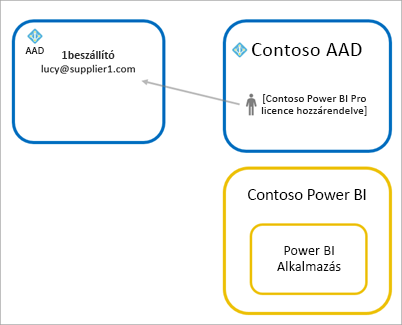
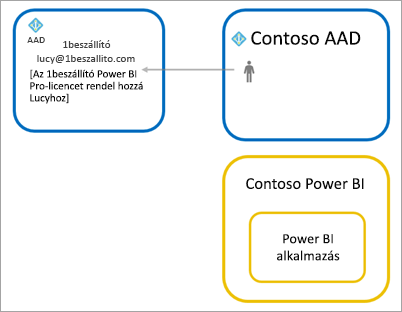

# Power BI tartalmak terjesztése Azure AD B2B külső vendégfelhasználóknak

A Power BI integrálható az Azure Active Directory vállalatközi felhasználásra szánt verziójával (Azure AD B2B), ami lehetővé teszi, hogy a Power BI-tartalmakat cégen kívüli vendégfelhasználókkal is biztonságosan meg tudja osztani, úgy, hogy közben teljes mértékben szabályozza a belső adatok felhasználását.

> [!VIDEO https://www.youtube.com/embed/xxQWEQ1NnlY]

> [!NOTE]
> Ez a funkció jelenleg nem érhető el Power BI-mobilalkalmazásokban. Az Azure AD B2B-vel megosztott Power BI-tartalmakat a mobileszközén böngészőben tekintheti meg. 

## Vendégfelhasználók meghívása

Power BI bérlőjébe kétféleképpen hívat meg vendégeket: tervezett és ad-hoc módon. Meghívóra csak akkor van szükség, amikor először hív meg egy külső felhasználót a cégbe.

### Tervezett meghívások

Tervezett meghívást az Azure AD-beli Microsoft Azure Portalon belül, PowerShellt használva hozhat létre és küldhet el. Ha tudja, mely felhasználókat szeretné meghívni, ezt a módszert kell használni. 

**Az Azure AD Portalon csak bérlői rendszergazdák hozhatnak létre vendégfelhasználókat.**

1. Nyissa meg az [Azure Portalt](https://portal.azure.com), és válassza az **Azure Active Directory** lehetőséget.

2. Navigáljon a **Felhasználók és csoportok** > **Minden felhasználó** > **Új vendégfelhasználó** lehetőséghez.

    

3. Adja meg az **e-mail címet** és egy **személyes üzenetet**.

    

4. Kattintson a **Meghívás** lehetőségre.

Ha egynél több vendéget szeretne meghívni, használja a PowerShellt. Ha további információra van szüksége, tekintse át az [Azure Active Directory B2B együttműködési kódmintát és PowerShell-példákat](https://docs.microsoft.com/azure/active-directory/active-directory-b2b-code-samples) tartalmazó cikket.

A vendégfelhasználónak az e-mailben kapott meghívóban rá kell majd kattintania az **Első lépések** (Get Started) lehetőségre. A rendszer ezután hozzá fogja adni a vendégfelhasználót a bérlőhöz.

### Ad-hoc meghívások

Bármikor végrehajthat egy meghívást úgy, hogy közzétételkor hozzáad egy külső felhasználót az alkalmazások hozzáférési listájához.

A vendégfelhasználó fog kapni egy e-mailt, amely azt jelzi, hogy megosztották vele az alkalmazást.

A vendégfelhasználónak a céges e-mail-címével kell bejelentkeznie. Bejelentkezés után a rendszer kérni fogja a meghívó elfogadását. Bejelentkezés után a vendégfelhasználót a rendszer átirányítja az alkalmazás tartalmához. Az alkalmazáshoz való visszatéréshez könyvjelzőzze a hivatkozást, és mentse el az e-mailt.

## Licencelés

A meghívott felhasználónak megfelelő licencre lesz szüksége ahhoz, hogy megtekinthesse a megosztott alkalmazást. Ennek biztosítására három lehetőség van.

### Prémium szintű Power BI használata

Ha az alkalmazás munkaterületét prémium szintű Power BI-kapacitáshoz rendeli, a vendégfelhasználó Power BI Pro-licenc nélkül is használhatja az alkalmazást. Az alkalmazások tekintetében további előnyöket is biztosít a Power BI prémium szintje: például gyakoribb frissítéseket, dedikált kapacitást és nagy modellméretet.

### Power BI Pro licenc hozzárendelése a vendégfelhasználóhoz

Ha a vendégfelhasználóhoz a bérlőn belül Power BI-Pro licencet rendel, a vendégfelhasználó meg fogja tudni tekinteni a tartalmat.

> [!NOTE]
> A bérlői Power BI Pro-licenccel a vendégfelhasználók csak a bérlőn tárolt tartalmakhoz férhetnek hozzá.

### A vendégfelhasználók hozzák saját Power BI Pro-licencüket

A vendégfelhasználó saját bérlőjén már rendelkezik Power BI Pro-licenccel.

## Korlátozások

* A külső B2B-vendégeknek csak olvasási jogosultságuk van a tartalomhoz. A külső B2B-vendégek megtekinthetnek alkalmazásokat, irányítópultokat, jelentéseket, illetve adatokat exportálhatnak, és irányítópultokhoz és jelentésekhez kapcsolódó e-mail-értesítéseket hozhatnak létre. Nem férhetnek hozzá azonban munkaterületekhez, és nem tehetik közzé saját tartalmaikat.
* Ez a funkció jelenleg nem érhető el Power BI-mobilalkalmazásokban. Az Azure AD B2B-vel megosztott Power BI-tartalmakat a mobileszközén böngészőben tekintheti meg.
* A Power BI nem támogatja a vendégfelhasználókat független (kormányzati) felhőkben.

## További lépések

Ha részletesebb információkra van szüksége például a sorszintű adatvédelem működésével kapcsolatban, olvassa el ezt a [tanulmányt](https://aka.ms/powerbi-b2b-whitepaper).

Az Azure Active Directory B2B szolgáltatással kapcsolatban tekintse át a [Azure AD B2B együttműködésről](https://docs.microsoft.com/azure/active-directory/active-directory-b2b-what-is-azure-ad-b2b) szóló cikket.