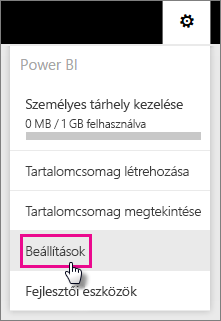
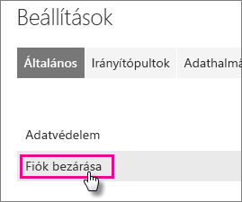
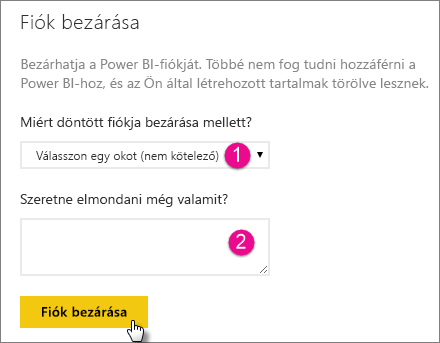
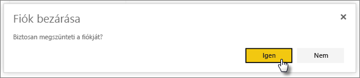
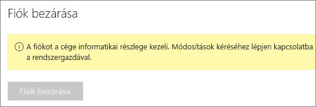

# A Power BI-fiók megszüntetése
Ha nem kívánja tovább használni a Power BI-t, kérheti a Power BI-fiók megszüntetését.  A fiók megszüntetése után nem tud többet bejelentkezni a Power BI-ba.  A Power BI Szolgáltatási feltételek adatmegőrzési szabályzatának megfelelően a Power BI-ba feltöltött és ott létrehozott felhasználói adatok törlésre kerülnek.

## Egyéni Power BI-felhasználók
A fiókot a beállítások képernyőn szüntetheti meg.

1. Kattintson a jobb felső sarokban látható fogaskerék  ikonra.
2. Kattintson a **Beállítások** elemre.
   
    
3. **Általános** > **Fiók megszüntetése**
   
    
4. Válasszon egy választ a **Miért szünteti meg a fiókját?** (1) legördülő menüből.  Tetszés szerint további információkat is megadhat (2). Ezután kattintson a **Fiók megszüntetése** elemre.
   
    
5. Erősítse meg, hogy meg kívánja szüntetni a fiókját.
   
    
6. Ekkor megjelenik a fiók megszűnését igazoló képernyő. A képernyőn egy hivatkozás is látható, amellyel újranyithatja a fiókját.
   
    

## Felügyelt bérlői felhasználók
Lépjen kapcsolatba a bérlői rendszergazdával, és kérje meg, hogy szüntesse meg a licenc hozzárendelését a fiókjához.

További kérdései vannak? [Kérdezze meg a Power BI közösségét](http://community.powerbi.com/)

