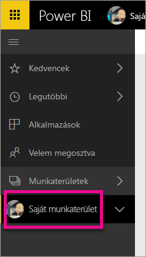
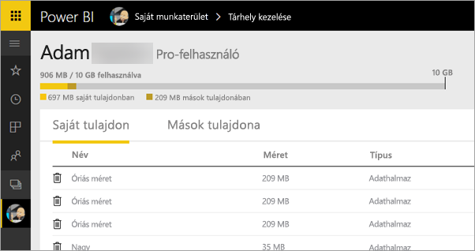
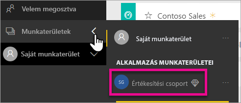
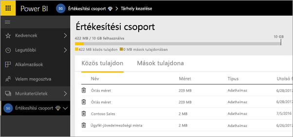
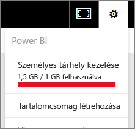
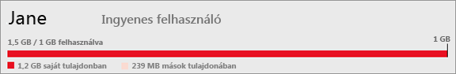
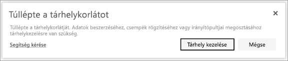

# Saját tárhely kezelése
Ismerje meg, hogy miképpen biztosíthatja a jelentések és az adatkészletek további közzétételét az egyéni vagy az alkalmazás-munkaterületen található saját tárhely kezelésével.

A felhasználók és az alkalmazás-munkaterületek saját adatkapacitással rendelkeznek

* Az ingyenes és a Pro változat felhasználói esetében a tárhely maximális mérete 10 GB.
* A Pro-felhasználók több, egyenként 10 GB-os alkalmazás-munkaterületet is létrehozhatnak.

Bérlői szinten az egy Pro-felhasználóra és alkalmazás-munkaterületre jutó teljes használat nem haladhatja meg a felhasználónkénti 10 GB-ot.

További információkért tekintse meg [a Power BI díjszabási modelljét](https://powerbi.microsoft.com/pricing).

A tárhely magában foglalja a saját és a mások által Önnel megosztott adatkészleteket és Excel-jelentéseket. Adatkészlet lehet bármely adatforrás, amelyet feltöltött, vagy amelyhez kapcsolódik, beleértve a használatban lévő Power BI Desktop-fájlokat és Excel-munkafüzeteket is. A következők szintén beletartoznak az adatkapacitásba.

* Irányítópultra rögzített Excel-tartományok.
* Power BI-irányítópultra rögzített helyszíni Reporting Services-vizualizációk.
* Feltöltött képek.

Az Ön által megosztott irányítópult mérete attól függ, hogy mi van rögzítve rajta. Például ha két különböző adatkészlethez tartozó jelentésből származó elemeket rögzít, a méretbe mindkét adatkészlet bele fog tartozni.

<a name="manage"/>

## Saját elemek kezelése
Megtekintheti a Power BI-fiókban aktuálisan felhasznált tárhely méretét, és kezelheti a fiókot.

1. A saját tárhely kezeléséhez nyissa meg a **Saját munkaterületet** a bal oldali navigációs ablaktáblán.
   
    
2. Kattintson a fogaskerék ikonra  a jobb felső sarokban \> **Személyes tárhely kezelése**.
   
    A felső sávon látható, hogy mennyit használt fel a rendelkezésre álló tárhelyből.
   
    
   
    Az adatkészletek és a jelentések két külön lapon találhatók az alábbiak szerint:
   
    **Saját tulajdon:** Ezeket a jelentéseket és adatkészleteket, köztük az olyan szolgáltatások adatkészleteit, mint a Salesforce és a Dynamics CRM, a saját Power BI-fiókjába töltötte fel.  
    **Mások tulajdona:** Ezeket a jelentéseket és adatkészleteket mások osztották meg Önnel.
3. Adatkészlet vagy jelentés törléséhez kattintson a Kuka ikonra .

Vegye figyelembe, hogy az adatkészleteken saját vagy megosztott jelentések és irányítópultok alapulhatnak. Ha törli az adatkészletet, ezek a jelentések és irányítópultok nem fognak működni.

## Saját alkalmazás-munkaterület kezelése
1. Kattintson a **Munkaterületek** elem melletti nyílra, majd \> válassza ki az alkalmazás-munkaterület nevét.
   
    
2. Kattintson a fogaskerék ikonra  a jobb felső sarokban \> **Csoporttárhely kezelése**.
   
    A felső sávon látható, hogy mennyit használtak fel a csoport rendelkezésére álló tárhelyből.
   
    
   
    Az adatkészletek és a jelentések két külön lapon találhatók az alábbiak szerint:
   
    **Közös tulajdon:** Ezeket a jelentéseket és adatkészleteket, köztük az olyan szolgáltatások adatkészleteit, mint a Salesforce és a Dynamics CRM, Ön vagy valaki más töltötte fel a csoport Power BI-fiókjába.
    **Mások tulajdona:** Ezeket a jelentéseket és adatkészleteket mások osztották meg a csoporttal.
3. Adatkészlet vagy jelentés törléséhez kattintson a Kuka ikonra .
   
   > [!NOTE]
   > Egy alkalmazás-munkaterület bármely, szerkesztési engedéllyel rendelkező tagja jogosult az adatkészletek és jelentések törlésére az alkalmazás-munkaterületről.
   > 
   > 

Vegye figyelembe, hogy az adatkészleteken saját vagy a csoport más tagja által birtokolt jelentések és irányítópultok alapulhatnak. Ha törli az adatkészletet, ezek a jelentések és irányítópultok nem fognak működni.

## Adatkészletkorlátok
A Power BI-ba importálható egyes adatkészletek korlátja 1 GB. Ha adatimportálás helyett az Excel további használata mellett döntött, az adatkészlet korlátja 250 MB lesz.

## Mi történik, ha eléri a korlátot
Ha eléri a munkája során felhasználható adatkapacitás korlátját, a szolgáltatás figyelmeztető üzeneteket küld. 

Ha a fogaskerék ikonra  kattint, piros csík jelzi az adatkapacitás korlátjának túllépését.

Ez megjelenik a **Személyes tárhely kezelése** területen is.

 

 Ha a korlátok bármelyikét elérő tevékenységet kísérel meg, a rendszer figyelmezteti a korlát túllépésére. Ekkor a tárhely [kezelésével](#manage) csökkentheti a tárhely méretét, és átlépheti a korlátot.

 

 Több kérdése van? [Kérdezze meg a Power BI közösségét](http://community.powerbi.com/)

