# Mobilalkalmazások konfigurálása a Microsoft Intune-nal
A Microsoft Intune lehetővé teszi a cégek számára az eszközök és alkalmazások kezelését. A Power BI iOS és Android rendszerhez készült mobilalkalmazásai integrálódnak az Intune-nal, lehetővé téve az alkalmazás kezelését az eszközökön, valamint a biztonság szabályozását. Konfigurációs szabályzatok útján a szervezetek sok mindent meghatározhatnak, például hogy egy elemhez szükség van-e hozzáférési kódra, hogy az alkalmazás hogyan kezeli az adatokat és akár az alkalmazásadatok titkosítását is, amikor az alkalmazás nincs használatban.

<iframe width="560" height="315" src="https://www.youtube.com/embed/9HF-qsdQvHw?list=PLv2BtOtLblH1nPVPU2etFzTNmpz49dwXm" frameborder="0" allowfullscreen></iframe>

## Általános mobileszköz-kezelési konfiguráció
A jelen cikk nem tekintendő teljes konfigurációs útmutatónak a Microsoft Intune-hoz. Ha éppen most integrál az Intune-nal, érdemes ellenőriznie néhány beállítást. [További információ](https://technet.microsoft.com/library/jj676587.aspx)

A Microsoft Intune létezhet egyidejűleg az Office 365 mobileszköz-kezelési (MDM) összetevőjével. [További információ](https://blogs.technet.microsoft.com/configmgrdogs/2016/01/04/microsoft-intune-co-existence-with-mdm-for-office-365/)

A jelen cikk feltételezi, hogy az Intune megfelelően van konfigurálva, és az Intune-ban regisztrált eszközökkel rendelkezik. Párhuzamosan létező MDM esetén az eszköz regisztráltként jelenik meg az MDM-en belül, de elérhető az Intune-on belüli felügyelethez.

> [!NOTE]
> Ha egy iOS vagy egy Android rendszerű eszközön használja a Power BI-mobilalkalmazást és a munkahelye már konfigurálta a Microsoft Intune mobilalkalmazás-kezelését, akkor a háttérbeli adatok frissítése ki van kapcsolva. Amikor legközelebb megnyitja az alkalmazást, a Power BI a webes Power BI szolgáltatásból frissíti az adatokat.
> 
> 

## 1. lépés: Az URL-cím lekérése az alkalmazáshoz
Az alkalmazás Intune-beli létrehozása előtt le kell kérnünk az alkalmazások URL-címét. iOS rendszer esetén ezt az iTunes-ból, Android rendszernél a Power BI Mobile oldaláról szerezheti be.

Mentse az URL-címet, szüksége lesz rá az alkalmazás létrehozásakor.

### iOS
Az alkalmazás URL-címének lekéréséhez iOS rendszer esetén azt az iTunes-ból kell beszereznünk.

1. Nyissa meg az iTunes-t.
2. Keressen a *Power BI* szövegre.
3. Ekkor meg kell jelennie a **Microsoft Power BI** elemnek az **iPhone-alkalmazások** és az **iPad-alkalmazások** listában. Bármelyiket használhatja, mivel azonos URL-címet kap.
4. Válassza a **Letöltés** legördülő listát, és válassza a **Hivatkozás másolása** lehetőséget.
   
    

A képernyőnek az alábbihoz hasonlóan kell kinéznie.

    https://itunes.apple.com/us/app/microsoft-power-bi/id929738808?mt=8

### Android
A Google Play Áruház URL-címét a [Power BI Mobile oldaláról](https://powerbi.microsoft.com/mobile/) szerezheti be. A **Download from Google Play** (Letöltés a Google Play Áruházból) ikonra kattintva léphet az alkalmazás lapjára. A böngésző címsorából másolhatja az URL-címet. A képernyőnek az alábbihoz hasonlóan kell kinéznie.

    https://play.google.com/store/apps/details?id=com.microsoft.powerbim

## 2. lépés: Mobilalkalmazás-felügyeleti szabályzat létrehozása
A mobilalkalmazás-felügyeleti szabályzattal kényszerítheti például a hozzáférési kód megadását. Az Intune-portálon hozhat létre egyet. 

Az alkalmazás vagy a szabályzat létrehozásával egyaránt kezdheti. A hozzáadásuk sorrendjének nincs jelentősége. Elég, hogy egyaránt jelen legyenek az üzembe helyezési lépéshez.

1. Válassza a **Szabályzat** > **Konfigurációs szabályzatok** lehetőséget.
   
    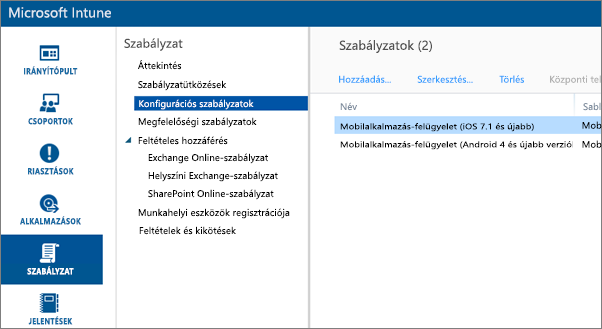
2. Kattintson a **Hozzáadás...** gombra.
3. A **Szoftver** szakaszban választhat az Android vagy az iOS rendszerbeli mobilalkalmazás-kezelés közül. Gyorsan és egyszerűen kiválaszthatja a **Szabályzat létrehozása az ajánlott beállításokkal** lehetőséget, vagy választhatja az egyéni szabályzat létrehozását.
4. A szabályzat szerkesztésével a konfigurálhatja az alkalmazásra vonatkozó kívánt korlátozásokat.

## 3. lépés: Az alkalmazás létrehozása
Az alkalmazás egy, az Intune-ban üzembe helyezés céljából mentett hivatkozás vagy csomag. Szükség lesz egy alkalmazás létrehozására és az alkalmazás azon URL-címére való hivatkozásra, amelyet az iTunes vagy Google Play Áruházból beszerzett.

Az alkalmazás vagy a szabályzat létrehozásával egyaránt kezdheti. A hozzáadásuk sorrendjének nincs jelentősége. Elég, hogy egyaránt jelen legyenek az üzembe helyezési lépéshez.

1. Nyissa meg az Intune-portált és kattintson a bal oldali menüben az Intune **Alkalmazások** elemére.
2. Válassza az **Alkalmazás felvétele** lehetőséget. Ekkor elindul a **Szoftver hozzáadása** alkalmazás.

### iOS
1. Válassza a **Felügyelt iOS-alkalmazás az App Store-ból** elemet a legördülő listából.
2. Adja meg az alkalmazás az [1. lépés](#step-1-get-the-url-for-the-application) során beszerzett URL-címét, és kattintson a **Tovább** gombra.
   
    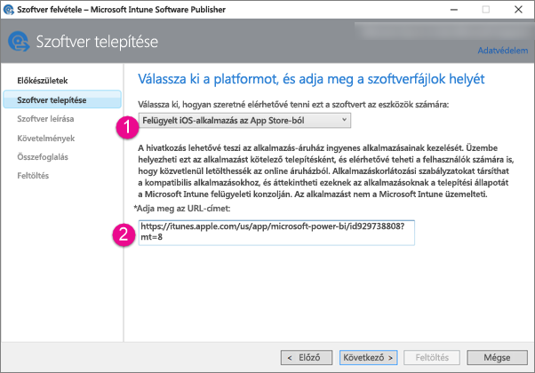
3. Adjon meg egy **kiadót**, **nevet** és **leírást**. Opcionálisan megadhat egy **ikont** is. A **Kategória** a Céges portál alkalmazásra vonatkozik. Ha elkészült, kattintson a **Tovább** gombra.
4. Eldöntheti, hogy az alkalmazást **bármely** (alapértelmezett), **iPad** vagy **iPhone** eszközökre szeretné-e kiadni. Alapértelmezés szerint a **Bármely** jelenik meg, és mindkét eszköztípus esetében működik. A Power BI alkalmazás URL-címe iPhone és iPad esetén is azonos. Válassza a **Tovább** gombot.
5. Válassza a **Feltöltés** lehetőséget.

> [!NOTE]
> Amíg nem frissíti az oldalt, előfordulhat, hogy az alkalmazás nem jelenik meg a listában. Rákattinthat az **Áttekintés** lehetőségre, és visszaléphet az **Alkalmazások** elemhez a lap újbóli betöltéséhez.
> 
> 

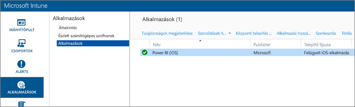

### Android
1. Válassza a **Külső hivatkozás** elemet a legördülő listából.
2. Adja meg az alkalmazás az [1. lépés](#step-1-get-the-url-for-the-application) során beszerzett URL-címét, és kattintson a **Tovább** gombra.
   
    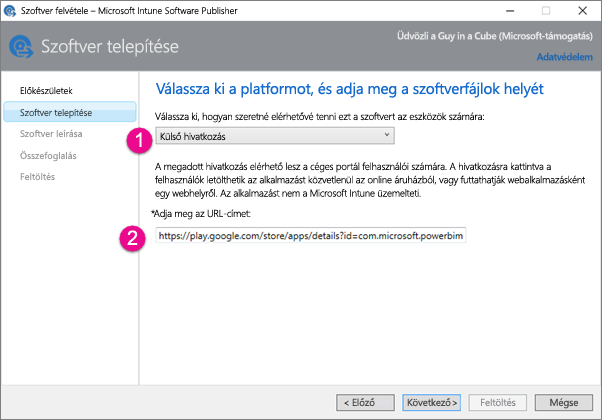
3. Adjon meg egy **kiadót**, **nevet** és **leírást**. Opcionálisan megadhat egy **ikont** is. A **Kategória** a Céges portál alkalmazásra vonatkozik. Ha elkészült, kattintson a **Tovább** gombra.
4. Válassza a **Feltöltés** lehetőséget.

> [!NOTE]
> Amíg nem frissíti az oldalt, előfordulhat, hogy az alkalmazás nem jelenik meg a listában. Rákattinthat az **Áttekintés** lehetőségre, és visszaléphet az **Alkalmazások** elemhez a lap újbóli betöltéséhez.
> 
> 

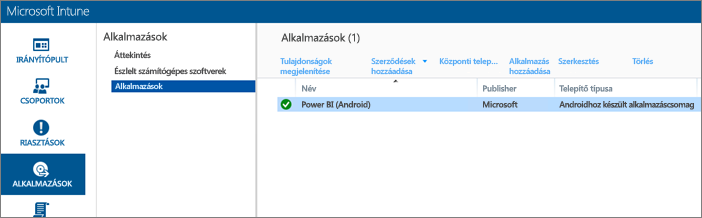

## 4. lépés: Az alkalmazás üzembe helyezése
Miután hozzáadta az alkalmazást, üzembe kell helyeznie azt, hogy a végfelhasználók elérhessék. Ebben a lépésben a létrehozott szabályzatot az alkalmazáshoz fogja kötni.

### iOS
1. Az alkalmazások képernyőn válassza ki a létrehozott alkalmazást. Válassza az **Üzembe helyezés kezelése...**  hivatkozást.
   
    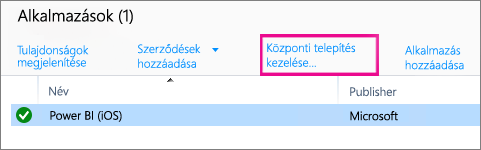
2. A **Csoportok kiválasztása** képernyőn eldöntheti, hogy mely csoportokban szeretné az alkalmazást üzembe helyezni. Válassza a **Tovább** gombot.
3. A **Központi telepítési művelet** képernyőn eldöntheti, hogy miként szeretné az alkalmazást üzembe helyezni. Az **Elérhető telepítés** vagy **Szükséges telepítés** lehetőséget választva az alkalmazás igény szerint lesz üzembe helyezve a céges portálon a felhasználók részére. Miután befejezte a kijelölést, kattintson a **Tovább** gombra.
   
    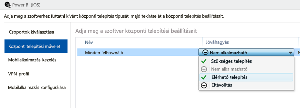
4. A **Mobilalkalmazás-kezelés** képernyőn kiválaszthatja a [2. lépés](#step-2-create-a-mobile-application-management-policy) során létrehozott mobilalkalmazás-kezelési szabályzatot. Az alapértelmezés az Ön által létrehozott szabályzat lesz, ha ez az egyetlen rendelkezésre álló iOS-szabályzat. Válassza a **Tovább** gombot.
   
    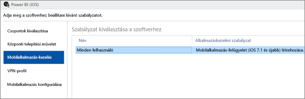
5. A **VPN-profil** képernyőn kiválaszthat egy szabályzatot, ha munkahelye rendelkezik ilyennel. A beállítás alapértelmezett értéke a **Nincs**. Válassza a **Tovább** gombot.
6. A **Mobilalkalmazás konfigurálása** képernyőn kiválaszthat egy **alkalmazáskonfigurálási szabályzatot**, ha van ilyen. A beállítás alapértelmezett értéke a **Nincs**. Ez nem kötelező. Válassza a **Befejezés** gombot.

Miután telepítette az alkalmazást, mellette az **Igen** feliratnak kell megjelennie az alkalmazások lapján.

### Android
1. Az alkalmazások képernyőn válassza ki a létrehozott alkalmazást. Válassza az **Üzembe helyezés kezelése...**  hivatkozást.
   
    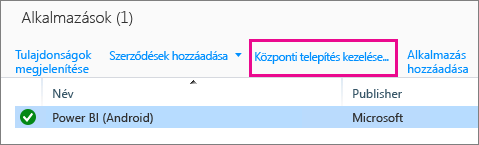
2. A **Csoportok kiválasztása** képernyőn eldöntheti, hogy mely csoportokban szeretné az alkalmazást üzembe helyezni. Válassza a **Tovább** gombot.
3. A **Központi telepítési művelet** képernyőn eldöntheti, hogy miként szeretné az alkalmazást üzembe helyezni. Az **Elérhető telepítés** vagy **Szükséges telepítés** lehetőséget választva az alkalmazás igény szerint lesz üzembe helyezve a céges portálon a felhasználók részére. Miután befejezte a kijelölést, kattintson a **Tovább** gombra.
   
    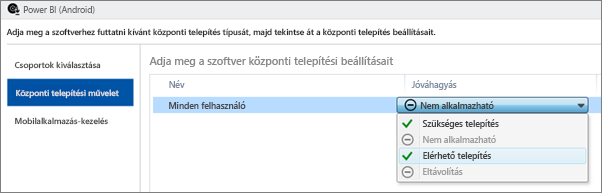
4. A **Mobilalkalmazás-kezelés** képernyőn kiválaszthatja a [2. lépés](#step-2-create-a-mobile-application-management-policy) során létrehozott mobilalkalmazás-kezelési szabályzatot. Az alapértelmezés az Ön által létrehozott szabályzat lesz, ha ez az egyetlen rendelkezésre álló Android-szabályzat. Válassza a **Befejezés** gombot.
   
    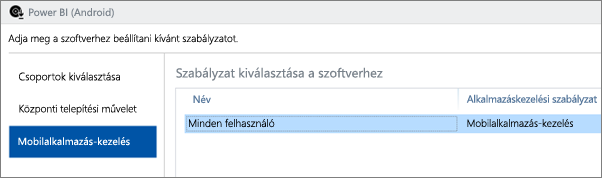

Miután telepítette az alkalmazást, mellette az **Igen** feliratnak kell megjelennie az alkalmazások lapján.

## 5. lépés: Az alkalmazás telepítése egy eszközön
Az alkalmazást a Céges portál alkalmazáson keresztül fogja telepíteni. Ha még nem telepítette a Céges portált, beszerezheti azt az iOS vagy az Android platform alkalmazásáruházából. A Céges portálra a munkahelyi bejelentkezési adataival jelentkezzen be.

1. Nyissa meg a Céges portál alkalmazást.
2. Ha nem látja a Power BI alkalmazást felsorolt kiemelt alkalmazásként, válassza a **Céges alkalmazások** lehetőséget.
   
    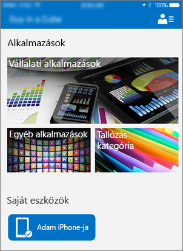
3. Válassza ki az üzembe helyezett Power BI alkalmazást.
   
    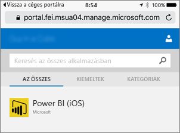
4. Válassza a **Telepítés** gombot.
   
    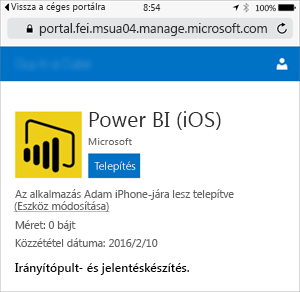
5. Ha iOS rendszert használ, akkor az le fogja küldeni Önnek az alkalmazást. Válassza a **Telepítés** gombot a leküldési párbeszédpanelen.
   
    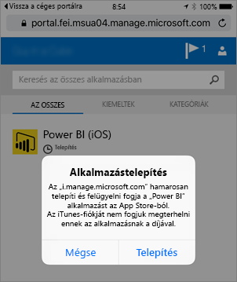

A telepítését követően látni fogja, hogy az alkalmazást **A munkahely kezeli**. Ha a szabályzatban engedélyezte a PIN-kóddal való hozzáférést, a következőt láthatja.

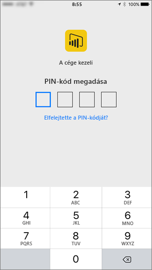

## Következő lépések
[Mobilalkalmazás-felügyeleti szabályzatok konfigurálása és üzembe helyezése a Microsoft Intune-konzolon](https://technet.microsoft.com/library/dn878026.aspx)  
[Power BI-alkalmazások mobileszközökre](mobile-apps-for-mobile-devices.md)  

További kérdései vannak? [Kérdezze meg a Power BI közösségét](http://community.powerbi.com/)

