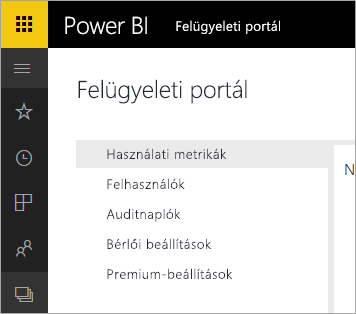

# Az Office 365-höz készült Power BI-t kivonták
A Power BI előző verziója, az Office 365-höz készült Power BI helyét a [Power BI](https://powerbi.microsoft.com) jelenlegi verziója veszi át. Az **Office 365-höz készült Power BI**  eddigi felhasználói áttérhetnek a Power BI jelenlegi verziójára. [További információk a Power BI használatáról](service-get-started.md).

## Felügyeleti portál
Az **Office 365-höz készült Power BI** felügyeleti portálja már nem érhető el. A rendszergazdák az új [Felügyeleti portál](https://app.powerbi.com/admin-portal) használatával felügyelhetik a cég Power BI-előfizetését.

További információért lásd: [Power BI felügyeleti portál](service-admin-portal.md).

## További lépések
[Első lépések a Power BI használatával](service-get-started.md)

[Első lépések a Power BI Desktop használatával](desktop-getting-started.md)

[A Power BI felügyelete a cégnél](service-admin-administering-power-bi-in-your-organization.md)
