# Power BI felügyeleti portál

A felügyeleti portál a Power BI bérlői felügyeletét teszi lehetővé a munkahelyen. Olyan lehetőségeket kínál, mint például a használati metrikák, hozzáférés az Office 365 felügyeleti központjához, valamint a beállítások.

A cégnél a Power BI bérlői felügyelete a Power BI felügyeleti portálján keresztül történik. A felügyeleti portálhoz az Office 365 minden globális rendszergazdája hozzáférhet, valamint olyan felhasználók is, akik Power BI-szolgáltatásadminisztrátori szerepkört kaptak. További információ a Power BI-szolgáltatásadminisztrátori szerepkörről: [A Power BI rendszergazdai szerepkörének ismertetése](service-admin-role.md).

Az összes felhasználó láthatja a **Felügyeleti portál** menüpontot a fogaskerék ikonja alatt. Ha nem rendszergazdáról van szó, a felhasználó csak a **Premium-beállítások** szakaszt látja, és csak azok a kapacitások jelennek meg, amelyek felügyeletéhez a felhasználó jogosultsággal rendelkezik.

## A felügyeleti portál elérése

A Power BI felügyeleti portál eléréséhez az adott fiókot **globális rendszergazdaként** kell megjelölni az Office 365-ben vagy az Azure Active Directoryban, vagy Power BI-szolgáltatásadminisztrátori szerepkört kell hozzárendelni. További információ a Power BI-szolgáltatásadminisztrátori szerepkörről: [A Power BI rendszergazdai szerepkörének ismertetése](service-admin-role.md). A Power BI felügyeleti portál eléréséhez tegye az alábbiakat.

1. Válassza ki a Beállítások fogaskereket a Power BI szolgáltatás jobb felső sarkában.
2. Válassza a **Felügyeleti portál** lehetőséget.

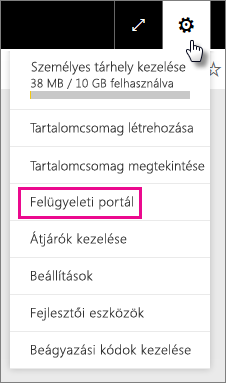

A portálon hat lap található. Ezek leírását az alábbiakban láthatja.

* [Használati metrikák](#usage-metrics)
* [Felhasználók](#users)
* [Auditnaplók](#audit-logs)
* [Bérlői beállítások](#tenant-settings)
* [Premium-beállítások](#premium-settings)
* [Beágyazási kódok](#embed-codes)
* [Szervezeti vizualizációk](#Organization-visuals)

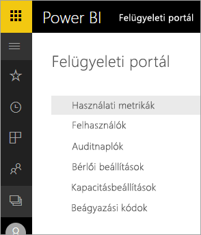

## Használati metrikák
A felügyeleti portál első lapja a **Használati metrikák**. A használati metrikákat tartalmazó jelentés a Power BI-beli használat monitorozását teszi lehetővé a munkahelyen. Ezenkívül azt is mutatja, hogy mely munkahelyi felhasználók és csoportok a legaktívabbak a Power BI-ban.

> [!NOTE]
> Az irányítópult első használatakor, vagy ha hosszú idő elteltével keresi fel újra az irányítópultot, egy betöltési képernyő jelenik meg az irányítópult betöltése során.

Miután az irányítópult betöltődött, két szakaszba sorolt csempék jelennek meg. Az első szakasz tartalmazza az egyes felhasználók használati adatait, míg a második szakaszban a munkahelyi csoportok hasonló információi láthatók.

Az alábbiakban az egyes csempéknél megjelenő részletes információkat ismertetjük:

* A felhasználói munkaterület összes irányítópultjának, jelentésének és adatkészletének eltérő darabszáma
  
    

* A legtöbbet használt irányítópult az ahhoz hozzáférő felhasználók száma szerint. Például ha 3 felhasználóval oszt meg egy irányítópultot, és olyan tartalomcsomaghoz is hozzáadja azt, amelyhez két különböző felhasználó kapcsolódik, a számláló értéke 6 (1 + 3 + 2)
  
    

* A legnépszerűbb tartalom, amelyhez a felhasználók kapcsolódtak. Ez bármi lehet, amelyhez a felhasználók hozzáférhetnek az adatbeolvasási folyamaton keresztül, például szolgáltatott szoftveres tartalomcsomagok, munkahelyi tartalomcsomagok, fájlok vagy adatbázisok.
  
    

* A legaktívabb felhasználókat mutatja az irányítópultok száma alapján, beleértve a felhasználók által létrehozott és a velük megosztott irányítópultok számát.
  
    

* A legaktívabb felhasználókat mutatja a jelentések száma alapján
  
    

A második szakasz ugyanezeket az információkat tartalmazza – a csoportok alapján. Lehetővé teszi annak megtekintését, hogy a munkahely mely csoportjai a legaktívabbak, és milyen típusú információkat használnak.

Ezek az információk valós betekintést nyújtanak abba, hogy a felhasználók miként használják a Power BI-t a munkahelyen, és mely munkahelyi felhasználók és csoportok számítanak különösen aktívnak.

## Felhasználók

A felügyeleti portál második lapja a **Felhasználók kezelése**. A Power BI-beli felhasználók kezelése az Office 365 felügyeleti központjában történik. Ebből a szakaszból gyorsan elérhető a felhasználók, a rendszergazdák és a csoportok kezelésére szolgáló Office 365-beli terület.

Amikor rákattint az **Ugrás az O365 felügyeleti központjára** elemre, közvetlenül az Office 365 felügyeleti központjának kezdőlapjára kerül, ahol elvégezheti a bérlő felhasználóinak kezelését.

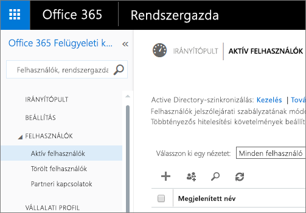

## Auditnaplók

A felügyeleti portál harmadik lapja az **Auditnaplók**. A naplók az Office 365 Biztonsági és megfelelőségi központjában találhatók. Ebben a szakaszban gyorsan hozzáférhet az Office 365-beli adott területhez. 

Az auditnaplókkal kapcsolatos további információ: [A Power BI-naplózás használata a munkahelyen](service-admin-auditing.md)

## Bérlői beállítások

A felügyeleti portál negyedik lapja a **Bérlői beállítások**. A Bérlői beállítások használatával hatékonyabban lehet szabályozni, hogy mely funkciók legyenek elérhetők a munkahelyen. Ha aggályai vannak a bizalmas adatokkal kapcsolatban, a funkciók némelyike esetlegesen nem megfelelő a munkahely számára, vagy csak egy adott funkciót szeretne engedélyezni egy adott csoportnak. Ha ezekről van szó, kikapcsolhatja az adott funkciót a bérlőn.

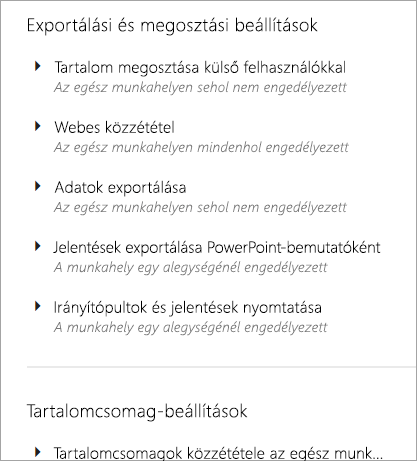

> [!NOTE]
> A beállítás érvénybe léptetése a bérlő összes felhasználója számára akár 10 percet is igénybe vehet.

A megadott beállítások alapján a beállításoknak három állapota lehet.

### Az egész munkahelyen sehol nem engedélyezett

Letilthat egy funkciót, így a felhasználók nem fogják tudni használni azt.

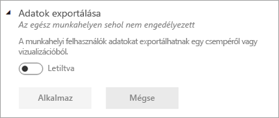

### Az egész munkahelyen mindenhol engedélyezett

Engedélyezhet egy funkciót az egész munkahelyen, így minden felhasználó hozzáférhet ahhoz.

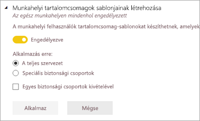

### A munkahely egy alegységénél engedélyezett

A funkciókat a munkahely egy adott alegységénél is engedélyezheti. Erre különböző módokon kerülhet sor. Engedélyezhet egy funkciót az egész munkahelyen a felhasználók egy adott csoportja kivételével.

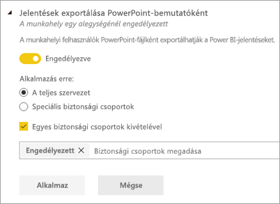

Engedélyezhet egy funkciót a felhasználók egy adott csoportjában, és letilthatja azt a felhasználók egy másik csoportjában. Így garantálható, hogy egyes felhasználók még akkor sem férhetnek hozzá az adott funkcióhoz, ha egyébként benne vannak az engedélyezett csoportban.

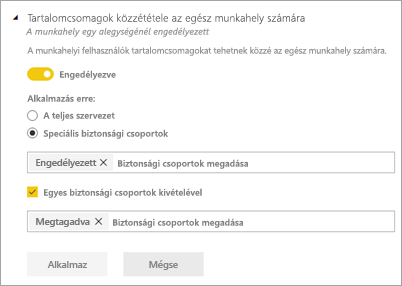

## Exportálási és megosztási beállítások

### Tartalom megosztása külső felhasználókkal

A munkahelyi felhasználók külső felhasználókkal oszthatnak meg irányítópultokat.

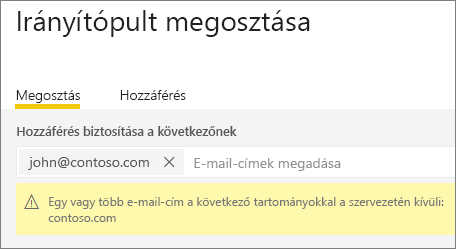

### Webes közzététel

A munkahelyi felhasználók a weben tehetnek közzé jelentéseket. [További információ](service-publish-to-web.md)

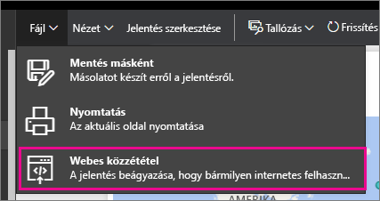

A webes közzététel beállításától függően a felhasználók különféle lehetőségeket láthatnak majd a felhasználói felületen.

|Funkció |A teljes cég számára engedélyezve |A teljes cég számára letiltva |Speciális biztonsági csoportok   |
|---------|---------|---------|---------|
|A **Webes közzététel** parancs egy jelentés **Fájl** menüjében.|Mindenki számára engedélyezve|Mindenki számára nem látható|Csak az arra jogosult felhasználók vagy csoportok láthatják.|
|A **Beágyazási kódok kezelése** funkció a **Beállítások** közt|Mindenki számára engedélyezve|Mindenki számára engedélyezve|Mindenki számára engedélyezve  * A **Törlés** parancsot csak az arra jogosult felhasználók vagy csoportok érik el. * A **Kód lekérése** mindenki számára engedélyezve van.|
|**Beágyazási kódok** a felügyeleti portálon|Az állapot a következő értékeket jelenítheti meg: * Aktív * Nem támogatott * Blokkolva|Az állapot **Letiltva** lesz|Az állapot a következő értékeket jelenítheti meg: * Aktív * Nem támogatott * Blokkolva  Ha egy felhasználónak nincs megfelelő jogosultsága a bérlői beállítások alapján, akkor az állapot **Megsértve** lesz.|
|Meglévő közzétett jelentések|Minden engedélyezve|Minden letiltva|A jelentések továbbra is megjelennek mindenki számára.|

### Adatok exportálása

A munkahelyi felhasználók adatokat exportálhatnak egy csempéről vagy vizualizációból. [További információ](power-bi-visualization-export-data.md)

> [!NOTE]
> Az **Adatok exportálása** lehetőség letiltásával azt is megakadályozhatja, hogy a felhasználók az **Elemzés az Excelben** funkciót vagy a Power BI szolgáltatás élő kapcsolatát használják.

### Jelentések exportálása PowerPoint-bemutatóként

A munkahelyi felhasználók PowerPoint-fájlként exportálhatják a Power BI-jelentéseket. [További információ](service-publish-to-powerpoint.md)

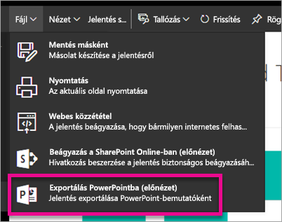

### Irányítópultok és jelentések nyomtatása

A munkahelyi felhasználók irányítópultokat és jelentéseket nyomtathatnak. [További információ](service-print.md)

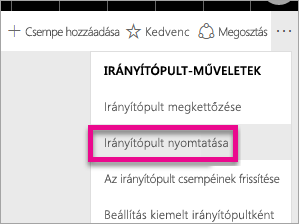

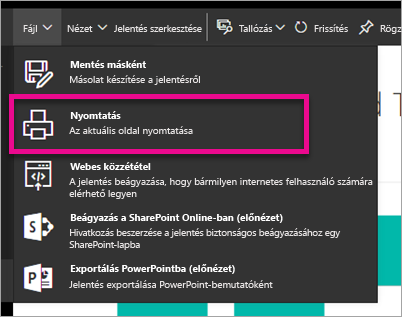

## Tartalomcsomag-beállítások

### Tartalomcsomagok közzététele az egész munkahely számára

A munkahelyi felhasználók tartalomcsomagokat tehetnek közzé az egész munkahely számára.

### Munkahelyi tartalomcsomagok sablonjainak létrehozása

A munkahelyi felhasználók tartalomcsomag-sablonokat készíthetnek, amelyek a Power BI Desktop adott adatforrására épülő adatkészleteket használják.

### Alkalmazások küldése a végfelhasználóknak

A bérlői rendszergazda a **Bérlői beállításokban** engedélyezheti az alkalmazások küldését.

   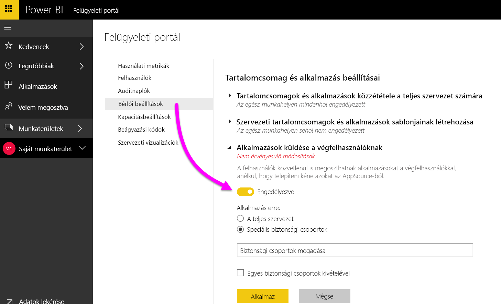

A beállítást **Engedélyezve** értékre állíthatja, és megadhatja, hogy ki használhatja ezt a funkciót (a teljes szervezet vagy adott biztonsági csoportok).

> [!NOTE]
> Ne feledje, hogy bérlői beállítások módosításának érvénybe lépése időbe telhet.

További információ az [alkalmazások leküldéséről](service-create-distribute-apps.md#how-to-install-an-app-automatically-for-end-users).

## Integrálási beállítások

### Adatokkal kapcsolatos kérdések feltevése Cortanával
A munkahelyi felhasználók Cortana használatával kérdéseket tehetnek fel az adataikról.

> [!NOTE]
> Ez a beállítás az egész munkahelyre vonatkozik, és nem lehet korlátozni meghatározott csoportokra.

### Az Elemzés az Excelben helyszíni adatkészleteken való használata
A munkahelyi felhasználók az Excel használatával megtekinthetik és használhatják a helyszíni Power BI-adatkészleteket. [További információ](service-analyze-in-excel.md)

> [!NOTE]
> Az **Adatok exportálása** lehetőség letiltásával azt is megakadályozhatja, hogy a felhasználók az **Elemzés az Excelben** funkciót használják.

### Az ArcGIS Maps for Power BI (előzetes verzió) használata

A munkahelyi felhasználók használhatják az Esri által biztosított ArcGIS Maps for Power BI (előzetes verzió) vizualizációját. [További információ](power-bi-visualization-arcgis.md)

## Egyéni vizualizációk beállításai
### Egyéni vizualizációk engedélyezése a teljes cég számára
A munkahelyi felhasználók egyéni vizualizációkat használhatnak és oszthatnak meg. [További információ](power-bi-custom-visuals.md)

> [!NOTE]
> Ez a beállítás az egész munkahelyre vonatkozik, és nem lehet korlátozni meghatározott csoportokra.

## R-vizualizációk beállításai

### Az R-vizualizációk interaktív használata és megosztása

A munkahelyi felhasználók R-szkriptekkel készült vizualizációkat használhatnak és oszthatnak meg. [További információ](service-r-visuals.md)

> [!NOTE]
> Ez a beállítás az egész munkahelyre vonatkozik, és nem lehet korlátozni meghatározott csoportokra.

## Naplózási beállítások

### Auditnaplók létrehozása a belső tevékenységek vizsgálatához és a megfelelőség biztosításához

A felhasználók a naplózással nyomon követhetik, hogy a munkahely más felhasználói milyen műveleteket hajtottak végre a Power BI-ban. [További információ](service-admin-auditing.md)

Az auditnapló bejegyzéseinek rögzítéséhez ezt a beállítást kell bekapcsolni.

> [!NOTE]
> Ez a beállítás az egész munkahelyre vonatkozik, és nem lehet korlátozni meghatározott csoportokra.

## Irányítópult beállításai

### Irányítópultok adatainak besorolása

A munkahelyi felhasználók a biztonsági szint besorolását jelző címkékkel láthatják el az irányítópultokat. [További információ](service-data-classification.md)

> [!NOTE]
> Ez a beállítás az egész munkahelyre vonatkozik, és nem lehet korlátozni meghatározott csoportokra.

## Fejlesztői beállítások

### Tartalom beágyazása alkalmazásokba

A munkahelyi felhasználók beágyazhatnak Power BI-irányítópultokat és -jelentéseket szolgáltatott szoftveres (SaaS-) alkalmazásokba. A beállítás kikapcsolásával megakadályozhatja, hogy a felhasználók a REST API-k használatával Power BI-tartalmakat ágyazzanak be saját alkalmazásukba.

## Premium-beállítások

A Premium-beállítások lapon bármely Power BI Premium-kapacitás felügyelhető, amelyet a munkahely megvásárolt. A munkahely bármely felhasználója láthatja a Premium-beállítások lapot, de annak tartalma csak akkor jelenik meg, ha az adott felhasználó **kapacitás-rendszergazda**, vagy rendelkezik a szükséges engedélyekkel. Ha a felhasználó nem rendelkezik ilyen engedéllyel, az alábbi üzenet jelenik meg.

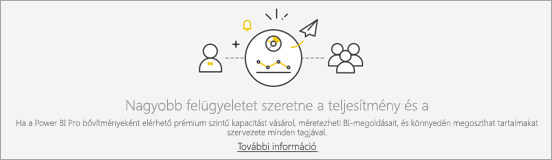

További információ a Premium-beállítások kezeléséről: [A Power BI Premium kezelése](service-admin-premium-manage.md).

## Beágyazási kódok

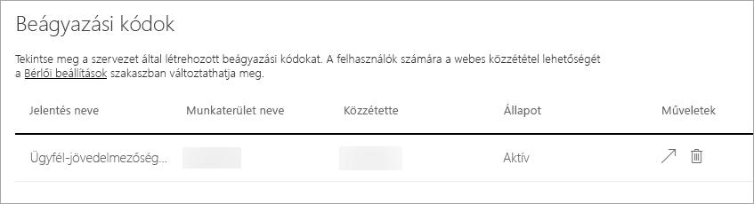

A rendszergazdák megnézhetik a bérlő számára generált beágyazási kódokat. Elérhetőek a jelentés megtekintésére, valamint a visszavonáshoz a beágyazási kód törlésére vonatkozó műveletek is.

## Szervezeti vizualizációk

A szervezeti vizualizációk lapon egyéni vizualizációkat helyezhet el és kezelhet a szervezetén belül, így könnyen alkalmazhat jogvédett egyéni vizualizációkat a szervezetében, amelyeket a jelentéskészítők könnyen megtalálhatnak és importálhatnak a jelentéseikbe közvetlenül a Power BI Desktopból.
 
A lapon minden olyan egyéni vizualizáció megjelenik, amely jelenleg megtalálható a szervezet adattárában.
 
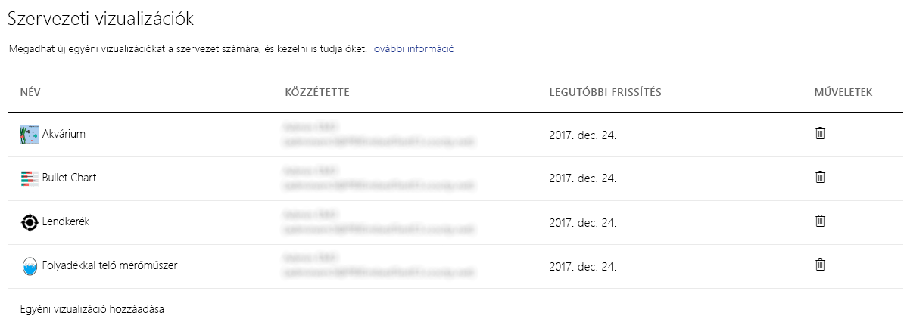

### Új egyéni vizualizáció hozzáadása

Új egyéni vizualizáció a listához adásához válassza az **Egyéni vizualizáció hozzáadása** lehetőséget

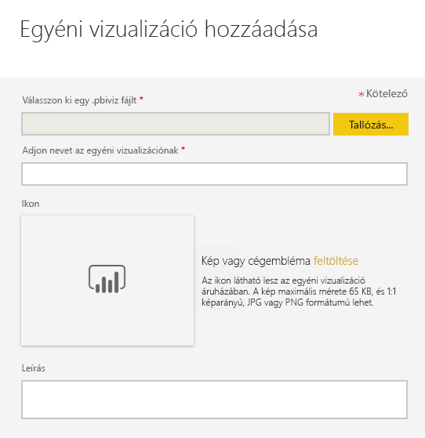

> [!WARNING]
> Az egyéni vizualizációk biztonsági vagy adatvédelmi kockázatot jelentő kódokat tartalmazhatnak, ezért az adattárban való üzembe helyezés előtt ellenőrizze, hogy megbízható-e a vizualizáció szerzője és forrása.
> 

Töltse ki a mezőket:
 
* Válasszon egy .pbiviz-fájlt (kötelező): Válasszon ki egy feltöltendő egyéni vizualizációs fájlt. Csak a verziószámmal ellátott API-s vizualizációk támogatottak (itt elolvashatja, ez mit jelent).
Az egyéni vizualizációk feltöltése előtt át kell tekintenie a vizualizációt biztonsági és adatvédelmi szempontból, hogy biztosan megfeleljen a szervezet igényeinek. További információk az egyéni vizualizációk biztonságáról.
 
* Nevezze el az egyéni vizualizációkat (kötelező): Adjon egy rövid címet a vizualizációnak, a Power BI Desktop felhasználói így könnyen megérthetik, mi annak a célja
 
* Ikon (kötelező): A Power BI Desktop felhasználói felületén megjelenő ikonfájl.
 
* Leírás: A vizualizáció rövid leírása, amely több információt szolgáltat a felhasználónak
 
Az „Alkalmazás“ lehetőséggel kezdje meg a feltöltést. Ha ez sikeres, az új elem megjelenik a listában. Ha nem, egy ennek megfelelő hibaüzenet jelenik meg
 
### Egyéni látványelem törlése a listából

A kuka ikonnal végleg törölheti a vizualizációt az adattárból.
Fontos: a törlés nem vonható vissza. A törölt vizualizációk azonnal abbahagyják a renderelést a meglévő jelentésekben. Ha újra feltölti a vizualizációt, az nem helyettesíti a törölt verziót, a felhasználóknak pedig újra importálniuk kell az új vizualizációt, és kicserélni azt a saját jelentésükben található példánnyal.
 
### A vizualizációk frissítése

Ha az adattárban szeretné frissíteni a vizualizációt, mert annak elérhető egy új verziója (például hibajavítás, új funkciók vagy egyebek), töltse fel az új fájlt (változatlan vizualizációazonosítóval) új listabejegyzésként, és a megfelelő részleteket írja be a címbe és a leírásba (például „Saját vizualizáció v2.0“). Amikor a felhasználók legközelebb belépnek a szervezeti adattárba a Power BI Desktopból, importálhatják az új verziót, amely kérni fogja őket, hogy cseréljék le a jelentés jelenlegi verzióját.
 
## Következő lépések

[A Power BI rendszergazdai szerepkörének ismertetése](service-admin-role.md)  
[A Power BI-naplózás használata a munkahelyen](service-admin-auditing.md)  
[A Power BI Premium kezelése](service-admin-premium-manage.md)  
[A Power BI felügyelete a munkahelyen](service-admin-administering-power-bi-in-your-organization.md)  

További kérdései vannak? [Kérdezze meg a Power BI közösségét](http://community.powerbi.com/)