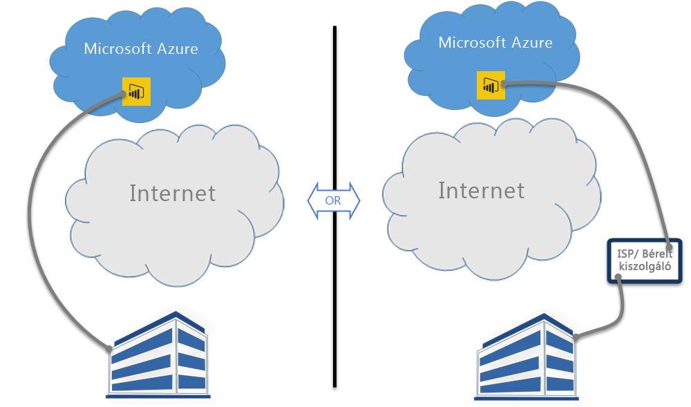

# A Power BI és az ExpressRoute
A **Power BI** és az **ExpressRoute** közös használatával létrehozhat egy hálózati magánkapcsolatot a vállalata és a Power BI között (vagy egy internetszolgáltatótól bérelhető kiszolgálói létesítmény között), így megkerülheti az Internetet, és jobb védelmet biztosíthat érzékeny Power BI-adatai és -kapcsolatai számára.

Az **ExpressRoute** egy olyan Azure-szolgáltatás, amely magánkapcsolatok létrehozását teszi lehetővé az Azure-adatközpontok (ahol a Power BI is található) és a saját helyszíni infrastruktúrája vagy bérelt kiszolgálói környezete között.

[További információkat tudhat meg az ExpressRoute-ról](https://azure.microsoft.com/services/expressroute/), és megismerheti a [regisztráció menetét](https://azure.microsoft.com/pricing/details/expressroute/) is.

> [!NOTE]
> A Power BI nyilvános társviszony-létesítés módban támogatott, ahogyan az [ebben a GYIK-ban](https://docs.microsoft.com/azure/expressroute/expressroute-faqs) is olvasható.
> 
> 

## A Power BI-ra vonatkozó ExpressRoute-kivételek
A Power BI használható az ExpressRoute-tal, azonban van néhány olyan kivétel, amikor a Power BI a nyilvános interneten keresztül fogad vagy küld adatokat. Ezek a meghatározott kivételek gyakran statikus adatokat is tartalmaznak, mint amilyenek például a böngészőkonfigurációs fájlok, amelyek letöltése a legközelebbi **Content Delivery Network- (CDN-)** csomópontról történik. Léteznek általánosabb, a Power BI egészére vonatkozó kivételek, illetve adott szolgáltatásokra vagy funkciókra jellemző kivételek is. A következő szakaszokban az összes ilyen kivételt ismertetjük.

### A Power BI egészére vonatkozó ExpressRoute-kivételek
A **Power BI** és az **ExpressRoute** esetén egy kivétel azt jelenti, hogy a Power BI felé küldött vagy tőle érkező adatok a nyilvános interneten keresztül haladnak, nem pedig az ExpressRoute egyik magánkapcsolatán keresztül.

Az ExressRoute-ot használó Power BI egészére két kivétel vonatkozik:

* A statikus fájlok letöltése a **Content Delivery Networkről (CDN-ről)** és webhelyekről történik
* A **Telemetrikai** adatok továbbítása a nyilvános interneten keresztül történik

A Power BI több **Content Delivery Networköt (CDN-t)** vagy webhelyet használ ahhoz, hogy a szükséges statikus tartalmakat és fájlokat a felhasználók számára hatékonyan, a területi beállításaik alapján oszthassa el a nyilvános interneten keresztül. A statikus fájlok között megtalálhatók termékek letöltési fájljai (például a **Power BI Desktop**, a **Helyszíni adatátjáró** vagy a különböző független szolgáltatóktól származó **Power BI-tartalomcsomagok**), böngészőkonfigurációs fájlok, amelyek a Power BI felé irányuló egymást követő kapcsolatok kezdeményezésére és kialakításához szükségesek, illetve megtalálható a Power BI kezdeti biztonságos bejelentkezési oldala is, azonban a tényleges hitelesítő adatok küldése már kizárólag az ExpressRoute-on keresztül történik.   

Bizonyos **telemetrikai adatok** továbbítása szintén egyaránt történik a nyilvános interneten és az ExpressRoute-on keresztül. A telemetrikai adatok között használati statisztikák és hasonló adatok találhatók, amelyeket használatot és egyéb tevékenységeket monitorozó szolgáltatásoknak továbbítanak.

### A Power BI SaaS-alkalmazás és az ExpressRoute
Ha egy felhasználó kapcsolatot kezdeményez a Power BI szolgáltatással (a powerbi.com-on vagy Cortanán keresztül), akkor a nyilvános interneten keresztül, egy CDN-ről vagy weboldalakról történik a Power BI nyitóoldalának és bejelentkezési oldalának a lekérése, illetve azoknak a statikus fájloknak a lekérése is, amelyek felkészítik a böngészőt a Power BI-hoz való kapcsolódásra és annak használatára.

Amint létrejött a bejelentkezés, az Power BI-adatok interakciói már az ExpressRoute-on keresztül haladnak, olyan funkciók és szolgáltatások adatainak kivételével, amelyek működéséhez a nyilvános interneten található adatok szükségesek:

* A **Térképi vizualizációknak** csatlakozniuk kell a Bing Virtual Earth vagy a Bing geocoding szolgáltatáshoz, és adatátvitelt folytatni velük. Ezek mindegyike a nyilvános interneten keresztül történik.
* A Power BI és a **Cortana** integrációjához a Bing nyilvános interneten keresztül történő elérése szükséges.
* Ha egy felhasználó egy **egyéni hivatkozást** vesz fel, például egy kép widgetet vagy egy videót, akkor a Power BI lekéri az adatokat a felhasználó által megadott hivatkozásról, ami történhet az ExpressRoute használatával, de a nyilvános interneten keresztül is.
* A felhasználók a User Voice visszajelzési mechanizmuson keresztül szöveges **visszajelzéseket küldhetnek a Power BI-nak**, ezek átvitele a nyilvános interneten keresztül történik.
* A **Bing News tartalomszolgáltató** a nyilvános interneten keresztül tölt le tartalmakat a Bingről.
* A felhasználóknak gyakran kell hitelesítő adatokat és beállításokat megadniuk SaaS-szolgáltatók oldalaihoz, ha **alkalmazásokhoz** (például tartalomcsomagokhoz) csatlakoznak. Az ilyen oldalak lehet, hogy az ExpressRoute-ot használják, de az is lehet, hogy a nyilvános internetet.

| Felhasználói tevékenység | Cél |
| --- | --- |
| Kezdőlap (a bejelentkezést megelőzően) |`maxcdn.bootstrapcdn.com ; ajax.aspnetcdn.com ; netdna.bootstrapcdn.com ; cdn.optimizely.com; google-analytics.com ` |
| Bejelentkezés |`*.mktoresp.com ; *.aadcdn.microsoftonline-p.com ; *.msecnd.com ; *.localytics.com ; ajax.aspnetcdn.com` |
| Irányítópultok, jelentések és adatkészletek kezelése (térképeket és geokódolást is beleértve) |`*.localytics.com ; *.virtualearth.net ; platform.bing.com; powerbi.microsoft.com; c.microsoft.com; app.powerbi.com; *.powerbi.com; dc.services.visualstudio.com ` |
| Támogatás |`support.powerbi.com ; powerbi.uservoice.com ; go.microsoft.com ` |

### A Power BI Desktop és az ExpressRoute
A Power BI Desktop szintén használható az ExpressRoute-tal, a következő listában látható néhány kivétellel:

* A **Frissítési értesítések**, amelyek azt érzékelik, hogy a felhasználók a legfrissebb verziójú Power BI Desktopot használják-e, a nyilvános interneten keresztül haladnak.
* Bizonyos **telemetrikai adatok** a nyilvános interneten keresztül haladnak.
* A **Térképi vizualizációknak** csatlakozniuk kell a **Bing Virtual Earth** vagy a **Bing geocoding** szolgáltatáshoz, és adatátvitelt folytatni velük. Ezek mindegyike a nyilvános interneten keresztül történik.
* A **webről** vagy külső SaaS-szolgáltatókról az **adatok lekérése** a nyilvános interneten keresztül történik.

### A Power BI PaaS és az ExpressRoute
A Power BI olyan API-kat és más platformalapú funkciókat is kínál, amelyekkel a fejlesztők személyre szabott Power BI-megoldásokat és -alkalmazásokat hozhatnak létre. A cikkben már korábban említett CDN-adatok és telemetrikai adatok mellett a Power BI PaaS-adatok az alábbi szolgáltatások esetén is a nyilvános internetet használják:

| PaaS-tevékenység | További használt célok |
| --- | --- |
| Nyilvános beágyazás (telemetrika) |`c1.microsoft.com` |
| Egyéni vizualizációk (CDN) |`*.azureedge.net` |

Egyes **egyéni vizualizációk** harmadik felektől származnak, mások a Microsofttól. Ezek lehet, hogy az ExpressRoute-ot használják, de az is lehet, hogy a nyilvános internetet.

### A Power BI Mobile és az ExpressRoute
Ez a dokumentum nem tér ki a Power BI Mobile-alkalmazások használatára.  

### Helyszíni adatátjáró és az ExpressRoute
A Power BI és egy **Helyszíni adatátjáró** együttes használata esetén az átvitelek használhatók az ExpressRoute-tal, ugyanazzal a felhasználói tevékenységekre vonatkozó kivétellel, amelyet a cikk **A Power BI SaaS-alkalmazás és az ExpressRoute** szakaszában már ismertettünk.  

